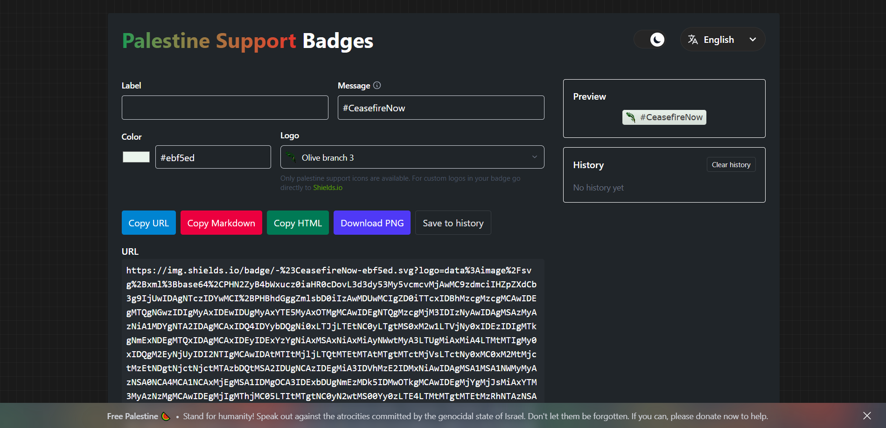

# Palestine Support Badges

    

Welcome to Palestine Support Badges! This project is not just a technical tool for creating **stylized badges** (with [Shields.io](https://shields.io/)), it also aims to be an instrument for mobilizing **support on social media** and amplifying messages in solidarity with Palestine, while **denouncing the genocide** against the Palestinian people perpetrated by the state of Israel and enabled by its allies.

The website is simple and intuitive: it requires no registration or prior forms, **no documentation needs to be read** and no knowledge of image limitations is required to use them as icons. In addition, it features a color picker, a **real-time preview of the generated badge** and a history to save certain color patterns or combinations we may need in the future. Overall, the platform is designed to support campaigns **without requiring advanced technical resources or spending too much time** creating useful and attractive badges. It also takes an accessible and responsive approach by providing clear metadata (URL, embedding in Markdown/HTML) and export options.


<div align="center">
    
    
</div>


## 🛠️ How to use

**1. Enter label and/or message**

- Label is the left part of the badge.

- Message is the right part of the badge.

- The app encodes spaces and special characters for the badge URL.

    | URL input                 | Badge output      |
    |---------------------------|-------------------|
    | Underscore `_`            | Space ` `         |
    | Double underscore `__`    | Underscore `_`    |
    | Double dash `--`          | Dash `-`          |


**2. Choose color**

- Use the color picker or type the color you want (hex, rgb, rgba, hsl, hsla and css named colors supported).

- If you provide a color name (for example, "green") it will usually be accepted as well, since the value is normalized internally. However, not all colors are available this way. To verify which ones are, check the [Shields.io documentation](https://github.com/badges/shields/tree/master/badge-maker#colors).

- In the current implementation, only the color of the message (the right part of the badge) can be changed.


**3. Logos**

- Only palestine support icons are available. For custom logos in your badges go directly to [Shields.io](https://shields.io/badges).

- Currently there are 14 logos available to embed in the badges. These use SVG images of up to approximately 11 KB, which are later internally encoded in Base64.

- These icons aim to represent the most important symbols of both the Palestinian people's struggle and their cultural and historical heritage.

> [!NOTE]  
> I am not Palestinian, so I cannot fully understand the true importance and meanings of certain representations. For that reason, I would appreciate any corrections and any contributions of new symbols or images that better represent the Palestinian history.


**4. Copy or download PNG**

- _Copy URL_: This copies the direct image URL to your clipboard (useful for ```` or links).

- _Copy Markdown_: This copies the code needed to display the badge in any Markdown file.

- _Copy HTML_: This copies the badge image in HTML format (````).

- _Download PNG_: This converts the badge to PNG client-side using a canvas.


**5. History**

- Save different combinations with _Save to history_.

- History is stored in your localStorage. No form of caching or cookies is used.

- You can reload a history entry with a single click.


**5. Share**

Share and create all kinds of badges. Use the icons you feel most comfortable with, choose the colors that match your website and include these images **everywhere you can**: social media, personal webs, open-source projects and more. **Don’t be silent**. Fighting from a distance and against the inaction and complicity of our governments is not easy, but Israel lives through its image, so **expose what is happening** and don’t normalize it. Attend protests, be explicit about your stance and support the community in any way you can. None of this is enough, but it’s about **doing everything within our power**. We are talking about humanity.


> [!CAUTION]
> As I mentioned earlier, the badges in this project use logos embedded in the URL via Base64. This makes the **URL of badges with certain logos very long** and, due to GitHub's proxy system (which has its own URL size limits), these badges may not display correctly in GitHub repositories, although they usually load fine elsewhere since other platforms don’t impose such strict limits.
> If you want to **use these badges on GitHub**, it is recommended to **shorten the URL** using a free service like [TinyURL](https://tinyurl.com/). It’s very simple: just paste the long badge URL into TinyURL and use the shortened URL in your README or documentation.


## 📨 Ready-to-use examples


**URL**

```
https://img.shields.io/badge/-FreePalestine-50225c.svg?logo=data%3Aimage%2Fsvg%2Bxml%3Bbase64%2CPD94bWwgdmVyc2lvbj0iMS4wIiBlbmNvZGluZz0iVVRGLTgiPz48c3ZnIHhtbG5zPSJodHRwOi8vd3d3LnczLm9yZy8yMDAwL3N2ZyIgd2lkdGg9IjEyMDAiIGhlaWdodD0iNjAwIiB2aWV3Qm94PSIwIDAgNiAzIj48cmVjdCBmaWxsPSIjMDA5NjM5IiB3aWR0aD0iNiIgaGVpZ2h0PSIzIi8%2BPHJlY3QgZmlsbD0iI0ZGRiIgd2lkdGg9IjYiIGhlaWdodD0iMiIvPjxyZWN0IHdpZHRoPSI2IiBoZWlnaHQ9IjEiLz48cGF0aCBmaWxsPSIjRUQyRTM4IiBkPSJNMCwwbDIsMS41TDAsM1oiLz48L3N2Zz4%3D
```


**Markdown**

```

```


**HTML**

```

```

---


**URL**

```
https://img.shields.io/badge/-%23CeasefireNow-ebf5ed.svg?logo=data%3Aimage%2Fsvg%2Bxml%3Bbase64%2CPHN2ZyB4bWxucz0iaHR0cDovL3d3dy53My5vcmcvMjAwMC9zdmciIHZpZXdCb3g9IjEwIDAgNjA4IDYwMCI%2BPHBhdGggZmlsbD0iIzAwMDMwMSIgZD0iTTM4NSAyYzggNCAxMiAxMyAxNSAyMGExNDUgMTQ1IDAgMCAxIDMgNzJsLTEgMXYxN2w0IDI4YzQtNyA0LTEyIDQtMjAgMC05IDEtMTggNC0yN2wxLTNjNy0xOSAyMS0zNCAzMy00OWE2NzIgNjcyIDAgMCAwIDE3LTIwYzYgMTIgMyAyOC0xIDQwLTcgMjQtMTggNTQtMzggNzFsLTMgMWMtNiAyLTkgOS0xMiAxNS0zIDctMyAxNC0yIDIyIDAgMTEtMiAyMi00IDMzbC0yIDEyaC0ydjJsLTEgM3YzbC0yIDUtMSA3IDYgN2MzLTkgNi0xNSA0LTI0LTUtMjAgNi00MiAxNi01OWwxOS0yOCAxMC0xMyAxLTJoMmMxMCAyNC0yIDU2LTExIDc4LTExIDI2LTExIDI2LTIxIDM1bC0yIDFjLTUgMi02IDYtNyAxMGwtMiAyLTEgMy0xIDJjMCA0IDIgOCA1IDExbDEgMyAyIDNhNDUzIDQ1MyAwIDAgMSA0MyA5NmMxMSAzMCAxOSA2MCAyNiA5MWwxIDQgMiA5YzgtMyAxMi0xMSAxNi0xOWw3LTE4di0yYzItNiAyLTkgMS0xNWwtMS0zYy0yLTgtNC0xMi0xMC0xNi0xMi05LTE3LTI1LTIwLTM4bC0xLTQyYTk3NDUgOTc0NSAwIDAgMCAwLTI1aDNsLTItM2MtMTAtMTEtMTYtMjYtMjMtNDBhMTE3MSAxMTcxIDAgMCAwLTYtMTNsLTEtMy0yLTdjMTYtMSAzMCA4IDQxIDE3bDE3IDE3di0yYTE2MiAxNjIgMCAwIDEtMi00OCAyMTAxIDIxMDEgMCAwIDEgMS0xN3YtMmEzNzUzIDM3NTMgMCAwIDAgMi0xNGMxNSA4IDIxIDI0IDI3IDM5bDEtMyAyMi01MmgzYzMgNiA2IDEyIDcgMTl2MmM0IDI5LTEgNjgtMTcgOTNsLTQgNC0xIDV2N2wtMSA0LTEgMTFhODIxOSA4MjE5IDAgMCAxLTIgMjJ2MTFsMS0yYTE2OSAxNjkgMCAwIDEgMzEtMzlsMTEtMTIgNC01IDEtMmgyYzYgMjgtMTAgNjItMjQgODUtMTUgMjMtMTUgMjMtMjQgMjYtNiAyLTggOC0xMCAxM2wtNCAxOGMtNiAyNC0xNCA1OS0zNSA3NC00IDMtNiA2LTcgMTF2NWwtMSAzYTM4NyAzODcgMCAwIDAtMSA0N3YzYzEgMTIgNCAyNCA4IDM2LTcgNi03IDYtMTQgNi00IDAtNi0yLTktNi01LTgtNi0xOC03LTI4di0yYy0yLTIwLTEtMzkgMi01OSA0LTIzIDEtNDUtNC02OGwtMS0yYy00LTIxLTEwLTQyLTE3LTYzbC0xLTNjLTExLTM0LTI1LTcwLTQ3LTk4bC0yLTQtMyAyLTQgMi0yIDEtOCAyLTEgMmMtNyAxNi0yMiAyNS0zNyAzMi0xOSA3LTQ1IDExLTY2IDExIDItOCA4LTE0IDE0LTIwbDItMmMxNy0xNiA0MC0yNiA2Mi0zNGwtMy0xLTQtMi0yLTEtNy01LTQtMmMtOSAyLTE1IDQtMjAgMTFhNjggNjggMCAwIDEtNTUgMjFoLTJhMjI4MCAyMjgwIDAgMCAxLTQ1LTFjOS0xOCAzMC0yOCA0OS0zNGwxNS01di0yYy0xLTYgMS0xMCA1LTE1aC0zYy0yMSAwLTQyIDAtNjMtMyA1LTEzIDIwLTIwIDMyLTI1bDI4LTEwLTYtNS0yLTEtNS00LTMtMmMtNC0yLTggMC0xMiAxLTEwIDQtMTQgOC0yMCAxNy0xMyAxNi0zNiAyMi01NiAyNWE3OTIgNzkyIDAgMCAxLTQyIDNjNC0xNSAyMC0yNiAzMy0zMyAxOC0xMCA0MS0yMiA2My0yMGw0IDJjNiAyIDkgMCAxNC0ybC0yMC03LTMtMS0yNi02LTQtMS0yMS0zYy0zIDItNCAzLTUgNmwtMSAxMGMtMiA2LTYgMTAtMTEgMTQtNCAzLTkgNC0xNCAzbC02LTQtMSAxYy0xOCAxNi00MSAyMS02MyAyNmE2MDkxIDYwOTEgMCAwIDAtMTEgMmwtMiAxLTExIDFjMy0xMSA5LTE3IDE3LTI1aC0yYTYzOCA2MzggMCAwIDEtNTYgNWM5LTIyIDM0LTM0IDU0LTQzbDYtMXYtMmgtM2wtMTEtNC0yLTEtMjYtMTUtMTEtNmM3LTggMTgtMTAgMjgtMTFoMzNsLTItM2MtOS0xMi0xNy0yNC0yNC0zN2wtNC00LTEtNGMyMC0zIDM3IDUgNTMgMTcgOSA2IDE2IDEzIDI0IDIxbDMtMWM5LTUgMTktNyAzMC05aDRsLTItMmE4MTk0IDgxOTQgMCAwIDEtMTMtMTNjLTE4LTE4LTE4LTE4LTIwLTIyIDE1LTcgMzQtMyA0OSAzbDUgMi01LTEyLTEtNC05LTIyLTEtNWMxNC0xIDI2IDcgMzcgMTVsMjAgMjIgMSAyYzE3IDIxIDE3IDIxIDE2IDMzLTEgOCA0IDEzIDkgMTlhODU2IDg1NiAwIDAgMSAxLTNjLTMtNS00LTEwLTYtMTZsLTEtM2MtNi0yMC04LTQxLTEwLTYyIDExIDEgMTkgOSAyNiAxNyAxNSAyMCAzMCA0OCAyOSA3M2wtMSA0Yy0yIDcgMiAxNSA1IDIxIDYgOCAxNCAxMiAyMiAxN2wxNCAxMCA1IDMgMiAxIDEgMWMtMS0zLTItNC01LTYtMTQtMTAtMTktMjUtMjItNDJsLTEtMjJWNTVjOSAyIDE1IDkgMjAgMTdhMTQ1IDE0NSAwIDAgMSAyMSA3NGMwIDQgMCA3LTIgMTEtMiA1LTEgOCAwIDEzdjJjMiA4IDcgMTEgMTMgMTUgMTQgMTEgMjYgMjQgMzggMzYgNC05IDQtOSAzLTE4bC0yLTMtNC05LTMtMWMtMTMtNS0yMS0xNC0yNy0yNy0xMS0yMy0xMy00OS0xNi03NCAxMSAzIDExIDMgMTUgNmwyIDIgMSAxdi00bDItNnYtNWwtMS0zYTQzNiA0MzYgMCAwIDAtMy0zNXYtNGwtMS0yMGMxMCAxIDE2IDkgMjIgMTZsMSAyIDUtMjIgMS04VjhsMi02Wk0xMjMgMTA4bDEgMyAxIDhjMSA1IDQgOCA4IDExbDIgMmM0IDMgNyA0IDEyIDVoOWw4IDEtMy0zaC0ybC0zLTZjLTEtNS0zLTgtOC0xMGEyMzkgMjM5IDAgMCAwLTE0LTZjLTUtNC01LTQtMTEtNVptMTI2IDVjMSAzIDMgNSA2IDdsMiAyIDMgMSAyIDIgNiA0di00Yy0xLTMtMy0zLTYtNC0zLTItNi0zLTgtNmwtNS0yWm0xMjEgMSAyIDQgMS0zLTMtMVptLTE2OSAxMi0yMSAzdjdjMiA0IDQgNiA5IDdsMTIgMyAxNCAzaDNjMTggNCAzNyA5IDUyIDIwbDMgMiAxMSA5YzQgNCA2IDYgMTIgN2g4YzcgMCAxMSAxIDE3IDRoOGEyNjIgMjYyIDAgMCAwLTQxLTM0IDQyNSA0MjUgMCAwIDAtMjMtMThjLTgtOC04LTgtMTktMTAtNSAwLTYgMC04IDRsLTIgM2MtNSA0LTEyIDQtMTggMy00LTEtNy0zLTktN2wtMS03LTcgMVptLTMxIDEyIDMgMnYtMmgtM1ptLTUzIDExLTMgMS02IDMtMSAzIDQtMSAzLTEgNS0yYzctMiAxNS0zIDIyLTFsNS0xIDItMnYtMWwtNi0xLTQtMWMtOS0xLTE0IDAtMjEgNFptMjcyLTItMSA0IDEgMiAxIDMgMSAyYzMgMTAgNSAxOSAyIDI5bDIgN2gyYzMtMTMgNi0yNyAxLTQwbC03LTdoLTJabS03MCA1Ny0zIDUgMiAyIDEyIDEyYzExIDEzIDIzIDIzIDQwIDI2bDktMWMxLTgtNC0xNC05LTIwbC0xNS0xNS02LTYtNS00LTItMmMtNi01LTE3LTMtMjMgM1ptLTIwIDE3IDcgNCA0LTItNS01Yy0zIDAtNCAxLTYgM1ptOSAxMy0yIDcgMiAxaDJsMyAxIDUgMyA1LTFoM2wyLTFjLTQtNS03LTEwLTEyLTE0LTMgMC01IDItOCA0Wm0yMTkgNDljMCAxMCAwIDEwIDQgMThsMiAyYzEtNCAwLTctMS0xMXYtMmwtMi02LTMtMVptLTMxIDEzIDMgNSAyIDMgNSA2IDEtMTAtNC0yLTMtMS00LTFabTM2IDIyIDEgM1ptLTIxIDNhMjI0MyAyMjQzIDAgMCAwIDQgMTRjNSAxNCA3IDI4IDkgNDJoMWE5NDg2IDk0ODYgMCAwIDAgNS0zMHYtMmMyLTggMi04LTEtMTYtMi0zLTQtNC04LTRsLTMtMWMtMyAwLTUtMS03LTNabTEwIDY4LTIgNCAyIDQgMS04aC0xWiIvPjxwYXRoIGZpbGw9IiMwMDhBNDkiIGQ9Ik0xMDggMTI2YzMgMyAzIDQgNCA4IDExIDMgMjIgNSAzNCA2YTIxOCAyMTggMCAwIDEgNDQgN2wyIDFjMTMgMiAyNSA0IDM3IDhsMyAxYTIxMiAyMTIgMCAwIDEgODkgNjNsMTIgMTNjOSA5IDIyIDE3IDM0IDE5bDE1LTFjMS05LTEtMTUtNi0yMmwtMS0yLTExLTExLTktOC0xMy0xMi03LTZhMzkxIDM5MSAwIDAgMC00My0zNWwtNy02LTI0LTE4YzMgMCA0IDEgNyAzbDIgMSAzIDIgNSA0IDMgMiAxMyA5YzQxIDI4IDQxIDI4IDU4IDQzbDIgMmE2MjYgNjI2IDAgMCAxIDIzIDIxYzEwIDkgMTAgOSAxMSAxNGwtMiA2aDR2LTNsMy0xNCAxLTNhMzE3NCAzMTc0IDAgMCAxIDctMjdoMWExMzUgMTM1IDAgMCAxLTcgMzMgMTI4NCAxMjg0IDAgMCAxLTIgMTRsMyA0YzI5IDMxIDQ1IDc0IDU5IDExM2wxIDIgOSAyOCAxIDMgMTAgMzkgMyAxMWEyOTg4NiAyOTg4NiAwIDAgMSA4IDMwbDktMWMyMy0xOSAyOC02NCAzMi05MmwyLTEwYTEyMjkgMTIyOSAwIDAgMCAxMi04M2gxbC00IDUzdjJjLTYgNjUtNiA2NS0xNiA5NGwtMyA5Yy00IDE0LTEwIDI4LTIwIDQwbC0yIDJjLTUgNy01IDctOSA5LTMgMy0zIDYtMyAxMWE0MjUxMzIzMjcgNDI1MTMyMzI3IDAgMCAwLTEgMThjLTMgMzUtMyAzNSA1IDY5djVsLTYgMmMtNS0xLTYtMi04LTYtNy0xNS02LTMzLTYtNDl2LTNjMC0xMyAxLTI3IDQtNDAgNi0zNi04LTc5LTE5LTExM2wtMS0yYy02LTIwLTEyLTM5LTIxLTU4bC0xLTNjLTEwLTIwLTIwLTM5LTMzLTU3bC0xLTJjLTItMi0yLTItNS0yaC0xNmE1MSA1MSAwIDAgMS0yOS01Yy01LTQtMTAtNy0xNC0xMmwtMi0yLTMtNC0zNC0zNi0yLTJjLTE4LTE4LTM3LTMxLTYxLTM5bC0zLTFjLTMxLTEwLTY0LTE0LTk3LTE5bC0zLTFjLTEyLTItMTItMi0yNCAwLTcgNC0xMyA1LTIxIDVoLTNjLTExIDAtMjEtMy0zMS04bC0zLTEtMjktMTcgNy00aDNjMjMtNiA2MS00IDgwIDExWiIvPjxwYXRoIGZpbGw9IiMwMDhDNEEiIGQ9Ik0zMDIgNjNjMTQgNyAyMCAyNiAyNSA0MGExNzUgMTc1IDAgMCAxIDcgMjVjMiAxMCAyIDIwLTIgMzBsLTEgNHY0bC0yLTUtMi0xYy0xMC00LTE2LTE1LTIwLTI1LTYtMTYtNS0zMy01LTQ5YTc3MTUgNzcxNSAwIDAgMCAwLTIzWiIvPjxwYXRoIGZpbGw9IiMwMDhCNEEiIGQ9Ik00ODYgMjk0YzEzIDYgMjAgMjUgMjUgMzdhMTQyIDE0MiAwIDAgMSA4IDQ5YzAgNCAwIDctMyAxMGwtMiA0YTY3IDY3IDAgMCAxLTI3LTQ4IDE0MSAxNDEgMCAwIDEtMS0yMSA0MDM2IDQwMzYgMCAwIDEgMC0zMVoiLz48cGF0aCBmaWxsPSIjMDA4QzRBIiBkPSJNNDUyIDEyNWMzIDMgMiA1IDIgOSAwIDI5LTExIDY4LTMxIDg5bC02IDQtNSA1di0xMGE2NSA2NSAwIDAgMSA1LTQyIDI1MiAyNTIgMCAwIDEgMzUtNTVabTEwLTk0aDFjMCAxMCAwIDE5LTMgMjhsLTEgM2MtNSAxOC0xMiAzNy0yNCA1M2wtMiAyYy00IDctOSAxMS0xNiAxNGwtMiAyYy00LTI4IDUtNDkgMjEtNzFhMzQ4IDM0OCAwIDAgMSAyNS0zMGwxLTFabS05MiAyMzUgMyAyIDYgMWMtOSAxNi0yMiAyNy0zOSAzNGwtMyAxYTE1OCAxNTggMCAwIDEtMzkgOGwtMyAxaC0xMmMxMy0yMyA0Ni0zOCA3MC00NSA2LTIgMTEtMyAxNy0yWiIvPjxwYXRoIGZpbGw9IiMwMDhENEEiIGQ9Im0yMjYgMTc1IDMgMyAzIDJhNzQgNzQgMCAwIDEtNDUgMzJsLTMgMWMtMTYgMy0zMiA0LTQ4IDQgMTQtMjIgNDYtMzQgNzAtNDEgNy0xIDEzLTIgMjAtMVoiLz48cGF0aCBmaWxsPSIjMDA4RDRCIiBkPSJNMTI3IDU0YzI4LTIgNTUgOSA3NiAyNyA1IDQgNyA3IDggMTNsNCA0IDIgMS05IDFoLTRjLTE0IDMtMjYgMC0zOC04LTEwLTYtMTgtMTUtMjctMjNhMTI3MyAxMjczIDAgMCAwLTctOGwtMy0zLTItNFoiLz48cGF0aCBmaWxsPSIjMDA4QzRBIiBkPSJNNTkwIDI4MmgxYzAgNyAwIDEzLTIgMTlsLTEgM2MtNyAyNS0xOSA1Ny00MCA3NGwtNyAzLTIgMWMtMS0zNCAxMi01NyAzNS04MWwxMS0xMyAyLTIgMi0zIDEtMVpNMTQyIDE1NmwtMSAyLTkgMTRjLTUgMTEtMTcgMTctMjcgMjFhMjU1IDI1NSAwIDAgMS01NSAxM2wxMC0xNCAyLTJhMTYyIDE2MiAwIDAgMSA1OS0zNWwyLTFjNy0yIDEzLTIgMTkgMlptMTY5IDkwIDMgMyA2IDEtMiAyLTcgN2E2NiA2NiAwIDAgMS00MiAyMGwtMyAxaC0xN2wtMzAtMWMxMy0xNyAzOS0yOCA2MC0zMWgxMWw4LTJjNC0yIDktMSAxMyAwWiIvPjxwYXRoIGZpbGw9IiMwMDhENEIiIGQ9Ik00NTggMjI1YzEzIDIgMjMgOSAzMyAxOGwzIDJhMTE2IDExNiAwIDAgMSAxOCAyMWM3IDggMTEgMTYgMTIgMjdoLTJjLTUgMC04IDAtMTIgMy04LTEtMTctNy0yMi0xMy0xMC0xMy0zMC00MS0zMC01OFoiLz48cGF0aCBmaWxsPSIjMDA4QzRBIiBkPSJtNTYxIDE2MyAzIDNjMiA4IDMgMTcgMiAyNnYyYzAgMjQtMiA1NC0xNyA3NGwtNCAxYy0zLTEtNC00LTUtNy0xMS0yOCAyLTU2IDEzLTgybDgtMTdaIi8%2BPHBhdGggZmlsbD0iIzAwOEQ0QSIgZD0ibTEwMyAxNDcgMiAxaDJsLTMgNC0xIDJjLTQgNi04IDEwLTE0IDEzbC00IDMtMiAxLTggNWMtMTAgNi0yMiA4LTMzIDloLTRsLTI4IDJjMTAtMTUgMjgtMjQgNDQtMzJsMi0xYzktNCAxNi02IDI1LTUgNSAwIDkgMCAxNC0yaDhaTTQ3IDY1YzIwIDAgMzggMTMgNTMgMjVsMiAyYzggNiAxOSAxNyAyMCAyOHY2aC03Yy0zIDAtNC0yLTctNC04LTQtMTYtNy0yNS05LTE2LTYtMjgtMzMtMzYtNDd2LTFaIi8%2BPHBhdGggZmlsbD0iIzAwOEM0QSIgZD0iTTM0NSA5OGM4IDQgMTQgOSAyMCAxN2wxIDFjMyA0IDMgNCAzIDdsLTEgMmMtMSA2IDEgMTEgNCAxNiAzIDMgNSA1IDkgNiA1IDMgNSA3IDcgMTJsMSAzYzMgOSAzIDE5IDAgMjlsLTEtMi0zLTFjLTEwLTItMTgtMTEtMjQtMjBhMTMyIDEzMiAwIDAgMS0xMy00N2wtMy0yM1oiLz48cGF0aCBmaWxsPSIjMDA4QjRBIiBkPSJNNTEzIDE4MGMxMSA1IDE2IDIyIDIwIDMzIDIgNSAyIDggMSAxMy0xIDE0LTEgMjkgNSA0MXY4bC0zIDQtMiA0LTMtMy00LTNhNjIgNjIgMCAwIDEtMTYtMzh2LTIwYzAtMTMgMC0yNiAyLTM5WiIvPjxwYXRoIGZpbGw9IiMwMDhDNEEiIGQ9Ik0xNjMgMTljMjIgNCA0MCAyNSA1MiA0MyAxMiAxNyAxMiAxNyAxMSAyNyAwIDQgMCA2IDIgMTBsLTEtMmMtNC0zLTgtMy0xMy00di0zYy00LTEwLTE0LTE3LTIzLTIybC02LTJjLTgtNS0xMS0xNS0xNC0yNGwtMi02LTYtMTdabTExOSAxNzUgNSA0IDIgMyAzIDIgMiAzYzcgNyA3IDcgNyA5LTIxIDktNDIgOS02NSA3aC02bC0zLTEtNS0yYzEyLTExIDQzLTMwIDYwLTI1WiIvPjxwYXRoIGZpbGw9IiMwMDhCNEEiIGQ9Ik0yMjkgMjhjNSAxIDcgNCAxMSA3bDEgMmMxOCAxOCAzMiA0OCAzMiA3M2wtMiAxMS0xLTItNC0xYy02LTItMTEtNi0xNS0xMHYtMmwzLTJjNS00IDgtOCA5LTE1IDAtNSAxLTktMS0xM2wtNC0zLTExIDEtNyAxMi00LTktMS0ydi0zbC0xLTNjLTMtMTMtNS0yNy01LTQxWm0tNTggNzBjMTAgNyAyNCA3IDM2IDUgMyAwIDQgMCA2IDJsNSA3IDIgMmMtMTMgNy0yNSAxMi00MCAxMXYtMmMtMi02LTQtMTItOS0xNmwtMTAtMWMtNCAzLTYgNi03IDExbC0yMS05LTMtMS04LTR2LTJjMTQtNiAzNS0xMiA0OS0zWiIvPjxwYXRoIGZpbGw9IiMwMDhCNDkiIGQ9Ik0zODcgMTFoMmExMDIgMTAyIDAgMCAxIDEyIDMyYzIgMTUgNCAzNS0yIDQ5bC0zIDNjLTYtMi05LTctMTEtMTMtNy0xNy00LTM1LTEtNTNhMTA0NzcgMTA0NzcgMCAwIDAgMy0xOFoiLz48cGF0aCBmaWxsPSIjMDA4QjRBIiBkPSJtMzU5IDMwIDEwIDggMiAzIDIgMiAyIDNjMiA0IDMgNyAzIDExIDAgMTQgMiAyOCAxMiAzOCAzIDQgMyA3IDMgMTJsLTUtMi0xLTdjLTItNS00LTctOC0xMC01LTMtMTAtMi0xNS0yLTQtMTgtNi0zNy01LTU2WiIvPjxwYXRoIGZpbGw9IiMwMDgwNDQiIGQ9Im0xMTQgMTM1IDYgMSAxNyAzaDJhMTY3MCAxNjcwIDAgMCAwIDM1IDVsMTIgMiAyIDFhMjQ3NSAyNDc1IDAgMCAwIDM5IDhsLTIgMXYybC0xNy00YTQ1MSA0NTEgMCAwIDAtNDQtOCAyMDE4IDIwMTggMCAwIDAtNTItOWwyLTJaIi8%2BPHBhdGggZmlsbD0iIzAwODU0NyIgZD0iTTI5NiAxOTBjNyAwIDEzIDAgMjAgM2wyIDIgNiAxLTMgMi0yIDItNyA2LTEtMS0xMi0xMi0zLTNaIi8%2BPHBhdGggZmlsbD0iIzAwNkUzQSIgZD0ibTExNCAxMzUgNiAxYTIxMiAyMTIgMCAwIDAgMzggNWwxMiAyLTIgMy0zMy00LTItMS0yMS00IDItMloiLz48cGF0aCBmaWxsPSIjMDA4MjQ1IiBkPSJNMzg5IDExM2M1IDMgNSAzIDYgNnY5bC0yLTJjLTMtNC02LTctMTEtOWwtNC0zYzQtMyA3LTMgMTEtMVoiLz48cGF0aCBmaWxsPSIjMDA3MDNCIiBkPSJtMjYxIDEzMCAxMiA3IDE0IDEwLTEgM2E1NDAwIDU0MDAgMCAwIDEtMTMtMTBsLTMtMi0zLTItNi02WiIvPjxwYXRoIGZpbGw9IiMwMDY4MzciIGQ9Ik01NDIgMjgyaDF2MTFsLTEgMy0xIDE5aC0xYy0yLTExIDAtMjIgMi0zM1oiLz48cGF0aCBmaWxsPSIjMDA2MTMzIiBkPSJtMTYwIDE0MiAxMCAxLTIgMy05LTEgMS0zWiIvPjxwYXRoIGZpbGw9IiMwMDZEM0EiIGQ9Im0yMjEgMTU0IDYgMS0yIDF2MmwtNi0xIDItMXYtMloiLz48cGF0aCBmaWxsPSIjMDA2RjNCIiBkPSJtMjA0IDE1MCA3IDEtMiAxLTEgMi02LTEgMi0xdi0yWiIvPjwvc3ZnPg%3D%3D
```


**Markdown**

```
![Badge](https://img.shields.io/badge/-%23CeasefireNow-ebf5ed.svg?logo=data%3Aimage%2Fsvg%2Bxml%3Bbase64%2CPHN2ZyB4bWxucz0iaHR0cDovL3d3dy53My5vcmcvMjAwMC9zdmciIHZpZXdCb3g9IjEwIDAgNjA4IDYwMCI%2BPHBhdGggZmlsbD0iIzAwMDMwMSIgZD0iTTM4NSAyYzggNCAxMiAxMyAxNSAyMGExNDUgMTQ1IDAgMCAxIDMgNzJsLTEgMXYxN2w0IDI4YzQtNyA0LTEyIDQtMjAgMC05IDEtMTggNC0yN2wxLTNjNy0xOSAyMS0zNCAzMy00OWE2NzIgNjcyIDAgMCAwIDE3LTIwYzYgMTIgMyAyOC0xIDQwLTcgMjQtMTggNTQtMzggNzFsLTMgMWMtNiAyLTkgOS0xMiAxNS0zIDctMyAxNC0yIDIyIDAgMTEtMiAyMi00IDMzbC0yIDEyaC0ydjJsLTEgM3YzbC0yIDUtMSA3IDYgN2MzLTkgNi0xNSA0LTI0LTUtMjAgNi00MiAxNi01OWwxOS0yOCAxMC0xMyAxLTJoMmMxMCAyNC0yIDU2LTExIDc4LTExIDI2LTExIDI2LTIxIDM1bC0yIDFjLTUgMi02IDYtNyAxMGwtMiAyLTEgMy0xIDJjMCA0IDIgOCA1IDExbDEgMyAyIDNhNDUzIDQ1MyAwIDAgMSA0MyA5NmMxMSAzMCAxOSA2MCAyNiA5MWwxIDQgMiA5YzgtMyAxMi0xMSAxNi0xOWw3LTE4di0yYzItNiAyLTkgMS0xNWwtMS0zYy0yLTgtNC0xMi0xMC0xNi0xMi05LTE3LTI1LTIwLTM4bC0xLTQyYTk3NDUgOTc0NSAwIDAgMCAwLTI1aDNsLTItM2MtMTAtMTEtMTYtMjYtMjMtNDBhMTE3MSAxMTcxIDAgMCAwLTYtMTNsLTEtMy0yLTdjMTYtMSAzMCA4IDQxIDE3bDE3IDE3di0yYTE2MiAxNjIgMCAwIDEtMi00OCAyMTAxIDIxMDEgMCAwIDEgMS0xN3YtMmEzNzUzIDM3NTMgMCAwIDAgMi0xNGMxNSA4IDIxIDI0IDI3IDM5bDEtMyAyMi01MmgzYzMgNiA2IDEyIDcgMTl2MmM0IDI5LTEgNjgtMTcgOTNsLTQgNC0xIDV2N2wtMSA0LTEgMTFhODIxOSA4MjE5IDAgMCAxLTIgMjJ2MTFsMS0yYTE2OSAxNjkgMCAwIDEgMzEtMzlsMTEtMTIgNC01IDEtMmgyYzYgMjgtMTAgNjItMjQgODUtMTUgMjMtMTUgMjMtMjQgMjYtNiAyLTggOC0xMCAxM2wtNCAxOGMtNiAyNC0xNCA1OS0zNSA3NC00IDMtNiA2LTcgMTF2NWwtMSAzYTM4NyAzODcgMCAwIDAtMSA0N3YzYzEgMTIgNCAyNCA4IDM2LTcgNi03IDYtMTQgNi00IDAtNi0yLTktNi01LTgtNi0xOC03LTI4di0yYy0yLTIwLTEtMzkgMi01OSA0LTIzIDEtNDUtNC02OGwtMS0yYy00LTIxLTEwLTQyLTE3LTYzbC0xLTNjLTExLTM0LTI1LTcwLTQ3LTk4bC0yLTQtMyAyLTQgMi0yIDEtOCAyLTEgMmMtNyAxNi0yMiAyNS0zNyAzMi0xOSA3LTQ1IDExLTY2IDExIDItOCA4LTE0IDE0LTIwbDItMmMxNy0xNiA0MC0yNiA2Mi0zNGwtMy0xLTQtMi0yLTEtNy01LTQtMmMtOSAyLTE1IDQtMjAgMTFhNjggNjggMCAwIDEtNTUgMjFoLTJhMjI4MCAyMjgwIDAgMCAxLTQ1LTFjOS0xOCAzMC0yOCA0OS0zNGwxNS01di0yYy0xLTYgMS0xMCA1LTE1aC0zYy0yMSAwLTQyIDAtNjMtMyA1LTEzIDIwLTIwIDMyLTI1bDI4LTEwLTYtNS0yLTEtNS00LTMtMmMtNC0yLTggMC0xMiAxLTEwIDQtMTQgOC0yMCAxNy0xMyAxNi0zNiAyMi01NiAyNWE3OTIgNzkyIDAgMCAxLTQyIDNjNC0xNSAyMC0yNiAzMy0zMyAxOC0xMCA0MS0yMiA2My0yMGw0IDJjNiAyIDkgMCAxNC0ybC0yMC03LTMtMS0yNi02LTQtMS0yMS0zYy0zIDItNCAzLTUgNmwtMSAxMGMtMiA2LTYgMTAtMTEgMTQtNCAzLTkgNC0xNCAzbC02LTQtMSAxYy0xOCAxNi00MSAyMS02MyAyNmE2MDkxIDYwOTEgMCAwIDAtMTEgMmwtMiAxLTExIDFjMy0xMSA5LTE3IDE3LTI1aC0yYTYzOCA2MzggMCAwIDEtNTYgNWM5LTIyIDM0LTM0IDU0LTQzbDYtMXYtMmgtM2wtMTEtNC0yLTEtMjYtMTUtMTEtNmM3LTggMTgtMTAgMjgtMTFoMzNsLTItM2MtOS0xMi0xNy0yNC0yNC0zN2wtNC00LTEtNGMyMC0zIDM3IDUgNTMgMTcgOSA2IDE2IDEzIDI0IDIxbDMtMWM5LTUgMTktNyAzMC05aDRsLTItMmE4MTk0IDgxOTQgMCAwIDEtMTMtMTNjLTE4LTE4LTE4LTE4LTIwLTIyIDE1LTcgMzQtMyA0OSAzbDUgMi01LTEyLTEtNC05LTIyLTEtNWMxNC0xIDI2IDcgMzcgMTVsMjAgMjIgMSAyYzE3IDIxIDE3IDIxIDE2IDMzLTEgOCA0IDEzIDkgMTlhODU2IDg1NiAwIDAgMSAxLTNjLTMtNS00LTEwLTYtMTZsLTEtM2MtNi0yMC04LTQxLTEwLTYyIDExIDEgMTkgOSAyNiAxNyAxNSAyMCAzMCA0OCAyOSA3M2wtMSA0Yy0yIDcgMiAxNSA1IDIxIDYgOCAxNCAxMiAyMiAxN2wxNCAxMCA1IDMgMiAxIDEgMWMtMS0zLTItNC01LTYtMTQtMTAtMTktMjUtMjItNDJsLTEtMjJWNTVjOSAyIDE1IDkgMjAgMTdhMTQ1IDE0NSAwIDAgMSAyMSA3NGMwIDQgMCA3LTIgMTEtMiA1LTEgOCAwIDEzdjJjMiA4IDcgMTEgMTMgMTUgMTQgMTEgMjYgMjQgMzggMzYgNC05IDQtOSAzLTE4bC0yLTMtNC05LTMtMWMtMTMtNS0yMS0xNC0yNy0yNy0xMS0yMy0xMy00OS0xNi03NCAxMSAzIDExIDMgMTUgNmwyIDIgMSAxdi00bDItNnYtNWwtMS0zYTQzNiA0MzYgMCAwIDAtMy0zNXYtNGwtMS0yMGMxMCAxIDE2IDkgMjIgMTZsMSAyIDUtMjIgMS04VjhsMi02Wk0xMjMgMTA4bDEgMyAxIDhjMSA1IDQgOCA4IDExbDIgMmM0IDMgNyA0IDEyIDVoOWw4IDEtMy0zaC0ybC0zLTZjLTEtNS0zLTgtOC0xMGEyMzkgMjM5IDAgMCAwLTE0LTZjLTUtNC01LTQtMTEtNVptMTI2IDVjMSAzIDMgNSA2IDdsMiAyIDMgMSAyIDIgNiA0di00Yy0xLTMtMy0zLTYtNC0zLTItNi0zLTgtNmwtNS0yWm0xMjEgMSAyIDQgMS0zLTMtMVptLTE2OSAxMi0yMSAzdjdjMiA0IDQgNiA5IDdsMTIgMyAxNCAzaDNjMTggNCAzNyA5IDUyIDIwbDMgMiAxMSA5YzQgNCA2IDYgMTIgN2g4YzcgMCAxMSAxIDE3IDRoOGEyNjIgMjYyIDAgMCAwLTQxLTM0IDQyNSA0MjUgMCAwIDAtMjMtMThjLTgtOC04LTgtMTktMTAtNSAwLTYgMC04IDRsLTIgM2MtNSA0LTEyIDQtMTggMy00LTEtNy0zLTktN2wtMS03LTcgMVptLTMxIDEyIDMgMnYtMmgtM1ptLTUzIDExLTMgMS02IDMtMSAzIDQtMSAzLTEgNS0yYzctMiAxNS0zIDIyLTFsNS0xIDItMnYtMWwtNi0xLTQtMWMtOS0xLTE0IDAtMjEgNFptMjcyLTItMSA0IDEgMiAxIDMgMSAyYzMgMTAgNSAxOSAyIDI5bDIgN2gyYzMtMTMgNi0yNyAxLTQwbC03LTdoLTJabS03MCA1Ny0zIDUgMiAyIDEyIDEyYzExIDEzIDIzIDIzIDQwIDI2bDktMWMxLTgtNC0xNC05LTIwbC0xNS0xNS02LTYtNS00LTItMmMtNi01LTE3LTMtMjMgM1ptLTIwIDE3IDcgNCA0LTItNS01Yy0zIDAtNCAxLTYgM1ptOSAxMy0yIDcgMiAxaDJsMyAxIDUgMyA1LTFoM2wyLTFjLTQtNS03LTEwLTEyLTE0LTMgMC01IDItOCA0Wm0yMTkgNDljMCAxMCAwIDEwIDQgMThsMiAyYzEtNCAwLTctMS0xMXYtMmwtMi02LTMtMVptLTMxIDEzIDMgNSAyIDMgNSA2IDEtMTAtNC0yLTMtMS00LTFabTM2IDIyIDEgM1ptLTIxIDNhMjI0MyAyMjQzIDAgMCAwIDQgMTRjNSAxNCA3IDI4IDkgNDJoMWE5NDg2IDk0ODYgMCAwIDAgNS0zMHYtMmMyLTggMi04LTEtMTYtMi0zLTQtNC04LTRsLTMtMWMtMyAwLTUtMS03LTNabTEwIDY4LTIgNCAyIDQgMS04aC0xWiIvPjxwYXRoIGZpbGw9IiMwMDhBNDkiIGQ9Ik0xMDggMTI2YzMgMyAzIDQgNCA4IDExIDMgMjIgNSAzNCA2YTIxOCAyMTggMCAwIDEgNDQgN2wyIDFjMTMgMiAyNSA0IDM3IDhsMyAxYTIxMiAyMTIgMCAwIDEgODkgNjNsMTIgMTNjOSA5IDIyIDE3IDM0IDE5bDE1LTFjMS05LTEtMTUtNi0yMmwtMS0yLTExLTExLTktOC0xMy0xMi03LTZhMzkxIDM5MSAwIDAgMC00My0zNWwtNy02LTI0LTE4YzMgMCA0IDEgNyAzbDIgMSAzIDIgNSA0IDMgMiAxMyA5YzQxIDI4IDQxIDI4IDU4IDQzbDIgMmE2MjYgNjI2IDAgMCAxIDIzIDIxYzEwIDkgMTAgOSAxMSAxNGwtMiA2aDR2LTNsMy0xNCAxLTNhMzE3NCAzMTc0IDAgMCAxIDctMjdoMWExMzUgMTM1IDAgMCAxLTcgMzMgMTI4NCAxMjg0IDAgMCAxLTIgMTRsMyA0YzI5IDMxIDQ1IDc0IDU5IDExM2wxIDIgOSAyOCAxIDMgMTAgMzkgMyAxMWEyOTg4NiAyOTg4NiAwIDAgMSA4IDMwbDktMWMyMy0xOSAyOC02NCAzMi05MmwyLTEwYTEyMjkgMTIyOSAwIDAgMCAxMi04M2gxbC00IDUzdjJjLTYgNjUtNiA2NS0xNiA5NGwtMyA5Yy00IDE0LTEwIDI4LTIwIDQwbC0yIDJjLTUgNy01IDctOSA5LTMgMy0zIDYtMyAxMWE0MjUxMzIzMjcgNDI1MTMyMzI3IDAgMCAwLTEgMThjLTMgMzUtMyAzNSA1IDY5djVsLTYgMmMtNS0xLTYtMi04LTYtNy0xNS02LTMzLTYtNDl2LTNjMC0xMyAxLTI3IDQtNDAgNi0zNi04LTc5LTE5LTExM2wtMS0yYy02LTIwLTEyLTM5LTIxLTU4bC0xLTNjLTEwLTIwLTIwLTM5LTMzLTU3bC0xLTJjLTItMi0yLTItNS0yaC0xNmE1MSA1MSAwIDAgMS0yOS01Yy01LTQtMTAtNy0xNC0xMmwtMi0yLTMtNC0zNC0zNi0yLTJjLTE4LTE4LTM3LTMxLTYxLTM5bC0zLTFjLTMxLTEwLTY0LTE0LTk3LTE5bC0zLTFjLTEyLTItMTItMi0yNCAwLTcgNC0xMyA1LTIxIDVoLTNjLTExIDAtMjEtMy0zMS04bC0zLTEtMjktMTcgNy00aDNjMjMtNiA2MS00IDgwIDExWiIvPjxwYXRoIGZpbGw9IiMwMDhDNEEiIGQ9Ik0zMDIgNjNjMTQgNyAyMCAyNiAyNSA0MGExNzUgMTc1IDAgMCAxIDcgMjVjMiAxMCAyIDIwLTIgMzBsLTEgNHY0bC0yLTUtMi0xYy0xMC00LTE2LTE1LTIwLTI1LTYtMTYtNS0zMy01LTQ5YTc3MTUgNzcxNSAwIDAgMCAwLTIzWiIvPjxwYXRoIGZpbGw9IiMwMDhCNEEiIGQ9Ik00ODYgMjk0YzEzIDYgMjAgMjUgMjUgMzdhMTQyIDE0MiAwIDAgMSA4IDQ5YzAgNCAwIDctMyAxMGwtMiA0YTY3IDY3IDAgMCAxLTI3LTQ4IDE0MSAxNDEgMCAwIDEtMS0yMSA0MDM2IDQwMzYgMCAwIDEgMC0zMVoiLz48cGF0aCBmaWxsPSIjMDA4QzRBIiBkPSJNNDUyIDEyNWMzIDMgMiA1IDIgOSAwIDI5LTExIDY4LTMxIDg5bC02IDQtNSA1di0xMGE2NSA2NSAwIDAgMSA1LTQyIDI1MiAyNTIgMCAwIDEgMzUtNTVabTEwLTk0aDFjMCAxMCAwIDE5LTMgMjhsLTEgM2MtNSAxOC0xMiAzNy0yNCA1M2wtMiAyYy00IDctOSAxMS0xNiAxNGwtMiAyYy00LTI4IDUtNDkgMjEtNzFhMzQ4IDM0OCAwIDAgMSAyNS0zMGwxLTFabS05MiAyMzUgMyAyIDYgMWMtOSAxNi0yMiAyNy0zOSAzNGwtMyAxYTE1OCAxNTggMCAwIDEtMzkgOGwtMyAxaC0xMmMxMy0yMyA0Ni0zOCA3MC00NSA2LTIgMTEtMyAxNy0yWiIvPjxwYXRoIGZpbGw9IiMwMDhENEEiIGQ9Im0yMjYgMTc1IDMgMyAzIDJhNzQgNzQgMCAwIDEtNDUgMzJsLTMgMWMtMTYgMy0zMiA0LTQ4IDQgMTQtMjIgNDYtMzQgNzAtNDEgNy0xIDEzLTIgMjAtMVoiLz48cGF0aCBmaWxsPSIjMDA4RDRCIiBkPSJNMTI3IDU0YzI4LTIgNTUgOSA3NiAyNyA1IDQgNyA3IDggMTNsNCA0IDIgMS05IDFoLTRjLTE0IDMtMjYgMC0zOC04LTEwLTYtMTgtMTUtMjctMjNhMTI3MyAxMjczIDAgMCAwLTctOGwtMy0zLTItNFoiLz48cGF0aCBmaWxsPSIjMDA4QzRBIiBkPSJNNTkwIDI4MmgxYzAgNyAwIDEzLTIgMTlsLTEgM2MtNyAyNS0xOSA1Ny00MCA3NGwtNyAzLTIgMWMtMS0zNCAxMi01NyAzNS04MWwxMS0xMyAyLTIgMi0zIDEtMVpNMTQyIDE1NmwtMSAyLTkgMTRjLTUgMTEtMTcgMTctMjcgMjFhMjU1IDI1NSAwIDAgMS01NSAxM2wxMC0xNCAyLTJhMTYyIDE2MiAwIDAgMSA1OS0zNWwyLTFjNy0yIDEzLTIgMTkgMlptMTY5IDkwIDMgMyA2IDEtMiAyLTcgN2E2NiA2NiAwIDAgMS00MiAyMGwtMyAxaC0xN2wtMzAtMWMxMy0xNyAzOS0yOCA2MC0zMWgxMWw4LTJjNC0yIDktMSAxMyAwWiIvPjxwYXRoIGZpbGw9IiMwMDhENEIiIGQ9Ik00NTggMjI1YzEzIDIgMjMgOSAzMyAxOGwzIDJhMTE2IDExNiAwIDAgMSAxOCAyMWM3IDggMTEgMTYgMTIgMjdoLTJjLTUgMC04IDAtMTIgMy04LTEtMTctNy0yMi0xMy0xMC0xMy0zMC00MS0zMC01OFoiLz48cGF0aCBmaWxsPSIjMDA4QzRBIiBkPSJtNTYxIDE2MyAzIDNjMiA4IDMgMTcgMiAyNnYyYzAgMjQtMiA1NC0xNyA3NGwtNCAxYy0zLTEtNC00LTUtNy0xMS0yOCAyLTU2IDEzLTgybDgtMTdaIi8%2BPHBhdGggZmlsbD0iIzAwOEQ0QSIgZD0ibTEwMyAxNDcgMiAxaDJsLTMgNC0xIDJjLTQgNi04IDEwLTE0IDEzbC00IDMtMiAxLTggNWMtMTAgNi0yMiA4LTMzIDloLTRsLTI4IDJjMTAtMTUgMjgtMjQgNDQtMzJsMi0xYzktNCAxNi02IDI1LTUgNSAwIDkgMCAxNC0yaDhaTTQ3IDY1YzIwIDAgMzggMTMgNTMgMjVsMiAyYzggNiAxOSAxNyAyMCAyOHY2aC03Yy0zIDAtNC0yLTctNC04LTQtMTYtNy0yNS05LTE2LTYtMjgtMzMtMzYtNDd2LTFaIi8%2BPHBhdGggZmlsbD0iIzAwOEM0QSIgZD0iTTM0NSA5OGM4IDQgMTQgOSAyMCAxN2wxIDFjMyA0IDMgNCAzIDdsLTEgMmMtMSA2IDEgMTEgNCAxNiAzIDMgNSA1IDkgNiA1IDMgNSA3IDcgMTJsMSAzYzMgOSAzIDE5IDAgMjlsLTEtMi0zLTFjLTEwLTItMTgtMTEtMjQtMjBhMTMyIDEzMiAwIDAgMS0xMy00N2wtMy0yM1oiLz48cGF0aCBmaWxsPSIjMDA4QjRBIiBkPSJNNTEzIDE4MGMxMSA1IDE2IDIyIDIwIDMzIDIgNSAyIDggMSAxMy0xIDE0LTEgMjkgNSA0MXY4bC0zIDQtMiA0LTMtMy00LTNhNjIgNjIgMCAwIDEtMTYtMzh2LTIwYzAtMTMgMC0yNiAyLTM5WiIvPjxwYXRoIGZpbGw9IiMwMDhDNEEiIGQ9Ik0xNjMgMTljMjIgNCA0MCAyNSA1MiA0MyAxMiAxNyAxMiAxNyAxMSAyNyAwIDQgMCA2IDIgMTBsLTEtMmMtNC0zLTgtMy0xMy00di0zYy00LTEwLTE0LTE3LTIzLTIybC02LTJjLTgtNS0xMS0xNS0xNC0yNGwtMi02LTYtMTdabTExOSAxNzUgNSA0IDIgMyAzIDIgMiAzYzcgNyA3IDcgNyA5LTIxIDktNDIgOS02NSA3aC02bC0zLTEtNS0yYzEyLTExIDQzLTMwIDYwLTI1WiIvPjxwYXRoIGZpbGw9IiMwMDhCNEEiIGQ9Ik0yMjkgMjhjNSAxIDcgNCAxMSA3bDEgMmMxOCAxOCAzMiA0OCAzMiA3M2wtMiAxMS0xLTItNC0xYy02LTItMTEtNi0xNS0xMHYtMmwzLTJjNS00IDgtOCA5LTE1IDAtNSAxLTktMS0xM2wtNC0zLTExIDEtNyAxMi00LTktMS0ydi0zbC0xLTNjLTMtMTMtNS0yNy01LTQxWm0tNTggNzBjMTAgNyAyNCA3IDM2IDUgMyAwIDQgMCA2IDJsNSA3IDIgMmMtMTMgNy0yNSAxMi00MCAxMXYtMmMtMi02LTQtMTItOS0xNmwtMTAtMWMtNCAzLTYgNi03IDExbC0yMS05LTMtMS04LTR2LTJjMTQtNiAzNS0xMiA0OS0zWiIvPjxwYXRoIGZpbGw9IiMwMDhCNDkiIGQ9Ik0zODcgMTFoMmExMDIgMTAyIDAgMCAxIDEyIDMyYzIgMTUgNCAzNS0yIDQ5bC0zIDNjLTYtMi05LTctMTEtMTMtNy0xNy00LTM1LTEtNTNhMTA0NzcgMTA0NzcgMCAwIDAgMy0xOFoiLz48cGF0aCBmaWxsPSIjMDA4QjRBIiBkPSJtMzU5IDMwIDEwIDggMiAzIDIgMiAyIDNjMiA0IDMgNyAzIDExIDAgMTQgMiAyOCAxMiAzOCAzIDQgMyA3IDMgMTJsLTUtMi0xLTdjLTItNS00LTctOC0xMC01LTMtMTAtMi0xNS0yLTQtMTgtNi0zNy01LTU2WiIvPjxwYXRoIGZpbGw9IiMwMDgwNDQiIGQ9Im0xMTQgMTM1IDYgMSAxNyAzaDJhMTY3MCAxNjcwIDAgMCAwIDM1IDVsMTIgMiAyIDFhMjQ3NSAyNDc1IDAgMCAwIDM5IDhsLTIgMXYybC0xNy00YTQ1MSA0NTEgMCAwIDAtNDQtOCAyMDE4IDIwMTggMCAwIDAtNTItOWwyLTJaIi8%2BPHBhdGggZmlsbD0iIzAwODU0NyIgZD0iTTI5NiAxOTBjNyAwIDEzIDAgMjAgM2wyIDIgNiAxLTMgMi0yIDItNyA2LTEtMS0xMi0xMi0zLTNaIi8%2BPHBhdGggZmlsbD0iIzAwNkUzQSIgZD0ibTExNCAxMzUgNiAxYTIxMiAyMTIgMCAwIDAgMzggNWwxMiAyLTIgMy0zMy00LTItMS0yMS00IDItMloiLz48cGF0aCBmaWxsPSIjMDA4MjQ1IiBkPSJNMzg5IDExM2M1IDMgNSAzIDYgNnY5bC0yLTJjLTMtNC02LTctMTEtOWwtNC0zYzQtMyA3LTMgMTEtMVoiLz48cGF0aCBmaWxsPSIjMDA3MDNCIiBkPSJtMjYxIDEzMCAxMiA3IDE0IDEwLTEgM2E1NDAwIDU0MDAgMCAwIDEtMTMtMTBsLTMtMi0zLTItNi02WiIvPjxwYXRoIGZpbGw9IiMwMDY4MzciIGQ9Ik01NDIgMjgyaDF2MTFsLTEgMy0xIDE5aC0xYy0yLTExIDAtMjIgMi0zM1oiLz48cGF0aCBmaWxsPSIjMDA2MTMzIiBkPSJtMTYwIDE0MiAxMCAxLTIgMy05LTEgMS0zWiIvPjxwYXRoIGZpbGw9IiMwMDZEM0EiIGQ9Im0yMjEgMTU0IDYgMS0yIDF2MmwtNi0xIDItMXYtMloiLz48cGF0aCBmaWxsPSIjMDA2RjNCIiBkPSJtMjA0IDE1MCA3IDEtMiAxLTEgMi02LTEgMi0xdi0yWiIvPjwvc3ZnPg%3D%3D)
```


**HTML**

```
<img src="https://img.shields.io/badge/-%23CeasefireNow-ebf5ed.svg?logo=data%3Aimage%2Fsvg%2Bxml%3Bbase64%2CPHN2ZyB4bWxucz0iaHR0cDovL3d3dy53My5vcmcvMjAwMC9zdmciIHZpZXdCb3g9IjEwIDAgNjA4IDYwMCI%2BPHBhdGggZmlsbD0iIzAwMDMwMSIgZD0iTTM4NSAyYzggNCAxMiAxMyAxNSAyMGExNDUgMTQ1IDAgMCAxIDMgNzJsLTEgMXYxN2w0IDI4YzQtNyA0LTEyIDQtMjAgMC05IDEtMTggNC0yN2wxLTNjNy0xOSAyMS0zNCAzMy00OWE2NzIgNjcyIDAgMCAwIDE3LTIwYzYgMTIgMyAyOC0xIDQwLTcgMjQtMTggNTQtMzggNzFsLTMgMWMtNiAyLTkgOS0xMiAxNS0zIDctMyAxNC0yIDIyIDAgMTEtMiAyMi00IDMzbC0yIDEyaC0ydjJsLTEgM3YzbC0yIDUtMSA3IDYgN2MzLTkgNi0xNSA0LTI0LTUtMjAgNi00MiAxNi01OWwxOS0yOCAxMC0xMyAxLTJoMmMxMCAyNC0yIDU2LTExIDc4LTExIDI2LTExIDI2LTIxIDM1bC0yIDFjLTUgMi02IDYtNyAxMGwtMiAyLTEgMy0xIDJjMCA0IDIgOCA1IDExbDEgMyAyIDNhNDUzIDQ1MyAwIDAgMSA0MyA5NmMxMSAzMCAxOSA2MCAyNiA5MWwxIDQgMiA5YzgtMyAxMi0xMSAxNi0xOWw3LTE4di0yYzItNiAyLTkgMS0xNWwtMS0zYy0yLTgtNC0xMi0xMC0xNi0xMi05LTE3LTI1LTIwLTM4bC0xLTQyYTk3NDUgOTc0NSAwIDAgMCAwLTI1aDNsLTItM2MtMTAtMTEtMTYtMjYtMjMtNDBhMTE3MSAxMTcxIDAgMCAwLTYtMTNsLTEtMy0yLTdjMTYtMSAzMCA4IDQxIDE3bDE3IDE3di0yYTE2MiAxNjIgMCAwIDEtMi00OCAyMTAxIDIxMDEgMCAwIDEgMS0xN3YtMmEzNzUzIDM3NTMgMCAwIDAgMi0xNGMxNSA4IDIxIDI0IDI3IDM5bDEtMyAyMi01MmgzYzMgNiA2IDEyIDcgMTl2MmM0IDI5LTEgNjgtMTcgOTNsLTQgNC0xIDV2N2wtMSA0LTEgMTFhODIxOSA4MjE5IDAgMCAxLTIgMjJ2MTFsMS0yYTE2OSAxNjkgMCAwIDEgMzEtMzlsMTEtMTIgNC01IDEtMmgyYzYgMjgtMTAgNjItMjQgODUtMTUgMjMtMTUgMjMtMjQgMjYtNiAyLTggOC0xMCAxM2wtNCAxOGMtNiAyNC0xNCA1OS0zNSA3NC00IDMtNiA2LTcgMTF2NWwtMSAzYTM4NyAzODcgMCAwIDAtMSA0N3YzYzEgMTIgNCAyNCA4IDM2LTcgNi03IDYtMTQgNi00IDAtNi0yLTktNi01LTgtNi0xOC03LTI4di0yYy0yLTIwLTEtMzkgMi01OSA0LTIzIDEtNDUtNC02OGwtMS0yYy00LTIxLTEwLTQyLTE3LTYzbC0xLTNjLTExLTM0LTI1LTcwLTQ3LTk4bC0yLTQtMyAyLTQgMi0yIDEtOCAyLTEgMmMtNyAxNi0yMiAyNS0zNyAzMi0xOSA3LTQ1IDExLTY2IDExIDItOCA4LTE0IDE0LTIwbDItMmMxNy0xNiA0MC0yNiA2Mi0zNGwtMy0xLTQtMi0yLTEtNy01LTQtMmMtOSAyLTE1IDQtMjAgMTFhNjggNjggMCAwIDEtNTUgMjFoLTJhMjI4MCAyMjgwIDAgMCAxLTQ1LTFjOS0xOCAzMC0yOCA0OS0zNGwxNS01di0yYy0xLTYgMS0xMCA1LTE1aC0zYy0yMSAwLTQyIDAtNjMtMyA1LTEzIDIwLTIwIDMyLTI1bDI4LTEwLTYtNS0yLTEtNS00LTMtMmMtNC0yLTggMC0xMiAxLTEwIDQtMTQgOC0yMCAxNy0xMyAxNi0zNiAyMi01NiAyNWE3OTIgNzkyIDAgMCAxLTQyIDNjNC0xNSAyMC0yNiAzMy0zMyAxOC0xMCA0MS0yMiA2My0yMGw0IDJjNiAyIDkgMCAxNC0ybC0yMC03LTMtMS0yNi02LTQtMS0yMS0zYy0zIDItNCAzLTUgNmwtMSAxMGMtMiA2LTYgMTAtMTEgMTQtNCAzLTkgNC0xNCAzbC02LTQtMSAxYy0xOCAxNi00MSAyMS02MyAyNmE2MDkxIDYwOTEgMCAwIDAtMTEgMmwtMiAxLTExIDFjMy0xMSA5LTE3IDE3LTI1aC0yYTYzOCA2MzggMCAwIDEtNTYgNWM5LTIyIDM0LTM0IDU0LTQzbDYtMXYtMmgtM2wtMTEtNC0yLTEtMjYtMTUtMTEtNmM3LTggMTgtMTAgMjgtMTFoMzNsLTItM2MtOS0xMi0xNy0yNC0yNC0zN2wtNC00LTEtNGMyMC0zIDM3IDUgNTMgMTcgOSA2IDE2IDEzIDI0IDIxbDMtMWM5LTUgMTktNyAzMC05aDRsLTItMmE4MTk0IDgxOTQgMCAwIDEtMTMtMTNjLTE4LTE4LTE4LTE4LTIwLTIyIDE1LTcgMzQtMyA0OSAzbDUgMi01LTEyLTEtNC05LTIyLTEtNWMxNC0xIDI2IDcgMzcgMTVsMjAgMjIgMSAyYzE3IDIxIDE3IDIxIDE2IDMzLTEgOCA0IDEzIDkgMTlhODU2IDg1NiAwIDAgMSAxLTNjLTMtNS00LTEwLTYtMTZsLTEtM2MtNi0yMC04LTQxLTEwLTYyIDExIDEgMTkgOSAyNiAxNyAxNSAyMCAzMCA0OCAyOSA3M2wtMSA0Yy0yIDcgMiAxNSA1IDIxIDYgOCAxNCAxMiAyMiAxN2wxNCAxMCA1IDMgMiAxIDEgMWMtMS0zLTItNC01LTYtMTQtMTAtMTktMjUtMjItNDJsLTEtMjJWNTVjOSAyIDE1IDkgMjAgMTdhMTQ1IDE0NSAwIDAgMSAyMSA3NGMwIDQgMCA3LTIgMTEtMiA1LTEgOCAwIDEzdjJjMiA4IDcgMTEgMTMgMTUgMTQgMTEgMjYgMjQgMzggMzYgNC05IDQtOSAzLTE4bC0yLTMtNC05LTMtMWMtMTMtNS0yMS0xNC0yNy0yNy0xMS0yMy0xMy00OS0xNi03NCAxMSAzIDExIDMgMTUgNmwyIDIgMSAxdi00bDItNnYtNWwtMS0zYTQzNiA0MzYgMCAwIDAtMy0zNXYtNGwtMS0yMGMxMCAxIDE2IDkgMjIgMTZsMSAyIDUtMjIgMS04VjhsMi02Wk0xMjMgMTA4bDEgMyAxIDhjMSA1IDQgOCA4IDExbDIgMmM0IDMgNyA0IDEyIDVoOWw4IDEtMy0zaC0ybC0zLTZjLTEtNS0zLTgtOC0xMGEyMzkgMjM5IDAgMCAwLTE0LTZjLTUtNC01LTQtMTEtNVptMTI2IDVjMSAzIDMgNSA2IDdsMiAyIDMgMSAyIDIgNiA0di00Yy0xLTMtMy0zLTYtNC0zLTItNi0zLTgtNmwtNS0yWm0xMjEgMSAyIDQgMS0zLTMtMVptLTE2OSAxMi0yMSAzdjdjMiA0IDQgNiA5IDdsMTIgMyAxNCAzaDNjMTggNCAzNyA5IDUyIDIwbDMgMiAxMSA5YzQgNCA2IDYgMTIgN2g4YzcgMCAxMSAxIDE3IDRoOGEyNjIgMjYyIDAgMCAwLTQxLTM0IDQyNSA0MjUgMCAwIDAtMjMtMThjLTgtOC04LTgtMTktMTAtNSAwLTYgMC04IDRsLTIgM2MtNSA0LTEyIDQtMTggMy00LTEtNy0zLTktN2wtMS03LTcgMVptLTMxIDEyIDMgMnYtMmgtM1ptLTUzIDExLTMgMS02IDMtMSAzIDQtMSAzLTEgNS0yYzctMiAxNS0zIDIyLTFsNS0xIDItMnYtMWwtNi0xLTQtMWMtOS0xLTE0IDAtMjEgNFptMjcyLTItMSA0IDEgMiAxIDMgMSAyYzMgMTAgNSAxOSAyIDI5bDIgN2gyYzMtMTMgNi0yNyAxLTQwbC03LTdoLTJabS03MCA1Ny0zIDUgMiAyIDEyIDEyYzExIDEzIDIzIDIzIDQwIDI2bDktMWMxLTgtNC0xNC05LTIwbC0xNS0xNS02LTYtNS00LTItMmMtNi01LTE3LTMtMjMgM1ptLTIwIDE3IDcgNCA0LTItNS01Yy0zIDAtNCAxLTYgM1ptOSAxMy0yIDcgMiAxaDJsMyAxIDUgMyA1LTFoM2wyLTFjLTQtNS03LTEwLTEyLTE0LTMgMC01IDItOCA0Wm0yMTkgNDljMCAxMCAwIDEwIDQgMThsMiAyYzEtNCAwLTctMS0xMXYtMmwtMi02LTMtMVptLTMxIDEzIDMgNSAyIDMgNSA2IDEtMTAtNC0yLTMtMS00LTFabTM2IDIyIDEgM1ptLTIxIDNhMjI0MyAyMjQzIDAgMCAwIDQgMTRjNSAxNCA3IDI4IDkgNDJoMWE5NDg2IDk0ODYgMCAwIDAgNS0zMHYtMmMyLTggMi04LTEtMTYtMi0zLTQtNC04LTRsLTMtMWMtMyAwLTUtMS03LTNabTEwIDY4LTIgNCAyIDQgMS04aC0xWiIvPjxwYXRoIGZpbGw9IiMwMDhBNDkiIGQ9Ik0xMDggMTI2YzMgMyAzIDQgNCA4IDExIDMgMjIgNSAzNCA2YTIxOCAyMTggMCAwIDEgNDQgN2wyIDFjMTMgMiAyNSA0IDM3IDhsMyAxYTIxMiAyMTIgMCAwIDEgODkgNjNsMTIgMTNjOSA5IDIyIDE3IDM0IDE5bDE1LTFjMS05LTEtMTUtNi0yMmwtMS0yLTExLTExLTktOC0xMy0xMi03LTZhMzkxIDM5MSAwIDAgMC00My0zNWwtNy02LTI0LTE4YzMgMCA0IDEgNyAzbDIgMSAzIDIgNSA0IDMgMiAxMyA5YzQxIDI4IDQxIDI4IDU4IDQzbDIgMmE2MjYgNjI2IDAgMCAxIDIzIDIxYzEwIDkgMTAgOSAxMSAxNGwtMiA2aDR2LTNsMy0xNCAxLTNhMzE3NCAzMTc0IDAgMCAxIDctMjdoMWExMzUgMTM1IDAgMCAxLTcgMzMgMTI4NCAxMjg0IDAgMCAxLTIgMTRsMyA0YzI5IDMxIDQ1IDc0IDU5IDExM2wxIDIgOSAyOCAxIDMgMTAgMzkgMyAxMWEyOTg4NiAyOTg4NiAwIDAgMSA4IDMwbDktMWMyMy0xOSAyOC02NCAzMi05MmwyLTEwYTEyMjkgMTIyOSAwIDAgMCAxMi04M2gxbC00IDUzdjJjLTYgNjUtNiA2NS0xNiA5NGwtMyA5Yy00IDE0LTEwIDI4LTIwIDQwbC0yIDJjLTUgNy01IDctOSA5LTMgMy0zIDYtMyAxMWE0MjUxMzIzMjcgNDI1MTMyMzI3IDAgMCAwLTEgMThjLTMgMzUtMyAzNSA1IDY5djVsLTYgMmMtNS0xLTYtMi04LTYtNy0xNS02LTMzLTYtNDl2LTNjMC0xMyAxLTI3IDQtNDAgNi0zNi04LTc5LTE5LTExM2wtMS0yYy02LTIwLTEyLTM5LTIxLTU4bC0xLTNjLTEwLTIwLTIwLTM5LTMzLTU3bC0xLTJjLTItMi0yLTItNS0yaC0xNmE1MSA1MSAwIDAgMS0yOS01Yy01LTQtMTAtNy0xNC0xMmwtMi0yLTMtNC0zNC0zNi0yLTJjLTE4LTE4LTM3LTMxLTYxLTM5bC0zLTFjLTMxLTEwLTY0LTE0LTk3LTE5bC0zLTFjLTEyLTItMTItMi0yNCAwLTcgNC0xMyA1LTIxIDVoLTNjLTExIDAtMjEtMy0zMS04bC0zLTEtMjktMTcgNy00aDNjMjMtNiA2MS00IDgwIDExWiIvPjxwYXRoIGZpbGw9IiMwMDhDNEEiIGQ9Ik0zMDIgNjNjMTQgNyAyMCAyNiAyNSA0MGExNzUgMTc1IDAgMCAxIDcgMjVjMiAxMCAyIDIwLTIgMzBsLTEgNHY0bC0yLTUtMi0xYy0xMC00LTE2LTE1LTIwLTI1LTYtMTYtNS0zMy01LTQ5YTc3MTUgNzcxNSAwIDAgMCAwLTIzWiIvPjxwYXRoIGZpbGw9IiMwMDhCNEEiIGQ9Ik00ODYgMjk0YzEzIDYgMjAgMjUgMjUgMzdhMTQyIDE0MiAwIDAgMSA4IDQ5YzAgNCAwIDctMyAxMGwtMiA0YTY3IDY3IDAgMCAxLTI3LTQ4IDE0MSAxNDEgMCAwIDEtMS0yMSA0MDM2IDQwMzYgMCAwIDEgMC0zMVoiLz48cGF0aCBmaWxsPSIjMDA4QzRBIiBkPSJNNDUyIDEyNWMzIDMgMiA1IDIgOSAwIDI5LTExIDY4LTMxIDg5bC02IDQtNSA1di0xMGE2NSA2NSAwIDAgMSA1LTQyIDI1MiAyNTIgMCAwIDEgMzUtNTVabTEwLTk0aDFjMCAxMCAwIDE5LTMgMjhsLTEgM2MtNSAxOC0xMiAzNy0yNCA1M2wtMiAyYy00IDctOSAxMS0xNiAxNGwtMiAyYy00LTI4IDUtNDkgMjEtNzFhMzQ4IDM0OCAwIDAgMSAyNS0zMGwxLTFabS05MiAyMzUgMyAyIDYgMWMtOSAxNi0yMiAyNy0zOSAzNGwtMyAxYTE1OCAxNTggMCAwIDEtMzkgOGwtMyAxaC0xMmMxMy0yMyA0Ni0zOCA3MC00NSA2LTIgMTEtMyAxNy0yWiIvPjxwYXRoIGZpbGw9IiMwMDhENEEiIGQ9Im0yMjYgMTc1IDMgMyAzIDJhNzQgNzQgMCAwIDEtNDUgMzJsLTMgMWMtMTYgMy0zMiA0LTQ4IDQgMTQtMjIgNDYtMzQgNzAtNDEgNy0xIDEzLTIgMjAtMVoiLz48cGF0aCBmaWxsPSIjMDA4RDRCIiBkPSJNMTI3IDU0YzI4LTIgNTUgOSA3NiAyNyA1IDQgNyA3IDggMTNsNCA0IDIgMS05IDFoLTRjLTE0IDMtMjYgMC0zOC04LTEwLTYtMTgtMTUtMjctMjNhMTI3MyAxMjczIDAgMCAwLTctOGwtMy0zLTItNFoiLz48cGF0aCBmaWxsPSIjMDA4QzRBIiBkPSJNNTkwIDI4MmgxYzAgNyAwIDEzLTIgMTlsLTEgM2MtNyAyNS0xOSA1Ny00MCA3NGwtNyAzLTIgMWMtMS0zNCAxMi01NyAzNS04MWwxMS0xMyAyLTIgMi0zIDEtMVpNMTQyIDE1NmwtMSAyLTkgMTRjLTUgMTEtMTcgMTctMjcgMjFhMjU1IDI1NSAwIDAgMS01NSAxM2wxMC0xNCAyLTJhMTYyIDE2MiAwIDAgMSA1OS0zNWwyLTFjNy0yIDEzLTIgMTkgMlptMTY5IDkwIDMgMyA2IDEtMiAyLTcgN2E2NiA2NiAwIDAgMS00MiAyMGwtMyAxaC0xN2wtMzAtMWMxMy0xNyAzOS0yOCA2MC0zMWgxMWw4LTJjNC0yIDktMSAxMyAwWiIvPjxwYXRoIGZpbGw9IiMwMDhENEIiIGQ9Ik00NTggMjI1YzEzIDIgMjMgOSAzMyAxOGwzIDJhMTE2IDExNiAwIDAgMSAxOCAyMWM3IDggMTEgMTYgMTIgMjdoLTJjLTUgMC04IDAtMTIgMy04LTEtMTctNy0yMi0xMy0xMC0xMy0zMC00MS0zMC01OFoiLz48cGF0aCBmaWxsPSIjMDA4QzRBIiBkPSJtNTYxIDE2MyAzIDNjMiA4IDMgMTcgMiAyNnYyYzAgMjQtMiA1NC0xNyA3NGwtNCAxYy0zLTEtNC00LTUtNy0xMS0yOCAyLTU2IDEzLTgybDgtMTdaIi8%2BPHBhdGggZmlsbD0iIzAwOEQ0QSIgZD0ibTEwMyAxNDcgMiAxaDJsLTMgNC0xIDJjLTQgNi04IDEwLTE0IDEzbC00IDMtMiAxLTggNWMtMTAgNi0yMiA4LTMzIDloLTRsLTI4IDJjMTAtMTUgMjgtMjQgNDQtMzJsMi0xYzktNCAxNi02IDI1LTUgNSAwIDkgMCAxNC0yaDhaTTQ3IDY1YzIwIDAgMzggMTMgNTMgMjVsMiAyYzggNiAxOSAxNyAyMCAyOHY2aC03Yy0zIDAtNC0yLTctNC04LTQtMTYtNy0yNS05LTE2LTYtMjgtMzMtMzYtNDd2LTFaIi8%2BPHBhdGggZmlsbD0iIzAwOEM0QSIgZD0iTTM0NSA5OGM4IDQgMTQgOSAyMCAxN2wxIDFjMyA0IDMgNCAzIDdsLTEgMmMtMSA2IDEgMTEgNCAxNiAzIDMgNSA1IDkgNiA1IDMgNSA3IDcgMTJsMSAzYzMgOSAzIDE5IDAgMjlsLTEtMi0zLTFjLTEwLTItMTgtMTEtMjQtMjBhMTMyIDEzMiAwIDAgMS0xMy00N2wtMy0yM1oiLz48cGF0aCBmaWxsPSIjMDA4QjRBIiBkPSJNNTEzIDE4MGMxMSA1IDE2IDIyIDIwIDMzIDIgNSAyIDggMSAxMy0xIDE0LTEgMjkgNSA0MXY4bC0zIDQtMiA0LTMtMy00LTNhNjIgNjIgMCAwIDEtMTYtMzh2LTIwYzAtMTMgMC0yNiAyLTM5WiIvPjxwYXRoIGZpbGw9IiMwMDhDNEEiIGQ9Ik0xNjMgMTljMjIgNCA0MCAyNSA1MiA0MyAxMiAxNyAxMiAxNyAxMSAyNyAwIDQgMCA2IDIgMTBsLTEtMmMtNC0zLTgtMy0xMy00di0zYy00LTEwLTE0LTE3LTIzLTIybC02LTJjLTgtNS0xMS0xNS0xNC0yNGwtMi02LTYtMTdabTExOSAxNzUgNSA0IDIgMyAzIDIgMiAzYzcgNyA3IDcgNyA5LTIxIDktNDIgOS02NSA3aC02bC0zLTEtNS0yYzEyLTExIDQzLTMwIDYwLTI1WiIvPjxwYXRoIGZpbGw9IiMwMDhCNEEiIGQ9Ik0yMjkgMjhjNSAxIDcgNCAxMSA3bDEgMmMxOCAxOCAzMiA0OCAzMiA3M2wtMiAxMS0xLTItNC0xYy02LTItMTEtNi0xNS0xMHYtMmwzLTJjNS00IDgtOCA5LTE1IDAtNSAxLTktMS0xM2wtNC0zLTExIDEtNyAxMi00LTktMS0ydi0zbC0xLTNjLTMtMTMtNS0yNy01LTQxWm0tNTggNzBjMTAgNyAyNCA3IDM2IDUgMyAwIDQgMCA2IDJsNSA3IDIgMmMtMTMgNy0yNSAxMi00MCAxMXYtMmMtMi02LTQtMTItOS0xNmwtMTAtMWMtNCAzLTYgNi03IDExbC0yMS05LTMtMS04LTR2LTJjMTQtNiAzNS0xMiA0OS0zWiIvPjxwYXRoIGZpbGw9IiMwMDhCNDkiIGQ9Ik0zODcgMTFoMmExMDIgMTAyIDAgMCAxIDEyIDMyYzIgMTUgNCAzNS0yIDQ5bC0zIDNjLTYtMi05LTctMTEtMTMtNy0xNy00LTM1LTEtNTNhMTA0NzcgMTA0NzcgMCAwIDAgMy0xOFoiLz48cGF0aCBmaWxsPSIjMDA4QjRBIiBkPSJtMzU5IDMwIDEwIDggMiAzIDIgMiAyIDNjMiA0IDMgNyAzIDExIDAgMTQgMiAyOCAxMiAzOCAzIDQgMyA3IDMgMTJsLTUtMi0xLTdjLTItNS00LTctOC0xMC01LTMtMTAtMi0xNS0yLTQtMTgtNi0zNy01LTU2WiIvPjxwYXRoIGZpbGw9IiMwMDgwNDQiIGQ9Im0xMTQgMTM1IDYgMSAxNyAzaDJhMTY3MCAxNjcwIDAgMCAwIDM1IDVsMTIgMiAyIDFhMjQ3NSAyNDc1IDAgMCAwIDM5IDhsLTIgMXYybC0xNy00YTQ1MSA0NTEgMCAwIDAtNDQtOCAyMDE4IDIwMTggMCAwIDAtNTItOWwyLTJaIi8%2BPHBhdGggZmlsbD0iIzAwODU0NyIgZD0iTTI5NiAxOTBjNyAwIDEzIDAgMjAgM2wyIDIgNiAxLTMgMi0yIDItNyA2LTEtMS0xMi0xMi0zLTNaIi8%2BPHBhdGggZmlsbD0iIzAwNkUzQSIgZD0ibTExNCAxMzUgNiAxYTIxMiAyMTIgMCAwIDAgMzggNWwxMiAyLTIgMy0zMy00LTItMS0yMS00IDItMloiLz48cGF0aCBmaWxsPSIjMDA4MjQ1IiBkPSJNMzg5IDExM2M1IDMgNSAzIDYgNnY5bC0yLTJjLTMtNC02LTctMTEtOWwtNC0zYzQtMyA3LTMgMTEtMVoiLz48cGF0aCBmaWxsPSIjMDA3MDNCIiBkPSJtMjYxIDEzMCAxMiA3IDE0IDEwLTEgM2E1NDAwIDU0MDAgMCAwIDEtMTMtMTBsLTMtMi0zLTItNi02WiIvPjxwYXRoIGZpbGw9IiMwMDY4MzciIGQ9Ik01NDIgMjgyaDF2MTFsLTEgMy0xIDE5aC0xYy0yLTExIDAtMjIgMi0zM1oiLz48cGF0aCBmaWxsPSIjMDA2MTMzIiBkPSJtMTYwIDE0MiAxMCAxLTIgMy05LTEgMS0zWiIvPjxwYXRoIGZpbGw9IiMwMDZEM0EiIGQ9Im0yMjEgMTU0IDYgMS0yIDF2MmwtNi0xIDItMXYtMloiLz48cGF0aCBmaWxsPSIjMDA2RjNCIiBkPSJtMjA0IDE1MCA3IDEtMiAxLTEgMi02LTEgMi0xdi0yWiIvPjwvc3ZnPg%3D%3D" alt="badge" />
```


**Shortened URL (with TinyURL)**

```
https://tinyurl.com/4r4vkm3a
```

---


**URL**

```
https://img.shields.io/badge/Palestine-will_be_free-eb1414.svg?logo=data%3Aimage%2Fsvg%2Bxml%3Bbase64%2CPHN2ZyB4bWxucz0iaHR0cDovL3d3dy53My5vcmcvMjAwMC9zdmciIHZpZXdCb3g9IjI1MCAxMjAgMjAwIDc1MCI%2BPHBhdGggZmlsbD0iI0ZFMzAzMCIgZD0iTTgwIDI2N2E2OS43IDY5LjcgMCAwIDEgMTIuMiA2bDMgMS42IDMgMS44YzguOSA1IDE3LjcgMTAuMyAyNi41IDE1LjVsMjMuMyAxMy42IDI5LjkgMTcuNSAyMy4xIDEzLjUgMjkuOSAxNy41IDIzLjEgMTMuNSAyOS45IDE3LjUgMjMuMSAxMy41IDI5LjkgMTcuNSAyMy4xIDEzLjUgMjkuOSAxNy41IDIzLjEgMTMuNSAyOS45IDE3LjUgMjMuMSAxMy41IDI5LjkgMTcuNSAyMy4xIDEzLjUgMjkuOSAxNy41IDIzLjEgMTMuNSAyOS45IDE3LjUgMjMuMSAxMy41YzEwIDUuNyAyMCAxMS42IDI5LjkgMTcuNWwyNCAxNGMyNC43IDE0LjIgMjQuNyAxNC4yIDI2LjEgMTdhOTMuOCA5My44IDAgMCAxLTQgN2wtMS40IDJhMjI5LjUgMjI5LjUgMCAwIDEtMzAuOCAzOS43QTIzMC40IDIzMC40IDAgMCAxIDYzNSA3MTRsLTMgMi4zYy0zNy43IDMwLTgyLjEgNTAtMTI5IDYwLjdsLTIuNy42QTM0NiAzNDYgMCAwIDEgNDU5IDc4NGwtMi45LjNhMzUwIDM1MCAwIDAgMS0zMSAxaC0zYTM4Ny43IDM4Ny43IDAgMCAxLTE1OS42LTM1LjQgMzcwLjIgMzcwLjIgMCAwIDEtOTItNTguOGMtNi01LjEtMTItMTAuNC0xNy41LTE2LTItMi00LTMuOS02LjEtNS43YTc5IDc5IDAgMCAxLTguOS05IDIxOSAyMTkgMCAwIDAtNi4yLTYuOUEyNjIgMjYyIDAgMCAxIDExMyA2MzFsLTEuNi0yQzU3LjIgNTU2LjEgMjkuMiA0NjUuMiA0MiAzNzQuNmM0LjUtMzAgMTMuMi01OCAyNS43LTg1LjZsMS4zLTNjNy4yLTE1LjMgNy4yLTE1LjMgMTEtMTkuMVoiLz48cGF0aCBmaWxsPSIjRDhGRUQ4IiBkPSJNODAgMjY3YzMuMyAxLjMgNi41IDIuNyA5LjYgNC41bDIuNiAxLjUgMyAxLjYgMyAxLjdhMTg5NCAxODk0IDAgMCAxIDI0LjYgMTQuNGwxLjggMWExOTQ1LjQgMTk0NS40IDAgMCAxIDggNC44YzIuNCAxLjUgMi40IDEuNSA0LjQgMy41bC0xIDEuM2MtMjUgMzQuOS0zMi4yIDgxLjgtMzIuMyAxMjMuNXYzYy0uMSA1OCAxOS45IDExNS41IDU0LjMgMTYyLjJsMS4zIDEuN0EzMDggMzA4IDAgMCAwIDIwOCA2NDVsMS42IDEuNGEzMzYuOCAzMzYuOCAwIDAgMCAxNzEuOCA3NmM2OSAxMCAxNDQuNS04IDIwMC42LTQ5LjRhMjM1IDIzNSAwIDAgMCAxMS42LTkuM0EyMjIuNSAyMjIuNSAwIDAgMCA2MjggNjI5bDIuNS0zYTIyMy4yIDIyMy4yIDAgMCAwIDEzLjctMTkuNGMxLjYtMi41IDIuOS00LjggMy44LTcuNiAzLjYgMS40IDcgMyAxMC4zIDVsMy4xIDEuNyAzLjQgMiAzLjQgMmEyNzc5IDI3NzkgMCAwIDEgMjQuOSAxNC42bDMuMiAyIDMgMS44IDIuNyAxLjVjMiAxLjQgMiAxLjQgMyAzLjRhOTMuOCA5My44IDAgMCAxLTQgN2wtMS40IDJhMjI5LjUgMjI5LjUgMCAwIDEtMzAuOCAzOS43QTIzMC40IDIzMC40IDAgMCAxIDYzNSA3MTRsLTMgMi4zYy0zNy43IDMwLTgyLjEgNTAtMTI5IDYwLjdsLTIuNy42QTM0NiAzNDYgMCAwIDEgNDU5IDc4NGwtMi45LjNhMzUwIDM1MCAwIDAgMS0zMSAxaC0zYTM4Ny43IDM4Ny43IDAgMCAxLTE1OS42LTM1LjQgMzcwLjIgMzcwLjIgMCAwIDEtOTItNTguOGMtNi01LjEtMTItMTAuNC0xNy41LTE2LTItMi00LTMuOS02LjEtNS43YTc5IDc5IDAgMCAxLTguOS05IDIxOSAyMTkgMCAwIDAtNi4yLTYuOUEyNjIgMjYyIDAgMCAxIDExMyA2MzFsLTEuNi0yQzU3LjIgNTU2LjEgMjkuMiA0NjUuMiA0MiAzNzQuNmM0LjUtMzAgMTMuMi01OCAyNS43LTg1LjZsMS4zLTNjNy4yLTE1LjMgNy4yLTE1LjMgMTEtMTkuMVoiLz48cGF0aCBmaWxsPSIjRkU1MzUyIiBkPSJNMTM2IDMwMGM1LjkgMS42IDEwLjcgNC42IDE1LjkgNy42bDIuNiAxLjYgNi41IDMuOC0yLjMgMS42Yy0xOC40IDE2LjItMjQuOCA1NC42LTI4LjMgNzcuNmwtMSA1LjdhMTU4LjIgMTU4LjIgMCAwIDAtMS43IDMxLjEgMTg3LjQgMTg3LjQgMCAwIDAgNCA0Mi4zQzE0MSA1MzQuMSAxODEgNTk2LjQgMjMxIDYzNWwzIDIuM2EzMjIuNyAzMjIuNyAwIDAgMCA3OS4yIDQ1YzU0LjMgMjIgMTIwLjcgMjYuNyAxNzYuOCA4LjdsMi42LS44QTI0Mi44IDI0Mi44IDAgMCAwIDU4MyA2NDBsMi44LTIuNGExMTMuNCAxMTMuNCAwIDAgMCAxNi42LTE3LjNjOC43LTkuNyAxOS41LTIxLjkgMjMuNi0zNC4zIDUgMS43IDkuMyA0LjQgMTMuOCA3LjFsMi40IDEuNCA1LjggMy41Yy0uNSA0LjUtMi41IDcuOC01IDExLjVsLTEuMiAxLjlBMjM1LjIgMjM1LjIgMCAwIDEgNTkxIDY2N2wtMi45IDIuM2MtNTYuOSA0NS4zLTEzMi4yIDYyLTIwMy43IDU0LjZhMzIxLjcgMzIxLjcgMCAwIDEtMTg2LjMtODcuMiAxODguNCAxODguNCAwIDAgMS0yNC0yNSAyNTYgMjU2IDAgMCAxLTM1LjMtNTAuM0EyNjYuNyAyNjYuNyAwIDAgMSAxMDIuNiA0MjV2LTNhMjQ5LjEgMjQ5LjEgMCAwIDEgMjUuMi0xMDguOGMyLjMtNC44IDUtOSA4LjItMTMuM1oiLz48cGF0aCBmaWxsPSIjMDE2QzAxIiBkPSJNODAgMjY3YzMuOCAxLjQgNy40IDMuMiAxMSA1bC0yIDEtLjggMi41YTU0LjUgNTQuNSAwIDAgMS00LjQgOS41QTI2NiAyNjYgMCAwIDAgNTUgMzY5bC0uNCAyLjRhMjk2IDI5NiAwIDAgMCAuOSAxMDEuNkEzMDkuNiAzMDkuNiAwIDAgMCA4MCA1NTNsMS4yIDIuOEEzNDQuNSAzNDQuNSAwIDAgMCAxNDYgNjUybDEuNiAxLjhjOC44IDkuNyA4LjggOS43IDE4LjQgMTguNmEyNjkuNCAyNjkuNCAwIDAgMCAzMi4xIDI2LjNjMzkuNSAyOS42IDg1LjEgNTEuMiAxMzIuOSA2My4zbDMgLjhhMjkzIDI5MyAwIDAgMCA3Mi42IDEwLjRoNGEzMTk0LjIgMzE5NC4yIDAgMCAwIDE2LjMgMEEyNzEgMjcxIDAgMCAwIDQ3NiA3NzBsMy45LS42YzE1LTIuNSAyOS42LTUuNyA0NC4xLTEwLjRsMy0xYTMwNC40IDMwNC40IDAgMCAwIDEwMy43LTU2LjRBMjQwLjUgMjQwLjUgMCAwIDAgNjY4IDY2NGwyLTIuNGM1LjMtNi4xIDkuOS0xMi43IDE0LjQtMTkuNGwxLjgtMi44YzIuOS00LjMgNS42LTguNiA3LjgtMTMuNCA0LjEgMS41IDcuNCAzLjUgMTEgNmExOTMuNiAxOTMuNiAwIDAgMS0yNiAzOGwtMi40IDNhMzE3LjQgMzE3LjQgMCAwIDEtMjAuMiAyMS44bC0yLjYgMi43YTIxOS41IDIxOS41IDAgMCAxLTIwLjYgMThjLTM4IDMwLjUtODMgNTAuNy0xMzAuMiA2MS41bC0yLjcuNkEzNDYgMzQ2IDAgMCAxIDQ1OSA3ODRsLTIuOS4zYTM1MCAzNTAgMCAwIDEtMzEgMWgtM2EzODcuNyAzODcuNyAwIDAgMS0xNTkuNi0zNS40IDM3MC4yIDM3MC4yIDAgMCAxLTkyLTU4LjhjLTYtNS4xLTEyLTEwLjQtMTcuNS0xNi0yLTItNC0zLjktNi4xLTUuN2E3OSA3OSAwIDAgMS04LjktOSAyMTkgMjE5IDAgMCAwLTYuMi02LjlBMjYyIDI2MiAwIDAgMSAxMTMgNjMxbC0xLjYtMkM1Ny4yIDU1Ni4xIDI5LjIgNDY1LjIgNDIgMzc0LjZjNC41LTMwIDEzLjItNTggMjUuNy04NS42bDEuMy0zYzcuMi0xNS4zIDcuMi0xNS4zIDExLTE5LjFaIi8%2BPHBhdGggZmlsbD0iIzlBRkM5QSIgZD0iTTg5IDI3M2MzLjcuNSA1LjYgMS4xIDggNC0xIDEuNS0xIDEuNS0xLjggMy4xYTI3NC4yIDI3NC4yIDAgMCAwLTMxLjcgODYuMSAyNzIuNSAyNzIuNSAwIDAgMC0uNCAxMDcuNUEyNjYgMjY2IDAgMCAwIDczIDUxNGwuOSAyLjdBMzQyLjYgMzQyLjYgMCAwIDAgMTU0LjcgNjUxYzUuOSA2LjYgMTIgMTIuNyAxOC43IDE4LjZsNSA0LjVjMzIuNyAyOS4yIDcyIDUxLjkgMTEyLjYgNjcuOWwyLjggMS4xYzE1LjEgNiAzMC41IDEwLjEgNDYuMiAxMy45bDMgLjdjOS45IDIuNSAxOS43IDQuNiAyOS44IDZsMi4zLjRjMTUuOSAyLjIgMzIgMi4xIDQ4IDJoM2EzMTMgMzEzIDAgMCAwIDIyMy45LTkzIDE3OS41IDE3OS41IDAgMCAwIDE2LjQtMTkuMWM4LTEwLjIgMTUuMy0yMC43IDIxLjYtMzJsNiAzYTI4IDI4IDAgMCAxLTUuMyAxMi4zbC0xLjMgMkEyMjcgMjI3IDAgMCAxIDY2MyA2NzFhMjExLjcgMjExLjcgMCAwIDEtMzcuNCAzNkEzMDMuMiAzMDMuMiAwIDAgMSA1MzMgNzU3bC0yLjUuOWEyNzMuNiAyNzMuNiAwIDAgMS05MCAxNi4zaC0zLjlhMzE4MC41IDMxODAuNSAwIDAgMS0xNi4zIDAgMzEzLjggMzEzLjggMCAwIDEtNTYuMi00Yy00Ni45LTYuNy05My42LTI0LjYtMTM0LjEtNDkuMmwtMi4yLTEuM2MtMjIuOC0xMy44LTQ0LTMwLTYzLjQtNDguNC0yLTItNC4zLTMuOC02LjUtNS43YTIwNy41IDIwNy41IDAgMCAxLTE5LjItMjAgMjY0LjMgMjY0LjMgMCAwIDEtMjEuMy0yNi44Yy05LjEtMTItMTctMjQuNi0yNC40LTM3LjhsLTEuNi0yLjhjLTEyLjctMjMtMjItNDctMjkuNC03Mi4ybC0uOC0yLjVjLTIuNy05LjQtNC43LTE4LjktNi40LTI4LjVsLS41LTIuOEw1MyA0NjNjMC0uNy0uMi0xLjMtLjMtMmEzMTEgMzExIDAgMCAxLTItNDEuNlY0MTZjMC0xNS44LjMtMzEuNCAzLjMtNDdsLjUtMi44QTMxMS43IDMxMS43IDAgMCAxIDg5IDI3M1oiLz48cGF0aCBmaWxsPSIjMUQxQTFBIiBkPSJNNDcxIDUxMmExOCAxOCAwIDAgMSA3IDdjMS41IDEyLTEuNCAyMC44LTguOCAzMC4zYTIyIDIyIDAgMCAxLTE1LjggOC4xYy0zLjIgMC00LjItLjItNi44LTIuMUEyMC4zIDIwLjMgMCAwIDEgNDQzIDUzOWMzLTEwLjIgOC0xOC44IDE3LTI0LjYgMy45LTIgNi42LTMuNSAxMS0yLjRaTTMxNCA2MTVjMy44IDEuNyA1LjUgMy4xIDcgNyAxLjMgMTAuOS0xIDE5LjEtNy40IDI3LjktNC40IDUuNC04LjggOC43LTE2IDkuNS0zLjYtLjQtMy42LS40LTYuNS0yLjctNC4yLTUuMy0zLjYtMTEuMi0zLjEtMTcuNyAyLTkuNCA4LjYtMTYuOSAxNi4xLTIyLjYgMy42LTEuNyA2LTEuOSA5LjktMS40WiIvPjxwYXRoIGZpbGw9IiMxQzFBMUEiIGQ9Ik00NTAgNjIwYzIuOCAxLjggNC41IDMgNiA2YTM1LjIgMzUuMiAwIDAgMS04IDI4LjQgMjUgMjUgMCAwIDEtMTYuMSA5Yy0zLjctLjUtNS4zLTEuOC03LjktNC40YTMyIDMyIDAgMCAxIDEuNS0yMi4zYzUtOSAxMy40LTE4LjMgMjQuNS0xNi43WiIvPjxwYXRoIGZpbGw9IiMxRTFBMUEiIGQ9Ik01NDEgNTk5YzMgMS43IDMgMS43IDUgNWEzNS44IDM1LjggMCAwIDEtNy4zIDI3LjljLTQuMiA1LTguNCA3LjUtMTQuOSA4LjctMy44LS44LTUuMy0yLjYtNy44LTUuNi0yLjMtNC42LTEuNS0xMC43LS40LTE1LjYgMy42LTEwLjQgMTMuMS0yMi44IDI1LjQtMjAuNFoiLz48cGF0aCBmaWxsPSIjMUQxQTFBIiBkPSJNMTg2IDQ2NmMyLjggMS44IDQuNSAzIDYgNmEzNy4yIDM3LjIgMCAwIDEtOC40IDI4LjUgMjUgMjUgMCAwIDEtMTMuOCA3Yy0zLjgtLjctNS4zLTIuNS03LjgtNS41LTIuMy00LjYtMS41LTEwLjctLjQtMTUuNiAzLjYtMTAuMyAxMi41LTIxLjkgMjQuNC0yMC40Wk0zODEgNTI3YzMuNiAyLjcgNC43IDQuMiA1LjQgOC41LjQgMTAuMi0yLjYgMTgtOS40IDI1LjUtNC41IDQuMy03LjYgNi40LTE0IDYuMy0yLS4zLTItLjMtNC40LTIuMi0zLjktNS4yLTMuNC0xMC45LTIuNi0xNy4xIDIuNy04IDYuNS0xNS4xIDEzLjctMjAgMy45LTEuNyA3LjEtMi4yIDExLjMtMVoiLz48cGF0aCBmaWxsPSIjMUYxQTFBIiBkPSJNMjk2IDQ4OGM0LjEgMy40IDUuOCA1LjUgNi41IDEwLjhhMzUuNiAzNS42IDAgMCAxLTkuNiAyMS42Yy00LjEgMy43LTcuOCA2LjQtMTMuMyA3LTQuMi0uNS01LjctMS41LTguNi00LjQtMi4yLTQuMy0xLjYtOS45LS4zLTE0LjQgNC4xLTkuOCAxMy0yMy4yIDI1LjMtMjAuNloiLz48cGF0aCBmaWxsPSIjMUUxQTFBIiBkPSJNMTgzIDM1MmM0LjEgMy41IDUuOSA1LjUgNi40IDEwLjlhMzIgMzIgMCAwIDEtOS40IDIxLjcgMTYuNCAxNi40IDAgMCAxLTEyLjYgNS40Yy0zLjQtMS0zLjQtMS01LjgtMy42LTMtNi4zLTItMTEuOC40LTE4LjIgMy44LTguMiAxMS4xLTE3LjQgMjEtMTYuMlpNMjcwIDQxMmMyLjkgMiA0LjcgMy41IDUuNSA3IC4zIDcuNC0yLjQgMTQuNS02LjggMjAuNC00LjIgNC04IDYuNy0xMy45IDcuMi0zLjgtLjYtMy44LS42LTYuMy0zLjItMi00LjYtMi4zLTcuNy0uOC0xMi42IDMuMi04LjEgMTItMjEuMyAyMi4zLTE4LjhaIi8%2BPC9zdmc%2B
```


**Markdown**

```
![Badge](https://img.shields.io/badge/Palestine-will_be_free-eb1414.svg?logo=data%3Aimage%2Fsvg%2Bxml%3Bbase64%2CPHN2ZyB4bWxucz0iaHR0cDovL3d3dy53My5vcmcvMjAwMC9zdmciIHZpZXdCb3g9IjI1MCAxMjAgMjAwIDc1MCI%2BPHBhdGggZmlsbD0iI0ZFMzAzMCIgZD0iTTgwIDI2N2E2OS43IDY5LjcgMCAwIDEgMTIuMiA2bDMgMS42IDMgMS44YzguOSA1IDE3LjcgMTAuMyAyNi41IDE1LjVsMjMuMyAxMy42IDI5LjkgMTcuNSAyMy4xIDEzLjUgMjkuOSAxNy41IDIzLjEgMTMuNSAyOS45IDE3LjUgMjMuMSAxMy41IDI5LjkgMTcuNSAyMy4xIDEzLjUgMjkuOSAxNy41IDIzLjEgMTMuNSAyOS45IDE3LjUgMjMuMSAxMy41IDI5LjkgMTcuNSAyMy4xIDEzLjUgMjkuOSAxNy41IDIzLjEgMTMuNSAyOS45IDE3LjUgMjMuMSAxMy41YzEwIDUuNyAyMCAxMS42IDI5LjkgMTcuNWwyNCAxNGMyNC43IDE0LjIgMjQuNyAxNC4yIDI2LjEgMTdhOTMuOCA5My44IDAgMCAxLTQgN2wtMS40IDJhMjI5LjUgMjI5LjUgMCAwIDEtMzAuOCAzOS43QTIzMC40IDIzMC40IDAgMCAxIDYzNSA3MTRsLTMgMi4zYy0zNy43IDMwLTgyLjEgNTAtMTI5IDYwLjdsLTIuNy42QTM0NiAzNDYgMCAwIDEgNDU5IDc4NGwtMi45LjNhMzUwIDM1MCAwIDAgMS0zMSAxaC0zYTM4Ny43IDM4Ny43IDAgMCAxLTE1OS42LTM1LjQgMzcwLjIgMzcwLjIgMCAwIDEtOTItNTguOGMtNi01LjEtMTItMTAuNC0xNy41LTE2LTItMi00LTMuOS02LjEtNS43YTc5IDc5IDAgMCAxLTguOS05IDIxOSAyMTkgMCAwIDAtNi4yLTYuOUEyNjIgMjYyIDAgMCAxIDExMyA2MzFsLTEuNi0yQzU3LjIgNTU2LjEgMjkuMiA0NjUuMiA0MiAzNzQuNmM0LjUtMzAgMTMuMi01OCAyNS43LTg1LjZsMS4zLTNjNy4yLTE1LjMgNy4yLTE1LjMgMTEtMTkuMVoiLz48cGF0aCBmaWxsPSIjRDhGRUQ4IiBkPSJNODAgMjY3YzMuMyAxLjMgNi41IDIuNyA5LjYgNC41bDIuNiAxLjUgMyAxLjYgMyAxLjdhMTg5NCAxODk0IDAgMCAxIDI0LjYgMTQuNGwxLjggMWExOTQ1LjQgMTk0NS40IDAgMCAxIDggNC44YzIuNCAxLjUgMi40IDEuNSA0LjQgMy41bC0xIDEuM2MtMjUgMzQuOS0zMi4yIDgxLjgtMzIuMyAxMjMuNXYzYy0uMSA1OCAxOS45IDExNS41IDU0LjMgMTYyLjJsMS4zIDEuN0EzMDggMzA4IDAgMCAwIDIwOCA2NDVsMS42IDEuNGEzMzYuOCAzMzYuOCAwIDAgMCAxNzEuOCA3NmM2OSAxMCAxNDQuNS04IDIwMC42LTQ5LjRhMjM1IDIzNSAwIDAgMCAxMS42LTkuM0EyMjIuNSAyMjIuNSAwIDAgMCA2MjggNjI5bDIuNS0zYTIyMy4yIDIyMy4yIDAgMCAwIDEzLjctMTkuNGMxLjYtMi41IDIuOS00LjggMy44LTcuNiAzLjYgMS40IDcgMyAxMC4zIDVsMy4xIDEuNyAzLjQgMiAzLjQgMmEyNzc5IDI3NzkgMCAwIDEgMjQuOSAxNC42bDMuMiAyIDMgMS44IDIuNyAxLjVjMiAxLjQgMiAxLjQgMyAzLjRhOTMuOCA5My44IDAgMCAxLTQgN2wtMS40IDJhMjI5LjUgMjI5LjUgMCAwIDEtMzAuOCAzOS43QTIzMC40IDIzMC40IDAgMCAxIDYzNSA3MTRsLTMgMi4zYy0zNy43IDMwLTgyLjEgNTAtMTI5IDYwLjdsLTIuNy42QTM0NiAzNDYgMCAwIDEgNDU5IDc4NGwtMi45LjNhMzUwIDM1MCAwIDAgMS0zMSAxaC0zYTM4Ny43IDM4Ny43IDAgMCAxLTE1OS42LTM1LjQgMzcwLjIgMzcwLjIgMCAwIDEtOTItNTguOGMtNi01LjEtMTItMTAuNC0xNy41LTE2LTItMi00LTMuOS02LjEtNS43YTc5IDc5IDAgMCAxLTguOS05IDIxOSAyMTkgMCAwIDAtNi4yLTYuOUEyNjIgMjYyIDAgMCAxIDExMyA2MzFsLTEuNi0yQzU3LjIgNTU2LjEgMjkuMiA0NjUuMiA0MiAzNzQuNmM0LjUtMzAgMTMuMi01OCAyNS43LTg1LjZsMS4zLTNjNy4yLTE1LjMgNy4yLTE1LjMgMTEtMTkuMVoiLz48cGF0aCBmaWxsPSIjRkU1MzUyIiBkPSJNMTM2IDMwMGM1LjkgMS42IDEwLjcgNC42IDE1LjkgNy42bDIuNiAxLjYgNi41IDMuOC0yLjMgMS42Yy0xOC40IDE2LjItMjQuOCA1NC42LTI4LjMgNzcuNmwtMSA1LjdhMTU4LjIgMTU4LjIgMCAwIDAtMS43IDMxLjEgMTg3LjQgMTg3LjQgMCAwIDAgNCA0Mi4zQzE0MSA1MzQuMSAxODEgNTk2LjQgMjMxIDYzNWwzIDIuM2EzMjIuNyAzMjIuNyAwIDAgMCA3OS4yIDQ1YzU0LjMgMjIgMTIwLjcgMjYuNyAxNzYuOCA4LjdsMi42LS44QTI0Mi44IDI0Mi44IDAgMCAwIDU4MyA2NDBsMi44LTIuNGExMTMuNCAxMTMuNCAwIDAgMCAxNi42LTE3LjNjOC43LTkuNyAxOS41LTIxLjkgMjMuNi0zNC4zIDUgMS43IDkuMyA0LjQgMTMuOCA3LjFsMi40IDEuNCA1LjggMy41Yy0uNSA0LjUtMi41IDcuOC01IDExLjVsLTEuMiAxLjlBMjM1LjIgMjM1LjIgMCAwIDEgNTkxIDY2N2wtMi45IDIuM2MtNTYuOSA0NS4zLTEzMi4yIDYyLTIwMy43IDU0LjZhMzIxLjcgMzIxLjcgMCAwIDEtMTg2LjMtODcuMiAxODguNCAxODguNCAwIDAgMS0yNC0yNSAyNTYgMjU2IDAgMCAxLTM1LjMtNTAuM0EyNjYuNyAyNjYuNyAwIDAgMSAxMDIuNiA0MjV2LTNhMjQ5LjEgMjQ5LjEgMCAwIDEgMjUuMi0xMDguOGMyLjMtNC44IDUtOSA4LjItMTMuM1oiLz48cGF0aCBmaWxsPSIjMDE2QzAxIiBkPSJNODAgMjY3YzMuOCAxLjQgNy40IDMuMiAxMSA1bC0yIDEtLjggMi41YTU0LjUgNTQuNSAwIDAgMS00LjQgOS41QTI2NiAyNjYgMCAwIDAgNTUgMzY5bC0uNCAyLjRhMjk2IDI5NiAwIDAgMCAuOSAxMDEuNkEzMDkuNiAzMDkuNiAwIDAgMCA4MCA1NTNsMS4yIDIuOEEzNDQuNSAzNDQuNSAwIDAgMCAxNDYgNjUybDEuNiAxLjhjOC44IDkuNyA4LjggOS43IDE4LjQgMTguNmEyNjkuNCAyNjkuNCAwIDAgMCAzMi4xIDI2LjNjMzkuNSAyOS42IDg1LjEgNTEuMiAxMzIuOSA2My4zbDMgLjhhMjkzIDI5MyAwIDAgMCA3Mi42IDEwLjRoNGEzMTk0LjIgMzE5NC4yIDAgMCAwIDE2LjMgMEEyNzEgMjcxIDAgMCAwIDQ3NiA3NzBsMy45LS42YzE1LTIuNSAyOS42LTUuNyA0NC4xLTEwLjRsMy0xYTMwNC40IDMwNC40IDAgMCAwIDEwMy43LTU2LjRBMjQwLjUgMjQwLjUgMCAwIDAgNjY4IDY2NGwyLTIuNGM1LjMtNi4xIDkuOS0xMi43IDE0LjQtMTkuNGwxLjgtMi44YzIuOS00LjMgNS42LTguNiA3LjgtMTMuNCA0LjEgMS41IDcuNCAzLjUgMTEgNmExOTMuNiAxOTMuNiAwIDAgMS0yNiAzOGwtMi40IDNhMzE3LjQgMzE3LjQgMCAwIDEtMjAuMiAyMS44bC0yLjYgMi43YTIxOS41IDIxOS41IDAgMCAxLTIwLjYgMThjLTM4IDMwLjUtODMgNTAuNy0xMzAuMiA2MS41bC0yLjcuNkEzNDYgMzQ2IDAgMCAxIDQ1OSA3ODRsLTIuOS4zYTM1MCAzNTAgMCAwIDEtMzEgMWgtM2EzODcuNyAzODcuNyAwIDAgMS0xNTkuNi0zNS40IDM3MC4yIDM3MC4yIDAgMCAxLTkyLTU4LjhjLTYtNS4xLTEyLTEwLjQtMTcuNS0xNi0yLTItNC0zLjktNi4xLTUuN2E3OSA3OSAwIDAgMS04LjktOSAyMTkgMjE5IDAgMCAwLTYuMi02LjlBMjYyIDI2MiAwIDAgMSAxMTMgNjMxbC0xLjYtMkM1Ny4yIDU1Ni4xIDI5LjIgNDY1LjIgNDIgMzc0LjZjNC41LTMwIDEzLjItNTggMjUuNy04NS42bDEuMy0zYzcuMi0xNS4zIDcuMi0xNS4zIDExLTE5LjFaIi8%2BPHBhdGggZmlsbD0iIzlBRkM5QSIgZD0iTTg5IDI3M2MzLjcuNSA1LjYgMS4xIDggNC0xIDEuNS0xIDEuNS0xLjggMy4xYTI3NC4yIDI3NC4yIDAgMCAwLTMxLjcgODYuMSAyNzIuNSAyNzIuNSAwIDAgMC0uNCAxMDcuNUEyNjYgMjY2IDAgMCAwIDczIDUxNGwuOSAyLjdBMzQyLjYgMzQyLjYgMCAwIDAgMTU0LjcgNjUxYzUuOSA2LjYgMTIgMTIuNyAxOC43IDE4LjZsNSA0LjVjMzIuNyAyOS4yIDcyIDUxLjkgMTEyLjYgNjcuOWwyLjggMS4xYzE1LjEgNiAzMC41IDEwLjEgNDYuMiAxMy45bDMgLjdjOS45IDIuNSAxOS43IDQuNiAyOS44IDZsMi4zLjRjMTUuOSAyLjIgMzIgMi4xIDQ4IDJoM2EzMTMgMzEzIDAgMCAwIDIyMy45LTkzIDE3OS41IDE3OS41IDAgMCAwIDE2LjQtMTkuMWM4LTEwLjIgMTUuMy0yMC43IDIxLjYtMzJsNiAzYTI4IDI4IDAgMCAxLTUuMyAxMi4zbC0xLjMgMkEyMjcgMjI3IDAgMCAxIDY2MyA2NzFhMjExLjcgMjExLjcgMCAwIDEtMzcuNCAzNkEzMDMuMiAzMDMuMiAwIDAgMSA1MzMgNzU3bC0yLjUuOWEyNzMuNiAyNzMuNiAwIDAgMS05MCAxNi4zaC0zLjlhMzE4MC41IDMxODAuNSAwIDAgMS0xNi4zIDAgMzEzLjggMzEzLjggMCAwIDEtNTYuMi00Yy00Ni45LTYuNy05My42LTI0LjYtMTM0LjEtNDkuMmwtMi4yLTEuM2MtMjIuOC0xMy44LTQ0LTMwLTYzLjQtNDguNC0yLTItNC4zLTMuOC02LjUtNS43YTIwNy41IDIwNy41IDAgMCAxLTE5LjItMjAgMjY0LjMgMjY0LjMgMCAwIDEtMjEuMy0yNi44Yy05LjEtMTItMTctMjQuNi0yNC40LTM3LjhsLTEuNi0yLjhjLTEyLjctMjMtMjItNDctMjkuNC03Mi4ybC0uOC0yLjVjLTIuNy05LjQtNC43LTE4LjktNi40LTI4LjVsLS41LTIuOEw1MyA0NjNjMC0uNy0uMi0xLjMtLjMtMmEzMTEgMzExIDAgMCAxLTItNDEuNlY0MTZjMC0xNS44LjMtMzEuNCAzLjMtNDdsLjUtMi44QTMxMS43IDMxMS43IDAgMCAxIDg5IDI3M1oiLz48cGF0aCBmaWxsPSIjMUQxQTFBIiBkPSJNNDcxIDUxMmExOCAxOCAwIDAgMSA3IDdjMS41IDEyLTEuNCAyMC44LTguOCAzMC4zYTIyIDIyIDAgMCAxLTE1LjggOC4xYy0zLjIgMC00LjItLjItNi44LTIuMUEyMC4zIDIwLjMgMCAwIDEgNDQzIDUzOWMzLTEwLjIgOC0xOC44IDE3LTI0LjYgMy45LTIgNi42LTMuNSAxMS0yLjRaTTMxNCA2MTVjMy44IDEuNyA1LjUgMy4xIDcgNyAxLjMgMTAuOS0xIDE5LjEtNy40IDI3LjktNC40IDUuNC04LjggOC43LTE2IDkuNS0zLjYtLjQtMy42LS40LTYuNS0yLjctNC4yLTUuMy0zLjYtMTEuMi0zLjEtMTcuNyAyLTkuNCA4LjYtMTYuOSAxNi4xLTIyLjYgMy42LTEuNyA2LTEuOSA5LjktMS40WiIvPjxwYXRoIGZpbGw9IiMxQzFBMUEiIGQ9Ik00NTAgNjIwYzIuOCAxLjggNC41IDMgNiA2YTM1LjIgMzUuMiAwIDAgMS04IDI4LjQgMjUgMjUgMCAwIDEtMTYuMSA5Yy0zLjctLjUtNS4zLTEuOC03LjktNC40YTMyIDMyIDAgMCAxIDEuNS0yMi4zYzUtOSAxMy40LTE4LjMgMjQuNS0xNi43WiIvPjxwYXRoIGZpbGw9IiMxRTFBMUEiIGQ9Ik01NDEgNTk5YzMgMS43IDMgMS43IDUgNWEzNS44IDM1LjggMCAwIDEtNy4zIDI3LjljLTQuMiA1LTguNCA3LjUtMTQuOSA4LjctMy44LS44LTUuMy0yLjYtNy44LTUuNi0yLjMtNC42LTEuNS0xMC43LS40LTE1LjYgMy42LTEwLjQgMTMuMS0yMi44IDI1LjQtMjAuNFoiLz48cGF0aCBmaWxsPSIjMUQxQTFBIiBkPSJNMTg2IDQ2NmMyLjggMS44IDQuNSAzIDYgNmEzNy4yIDM3LjIgMCAwIDEtOC40IDI4LjUgMjUgMjUgMCAwIDEtMTMuOCA3Yy0zLjgtLjctNS4zLTIuNS03LjgtNS41LTIuMy00LjYtMS41LTEwLjctLjQtMTUuNiAzLjYtMTAuMyAxMi41LTIxLjkgMjQuNC0yMC40Wk0zODEgNTI3YzMuNiAyLjcgNC43IDQuMiA1LjQgOC41LjQgMTAuMi0yLjYgMTgtOS40IDI1LjUtNC41IDQuMy03LjYgNi40LTE0IDYuMy0yLS4zLTItLjMtNC40LTIuMi0zLjktNS4yLTMuNC0xMC45LTIuNi0xNy4xIDIuNy04IDYuNS0xNS4xIDEzLjctMjAgMy45LTEuNyA3LjEtMi4yIDExLjMtMVoiLz48cGF0aCBmaWxsPSIjMUYxQTFBIiBkPSJNMjk2IDQ4OGM0LjEgMy40IDUuOCA1LjUgNi41IDEwLjhhMzUuNiAzNS42IDAgMCAxLTkuNiAyMS42Yy00LjEgMy43LTcuOCA2LjQtMTMuMyA3LTQuMi0uNS01LjctMS41LTguNi00LjQtMi4yLTQuMy0xLjYtOS45LS4zLTE0LjQgNC4xLTkuOCAxMy0yMy4yIDI1LjMtMjAuNloiLz48cGF0aCBmaWxsPSIjMUUxQTFBIiBkPSJNMTgzIDM1MmM0LjEgMy41IDUuOSA1LjUgNi40IDEwLjlhMzIgMzIgMCAwIDEtOS40IDIxLjcgMTYuNCAxNi40IDAgMCAxLTEyLjYgNS40Yy0zLjQtMS0zLjQtMS01LjgtMy42LTMtNi4zLTItMTEuOC40LTE4LjIgMy44LTguMiAxMS4xLTE3LjQgMjEtMTYuMlpNMjcwIDQxMmMyLjkgMiA0LjcgMy41IDUuNSA3IC4zIDcuNC0yLjQgMTQuNS02LjggMjAuNC00LjIgNC04IDYuNy0xMy45IDcuMi0zLjgtLjYtMy44LS42LTYuMy0zLjItMi00LjYtMi4zLTcuNy0uOC0xMi42IDMuMi04LjEgMTItMjEuMyAyMi4zLTE4LjhaIi8%2BPC9zdmc%2B)
```


**HTML**

```
<img src="https://img.shields.io/badge/Palestine-will_be_free-eb1414.svg?logo=data%3Aimage%2Fsvg%2Bxml%3Bbase64%2CPHN2ZyB4bWxucz0iaHR0cDovL3d3dy53My5vcmcvMjAwMC9zdmciIHZpZXdCb3g9IjI1MCAxMjAgMjAwIDc1MCI%2BPHBhdGggZmlsbD0iI0ZFMzAzMCIgZD0iTTgwIDI2N2E2OS43IDY5LjcgMCAwIDEgMTIuMiA2bDMgMS42IDMgMS44YzguOSA1IDE3LjcgMTAuMyAyNi41IDE1LjVsMjMuMyAxMy42IDI5LjkgMTcuNSAyMy4xIDEzLjUgMjkuOSAxNy41IDIzLjEgMTMuNSAyOS45IDE3LjUgMjMuMSAxMy41IDI5LjkgMTcuNSAyMy4xIDEzLjUgMjkuOSAxNy41IDIzLjEgMTMuNSAyOS45IDE3LjUgMjMuMSAxMy41IDI5LjkgMTcuNSAyMy4xIDEzLjUgMjkuOSAxNy41IDIzLjEgMTMuNSAyOS45IDE3LjUgMjMuMSAxMy41YzEwIDUuNyAyMCAxMS42IDI5LjkgMTcuNWwyNCAxNGMyNC43IDE0LjIgMjQuNyAxNC4yIDI2LjEgMTdhOTMuOCA5My44IDAgMCAxLTQgN2wtMS40IDJhMjI5LjUgMjI5LjUgMCAwIDEtMzAuOCAzOS43QTIzMC40IDIzMC40IDAgMCAxIDYzNSA3MTRsLTMgMi4zYy0zNy43IDMwLTgyLjEgNTAtMTI5IDYwLjdsLTIuNy42QTM0NiAzNDYgMCAwIDEgNDU5IDc4NGwtMi45LjNhMzUwIDM1MCAwIDAgMS0zMSAxaC0zYTM4Ny43IDM4Ny43IDAgMCAxLTE1OS42LTM1LjQgMzcwLjIgMzcwLjIgMCAwIDEtOTItNTguOGMtNi01LjEtMTItMTAuNC0xNy41LTE2LTItMi00LTMuOS02LjEtNS43YTc5IDc5IDAgMCAxLTguOS05IDIxOSAyMTkgMCAwIDAtNi4yLTYuOUEyNjIgMjYyIDAgMCAxIDExMyA2MzFsLTEuNi0yQzU3LjIgNTU2LjEgMjkuMiA0NjUuMiA0MiAzNzQuNmM0LjUtMzAgMTMuMi01OCAyNS43LTg1LjZsMS4zLTNjNy4yLTE1LjMgNy4yLTE1LjMgMTEtMTkuMVoiLz48cGF0aCBmaWxsPSIjRDhGRUQ4IiBkPSJNODAgMjY3YzMuMyAxLjMgNi41IDIuNyA5LjYgNC41bDIuNiAxLjUgMyAxLjYgMyAxLjdhMTg5NCAxODk0IDAgMCAxIDI0LjYgMTQuNGwxLjggMWExOTQ1LjQgMTk0NS40IDAgMCAxIDggNC44YzIuNCAxLjUgMi40IDEuNSA0LjQgMy41bC0xIDEuM2MtMjUgMzQuOS0zMi4yIDgxLjgtMzIuMyAxMjMuNXYzYy0uMSA1OCAxOS45IDExNS41IDU0LjMgMTYyLjJsMS4zIDEuN0EzMDggMzA4IDAgMCAwIDIwOCA2NDVsMS42IDEuNGEzMzYuOCAzMzYuOCAwIDAgMCAxNzEuOCA3NmM2OSAxMCAxNDQuNS04IDIwMC42LTQ5LjRhMjM1IDIzNSAwIDAgMCAxMS42LTkuM0EyMjIuNSAyMjIuNSAwIDAgMCA2MjggNjI5bDIuNS0zYTIyMy4yIDIyMy4yIDAgMCAwIDEzLjctMTkuNGMxLjYtMi41IDIuOS00LjggMy44LTcuNiAzLjYgMS40IDcgMyAxMC4zIDVsMy4xIDEuNyAzLjQgMiAzLjQgMmEyNzc5IDI3NzkgMCAwIDEgMjQuOSAxNC42bDMuMiAyIDMgMS44IDIuNyAxLjVjMiAxLjQgMiAxLjQgMyAzLjRhOTMuOCA5My44IDAgMCAxLTQgN2wtMS40IDJhMjI5LjUgMjI5LjUgMCAwIDEtMzAuOCAzOS43QTIzMC40IDIzMC40IDAgMCAxIDYzNSA3MTRsLTMgMi4zYy0zNy43IDMwLTgyLjEgNTAtMTI5IDYwLjdsLTIuNy42QTM0NiAzNDYgMCAwIDEgNDU5IDc4NGwtMi45LjNhMzUwIDM1MCAwIDAgMS0zMSAxaC0zYTM4Ny43IDM4Ny43IDAgMCAxLTE1OS42LTM1LjQgMzcwLjIgMzcwLjIgMCAwIDEtOTItNTguOGMtNi01LjEtMTItMTAuNC0xNy41LTE2LTItMi00LTMuOS02LjEtNS43YTc5IDc5IDAgMCAxLTguOS05IDIxOSAyMTkgMCAwIDAtNi4yLTYuOUEyNjIgMjYyIDAgMCAxIDExMyA2MzFsLTEuNi0yQzU3LjIgNTU2LjEgMjkuMiA0NjUuMiA0MiAzNzQuNmM0LjUtMzAgMTMuMi01OCAyNS43LTg1LjZsMS4zLTNjNy4yLTE1LjMgNy4yLTE1LjMgMTEtMTkuMVoiLz48cGF0aCBmaWxsPSIjRkU1MzUyIiBkPSJNMTM2IDMwMGM1LjkgMS42IDEwLjcgNC42IDE1LjkgNy42bDIuNiAxLjYgNi41IDMuOC0yLjMgMS42Yy0xOC40IDE2LjItMjQuOCA1NC42LTI4LjMgNzcuNmwtMSA1LjdhMTU4LjIgMTU4LjIgMCAwIDAtMS43IDMxLjEgMTg3LjQgMTg3LjQgMCAwIDAgNCA0Mi4zQzE0MSA1MzQuMSAxODEgNTk2LjQgMjMxIDYzNWwzIDIuM2EzMjIuNyAzMjIuNyAwIDAgMCA3OS4yIDQ1YzU0LjMgMjIgMTIwLjcgMjYuNyAxNzYuOCA4LjdsMi42LS44QTI0Mi44IDI0Mi44IDAgMCAwIDU4MyA2NDBsMi44LTIuNGExMTMuNCAxMTMuNCAwIDAgMCAxNi42LTE3LjNjOC43LTkuNyAxOS41LTIxLjkgMjMuNi0zNC4zIDUgMS43IDkuMyA0LjQgMTMuOCA3LjFsMi40IDEuNCA1LjggMy41Yy0uNSA0LjUtMi41IDcuOC01IDExLjVsLTEuMiAxLjlBMjM1LjIgMjM1LjIgMCAwIDEgNTkxIDY2N2wtMi45IDIuM2MtNTYuOSA0NS4zLTEzMi4yIDYyLTIwMy43IDU0LjZhMzIxLjcgMzIxLjcgMCAwIDEtMTg2LjMtODcuMiAxODguNCAxODguNCAwIDAgMS0yNC0yNSAyNTYgMjU2IDAgMCAxLTM1LjMtNTAuM0EyNjYuNyAyNjYuNyAwIDAgMSAxMDIuNiA0MjV2LTNhMjQ5LjEgMjQ5LjEgMCAwIDEgMjUuMi0xMDguOGMyLjMtNC44IDUtOSA4LjItMTMuM1oiLz48cGF0aCBmaWxsPSIjMDE2QzAxIiBkPSJNODAgMjY3YzMuOCAxLjQgNy40IDMuMiAxMSA1bC0yIDEtLjggMi41YTU0LjUgNTQuNSAwIDAgMS00LjQgOS41QTI2NiAyNjYgMCAwIDAgNTUgMzY5bC0uNCAyLjRhMjk2IDI5NiAwIDAgMCAuOSAxMDEuNkEzMDkuNiAzMDkuNiAwIDAgMCA4MCA1NTNsMS4yIDIuOEEzNDQuNSAzNDQuNSAwIDAgMCAxNDYgNjUybDEuNiAxLjhjOC44IDkuNyA4LjggOS43IDE4LjQgMTguNmEyNjkuNCAyNjkuNCAwIDAgMCAzMi4xIDI2LjNjMzkuNSAyOS42IDg1LjEgNTEuMiAxMzIuOSA2My4zbDMgLjhhMjkzIDI5MyAwIDAgMCA3Mi42IDEwLjRoNGEzMTk0LjIgMzE5NC4yIDAgMCAwIDE2LjMgMEEyNzEgMjcxIDAgMCAwIDQ3NiA3NzBsMy45LS42YzE1LTIuNSAyOS42LTUuNyA0NC4xLTEwLjRsMy0xYTMwNC40IDMwNC40IDAgMCAwIDEwMy43LTU2LjRBMjQwLjUgMjQwLjUgMCAwIDAgNjY4IDY2NGwyLTIuNGM1LjMtNi4xIDkuOS0xMi43IDE0LjQtMTkuNGwxLjgtMi44YzIuOS00LjMgNS42LTguNiA3LjgtMTMuNCA0LjEgMS41IDcuNCAzLjUgMTEgNmExOTMuNiAxOTMuNiAwIDAgMS0yNiAzOGwtMi40IDNhMzE3LjQgMzE3LjQgMCAwIDEtMjAuMiAyMS44bC0yLjYgMi43YTIxOS41IDIxOS41IDAgMCAxLTIwLjYgMThjLTM4IDMwLjUtODMgNTAuNy0xMzAuMiA2MS41bC0yLjcuNkEzNDYgMzQ2IDAgMCAxIDQ1OSA3ODRsLTIuOS4zYTM1MCAzNTAgMCAwIDEtMzEgMWgtM2EzODcuNyAzODcuNyAwIDAgMS0xNTkuNi0zNS40IDM3MC4yIDM3MC4yIDAgMCAxLTkyLTU4LjhjLTYtNS4xLTEyLTEwLjQtMTcuNS0xNi0yLTItNC0zLjktNi4xLTUuN2E3OSA3OSAwIDAgMS04LjktOSAyMTkgMjE5IDAgMCAwLTYuMi02LjlBMjYyIDI2MiAwIDAgMSAxMTMgNjMxbC0xLjYtMkM1Ny4yIDU1Ni4xIDI5LjIgNDY1LjIgNDIgMzc0LjZjNC41LTMwIDEzLjItNTggMjUuNy04NS42bDEuMy0zYzcuMi0xNS4zIDcuMi0xNS4zIDExLTE5LjFaIi8%2BPHBhdGggZmlsbD0iIzlBRkM5QSIgZD0iTTg5IDI3M2MzLjcuNSA1LjYgMS4xIDggNC0xIDEuNS0xIDEuNS0xLjggMy4xYTI3NC4yIDI3NC4yIDAgMCAwLTMxLjcgODYuMSAyNzIuNSAyNzIuNSAwIDAgMC0uNCAxMDcuNUEyNjYgMjY2IDAgMCAwIDczIDUxNGwuOSAyLjdBMzQyLjYgMzQyLjYgMCAwIDAgMTU0LjcgNjUxYzUuOSA2LjYgMTIgMTIuNyAxOC43IDE4LjZsNSA0LjVjMzIuNyAyOS4yIDcyIDUxLjkgMTEyLjYgNjcuOWwyLjggMS4xYzE1LjEgNiAzMC41IDEwLjEgNDYuMiAxMy45bDMgLjdjOS45IDIuNSAxOS43IDQuNiAyOS44IDZsMi4zLjRjMTUuOSAyLjIgMzIgMi4xIDQ4IDJoM2EzMTMgMzEzIDAgMCAwIDIyMy45LTkzIDE3OS41IDE3OS41IDAgMCAwIDE2LjQtMTkuMWM4LTEwLjIgMTUuMy0yMC43IDIxLjYtMzJsNiAzYTI4IDI4IDAgMCAxLTUuMyAxMi4zbC0xLjMgMkEyMjcgMjI3IDAgMCAxIDY2MyA2NzFhMjExLjcgMjExLjcgMCAwIDEtMzcuNCAzNkEzMDMuMiAzMDMuMiAwIDAgMSA1MzMgNzU3bC0yLjUuOWEyNzMuNiAyNzMuNiAwIDAgMS05MCAxNi4zaC0zLjlhMzE4MC41IDMxODAuNSAwIDAgMS0xNi4zIDAgMzEzLjggMzEzLjggMCAwIDEtNTYuMi00Yy00Ni45LTYuNy05My42LTI0LjYtMTM0LjEtNDkuMmwtMi4yLTEuM2MtMjIuOC0xMy44LTQ0LTMwLTYzLjQtNDguNC0yLTItNC4zLTMuOC02LjUtNS43YTIwNy41IDIwNy41IDAgMCAxLTE5LjItMjAgMjY0LjMgMjY0LjMgMCAwIDEtMjEuMy0yNi44Yy05LjEtMTItMTctMjQuNi0yNC40LTM3LjhsLTEuNi0yLjhjLTEyLjctMjMtMjItNDctMjkuNC03Mi4ybC0uOC0yLjVjLTIuNy05LjQtNC43LTE4LjktNi40LTI4LjVsLS41LTIuOEw1MyA0NjNjMC0uNy0uMi0xLjMtLjMtMmEzMTEgMzExIDAgMCAxLTItNDEuNlY0MTZjMC0xNS44LjMtMzEuNCAzLjMtNDdsLjUtMi44QTMxMS43IDMxMS43IDAgMCAxIDg5IDI3M1oiLz48cGF0aCBmaWxsPSIjMUQxQTFBIiBkPSJNNDcxIDUxMmExOCAxOCAwIDAgMSA3IDdjMS41IDEyLTEuNCAyMC44LTguOCAzMC4zYTIyIDIyIDAgMCAxLTE1LjggOC4xYy0zLjIgMC00LjItLjItNi44LTIuMUEyMC4zIDIwLjMgMCAwIDEgNDQzIDUzOWMzLTEwLjIgOC0xOC44IDE3LTI0LjYgMy45LTIgNi42LTMuNSAxMS0yLjRaTTMxNCA2MTVjMy44IDEuNyA1LjUgMy4xIDcgNyAxLjMgMTAuOS0xIDE5LjEtNy40IDI3LjktNC40IDUuNC04LjggOC43LTE2IDkuNS0zLjYtLjQtMy42LS40LTYuNS0yLjctNC4yLTUuMy0zLjYtMTEuMi0zLjEtMTcuNyAyLTkuNCA4LjYtMTYuOSAxNi4xLTIyLjYgMy42LTEuNyA2LTEuOSA5LjktMS40WiIvPjxwYXRoIGZpbGw9IiMxQzFBMUEiIGQ9Ik00NTAgNjIwYzIuOCAxLjggNC41IDMgNiA2YTM1LjIgMzUuMiAwIDAgMS04IDI4LjQgMjUgMjUgMCAwIDEtMTYuMSA5Yy0zLjctLjUtNS4zLTEuOC03LjktNC40YTMyIDMyIDAgMCAxIDEuNS0yMi4zYzUtOSAxMy40LTE4LjMgMjQuNS0xNi43WiIvPjxwYXRoIGZpbGw9IiMxRTFBMUEiIGQ9Ik01NDEgNTk5YzMgMS43IDMgMS43IDUgNWEzNS44IDM1LjggMCAwIDEtNy4zIDI3LjljLTQuMiA1LTguNCA3LjUtMTQuOSA4LjctMy44LS44LTUuMy0yLjYtNy44LTUuNi0yLjMtNC42LTEuNS0xMC43LS40LTE1LjYgMy42LTEwLjQgMTMuMS0yMi44IDI1LjQtMjAuNFoiLz48cGF0aCBmaWxsPSIjMUQxQTFBIiBkPSJNMTg2IDQ2NmMyLjggMS44IDQuNSAzIDYgNmEzNy4yIDM3LjIgMCAwIDEtOC40IDI4LjUgMjUgMjUgMCAwIDEtMTMuOCA3Yy0zLjgtLjctNS4zLTIuNS03LjgtNS41LTIuMy00LjYtMS41LTEwLjctLjQtMTUuNiAzLjYtMTAuMyAxMi41LTIxLjkgMjQuNC0yMC40Wk0zODEgNTI3YzMuNiAyLjcgNC43IDQuMiA1LjQgOC41LjQgMTAuMi0yLjYgMTgtOS40IDI1LjUtNC41IDQuMy03LjYgNi40LTE0IDYuMy0yLS4zLTItLjMtNC40LTIuMi0zLjktNS4yLTMuNC0xMC45LTIuNi0xNy4xIDIuNy04IDYuNS0xNS4xIDEzLjctMjAgMy45LTEuNyA3LjEtMi4yIDExLjMtMVoiLz48cGF0aCBmaWxsPSIjMUYxQTFBIiBkPSJNMjk2IDQ4OGM0LjEgMy40IDUuOCA1LjUgNi41IDEwLjhhMzUuNiAzNS42IDAgMCAxLTkuNiAyMS42Yy00LjEgMy43LTcuOCA2LjQtMTMuMyA3LTQuMi0uNS01LjctMS41LTguNi00LjQtMi4yLTQuMy0xLjYtOS45LS4zLTE0LjQgNC4xLTkuOCAxMy0yMy4yIDI1LjMtMjAuNloiLz48cGF0aCBmaWxsPSIjMUUxQTFBIiBkPSJNMTgzIDM1MmM0LjEgMy41IDUuOSA1LjUgNi40IDEwLjlhMzIgMzIgMCAwIDEtOS40IDIxLjcgMTYuNCAxNi40IDAgMCAxLTEyLjYgNS40Yy0zLjQtMS0zLjQtMS01LjgtMy42LTMtNi4zLTItMTEuOC40LTE4LjIgMy44LTguMiAxMS4xLTE3LjQgMjEtMTYuMlpNMjcwIDQxMmMyLjkgMiA0LjcgMy41IDUuNSA3IC4zIDcuNC0yLjQgMTQuNS02LjggMjAuNC00LjIgNC04IDYuNy0xMy45IDcuMi0zLjgtLjYtMy44LS42LTYuMy0zLjItMi00LjYtMi4zLTcuNy0uOC0xMi42IDMuMi04LjEgMTItMjEuMyAyMi4zLTE4LjhaIi8%2BPC9zdmc%2B" alt="badge" />
```


**Shortened URL (with TinyURL)**

```
https://tinyurl.com/5nvypynu
```


## 🍉 Alternative awesome badge projects

If you’re looking for **another type of ready-made badge** or banner, there are many developers who have created awesome pro-Palestine badges that you can check out.

### [support-palestine-banner](https://github.com/Safouene1/support-palestine-banner) by [@Safouene1](https://github.com/Safouene1)


[](https://techforpalestine.org/learn-more)

```
[](https://techforpalestine.org/learn-more)
```

[](https://github.com/Safouene1/support-palestine-banner)

```
[](https://techforpalestine.org/learn-more)
```

---

### [StandWithPalestine](https://github.com/saedyousef/StandWithPalestine) by [@saedyousef](https://github.com/saedyousef)

[](https://github.com/saedyousef/StandWithPalestine)

```
[](https://github.com/saedyousef/StandWithPalestine)
```

[](https://github.com/saedyousef/StandWithPalestine)

```
[](https://github.com/saedyousef/StandWithPalestine)
```

[](https://github.com/saedyousef/StandWithPalestine)

```
[](https://github.com/saedyousef/StandWithPalestine)
```

---

### [Stand-with-Palestine](https://github.com/zeyadetman/stand-with-palestine) by [@zeyadetman](https://github.com/zeyadetman) & [@elharony](https://github.com/elharony)


```
<script src="https://stand-with-palestine.pages.dev/widget.js"></script>
```

---

### [hinds-banner](https://github.com/alvii147/hinds-banner) by [@alvii147](https://github.com/alvii147)

[](https://www.pcrf.net)

```
[](https://www.pcrf.net)
```

[](https://www.pcrf.net)

```
[](https://www.pcrf.net)
```


## 📄 License

This project is licensed under the [MIT License](LICENSE). Feel free to use and modify it as you like and contributions are more than welcome!