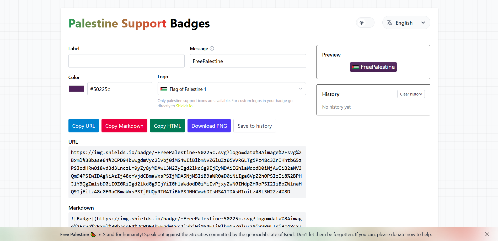
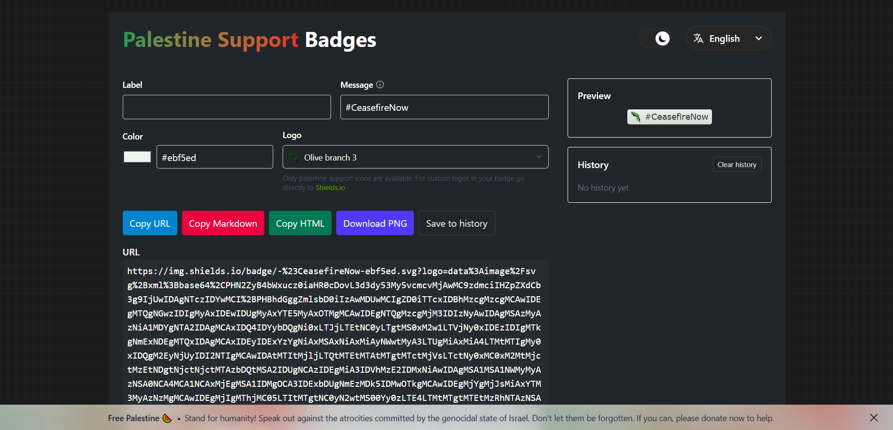

# Palestine Support Badges

 ![Badge](https://img.shields.io/badge/-SavePalestine-6bbde1.svg?logo=data%3Aimage%2Fsvg%2Bxml%3Bbase64%2CPHN2ZyB4bWxucz0iaHR0cDovL3d3dy53My5vcmcvMjAwMC9zdmciIHZpZXdCb3g9IjUwIDAgNTM3IDYwMCI%2BPHBhdGggZmlsbD0iIzAwMDYwMyIgZD0iTTgyIDRjMTQgNSAyNCAyNCAzMSAzNmwyIDJhMTUwMiAxNTAyIDAgMCAwIDE3IDUxbDEgMiA0IDE0IDEgM2MzIDggNiAxMSAxMyAxNWwyIDFjMC00IDAtNi0yLTEwLTQtNi0zLTE0LTEtMjEgMy0xMSAxMC0yMCAyMC0yNSA1LTIgMTAtMyAxNS0xIDQgMiA2IDQgOCA5YTM5IDM5IDAgMCAxLTMwIDQ2bC0xIDggNSAyIDctNGgydi0zYzAtNSAyLTggNS0xMiA5LTcgMTktMTEgMzAtMTF2LTNjMi05IDUtMTkgMTAtMjdsNCAxYTU3IDU3IDAgMCAxIDUgOGMxMSAyMCAxNiA0MSAxOCA2M3YzbDEgMjBjLTIgMTYtMiAxNiAzIDMwbDEyIDggOSA3YzQgNCA0IDQgOSA2bC0yLTJjLTE3LTI4LTIwLTUxLTE4LTgzYTIwNTQgMjA1NCAwIDAgMCAxLTE0di0zbDEtMnYtMmwxLTYgNCAxYTcxIDcxIDAgMCAxIDYgOGw0IDYgMiAzYzExIDE4IDE2IDM3IDE2IDU4YTIyOCAyMjggMCAwIDAgNCA0NmMyIDYgMyAxMiA4IDE2bDIgMmEzNjggMzY4IDAgMCAwIDE4IDE3bC0xLTItMTAtMTctMS0yYy0xMS0yMS0yLTQ1IDUtNjZsMy04di0ybDMtNyA1IDEgMyA3IDEgMmE1NDAgNTQwIDAgMCAxIDQgMTJjMTEgMzEgMjAgNTggNiA4OWwtMiA4YzIgNSA2IDkgMTAgMTNhMjcyIDI3MiAwIDAgMSAyNSAyOWwtMS0yYy0xMy0zMS0xMy0zMS0xNS00NHYtM2MtMy0yNSA3LTUxIDE1LTc0bDQgMWMxOSA4MCAxOSA4MCAxMSAxMTFsMi0yIDItMyAzLTJjNS03IDEyLTExIDIxLTExIDQgMCA2IDEgOSAzIDQgNSA1IDkgNSAxNS0xIDEwLTUgMTctMTEgMjRsLTIgMmMtNSA1LTEyIDktMjAgOWgtMmw0IDhoNGwzLTRjMy01IDktOCAxNS05aDljNyAxIDcgMSAxMy0ybDQtNmMyLTUgNi05IDEwLTEybDItMiA1LTUgMyAxYzcgMTggNiA0My0xIDYxbC02IDEzYTE5NzggMTk3OCAwIDAgMC04IDE1Yy02IDEyLTYgMTItNiAyNmw3IDEwYTg2IDg2IDAgMCAxIDQgOHYtM2MyLTExIDQtMjEgMTItMzBsMS0yYzE0LTE0IDM4LTIzIDU3LTI4aDRjMSAxNi02IDMwLTE2IDQyYTIyOCAyMjggMCAwIDEtNDggNDFsMSAyYTgzNSA4MzUgMCAwIDEgNDIgMTEwbDEgMnYxMWMtNCA0LTYgNS0xMSA1aC0zbC01LTItMi02LTEtM3YtMmwtMy0xMS0xLTJjLTktMzItMjItNjMtMzUtOTRsLTEyIDVhMTA4IDEwOCAwIDAgMS03NyAzYy0xMi00LTI0LTEwLTM0LTE5bDEtNGMyOS04IDU1LTEwIDgzIDJhMTE3IDExNyAwIDAgMCAyMSA2bDE1IDEtMTgtMzYtMTAgM2MtMTYgNS0zNCAyLTUwLTUtMTgtMTEtMzctMjgtNDktNDZ2LTNjMTQtNCAzMSAxIDQ1IDZsMS0zYzEtNCA0LTcgNy0xMGw3LTJ2LTJsMS0zdi0zbDItNS0zLTQtMS0yLTItMi0yLTItNC02LTMgMWMtMTMgNS0yNyAxMC00MiAxM2gtMmMtMTMgMi0yNiAwLTM4LTNsLTItMS00OC0xNXYtM2wzMS04aDRsMTMtMnYtMmwtMi0xYy03LTQtOS0xMi0xMS0xOWwtMiAxYy02IDItMTAgNC0xNiAzLTQtMi02LTQtOS04LTMtOS0xLTE3IDMtMjUgNC03IDgtMTEgMTQtMTZoLTJjLTIwIDEtMzQtNC01MS0xNWwtOS01Yy0xMC02LTIxLTE1LTI4LTI0di0zbDM2IDFoMmMxNSAzIDMwIDEwIDQ0IDE2YTE2ODk4IDE2ODk4IDAgMCAwIDE4IDhsLTctOC0yLTItMy0yYTQyMzcgNDIzNyAwIDAgMS0xOC0xNWMtOC03LTE2LTE0LTI3LTE1YTE1NiAxNTYgMCAwIDAtMTggM2wtMiAxaC04bC0xIDJjLTEgMy0zIDQtNiA2LTcgMS0xMiAwLTE4LTRsLTQtNGMtMy00LTUtNC05LTZoLTJsLTQtMi0xMi0zLTItMS0xNi02LTQtMS0zLTR2LTJsNS0zIDMtMmM4LTUgMTMtNSAyMi01aDExbDEtMnYtMmwxLTIgMy00YzItMyAyLTQgMi03IDAtNS0yLTgtNi0xMS01LTMtOS00LTE0LTNsLTggM2MtMTQgNy0zMCAxMS00NiA2LTE4LTYtMzQtMTUtNTEtMjR2LTRjMTUtNCAzMC03IDQ1LThoM2MxMi0xIDI0IDMgMzUgOGw0IDEtMy0yLTEtMWE1NTMgNTUzIDAgMCAwLTEzLTEwYy04LTYtMTQtNy0yMy04LTExLTEtMTktNS0yNy0xMGwtMy0yYy0xMi04LTI0LTE3LTM1LTI4bC0xLTFMMCA0MXYtM2E1OCA1OCAwIDAgMSAyMCAzYzMwIDcgNTkgMjMgNzUgNTB2MmwxIDIgNSAyIDggNCAyIDEgMTggMTEtMi0yYTM0MSAzNDEgMCAwIDEtMjAtMjRDODYgNjIgNzkgMzggODEgNWwxLTFabTQyIDExOCAxIDIgMi0xLTMtMVptNTUgMTctNSA0IDMgMiA0NSAzMiAyIDEgMiAyIDQgMi01LTljLTYtOS0xMS0xOC0xNC0yOWgtNGMtMTAgMC0xOSAwLTI4LTVabS0xMCAxNSAxIDIgMi0xLTMtMVptMTUgMTEgMSAyIDIgMyAxIDIgMyA2YzIgNSA2IDUgMTAgN2EyNzk1IDI3OTUgMCAwIDEgOCAzbDUgMyAzIDEgMi0xYTYxOCA2MTggMCAwIDAtMzEtMjRsLTQtMlptMTAwIDkxLTMgMi0yIDF2MWM3IDEgNyAxIDEzLTFsMS00Yy00LTEtNiAwLTkgMVptMTIgOS0yIDIgMSA0IDItNC0xLTJabTkgMy0xIDcgNSA1YzYgMTEgOCAyMiA1IDM0bC03IDE0aDJhMTQ2IDE0NiAwIDAgMSA1OSAxMmwyLTFhMzE4IDMxOCAwIDAgMC0zNS00MWwtNS02LTE1LTE2LTUtNC01LTRabTg3IDQ3IDEgMlptLTIgNSAxIDJabS0xIDNjLTIgNC0yIDctMiAxMWwyIDEgMS0xMmgtMVptMjkgNTEgNiAxMiAxNSAyMiAxIDMgMiAyIDEgMmgxbC0zLTM1aC0yYy04LTEtMTQtMy0yMS02Wm0tMjMgMS0xIDUgMiAxYzYgNiA5IDE0IDEwIDIydjJsMSA3IDEwIDdhNTM5IDUzOSAwIDAgMSA5IDZsMi0xYTcwMyA3MDMgMCAwIDAtMzEtNDloLTJaIi8%2BPHBhdGggZmlsbD0iIzAwOEI0OSIgZD0ibTExMCAxMDcgMTQgNyAzIDJhMTEwMSAxMTAxIDAgMCAxIDIwMSAxNTVsMyAzIDEyIDEzIDkgMTBhMjU4IDI1OCAwIDAgMSAyMSAyNCA0MTMgNDEzIDAgMCAxIDI0IDMwYzI0IDMxIDQ0IDY1IDYyIDk5bDEgMmE3ODQgNzg0IDAgMCAxIDUyIDEzM2wtMiAxaC0ybC0zIDEtNSAzLTEtMmE3NDkgNzQ5IDAgMCAwLTEyNy0yNTFsLTItM2ExMDk2IDEwOTYgMCAwIDAtNTMtNTlsLTQtNS02LTUtMTUtMTUtMTItMTEtOC03YTI3NyAyNzcgMCAwIDAtMjItMTlsLTEzLTEyYTUzMyA1MzMgMCAwIDEtMzUtMjcgOTQwIDk0MCAwIDAgMS0zNy0yOGwtOS02LTMyLTIzLTMtMS01LTQtMi0xLTMtMi0xLTF2LTFaIi8%2BPHBhdGggZmlsbD0iIzlGM0Q5NCIgZD0ibTI5MyAyNzcgNCAzaDRsMS0yYzQgMSA1IDQgNyA4bDIgM2MzIDkgMyAxOCAwIDI3LTIgNS01IDktMTAgMTJoLThjLTctNC0xMC0xMS0xMi0xOHYtNWMwLTEwIDEtMTggNy0yNWwyLTIgMy0xWm05MiAxMDUgMiAzaDlsMyA1IDIgMmM0IDggMyAyMCAxIDI4LTIgNS01IDEwLTEwIDEzLTQgMS02IDItMTAgMC02LTQtOC0xMC0xMC0xNy0xLTEwLTEtMjAgNS0yOSA0LTUgNC01IDgtNVpNMTY5IDE1OWM5IDIgMTMgOCAxNyAxNSA1IDggNyAxNyA0IDI2LTEgMy0yIDYtNSA4LTQgMS03IDItMTEgMC05LTUtMTQtMTMtMTctMjJhNTQgNTQgMCAwIDEtMi0xM2MxLTUgMi04IDUtMTJsMiAxaDZsMS0zWiIvPjxwYXRoIGZpbGw9IiMwMDhENEEiIGQ9Ik0xODQgNzRjNCAzIDUgNSA2IDkgMSA5LTEgMTgtNyAyNS00IDYtOSAxMS0xNiAxM2gtM2wtMi00aC04Yy0zLTgtMy0xNCAwLTIyIDYtMTIgMTUtMjQgMzAtMjFaIi8%2BPHBhdGggZmlsbD0iIzAwOEQ0QiIgZD0iTTQyNyAyOTljNCAzIDQgMyA1IDYgMiAxMC0xIDE4LTcgMjYtNSA2LTEwIDExLTE3IDEzaC01bC0yLTRoLTdjLTMtNi0yLTE0IDAtMTkgMy03IDgtMTMgMTQtMThsMi0xYzUtNCAxMS00IDE3LTNaIi8%2BPHBhdGggZmlsbD0iIzAwOEI0QSIgZD0ibTI2OSAxMTggMTAgMTMgMSAyYTExMyAxMTMgMCAwIDEgMTEgMjVjMiA4IDIgMTYgMiAyNGwzIDM4djNsMSAyLTEgNmMtMTQtMzYtMjgtNzQtMjctMTEzWm0tNDgtMzRoMXYyYTk3NTIgOTc1MiAwIDAgMCA1IDM3YzQgMzAgNCAzMCAxMiA1OGwyIDUtMSAyYTg3IDg3IDAgMCAxLTI4LTYwdi00YzAtMTQgMy0yNyA5LTQwWiIvPjxwYXRoIGZpbGw9IiM5RjNEOTQiIGQ9Im0yODQgMjYzIDIgN2g1djVsLTQgNGMtMyAyLTUgNS02IDlsLTEgMy0xIDUtMSA4Yy00IDQtMTAgNS0xNSA2bC03LTJjLTQtNS00LTktNC0xNSAyLTEwIDgtMTkgMTYtMjYgNS0zIDEwLTQgMTYtNFoiLz48cGF0aCBmaWxsPSIjMDA4QjRBIiBkPSJNNTI5IDM5MnYybC0zIDNhMjY2IDI2NiAwIDAgMC00MCA0MiAxNTQgMTU0IDAgMCAwLTE2IDIzYy0zLTMtMi0xMS0yLTE1IDAtMTIgNC0yMiAxMi0zMCAxMS0xMSAzNC0yNSA0OS0yNVoiLz48cGF0aCBmaWxsPSIjMDA4OTQ4IiBkPSJtMjU3IDM0NSAxMTQgMWMtMyA1LTE1IDctMjAgOS0yOSA5LTU1IDQtODMtNmwtMTEtM3YtMVoiLz48cGF0aCBmaWxsPSIjMDA4QjRBIiBkPSJtMzMxIDE3MiA0IDggMSAyIDIgNiAxIDJjMTAgMjYgMTcgNTEgNyA3OGwtMyA2LTMtN3YtNWwtMS0yYTEyMzYgMTIzNiAwIDAgMS00LTM0bC0xLTQtMy01MFptLTQgNGgxdjNjMSAyNSA0IDUwIDggNzV2M2wxIDR2MTBjLTEzLTE2LTIzLTMzLTIxLTUzIDEtMTUgNi0yOSAxMS00MlptNDAgMTY2IDIgMmEyODg2IDI4ODYgMCAwIDEtMTE2LTJsOS0zIDMtMWgzbDMtMWMzMy03IDY0LTEwIDk2IDVaIi8%2BPHBhdGggZmlsbD0iIzAwOEE0OSIgZD0iTTIyNSA4NWM0IDMgNiA3IDggMTF2M2ExNzYgMTc2IDAgMCAxIDEyIDc3djE0Yy0xNi0yNC0xNi02NS0xOS05M3YtMmwtMS0zdi03WiIvPjxwYXRoIGZpbGw9IiMwMDhCNEEiIGQ9Ik01MzMgMzk0Yy0xIDE3LTEyIDI5LTIzIDQxbC0zIDNjLTkgMTAtMjAgMTgtMzIgMjZsLTItMWExNDEgMTQxIDAgMCAxIDMwLTQwbDE3LTE3IDEwLTEwIDMtMlptLTE5MyA3NWE2OTYgNjk2IDAgMCAxIDQ0IDggMTM2IDEzNiAwIDAgMCAzMCAyIDQ2MTUgNDYxNSAwIDAgMCAzMyAwbC0xMiA2LTIgMWExMDEgMTAxIDAgMCAxLTkzLTE2di0xWiIvPjxwYXRoIGZpbGw9IiMwMDhBNDkiIGQ9Im0xOTAgMjI3IDE1IDVhMjU0IDI1NCAwIDAgMCAzOSAxMmMxMyA0IDI2IDcgMzkgOHYybC03IDItMiAxYy0xMiA0LTI3IDUtMzggMGwtMjEtMTEtOC01LTE3LTEzdi0xWiIvPjxwYXRoIGZpbGw9IiMwMDg5NDkiIGQ9Im0zODEgMjExIDQgMTJ2MmExNjMyIDE2MzIgMCAwIDEgMyAxM2M3IDMxIDcgMzEgNiA0NXYzYzAgOC0xIDE1LTMgMjJsLTEgNC0zIDktMiAxYTM5NDYgMzk0NiAwIDAgMS0yLTE4IDcxOSA3MTkgMCAwIDEtMi05M1ptLTQgMjUwaDJjMTIgMCAyMSAzIDMyIDcgOSA0IDE3IDcgMjcgOHYyYTM2OCAzNjggMCAwIDEtOTctMTFjMy0zIDUtMyA5LTRoNGM4LTIgMTUtMiAyMy0yWk00NCAxMjRhNzExMTczIDcxMTE3MyAwIDAgMSAyOSA0bDYwIDdjLTMgMy03IDUtMTEgNmwtMiAxYy0xNiA2LTMxIDQtNDYtMmwtNS0zLTMtMi0yMi0xMHYtMVpNODYgMTFjMTAgNCAxNiAxNyAyMSAyNWwyIDJhMTYwIDE2MCAwIDAgMSAxOCA0OHYybDUgMTV2NEM4NiAyOCA4NiAyOCA4NiAxMVoiLz48cGF0aCBmaWxsPSIjMDA4QjQ5IiBkPSJNMzc3IDIxOGgxdjRhMTE4NyAxMTg3IDAgMCAwIDQgOTVsLTUtOC0xLTNjLTEyLTMyLTktNTYgMS04OFoiLz48cGF0aCBmaWxsPSIjMDA4QTQ5IiBkPSJNNDcwIDMyM2gyYzUgMjctMSA0OS0xMyA3M2wtNyAxNy0xLTggMS0ydi0zbDEtM2E1MDggNTA4IDAgMCAxIDE3LTc0WiIvPjxwYXRoIGZpbGw9IiMwMDhDNEEiIGQ9Ik0yMTAgMTA5YTQ2MTYgNDYxNiAwIDAgMSAwIDI0djRsLTEgNGgtMTFjLTUgMC05LTEtMTQtM3YtNmwtNS0yYzEtNyA1LTEwIDEwLTE1IDYtNCAxMy02IDIxLTZaIi8%2BPHBhdGggZmlsbD0iIzAwOEE0OSIgZD0ibTEyOCAxMjggNCA0LTM3LTNhNTI2OCA1MjY4IDAgMCAwLTUxLTd2LTJhMTUzMCAxNTMwIDAgMCAxIDE5LTRjMjMtNCA0NSAwIDY1IDEyWk05IDQyYzMwIDUgNTcgMTkgNzcgNDFsNCA4LTE2LTgtMy0xQTk5NyA5OTcgMCAwIDEgOSA0M3YtMVoiLz48cGF0aCBmaWxsPSIjMDA4QzRBIiBkPSJNNDMwIDM0N2gxNGwtMSAzLTIgMTd2MTBjLTEwIDAtMTctMy0yNS05bC0yLTRoM2wtMS02LTItMWMwLTMgMS00IDMtNWwyLTIgMi0xYzMtMiA2LTIgOS0yWiIvPjxwYXRoIGZpbGw9IiMwMDg5NDkiIGQ9Ik00NjUgMzI2djRsLTEgM2ExNTYgMTU2IDAgMCAwLTYgMjJsLTcgMzl2M2wtMSA3djJsLTEgMy0yIDRhMTA2MCAxMDYwIDAgMCAxLTMtNDN2LTRjLTEtMTEgMi0xOCA5LTI2bDItMyAxMC0xMVoiLz48cGF0aCBmaWxsPSIjMDA4QTQ5IiBkPSJtODUgMTggNCA3IDEgMiAxIDNhNTgzIDU4MyAwIDAgMCAzOCA3NWwtMSAyLTE5LTIyLTEtMmE5MCA5MCAwIDAgMS0yMy02NVoiLz48cGF0aCBmaWxsPSIjMDA4OTQ5IiBkPSJNMTg3IDIyMWEyNjEgMjYxIDAgMCAxIDIyIDAgMTM4IDEzOCAwIDAgMSA0MSAxNGwzMSAxM2gtOWwtNC0xaC00bC0yLTFjLTI2LTUtNTEtMTItNzUtMjR2LTFabTgwLTg2aDF2MmM1IDMyIDEzIDYzIDI1IDkydjRhMjA2MiAyMDYyIDAgMCAxLTIyLTM4bC0xLTNhNjggNjggMCAwIDEtNS0zMHYtMTlsMS0yIDEtNloiLz48cGF0aCBmaWxsPSIjMDA4OTQ4IiBkPSJNOCA0NWEzMzcgMzM3IDAgMCAxIDI5IDE3bDMgMmExNzA2IDE3MDYgMCAwIDAgMzYgMjNsMiAyIDkgN2MtMjMgMi00Ny0yMC02NC0zNEw4IDQ3di0yWiIvPjxwYXRoIGZpbGw9IiMwMDg4NDgiIGQ9Ik0zMzMgMzkzYTEyNCAxMjQgMCAwIDEgMTQgN2w0IDEgNCAyIDMgMiAzIDEgOSA3IDEgMyA1IDE1Yy0xNi02LTMyLTI0LTQzLTM3di0xWiIvPjxwYXRoIGZpbGw9IiMwMDhCNEEiIGQ9Ik00MDEgNDI3YzUgMCA5IDIgMTQgNGwxMyAzdjJjLTcgMy0xNCAzLTIxIDNoLTNjLTUgMC05IDAtMTMtMmwyLTIgNS01IDMtM1oiLz48cGF0aCBmaWxsPSIjMDA4OTQ4IiBkPSJNMTUzIDE3NHY4bC0zNS0yYzEwLTEwIDIzLTkgMzUtNloiLz48cGF0aCBmaWxsPSIjMDA4QTQ5IiBkPSJNMzM0IDM5MGMxMi0xIDI1IDIgMzYgN2wtMSAxMS0xMS01LTMtMS0zLTItNy0zLTItMi05LTR2LTFaIi8%2BPHBhdGggZmlsbD0iIzAwODQ0NiIgZD0ibTEyMiAxODMgMzIgMiA1IDExLTE4LTUtNC0xLTE1LTZ2LTFaIi8%2BPHBhdGggZmlsbD0iIzAwMTMwQSIgZD0iTTM0NCA0NjdhMTExOCAxMTE4IDAgMCAxIDY0IDExdjJsLTIxLTJoLTNsLTQxLTggMS0zWiIvPjxwYXRoIGZpbGw9IiMwMDFDMEYiIGQ9Ik0yNjQgMzQyYTEzMjIyMjkxOSAxMzIyMjI5MTkgMCAwIDAgMjkgMGwxMyAxaDI3djFoLTMwdjJhNDk5MSA0OTkxIDAgMCAxLTM2IDBoLTlsLTUtMmM0LTIgNy0yIDExLTJaIi8%2BPHBhdGggZmlsbD0iIzAwODU0NyIgZD0iTTQwNiA0MTZjOSAzIDE3IDkgMjQgMTUtMyAyLTYgMC0xMC0xaC0ybC0xNS02IDMtOFoiLz48cGF0aCBmaWxsPSIjMDAxMzBBIiBkPSJNMzc4IDIxNGgxdjVsMSAzIDEgNmE3NiA3NiAwIDAgMSAwIDd2NmE0MzcyIDQzNzIgMCAwIDEgMSAzMWgtMnYxMGgtMWExMjE3IDEyMTcgMCAwIDEtMi01OHYtNWwxLTVaIi8%2BPHBhdGggZmlsbD0iIzAwODY0NyIgZD0iTTE5NCAxOTJjNyAwIDE0IDIgMjEgNHYxYTE1NzQgMTU3NCAwIDAgMS0yMiAzbDEtOFoiLz48cGF0aCBmaWxsPSIjMDA4NTQ3IiBkPSJtNTEzIDU4OCAxIDVjLTQgMy03IDUtMTIgNGwtMS00YzQtNCA2LTUgMTItNVoiLz48cGF0aCBmaWxsPSIjMDA3MjNDIiBkPSJtMTEwIDEwNyAxNSA4IDMgMSAzIDIgMiAxYzIgMiAzIDMgMyA2bC0xNy0xMS0zLTEtMi0yLTItMi0yLTF2LTFaIi8%2BPHBhdGggZmlsbD0iIzBDMDQwQiIgZD0ibTI4OSAyNzUgMiAxLTEgMi02IDEwaC0zYzEtNCAyLTYgNS05bDItMiAxLTJaIi8%2BPHBhdGggZmlsbD0iIzAwN0E0MSIgZD0ibTE5MyAxODUgMTEgNCA0IDEgMiAxaC0xMGwtMy0xLTMtMS0xLTRaIi8%2BPHBhdGggZmlsbD0iIzAwMjMxMiIgZD0iTTI2NSAzNDJoN3YxaC04djJjLTggMS04IDEtMTEtMSA0LTIgNy0yIDEyLTJaIi8%2BPHBhdGggZmlsbD0iIzAwNkIzOCIgZD0iTTM5MiAzNjhoMWMwIDUtMSA5LTMgMTRoLTFjMC01IDEtOSAzLTE0WiIvPjxwYXRoIGZpbGw9IiMwMDE4MEQiIGQ9Ik0yMjMgODVoMmwxIDhoLTJ2NWgtMVY4NVoiLz48cGF0aCBmaWxsPSIjMDA2RDNBIiBkPSJNMTU5IDEyMGMxIDUgMCA4LTEgMTJoLTJjMS05IDEtOSAzLTEyWiIvPjxwYXRoIGZpbGw9IiMwMDFGMTAiIGQ9Im0zNTYgNDY5IDcgMS0yIDF2MmwtOC0xIDMtMXYtMloiLz48cGF0aCBmaWxsPSIjMDA3OTQwIiBkPSJtMjk1IDI1OSAzIDEtOSA3LTEtMiAzLTMgMi0yIDItMVoiLz48cGF0aCBmaWxsPSIjMDAxQjBFIiBkPSJtMjMzIDE1MiAyIDdoLTJsLTEgMi0xLTdoMnYtMloiLz48cGF0aCBmaWxsPSIjMDA3RTQzIiBkPSJtMTMwIDExOSA1IDIgMSA0LTctNCAxLTJaIi8%2BPHBhdGggZmlsbD0iIzAwMjIxMiIgZD0ibTIzNiAxNjUgMiA2aC0ybC0xIDItMS02aDJ2LTJaIi8%2BPHBhdGggZmlsbD0iIzAwNjIzNCIgZD0ibTEyOCA5OCAzIDEgMSA0IDEgMnYyYy0zLTMtNC01LTUtOVoiLz48L3N2Zz4%3D) ![Badge](https://img.shields.io/badge/-StopGenocide-7be279.svg?logo=data%3Aimage%2Fsvg%2Bxml%3Bbase64%2CPHN2ZyB4bWxucz0iaHR0cDovL3d3dy53My5vcmcvMjAwMC9zdmciIHZpZXdCb3g9IjAgMCA0MTggMjY4Ij48cGF0aCBmaWxsPSIjMDkwQTBDIiBkPSJNMCAwaDQxOHYyNjhIMTg2di0ySDBWMFoiLz48cGF0aCBmaWxsPSIjRkRGREZEIiBkPSJNNDE2IDBoMnYyNjhIMTg2di0yaC04MGw1LTIzIDItNyA3LTMxYzItOCAyLTEzLTItMjBhMzI2IDMyNiAwIDAgMC0xNy0yNmwtMTMtMjEtMi0zLTItMy0yLTNjLTEtOCAxLTEzIDUtMjBsNC02IDEtMyA3LTEzIDEwLTE4YzYgMCA5IDIgMTQgNWw0IDF2MmwyIDEgMjAgOWExMDU0IDEwNTQgMCAwIDAgMTQgN2wzIDIgMiAxIDIgMSAzIDMtMiA1LTIgMmgtMmwtMSAyYy0yIDQtNCA3LTkgOS05IDEtMTYtMS0yMy03bC00LTMtMy0ydjRjLTEgNi00IDEwLTcgMTQgMyAzIDYgNCAxMCA1bDIgMSAyIDFoMmw2IDJjNCAyIDUgNCA3IDhsOCAxNCAxIDMgNyAxMGMxIDgtMSAxNC00IDIxLTIgNC0zIDctMyAxMmwxMyAyLTMgMTMtMSAzYTU5MSA1OTEgMCAwIDEtNiAzMGgydi0ybDktMjcgNy0yMi0yLTEtNS0zYzAtOSA2LTE2IDEyLTIybDItMiAyLTMtNCAxLTMgMS03IDMtMS0yLTQtMTEtMS0zLTQtOS0xLTNjLTMtNi00LTktMTAtMTJhOTEgOTEgMCAwIDAtMTYtM2wtNC0zYTI1ODcgMjU4NyAwIDAgMSAzMyAwbDIgMmg0bDEtMi0yLTEtMy0zYzItNiA0LTEwIDgtMTRsMy05LTItMWE1MTEwIDUxMTAgMCAwIDEtMTEtNmwtMy0xLTQtMi00LTNWNzVsMy0xNmMxNSA0IDE1IDQgMTggOGw5IDRjMCA0LTEgNi0zIDEwbC0yIDQtMSAyYzYtNCA2LTQgMTAtMTAgNCAxIDYgMSA5IDRsMiAyIDIgMiA0IDMgMyAzYy0xIDUtMyA4LTYgMTJsLTUgOC0zIDVjLTIgMi0zIDQtMyA3bDExLTExIDgtNyA1LTgtMS00aDJsLTEtM2E1MDY0MTMgNTA2NDEzIDAgMCAxIDE0OS0xaDUxVjBaIi8%2BPHBhdGggZmlsbD0iIzI5ODQzNiIgZD0iTTIxNyAxNzFoMXY2aDE5OHY4OUgxODhsMS0xNnYtNWgxbDEgNmExMDczMiAxMDczMiAwIDAgMCA1LTIzbDEtMiAyLTEwdi0ybDEtNmMyLTcgNy0xMiAxMy0xNmwzLTN2LTdsMS0ydi05WiIvPjxwYXRoIGZpbGw9IiNEODE0MTQiIGQ9Ik0xIDFoMnYyaDJ2MmgydjJoMmwxIDIgNSAydjJoMnYyaDJ2MmgydjJoMnYyaDR2MmgydjJoMnYyaDJ2MmgybDEgMiA1IDJ2MmgydjJoMnYyaDJsMSAyIDUgMnYyaDJ2MmgydjJoMnYyaDJsMSAyIDUgMnYyaDJ2MmgydjJoMmwxIDIgNSAydjJoMnYyaDJ2MmgydjJoMmwxIDIgNSAydjJoMnYyaDJsLTEgNS0xIDMtMiA0aC0ydjRoLTJ2MmgtMnY0aC0ydjJoLTJ2NGwtNCA0Yy0zIDQtMyA3LTMgMTJsMSAzIDIgMSAyIDcgMiAxIDIgNyAyIDF2NGgybDEgM2MxIDQgMSA1IDQgN2wxIDUgMiAxdjRoMmMyIDMgMiA2IDIgMTBoLTJ2MmgtMnYyaC0ydjJoLTJ2MmgtNHYyaC0ydjJoLTJ2MmgtMnYyaC0ydjJoLTJ2MmgtMnYyaC00djJoLTJ2MmgtMnYyaC0ydjJoLTJ2MmgtMnYyaC00djJoLTJ2MmgtMnYyaC0ydjJoLTJ2MmgtMnYyaC0ydjJoLTR2MmgtMnYyaC0ydjJoLTJ2MmgtMnYyaC0ydjJoLTR2MmgtMnYyaC0ydjJoLTJ2MmgtMnYyaC0ydjJoLTJ2MmgtNHYyaC0ydjJIOXYySDd2Mkg1djJIM3YySDFWMVoiLz48cGF0aCBmaWxsPSIjMzk4NTQyIiBkPSJNMCAwaDQxNnY4OWwtNTMgMWExMzEzOSAxMzEzOSAwIDAgMC0xOCAwaC0xMWEzMjkyMyAzMjkyMyAwIDAgMS0xMTYgMWwtNS0xdi0yaDIwMlYxSDF2MjY0aDJ2LTJoMnYtMmgydi0yaDJ2LTJoMnYtMmgydi0yaDR2LTJoMnYtMmgydi0yaDJ2LTJoMnYtMmgydi0yaDJ2LTJoNHYtMmgydi0yaDJ2LTJoMnYtMmgydi0yaDJ2LTJoNHYtMmgydi0yaDJ2LTJoMnYtMmgydi0yaDJ2LTJoMnYtMmg0di0yaDJ2LTJoMnYtMmgydi0yaDJ2LTJoMnYtMmg0di0yaDJ2LTJoMnYtMmgydi0yaDJ2LTJoMnYtMmgydi0yaDR2LTJoMnYtMmgydi0yaDJ2LTJsMy0xIDUgOCAxIDMgMiAyIDEgMmMzIDYgMiAxNCAxIDIwYTEzMTIwIDEzMTIwIDAgMCAwLTMgMzhjMCA2LTEgOS0zIDE1SDBWMFoiLz48cGF0aCBmaWxsPSIjMTYxNzE4IiBkPSJNMTU4IDU5YzE1IDQgMTUgNCAxOCA4bDkgNGMwIDQtMSA2LTMgMTBsLTIgNC0xIDJjNi00IDYtNCAxMC0xMCA0IDEgNiAxIDkgNGwyIDIgMiAyIDQgMyAzIDNjLTEgNS0zIDgtNiAxMmwtNSA4LTMgNWMtMiAyLTMgNC0zIDdsMTEtMTEgOC03IDUtOC0xLTQgMy0xIDQgMyAxIDEgMyAyIDQgNCAxIDIgNCAyYzAgNC0xIDctNCAxMGE2MSA2MSAwIDAgMC0xMiA0MHYzbC0xIDE4djNsLTMgMTItOCA2Yy03IDctNyAxNi05IDI1YTExNzQgMTE3NCAwIDAgMS03IDMwaC0xYTI0OSAyNDkgMCAwIDEgMy00NXYtMmMxLTYgMi0xMSA3LTE1bDItMWM4LTcgOC0yMCA5LTMwbDEtNiAyLTE2Yy00IDQtOSA3LTEyIDEybC0xMS01LTMtMi0zLTItMi0yYTEzMTEgMTMxMSAwIDAgMS0xMS02bC0yLTIgMy00LTItMS0zLTNjMi02IDQtMTAgOC0xNGwzLTktMi0xYTUxMTAgNTExMCAwIDAgMS0xMS02bC0zLTEtNC0yLTQtM1Y3NWwzLTE2WiIvPjxwYXRoIGZpbGw9IiMxNTE1MTYiIGQ9Im0xMzYgNDcgMTkgOXY0aDN2MmwtMSA4djNsLTEgOHYzYzAgMyAwIDMgMiA1bDIgMSAzIDIgMTAgNCA3IDRhMjYwIDI2MCAwIDAgMS0yIDdsLTEgMi0zIDEtMiA1LTEgMi0yIDcgNCAzLTEgMy02LTJoLTlhMjA1MSAyMDUxIDAgMCAwLTEzIDJoMmM1IDEgOSAyIDEzIDZsNSAxMCAxIDMgNCA4IDEgMyA1IDEyIDItMWM3LTQgNy00IDExLTNsLTUgN2MtNiA1LTkgMTItMTAgMjBsNiA0Yy0xIDExLTUgMjItOSAzMmE1NTM2IDU1MzYgMCAwIDAtNyAxOWgtMmwyLTE2IDEtM2ExOTA0IDE5MDQgMCAwIDEgNi0yNmwtMTItMmMtMS01LTEtNyAxLTEybDItNCAyLTVjMi00IDItOSAxLTEzbC02LTktMy01LTEtMy02LTktMi0zLTEtNWgtMmwtMTYtNS0yLTFjLTUtMi01LTItNi00bDYtOSAxLTV2LTVsNSAzIDMgMiA2IDRjNSA0IDExIDMgMTcgMyA0LTEgNC0zIDctNmwzLTRoMmwzLTgtMi0xYTIyMDAwIDIyMDAwIDAgMCAxLTMzLTE3bC0zLTEtMi0xLTUtM3YtMmwtNC0xIDMtMS0xLTJjMC00IDItNyA0LTExbDEtMiA2LTExWiIvPjxwYXRoIGZpbGw9IiNGM0YzRjQiIGQ9Ik0xNTggNTljMTUgNCAxNSA0IDE4IDhsOSA0YzAgNC0xIDYtMyAxMGwtMiA0LTEgMmM2LTQgNi00IDEwLTEwIDQgMSA2IDEgOSA0bDIgMiAyIDIgNCAzIDMgM2MtMSA1LTMgOC02IDEybC01IDgtNyAxMC03IDktMyAzYy01LTItOS01LTEzLTkgMy0xMCAzLTEwIDYtMTRsMi0xIDItNXYtMmwxLTItMi0xYTUxMTAgNTExMCAwIDAgMS0xMS02bC0zLTEtNC0yLTQtM1Y3NWwzLTE2WiIvPjxwYXRoIGZpbGw9IiMxNTE0MTIiIGQ9Ik0xMDAgODJoMmE0MDU4IDQwNTggMCAwIDAtMTYgMzJjLTMgNS00IDEwLTMgMTVsNCA2IDIgNCAyIDIgNyAxMWE4Mjg3IDgyODcgMCAwIDAgMjAgMzJjNSA3IDUgMTIgNCAyMGwtNSAxOGE0MzM3IDQzMzcgMCAwIDAtNCAxOWwtNCAxNGgtMWEyMTIgMjEyIDAgMCAxIDItMzVsMi0xNGMxLTktNC0xNy05LTI0bC00LTEzaC0ydi00bC0zLTEtMS03LTMtMS0xLTdoLTJ2LTRsLTMtMS0xLTctMy0xLTEtNy0zLTEtMS0xMCA2LTloMnYtNGgydi0yaDJ2LTRoMnYtMmgydi00aDJsMS0ydi0zbDEtM2MxLTMgMS0zIDUtM1oiLz48cGF0aCBmaWxsPSIjMTMxMzEzIiBkPSJNMTQ1IDEzMWM2IDAgMTAgMSAxNCA1bDEwIDIxIDEgMyA1IDEyIDItMWM3LTQgNy00IDExLTNsLTUgN2MtNiA1LTkgMTItMTAgMjBsNiA0Yy0xIDExLTUgMjItOSAzMmE1NTM2IDU1MzYgMCAwIDAtNyAxOWgtMmwyLTE2IDEtM2ExOTA0IDE5MDQgMCAwIDEgNi0yNmwtMTItMmMtMS01LTEtNyAxLTEybDItNCAyLTVjMi00IDItOSAxLTEzcy00LTctNi0xMGwtMy01LTItMmMtNi05LTYtOS01LTEzdi00bC0zLTJ2LTJaIi8%2BPHBhdGggZmlsbD0iI0YzRjNGNCIgZD0iTTIxNCA5OWE0MyA0MyAwIDAgMSAxMyA3bDEgNWMtMSA0LTIgNS01IDhsLTMgMy0yIDItMyA0LTE1IDE2LTktNy0xLTEtMi0yLTItMiA2LTggNy03IDEyLTEzIDMtNVoiLz48cGF0aCBmaWxsPSIjRjFGMkYzIiBkPSJtMTM2IDQ3IDE5IDljLTEgNy0xIDEwLTQgMTZsLTIgMTFjLTktMi0xNi03LTI0LTExIDAtNiAzLTExIDYtMTZsMS0yIDQtN1oiLz48cGF0aCBmaWxsPSIjNEE4NzUxIiBkPSJNMjEzIDg4aDIwMHYxbC02OCAxaC0xMWEzMjM4MyAzMjM4MyAwIDAgMS0xMTMgMWgtM2wtNS0xdi0yWiIvPjxwYXRoIGZpbGw9IiMyOTI5MkIiIGQ9Im0xNTQgNTkgNCAxLTMgMjdoLTFsLTEtOWgtMnYzbC00IDYtOC00LTMtMS0yLTEtMi0xLTUtM3YtMmwtNC0xaDdhMTM2IDEzNiAwIDAgMSAxMCA1bDIgMSA2IDJ2LTJsNC0xMiAyLTlaIi8%2BPHBhdGggZmlsbD0iIzFDMUMxQyIgZD0iTTE3MCAyMDVoMmwxIDEwIDEgMi0yIDktMSAyYTk4NCA5ODQgMCAwIDEtOCAyMmgtMmwyLTE2IDEtM2ExOTA0IDE5MDQgMCAwIDEgNi0yNloiLz48cGF0aCBmaWxsPSIjMTkxOTFBIiBkPSJNMTUxIDc4aDJsMSA5IDIgMSAyNCAxMi0xIDQtMSAzLTMgM3YtNGwtNiAyIDEtMiAyLTYtMi0xLTEwLTUtMy0yLTQtMS0zLTItMy0zaDJsMi04WiIvPjxwYXRoIGZpbGw9IiMxODI0MUEiIGQ9Im0xMTAgMjIyIDIgNCAyLTF2MTFsLTEgMy0xIDQtMSAzLTIgOWgtMWMwLTExIDAtMjIgMi0zM1oiLz48cGF0aCBmaWxsPSIjMUQyNDFGIiBkPSJNMTkyIDIxOWM0IDUgNCA4IDQgMTQtMiAxNi0yIDE2LTYgMjBsMi0zNFoiLz48cGF0aCBmaWxsPSIjMUYxRjFGIiBkPSJtMTMzIDEyOCAxMiAydjNsNCAyLTEgN2MtMy00LTMtNC0zLTdoLTJsLTEzLTQgMy0xdi0yWiIvPjxwYXRoIGZpbGw9IiMyQzJDMkUiIGQ9Ik0yMTcgMTM2aDFsMSAyNi0yIDEtMS0ydi0zbC0xLTMtMi01IDEtN2gybDEtN1oiLz48cGF0aCBmaWxsPSIjMkIyQjJDIiBkPSJNMTkwIDEyMGgybDEgNC0yIDNoLTJsLTIgNSA2IDdjLTUgMC03LTMtMTEtNmwzLTYgMi0zIDMtNFoiLz48cGF0aCBmaWxsPSIjMjcyNzI3IiBkPSJNMTcwIDIwNWgybDEgMTAgMSAydjJsLTQgNHYtM2wtMyAxIDMtMTZaIi8%2BPHBhdGggZmlsbD0iIzE4MTgxQSIgZD0ibTE3MiA5OCA3IDF2NWwtMSAyLTEgMi0xIDItMS00LTYgMiAxLTIgMi04WiIvPjxwYXRoIGZpbGw9IiMyODI4MkEiIGQ9Ik0xODUgNzRjNSAxIDUgMSA3IDNsLTIgMS02IDUtMyA0aC0yYzMtMTAgMy0xMCA2LTEzWiIvPjxwYXRoIGZpbGw9IiMyNzI4MkEiIGQ9Im0xNTQgNTkgNCAxLTEgNnY0bC0zIDVjLTItMi0yLTItMi01bDItMTFaIi8%2BPHBhdGggZmlsbD0iIzA5MUEwQiIgZD0iTTE5OSAyMDdoMWMwIDktMiAxNy00IDI1aC0xbC0xLTEzIDIgMXYtMmwxLTN2LTNsMi01WiIvPjxwYXRoIGZpbGw9IiMyMTIyMjMiIGQ9Ik04MiAxMzBoMmw0IDUgMiAzdjVsLTEgMi00LTEgMS0yLTItNi0yLTJ2LTRaIi8%2BPHBhdGggZmlsbD0iIzJDMUIxQSIgZD0iTTk3IDgyaDVsLTQgMTAtNC0xYzAtNCAxLTYgMy05WiIvPjxwYXRoIGZpbGw9IiMzODM4M0EiIGQ9Im0xNTEgNzEgMyAzIDItMS0xIDE0aC0xbC0xLTloLTNsLTEgMiAyLTlaIi8%2BPHBhdGggZmlsbD0iIzFDODgzMiIgZD0ibTk5IDE3OSAzIDFjLTEgNi0xIDYtMyA4aC01bC0xLTNoMnYtMmgydi0yaDJ2LTJaIi8%2BPHBhdGggZmlsbD0iIzI5MkEyQyIgZD0iTTE0MCA0N2MxMCAzIDEwIDMgMTQgNmwxIDMtMTEtNC0zLTItMi0xIDEtMloiLz48cGF0aCBmaWxsPSIjMUQxRDFFIiBkPSJtMTc2IDIwMyAyIDEtMSA0djNsLTIgNS0zLTF2LTdsNC01WiIvPjxwYXRoIGZpbGw9IiMzNTM1MzUiIGQ9Im0xMjQgMTE4IDIgMS0xIDMgMSA3LTctMyA1LThaIi8%2BPHBhdGggZmlsbD0iIzIzMjMyMyIgZD0ibTE2NSAxNTEgNCA3IDEgMiAxIDRoLTRjLTQtNy00LTctMy0xMmwxLTFaIi8%2BPHBhdGggZmlsbD0iIzJFMkUyRSIgZD0ibTEzMyAxMjggOCAxdjVsLTQtMWgtM2wtNC0zaDN2LTJaIi8%2BPHBhdGggZmlsbD0iIzFDMUMxQyIgZD0iTTE3MCAxOTBjMyAyIDMgMiA0IDZsMyAzLTMgMS02LTQgMi02WiIvPjxwYXRoIGZpbGw9IiMyNzI3MjkiIGQ9Im0yMTcgOTIgNCA0djNsMSAydjJsLTctNCAxLTItMS00IDItMVoiLz48cGF0aCBmaWxsPSIjMjUyNTI3IiBkPSJtMTg2IDEyOSAxIDIgNiA4Yy01IDAtNy0zLTExLTZsNC00WiIvPjxwYXRoIGZpbGw9IiMyNzI3MjkiIGQ9Ik0xODggMTY4Yy0xIDMtMiA0LTUgNmgtM2wtMS00YzMtMiA1LTIgOS0yWiIvPjxwYXRoIGZpbGw9IiNFQTFCMUQiIGQ9Ik01MyAyMTVoNHYyaC0ydjJoLTJ2MmgtMnYyaC00di0yaDJ2LTJoMnYtMmgydi0yWiIvPjxwYXRoIGZpbGw9IiMyQTJBMkEiIGQ9Im0xNjMgMTgzIDIgNC0yIDctMiAxdi05bDItM1oiLz48cGF0aCBmaWxsPSIjMzczNzM4IiBkPSJNMTczIDEwMWgybDIgNy0xIDItMS00LTYgMiA0LTdaIi8%2BPHBhdGggZmlsbD0iI0RCMjAyMiIgZD0iTTgxIDE4OWgydjJoMnYyaC0ydjJoLTJ2MmgtMmwyLThaIi8%2BPHBhdGggZmlsbD0iIzIxMUUyMCIgZD0iTTExMyAyMjVjMyA0IDIgNiAxIDEwaC0yYy0xLTQtMS02IDEtMTBaIi8%2BPHBhdGggZmlsbD0iIzJBMkEyQyIgZD0ibTE3MyAxMjggNCAyLTEgNGMtNS0yLTUtMi02LTRsMy0yWiIvPjxwYXRoIGZpbGw9IiMzODM4MzkiIGQ9Im0xNjcgOTQgNyAyIDEgMi01IDEtNC0zIDEtMloiLz48cGF0aCBmaWxsPSIjMjExRTIzIiBkPSJNMTkzIDIyNGgybDEgOS0zIDJ2LTExWiIvPjxwYXRoIGZpbGw9IiMyNjI0MjciIGQ9Im0xMDUgMTY1IDQgNS0xIDMtNC0yIDEtNloiLz48cGF0aCBmaWxsPSIjMDcwQjBFIiBkPSJtOTkgMTYxIDQgMXYyaC0ydjNoLTRsMi02WiIvPjxwYXRoIGZpbGw9IiNDODE1MTciIGQ9Im03NiA2NCAzIDF2MmgydjJoLTZsMS01WiIvPjxwYXRoIGZpbGw9IiMxRTBDMTEiIGQ9Im04NSAxMDQgMyAydjRoLTN2LTNoLTJ2LTJsMi0xWiIvPjxwYXRoIGZpbGw9IiNERjFBMUYiIGQ9Im05OCAxNzEgMyAydjZsLTEtM2gtM2wxLTVaIi8%2BPC9zdmc%2B) ![Badge](https://img.shields.io/badge/-StandWithPalestine-ffffff.svg?logo=data%3Aimage%2Fsvg%2Bxml%3Bbase64%2CPHN2ZyB4bWxucz0iaHR0cDovL3d3dy53My5vcmcvMjAwMC9zdmciIHZpZXdCb3g9Ijc1IDUwIDgwIDE2NyI%2BPHBhdGggZD0ibTExNiAyMjAtMy0zLTEtM2MwLTIgMC0zIDItNWwyLTQgMi0yIDEtNC0yLTQtMi0xYy0yIDAtMi0xLTMtMmwtMi0xLTEgMS0yIDEtMSAxdjVjMCAzIDAgNCAzIDcgMyA0IDQgNyAyIDEwbC0zIDEtMiAxaC0zYTI0IDI0IDAgMCAxLTgtMWwtMi0yLTMtMS04LTFoLTVsLTItMi0xLTF2LTdjLTEtMSAwLTMgMS00bDEtMS0xLTEtMS0xIDItNiAzLTFjMiAwIDMgMSA1IDVsNiAyIDQgMWgybC0xLTFjMC0yLTEtMi0yLTItMi0xLTUtMi02LTUtMi0zLTMtMTAtMi0xNnYtM2wtMS0yLTItNXYtNGMyLTYgMi0xMCAxLTEzdi0xbC0xLTNhMTYgMTYgMCAwIDEtMi01IDQwIDQwIDAgMCAxLTEtMjEgMjQgMjQgMCAwIDEgNS05bDItMiAyLTItMi0zdi01YzAtMiAxLTIgMi0ydi03bC0zLTEtNC0xLTEtMSA3IDJoMWwxLTMgMS02IDEtMiAxLTItMS0xYTUwIDUwIDAgMCAxLTQtM2MtMi0xLTItMi0xLTJsMyAzIDMgMSAxIDEgMy0zIDUtNGMyLTEgMi0xIDAtM2wtNC02di0xbDIgMnYxbDEgMSAzIDRoM2w2LTIgNC0xLTItN3YtMmwxIDEgMiA4aDFsNiAxaDVsMS0zYTczIDczIDAgMCAxIDItNWwxLTEtMSAzLTIgNXYybDEgMSA3IDMgMSAxIDItMSA1LTYtMSAzLTUgNSAxIDEgNCA3IDEgMyAyLTEgNS0zaDFsLTMgMi00IDItMSAxdjEwbDQtMmgzbC00IDItNCAxdjJsLTEgM3YzbDEgMWMxIDEgMCA1LTIgOGwtMSAxIDEgMSAxIDMgMyA3YzEgMiAyIDE0IDEgMTdsLTIgOC01IDYtMiAxdjNsMSA0IDEgOS0xIDJ2M2wxIDF2MTJjLTIgNS01IDgtMTAgOWwtMiAyIDEgMWgxbDEgMWgybDIgMWg1bDEtMSAyLTMgMy0xIDIgMSAyIDJ2N2ExMDU3IDEwNTcgMCAwIDEtMSA1YzAgMSAwIDItMiAzaC0xbDEgMmMwIDIgMCAyLTIgMmgtN2wtNCAxLTYgMS0yIDFoLTFjLTMgMi04IDItMTAgMW01IDAgMy0xaDFsMi0xIDktMiA0LTFoM2wxLTF2MWgzbC0yLTMtMS0yIDEgMWMyIDEgNCAwIDQtMWwtMi0yLTEtMWMtMS0xIDAtMSAxLTFsMiAxdi0zbC0zLTFoLTFsNC0xYzEgMSAxIDEgMS0xIDEtMiAwLTQtMS01bC0yLTFjLTIgMC00IDItNSA1bC0yIDEtMS0xYy0yIDAtMiAxLTIgMmgzYzEtMSAyIDAgMCAwbC0xIDJoNC0xbC0yIDEtMSAxLTItMnYyaC0xdi0xaC0ybDEtMmMtMS0xLTMgMC0yIDF2MWgtMmMtMiAwLTItMS0xLTJsMS0xYy0xIDAtMiAwLTMgMmwtMiAxIDEtMiAxLTFjMC0zIDAtMy0xLTJsLTEgMS0xIDJoLTJjLTIgMS0yIDAgMC0xdi0xaC0ydi0xbDEtMi0xLTEtMS0ydjVjMCAyIDAgMi0zIDVsLTIgNC0xIDUgMSA1em0tMTUtMyAzLTEgMS0xdi0yYzAtMiAwLTQtMi02YTkxNyA5MTcgMCAwIDAtNy02djJsMSAyYy0xLTEtMi0yLTMtMWwtMiAydi0xbDEtMS0xLTEtMSAxdjFoLTJjLTEgMS0xIDAtMi0xLTEtMi0xLTItMi0xaC0xbDEtMWgtMXYtMmgtM3YtMWgtMnYtMWgtNWwtNCAyYy0xIDItMSAzIDIgMmgybC0yIDEtMiAxYy0xIDIgMCAzIDIgMmgybC0yIDEtMiAyIDIgMWgxLTFsLTEgMiA0IDEgMi0xdi0xbDUgMSA0IDEgMiAyYzIgMiAzIDIgNiAybDMgMXptLTEyLTEzYzEtMSAwLTItMS0ydjF6bTM4IDBoLTF6bS0zMi0xdi0xaC0ydjF6bTM3IDB2LTFoLTJsMSAxem0tNDEtMXYtMWwtMSAxem0yOCAwYy0xIDAgMCAwIDAgMG05IDB2LTFoLTF2MXptLTM1LTFoMWwtMS0xaC0xbDEgMnptMzIgMHYtMWwtMSAxem0tMzggMGMxLTEgMC0yLTEtMXYxem00MyAwdi0xbC0xIDF6bS0xMC0xdi0xaC0xdjF6bTYgMHYtMWgtMmwxIDF6bS0zMCAwdi0xaC0xbC0xIDF6bS03LTFoLTF6bTMzIDAgMS0yaC0ydjJ6bS0yNCAwLTEtMS0xIDF6bS0xNi0xaC0xbDEgMXptMyAwLTItMXYxem0zIDBoLTFjLTEgMCAwIDAgMCAwem02IDB2LTFsLTEgMXptNSAwdi0xbC0xIDF6bS0yNC0xIDQtMS0zLTUtMy0xYy0xIDAtMyAyLTMgNGwxIDMgMiAxem00NCAwaC0xdjF6bS0zOSAwaC0xem0xNiAwdi0xbC0xIDF6bTI1LTFoLTJ6bS0zOCAwaC0xdjF6bTEwIDBxMS41IDAgMCAwaC0xemMtMSAxLTEgMSAwIDBtNSAwdi0xbC0xIDF6bTE5IDB2LTFsLTEgMXptLTIyLTEtMSAxem0xOS0xLTItMSAxIDF6bTYgMC0xLTF2MXptMiAwYzEtMSAwLTItMS0ydjJ6bS0yOC0xdjF6bTIyIDAtMS0xdjF6bTkgMHExLjUgMCAwIDBoLTFsMS0xdi0xbC0xIDEtMSAxem0tMzQgMC0xLTEtMS0xdi0xbC0xLTF2LTFoMmwtMS0xaC0xYy0yIDEtMiAwLTEtMWgxdi0ybDEgMWgxbDEtMS0xLTFoLTF2LTJoLTF2LTFsLTEtMS0xLTIgMSAxIDMgMXYtMWwtMi0xdi0xbC0xLTEgMS0xdi0yYTEzIDEzIDAgMCAxIDQtMmwtMS0yaC0ybDEtMS0xLTEtMS0yIDIgMSAxIDF2LTFsLTEtMSAxLTF2LTFoLTJsLTEgMS0zIDItMyAyLTIgOSAyIDExIDMgNHptNiAwdi0xbC0yIDF6bTQgMC0xLTF2MXptOS0xaC0xdi0xbC0xLTEtMS0xLTEgMSAxIDEgMyAyem05IDAtMS0xLTEgMSAxIDF6bS0yNiAwYzEgMC0xLTItMi0xbDEgMnptMjAgMHYtMWgtMnYxem0xNSAwcTEuNSAwIDAgMGwtMSAxem0tMjUgMCAxLTFjLTEtMS0yIDAtMiAxem0tNCAwIDEtMS0yIDF6bTIyIDB2LTFoLTFxLTEuNSAwIDAgMHptLTI2LTF2LTFoLTF2MXptMjAgMC0yLTEgMSAxIDEgMXptMTMgMC0xLTF2MXptLTMwIDB2LTF6bTI2IDAgMS0xLTEtMS0yIDEgMSAxem0tNyAwdi0yaC0xbC0xIDF6bS0xNS0xaC0xem0tMTEgMHYtMWwtMSAxem03IDB2LTJsLTIgMXYxem0xMyAwdi0xbC0yLTF2MWwxIDF6bTIwIDBoLTF6bS00IDAtMS0yLTEgMSAxIDF6bS03IDB2LTFoLTJsMSAxem0tMjctMSAxLTFoLTJ2MXptOCAwaC0xem0zIDBoLTF6bTMgMC0xLTEtMSAxem03IDAtMi0ydjJ6bTE2LTEtMi0xdjJoMXptLTcgMXYtMmgtMnYyem0xMCAwdi0xbC0xIDF6bS0zMi0xLTEtMS0xIDF6bTE1IDEgMS0xLTEtMS0yLTF2MnptLTExIDB2LTFoLTF6bS05LTEgMS0xLTEtMWgtMmwxIDF6bTgtMS0xIDF6bTMwLTFoLTN2MmwyLTF6bS0yNSAyIDEtMmgtMnYyem05LTF2LTFsLTItMXYxbDEgMXYxem03IDB2LTFoLTF2MXptLTIyIDB2LTFoLTFsLTEgMXptLTExIDBjMS0xIDAtMi0xLTFsLTEgMXptMjktMXYtMWwtMS0xYy0yIDAtMiAxLTEgMmwxIDF6bTcgMXYtMmgtMWwtMSAxem0tMjktMXYtMWgtMnYxem0xMyAwLTItMSAxIDJ6bS00IDAgMS0xaC0xbC0xIDF6bS0xMy0xLTEtMS0xIDF6bTYgMCAxLTFoLTF2LTFoLTFsLTEgMSAxIDJ6bTQgMC0xLTF2MXptOSAwLTEtMS0xIDJ6bTEwIDEtMS0yLTEtMXYxbDEgMnptNy0xIDEtMi0yIDFjLTIgMC0yIDAtMSAxem0tMTQtMS0yLTF2Mmgxem0tNyAwaC0xem0xNiAwdi0xbC0yLTF2MnptLTI5IDAtMS0xLTEgMXptMTAgMHYtMWwtMSAxem0tMyAwdi0yaC0ydjJ6bTMwIDB2LTJoLTF2MXptLTIxIDB2LTJsLTIgMnptNi0xdi0xaC0ydjF6bS0yNiAwdi0xaC0xdjF6bTM2IDAgMS0xdi0xaC00bDIgM3ptLTMwIDAgMS0yaC0ydjJ6bTEwLTFoLTF2MXptNiAwdi0xaC0xdjF6bTcgMC0xLTEtMSAxem0tMjcgMHYtMWwtMS0xdjJ6bTExIDAtMS0xLTEgMXptNSAwIDEtMmgtMWwtMSAyem0yMi0xaDFsLTEtMS0yLTF2MnptLTMxIDB2LTFoLTFsLTEgMXptMTYgMHYtMWgtMWwtMSAxem02IDBoMWwtMS0xdi0xbC0yIDEgMSAyem0tMzIgMC0xLTFoLTF2MXptNiAwdi0yaC0ydjF6bTEwLTFoLTF2MXptNiAwYzAtMS0xLTItMi0xbDEgMnptMTMgMCAxLTEtMS0xaC0xYy0yIDEtMiAxLTEgMnptLTMzIDAtMS0yLTEgMnptMTAgMHYtMWgtMmwxIDF6bTE2IDAtMS0xdjF6bTE1LTFjMC0yIDAtMy0yLTF2MWMxIDIgMiAyIDIgMG0tMzUgMHYtMWgtMXYxem0xMCAwdi0xbC0xIDF6bTYgMGgxbC0xLTEtMi0xdjJ6bTYgMGMxLTEgMS0yLTEtMnYyem0tMjYgMHYtMmgtMmwxIDJ6bTM0IDAgMS0yLTEtMS0xIDFoLTFsMSAyem0tMjQgMGMxLTEgMC0yLTEtMnYxcS0xLjUgMCAwIDB6bS00LTF2LTFoLTF2MXptMTAgMHYtMXEwLTEuNSAwIDBoLTF2MXptNyAwLTEtMmgtMXYyem02IDAgMS0yYy0xLTEtMiAwLTMgMWwxIDF6bS0zMy0xLTEtMWgtMWMwIDEgMSAyIDIgMW03IDAtMi0ydjJsMSAxem05IDB2LTFsLTEgMXptMjUgMHYtMmgtMWwtMSAxIDEgMnptLTI4IDB2LTJoLTFsLTEgMnptMTYgMHYtMmgtMnYxem0tNi0xLTItMXYxem0tMjEgMHYtMWgtMXYxem03IDAtMi0xdjF6bTkgMGgxdi0xaC0xbC0xIDF6bTE4IDAgMS0xaC0ybC0xIDF6bS00LTFoMWwtMS0xLTEtMWgtMXYyem0tMzQgMC0xLTF2MXptMjcgMC0xLTEtMSAxem0tMjEgMHYtMWgtMmwxIDF6bTcgMCAxLTFoLTFsLTEtMS0yIDEgMiAxem00IDAtMS0xem02IDB2LTJoLTF2MXptMTggMCAxLTF2LTFoLTJsLTEgMXptNC0xaC0xdjF6bS00MyAwdi0xaC0xdjF6bTYgMHYtMWgtMXYxem0yMSAwYzEtMSAwLTItMS0xdjF6bTggMHYtMmgtMmwtMSAyem0tMjItMXYtMWgtMXYxem00IDBoLTF2MXptNiAwIDEtMWgtMnYxem0xOSAwLTEtMi0xIDJ6bS0zOSAwdi0xaC0ydjF6bTYgMC0xLTFoLTF2MXptMjAgMCAxLTJoLTJ2MnptOS0xLTEtMS0xLTEtMSAyem0tMzkgMC0yLTF2MXptMjYgMCAxLTFoLTFsLTEgMXptLTIwIDAtMS0yLTEgMXYxem0xNCAwdi0xbC0xIDF6bS03LTEtMy0xdjFsMSAxIDEtMXptMyAwdi0xaC0xdjF6bTcgMGMtMSAxLTEgMSAwIDBtMTEgMHYtMWgtMnYxem0tMzItMWgtMXYxem0yNyAxdi0yaC0xdjJ6bTExLTF2MWgxem0tMzIgMS0xLTEtMS0xdjF6bTE0LTFoMXpjLTEtMS0yIDAtMSAxem0tNC0xdjF6bS0xNCAxLTEtMXYxem0xMSAwdi0zbC0xIDItMSAxem0yMSAwdi0xbC0yLTEgMSAxem0tMjYtMSAxLTEtMS0xLTEgMS0xIDF6bTE1LTFoLTJ2MWgyem03IDF2LTFoLTJ2MXptMTAgMHYtMWwtMiAxem0tMzYgMC0xLTF2MXptLTMtMS0xLTFjLTEtMS0yLTEtMSAxem0yNCAwdi0xaC0xdjF6bTEyIDAtMS0xaC0xdjF6bTIgMHYtMWwtMSAxem0tMjggMCAxLTEgMi00IDEtMXY2LTFsMS0xIDEtMSAxLTV2LTJsMS0xIDEtMSAyLTEgOC01di0xbC02LTUtMiAxLTIgMS0xIDJoLTJsLTYgNGgtMWw0LTMgMi0yLTEtMS0xIDEtMSAxLTEtMXYtMWwtMi0xaC0xIDFsMS0xYzAtMS0xLTItMy0xdjFoLTJsLTMgMmgtMWwxIDFxMS41IDAgMCAwdjFsNSA0IDEgMmgtMWwtMiAyLTMgNS0xIDJoMXYxaDFsMy0zYzEtMyAzLTUgNC00bC0yIDItMiA0LTIgNGMxIDEgMiAwIDMtMWwzLTQgMi0zLTEgM2MtMiAzLTMgNS0yIDZ6bTIxLTFoLTFjLTEtMS0xLTEgMCAwem0tMTMgMHYtMmwtMS0xLTEgMXYyem0zIDBoLTF6bS0yMCAwdi0xYy0xLTEtMiAwLTEgMXptLTE1IDAgMS0xaDFsMi0xIDYtNGgtM2wtMS0xLTEtMXEtMS41IDAgMCAwdi0xaC0xYy0xIDAtMS0xIDEtMmwyLTJoLTJsMi0yIDEtMWgtMnYtMmgtMWwtMSAxdi0xbDItMmgtMmwtNC0yaC0xdjEwbC0xIDV2NXptNDAtMWMyIDAgMi0xIDAtMWwtMSAxdjF6bTE1IDBoLTJ6bS0zNyAwdi0ybC0xIDEtMSAxem0xOCAwaDF6bTEyIDBoLTF6bTMgMHYtMWgtMnYxem0tNS0xdi0xaC0xdjF6bS0zMyAwdi0xbC0yLTEgMSAxem0yNiAwLTEtMS0xIDF6bTE0LTEtMS0xdjJ6bS0xOCAwLTMtNHYzbDIgMXptOCAwLTEtMWgtMXYxem02IDB2LTFsLTItMXYyem0tMTIgMC0xLTJ2MXptMTggMC0xLTJ2MXptLTQxLTEtMS0xdjF6bTMwIDB2LTFoLTF2MXptLTQtMWgxemwtMSAxem0xMSAxdi0yaC0ybDEgMXptLTM4LTEtMS0xdjF6bTM0IDAgMS0xaC0xbC0xLTEtMSAyem02IDB2LTJoLTF2MXptLTE1LTF2LTFsLTEtMWMxLTEgMC0xLTEtMmwtMS0xaC0xbC0xIDF2MWMyIDMgNCA0IDUgM201IDB2LTFoLTFsLTEgMXptNiAwdi0yaC0xdjF6bS0zNy0xLTItMXYxem0zMyAwdi0xbC0xLTF2MnptLTM3IDAgMS0xYy0xLTEtMS0yLTItMXYxem03IDB2LTFsLTEgMXptMzctMXYtMWgtMWwtMSAxem0tMTEgMHYtMWgtMWwtMSAxem0tMjcgMCAxLTFoLTFsLTIgMXptLTQgMHYtMmwtMSAxem0zOCAwdi0yaC0ydjF6bTYtMS0xLTF2LTEgMnptLTEwIDBjMS0xLTEtMi0yLTF2MXptLTUtMXYxem0tMzIgMHYtMWwtMiAxem01IDBoMWMwLTEtMS0yLTItMXYxem0zOCAwdi0xaC0xbC0xIDF6bS00IDAtMS0yLTEgMXptLTI5LTF2LTFsLTEgMXptMjUgMHYtMWwtMSAxem0tMzMgMGgtMXptMjkgMHExLjUgMCAwIDBsLTEtMXYxem0xNCAwdi0xaC0ydjF6bS0zNy0xaC0xYy0xLTEtMSAwLTEgMXptLTQgMC0xLTEtMSAxem0zNyAwdi0xbC0xIDF6bS0zMiAwdi0ybC0xIDF6bTI0IDB2LTF6cS0xLjUgMCAwIDBtNCAwdi0xaC0xem05LTEtMS0xIDEgMnptLTQwIDAtMS0xdjF6bTM3IDB2LTFsLTEgMXptLTQxIDAgMS0yLTIgMXYxem05LTFoLTFjLTEgMCAwIDAgMCAwbDEgMXptMjkgMGgtMXYxem0tNCAwczAtMSAwIDBoLTF6bS0yOCAwdi0xaC0xbC0xIDF6bTQgMHYtMWgtMXptLTgtMS0xLTEgMSAyem00MSAwaC0xdjF6bS0zIDBoLTJ6bTUgMC0xLTF2MXptLTM4IDB2LTFsLTEgMXptMzAtMWgtMXYxem0tMzMgMHYtMWgtMXYxem0tMyAwYzAtMSAwLTItMS0xdjF6bTggMC0xLTF2MXptLTMtMS0xLTF2MXptLTMgMHYtMWgtMWwtMSAxem00MiAwLTEtMWgtMWwtMSAxem0tNS0xdi0xaC0xbC0xIDF6bS0zMyAwaC0xem00MCAwYzEtMSAxLTItMS0xbC0xIDF6bS00NyAwLTItMXYxem00LTFoLTFsMSAxem0zMyAwaC0xdjF6bS0zNiAwdi0xbC0xIDF6bTQyIDB2LTFoLTFsLTEgMXptLTcgMHYtMWgtMnptOS0xaDF2LTFoLTJ2MXptLTYgMC0xLTItMSAxdjF6bTEwLTF2LTFsLTItMXYyem0tMjcgMHYtMWwtMSAxcS0xLjUgMCAwIDB6bS0yMyAwaDFsLTEtMWMtMSAxLTEgMCAwIDBsLTEtMnYtMWgybDEtMSAyLTF2LTFoLTJ2LTFsMS0xIDIgMXYtMmgtMSAzdi0xbC0xLTEtMSAxaC0ybDMtMiAxLTEgMS0xaDFsMS0xaC0zbC0yIDEgMi0xIDEtMSAxLTFoMXYtMWgtNGw2LTMtMSAxdjFsMSAxYTM4IDM4IDAgMCAxIDItMmwtMS0yLTItNS0xLTJ2LTFsMyA2IDEgM2gydi0xbC0xLTEtMS0ydjFoMnYtMmgxbDEgMSAxLTFoMWwtMy0yIDEtMSAxLTEgMS0xaDJsLTEtMWgydi0xaC0yYy0zIDEtMiAwIDAtMWwzLTEtMSAxIDEgMWgybC0xIDF2MmgydjFjMSAxIDAgMS0xIDFoLTF2MWgydjFsMSAxaDJ2MWwtMiA1djNsMSAxIDEtMWgxdi0yaDNsMS0xaC0zbDEtMSAxLTFoMi0xbDEgMnYzbDEgMiAyIDJ2MWwxIDF2MWgxdi0xbC0xLTMgMSAxaDJsMi0yaDFsMy0xIDItMSAxLTF2LTFoLTJhMjI1IDIyNSAwIDAgMSAxLTFsMS0xIDEgMXYxbDEgMXYtNGwtMS0xdi0xYzAtMiAwLTItMi0yaC0ybC0yIDFjLTEgMS0xIDEtMS0xbDEtMS0yLTFoLTNsLTIgMSAxLTEgMS0xdi0ybC0xLTItMS0yaC0xbDEtMWgxdi0zYzAtNCAwLTQtMi01bC01LTFoLTFjLTEgMCAwIDAgMCAwbDEtMS02LTFoLTJjLTYtMi0xNi0xLTIzIDFsLTkgNS01IDUtMSAyLTEgMy0xIDNhNDEgNDEgMCAwIDAgMiAyMGwxIDJjMSAyIDIgNCA0IDRhMjAgMjAgMCAwIDAgNiAyem02LTIxIDItMi0xIDJ6bTI3IDIxLTEtMXptMiAwdi0xbC0yLTF6bS0zMiAwIDEtMXYtMWgtMWwtMSAyem0zOSAwYzEtMSAwLTItMS0ybC0xIDJ6bS0yMiAwLTItMnYxem03LTJjMS0xIDEtMi0xLTFsLTIgMXYxaDF6bS0xOSAxIDEtMS0zLTItMSAxIDEgMnptMzAgMGMxLTEgMC0yLTItMnYyem0tMTYgMC0xLTJoLTFsLTEgMWgxem0yMyAwdi0xbC0xLTEtMSAyem03LTFoLTJsMSAxdi0xem0tMjAgMHYtMWgtMWwtMSAxem0xNiAwdi0yYy0xLTEtMi0xLTIgMSAwIDEgMCAyIDIgMW0tMjQtMWgxbC0xLTFoLTFsLTEgMXptMTYgMCAxLTFoLTFjLTIgMC0yIDEtMSAxem0tMzggMGgxbC0xLTFoLTF2MXptOSAwLTEtMmgtMWMtMiAxLTIgMSAwIDJ6bTYtMXYxczAgMSAwIDB6bTE3IDEtMS0xLTEgMXptLTE0IDAtMS0yaC0xdjF6bTE2LTF2LTFoLTFsLTEgMXptMTQgMHYtMWgtMnYxem0tNDUgMHYtMWgtMmwxIDJ6bTIxIDAgMS0xaC0ydjFsMSAxem00IDBjMS0xIDAtMi0xLTJsLTEgMSAxIDF6bTEzIDB2LTFsLTIgMXptMTAtMS0xLTFoLTF2Mmgyem0tNDEgMHYtMWgtMXYxem0xMCAwaDFsLTEtMWgtMmwtMSAxem0xNyAwdi0xaC0xYy0xIDAtMiAwLTEgMXptLTcgMC0xLTJ2MnptMTQgMC0xLTFoLTFxLTEuNSAwIDAgMGMtMSAxIDAgMiAxIDF6bS0zOCAwdi0ybC0yIDF2MXptMjctMXYtMWgtMnYxem0tMTggMC0xLTF6bTcgMHYtMWMtMiAwLTIgMC0xIDF6bTI0IDB2LTFjLTItMi0zIDAtMiAxem0tMTkgMC0yLTJ2MWwxIDF6bTEyIDB2LTFsLTEgMXptMTMtMWgtMXYxem0tNDMgMC0xLTFjLTEgMC0yIDAtMSAxem0yIDBjMSAwIDAgMCAwIDBzLTEgMCAwIDBxMCAxLjUgMCAwbTcgMXYtMmgtMWwtMSAxem0xOC0xLTEtMWgtMmwxIDF6bTEzIDAtMS0yaC0xdjJ6bS00NSAwdi0xbC0yIDF6bTI1IDAtMi0ydjF6bTEyIDAgMS0xLTEtMi0yIDFoMXYyem0tMjctMWgtMXYxem0tNCAwdi0xaC0xdjF6bTExIDAtMS0xaC0ybDEgMXptMTAgMHYtMWwtMi0xdjJ6bTcgMC0xLTF2MXptMTQgMC0xLTEtMi0xdjJ6bS0zNiAwdi0xYy0xLTEtMiAwLTEgMXptMjggMC0xLTJoLTF2MXptLTM4IDB2LTJsLTEgMXptNi0xLTEtMXYxem0xMSAwdi0xaC0xdjF6bTExIDAgMS0xLTEtMWgtMnYyem0xMiAwdi0yaC0ydjF6bS0zNy0xdi0xaC0ydjF6bTEwIDAtMS0xLTEgMnptOCAxdi0xaC0xem0tMTItMXYtMWMtMS0xLTIgMC0xIDF6bTE0LTFoMS0zdjF6bTggMC0xLTFoLTFjLTEgMSAwIDIgMSAyem0xMiAxdi0yaC0ydjF6bTMtMnYtMmgtMmwtMSAxIDEgMSAxIDFjMSAyIDEgMSAxLTFtLTMxIDEgMS0xLTIgMXptLTEwIDB2LTFsLTEtMS0xIDF2MXptNiAwdi0xbC0xLTF2MnptOC0xaC0xbDEgMXptMTcgMXYtMWMtMS0xLTIgMC0yIDF6bS0zNS0xLTEtMS0xIDF6bTI1IDB2LTFsLTEtMS0xIDJ6bTEyIDBjMSAwIDAtMi0xLTF2MXptLTI0IDB2LTFsLTItMXYxem04LTFzLTItNC0zLTN2MWwxIDIgMSAxem0tNSAwdjF6bS0xNCAwaDFsLTEtMWgtMnYxem00IDBoLTF2MXptMzQgMGgxbC0xLTFoLTJ2MXptLTMyIDAgMS0xYy0xLTEtMy0xLTIgMXptMjAgMC0xLTJoLTF2MnptLTE0LTFoMmwtMi0yLTEgMXYxem0xMCAwdi0yaC0ybC0xIDJ6bS0yMCAwYzAtMi0xLTItMi0ybDEgMXptMzkgMHYtMWwtMi0xdjFsMSAxem0tMzMgMHYtMmgtMXYxem0zLTJoMWwtMS0xaC0ydjFsMSAxem0zMiAwdi0xbC0xIDF6bS0xOSAwdi0xbC0yLTF2MnptLTIwIDAtMS0xdjF6bTExIDB2LTFsLTEgMXptLTE0IDB2LTJsLTIgMSAxIDF6bTYtMS0xLTFjLTEgMC0yIDAtMSAxem03LTF2LTFoLTJ2MnptLTUgMHYtMWgtM2wxIDF6bS02IDAtMS0xLTEgMXptMi0xaC0xem03IDB2LTJoLTJsLTEgMSAxIDF6bTQgMHYtMmwtMSAyem0tOC0xYzAtMS0xLTItMi0xbC0xIDF6bTctMXYtMWgtMnYxem0tNSAwdi0ybC0yIDFoLTFsMSAxem0zLTJ2LTFoLTJ2MXptNCAwYzEtMSAwLTEtMS0xdjF6bS0xMCAwdi0yaC0xbC0xIDFoMXptNC0zaC0zdjFsMSAxIDEtMXptNSAydi0yaC0ybC0xIDF6bS0zLTJ2LTJoLTJsLTEgMSAyIDF6bTI4LTF2LTJsLTEtNC0zLTQtMS0yLTQtMy0xIDIgMSA0YzEgMCAxIDEgMCAwaC0xdjJsMSAzaDFsMi0xdjFsLTEgMWgtMWwxIDEgMiAxIDEtMSAxLTF2MmwtMSAxem0tMzAtMi0yLTF2Mmgxem0yLTF2LTFoLTJ2MXptMjYtMTFjMS0yIDItNSAxLTZzLTEgMC0yIDFsLTEgMi0xIDF2MWwtMSAxIDEgMSAxIDF6bS00LTEgMS0zIDQtNyAxLTctMS05LTEtNS0zLTUtMi0xYTIyIDIyIDAgMCAwLTYtNGMtMy0xLTktMy0xNC0zbC0xIDFoLTNjLTUgMC0xMCAyLTEwIDNoLTFsLTEgMS02IDUtMiAydjFjLTIgMC0zIDMtNCA4bC0xIDEwYzEgNSAyIDYgNCA4djFoMmE2MCA2MCAwIDAgMSAyMi0zaDN2LTFoMWMyIDIgNCAyIDIgMGwtMi0xYy0xIDAtMiAwLTEtMWg1di0xaDRsLTEtMXYtMWgtMmMtMiAwLTEtMSAxLTFsMi0xdi0xbDMgMXYtMmgtMnYtMWgxdi0xaDJsLTEtMiAxLTEgMS0yaDJ2LTFoLTJ2LTFsMS0xYy0xLTEgMC0xIDAgMGgxdi0yaC0xdi0yaDJsLTEtMS0yLTFoLTFsMS0xaDF2LTJoLTJ2LTFoMmwxIDEgMSAxdjFoLTFsMSAxaDNsLTEgMS0xIDEgMiAxLTIgMiAxIDEgMSAxIDEgMWgtMWwtMSAxdjFsMSAxYzEtMSAxIDAgMCAwdjJjMSAwIDEgMSAwIDBoLTNsMSAxaDF2MmwtMiAxIDEgMmgxbC0yIDF2MmgtMWwtMi0xdjJoMXYybDEgMS0xLTFoLTJ2MWwyIDFoMWwtMSAxaC0yYy0yIDAtMiAyIDAgMmExMCAxMCAwIDAgMSAyIDJsMiAxem0tMjItOGgxczEgMCAwIDB6bS0yNiA2di0zbC0xLTJjLTEtMy0yLTQtMy0zbC0xIDMgMiA1em0zOS0yLTEtMi0yLTF2MnptMy0yLTEtMWgtM2wxIDEgMiAxem0tNyAxLTItMXYxYTM5MSAzOTEgMCAwIDEgMiAwbTEtMnYtMWwtMi0xYy0yIDAtMiAwLTEgMXptMy0xYzEtMSAwLTItMS0ybC0yIDEgMSAxem0zLTF2LTFsLTItMXYyem0tMi0ydi0ybC0yLTF2MnptMy0xdi0yaC0zbDEgMXptMy0yLTEtMS0xLTF2MnptLTMtMmgxdi0xbC0yLTEtMSAxIDEgMXptNC0yLTItMWgtMXYxbDIgMXptLTMtMiAxLTEtMi0xLTEgMnptMy0xdi0yaC0ydjJ6bTAtNHYtMmgtMXYyem0xLTQtMS0xYy0xLTEtMiAwLTEgMXoiLz48L3N2Zz4%3D) ![Badge](https://img.shields.io/badge/Palestine-will_be_free-eb1414.svg?logo=data%3Aimage%2Fsvg%2Bxml%3Bbase64%2CPHN2ZyB4bWxucz0iaHR0cDovL3d3dy53My5vcmcvMjAwMC9zdmciIHZpZXdCb3g9IjI1MCAxMjAgMjAwIDc1MCI%2BPHBhdGggZmlsbD0iI0ZFMzAzMCIgZD0iTTgwIDI2N2E2OS43IDY5LjcgMCAwIDEgMTIuMiA2bDMgMS42IDMgMS44YzguOSA1IDE3LjcgMTAuMyAyNi41IDE1LjVsMjMuMyAxMy42IDI5LjkgMTcuNSAyMy4xIDEzLjUgMjkuOSAxNy41IDIzLjEgMTMuNSAyOS45IDE3LjUgMjMuMSAxMy41IDI5LjkgMTcuNSAyMy4xIDEzLjUgMjkuOSAxNy41IDIzLjEgMTMuNSAyOS45IDE3LjUgMjMuMSAxMy41IDI5LjkgMTcuNSAyMy4xIDEzLjUgMjkuOSAxNy41IDIzLjEgMTMuNSAyOS45IDE3LjUgMjMuMSAxMy41YzEwIDUuNyAyMCAxMS42IDI5LjkgMTcuNWwyNCAxNGMyNC43IDE0LjIgMjQuNyAxNC4yIDI2LjEgMTdhOTMuOCA5My44IDAgMCAxLTQgN2wtMS40IDJhMjI5LjUgMjI5LjUgMCAwIDEtMzAuOCAzOS43QTIzMC40IDIzMC40IDAgMCAxIDYzNSA3MTRsLTMgMi4zYy0zNy43IDMwLTgyLjEgNTAtMTI5IDYwLjdsLTIuNy42QTM0NiAzNDYgMCAwIDEgNDU5IDc4NGwtMi45LjNhMzUwIDM1MCAwIDAgMS0zMSAxaC0zYTM4Ny43IDM4Ny43IDAgMCAxLTE1OS42LTM1LjQgMzcwLjIgMzcwLjIgMCAwIDEtOTItNTguOGMtNi01LjEtMTItMTAuNC0xNy41LTE2LTItMi00LTMuOS02LjEtNS43YTc5IDc5IDAgMCAxLTguOS05IDIxOSAyMTkgMCAwIDAtNi4yLTYuOUEyNjIgMjYyIDAgMCAxIDExMyA2MzFsLTEuNi0yQzU3LjIgNTU2LjEgMjkuMiA0NjUuMiA0MiAzNzQuNmM0LjUtMzAgMTMuMi01OCAyNS43LTg1LjZsMS4zLTNjNy4yLTE1LjMgNy4yLTE1LjMgMTEtMTkuMVoiLz48cGF0aCBmaWxsPSIjRDhGRUQ4IiBkPSJNODAgMjY3YzMuMyAxLjMgNi41IDIuNyA5LjYgNC41bDIuNiAxLjUgMyAxLjYgMyAxLjdhMTg5NCAxODk0IDAgMCAxIDI0LjYgMTQuNGwxLjggMWExOTQ1LjQgMTk0NS40IDAgMCAxIDggNC44YzIuNCAxLjUgMi40IDEuNSA0LjQgMy41bC0xIDEuM2MtMjUgMzQuOS0zMi4yIDgxLjgtMzIuMyAxMjMuNXYzYy0uMSA1OCAxOS45IDExNS41IDU0LjMgMTYyLjJsMS4zIDEuN0EzMDggMzA4IDAgMCAwIDIwOCA2NDVsMS42IDEuNGEzMzYuOCAzMzYuOCAwIDAgMCAxNzEuOCA3NmM2OSAxMCAxNDQuNS04IDIwMC42LTQ5LjRhMjM1IDIzNSAwIDAgMCAxMS42LTkuM0EyMjIuNSAyMjIuNSAwIDAgMCA2MjggNjI5bDIuNS0zYTIyMy4yIDIyMy4yIDAgMCAwIDEzLjctMTkuNGMxLjYtMi41IDIuOS00LjggMy44LTcuNiAzLjYgMS40IDcgMyAxMC4zIDVsMy4xIDEuNyAzLjQgMiAzLjQgMmEyNzc5IDI3NzkgMCAwIDEgMjQuOSAxNC42bDMuMiAyIDMgMS44IDIuNyAxLjVjMiAxLjQgMiAxLjQgMyAzLjRhOTMuOCA5My44IDAgMCAxLTQgN2wtMS40IDJhMjI5LjUgMjI5LjUgMCAwIDEtMzAuOCAzOS43QTIzMC40IDIzMC40IDAgMCAxIDYzNSA3MTRsLTMgMi4zYy0zNy43IDMwLTgyLjEgNTAtMTI5IDYwLjdsLTIuNy42QTM0NiAzNDYgMCAwIDEgNDU5IDc4NGwtMi45LjNhMzUwIDM1MCAwIDAgMS0zMSAxaC0zYTM4Ny43IDM4Ny43IDAgMCAxLTE1OS42LTM1LjQgMzcwLjIgMzcwLjIgMCAwIDEtOTItNTguOGMtNi01LjEtMTItMTAuNC0xNy41LTE2LTItMi00LTMuOS02LjEtNS43YTc5IDc5IDAgMCAxLTguOS05IDIxOSAyMTkgMCAwIDAtNi4yLTYuOUEyNjIgMjYyIDAgMCAxIDExMyA2MzFsLTEuNi0yQzU3LjIgNTU2LjEgMjkuMiA0NjUuMiA0MiAzNzQuNmM0LjUtMzAgMTMuMi01OCAyNS43LTg1LjZsMS4zLTNjNy4yLTE1LjMgNy4yLTE1LjMgMTEtMTkuMVoiLz48cGF0aCBmaWxsPSIjRkU1MzUyIiBkPSJNMTM2IDMwMGM1LjkgMS42IDEwLjcgNC42IDE1LjkgNy42bDIuNiAxLjYgNi41IDMuOC0yLjMgMS42Yy0xOC40IDE2LjItMjQuOCA1NC42LTI4LjMgNzcuNmwtMSA1LjdhMTU4LjIgMTU4LjIgMCAwIDAtMS43IDMxLjEgMTg3LjQgMTg3LjQgMCAwIDAgNCA0Mi4zQzE0MSA1MzQuMSAxODEgNTk2LjQgMjMxIDYzNWwzIDIuM2EzMjIuNyAzMjIuNyAwIDAgMCA3OS4yIDQ1YzU0LjMgMjIgMTIwLjcgMjYuNyAxNzYuOCA4LjdsMi42LS44QTI0Mi44IDI0Mi44IDAgMCAwIDU4MyA2NDBsMi44LTIuNGExMTMuNCAxMTMuNCAwIDAgMCAxNi42LTE3LjNjOC43LTkuNyAxOS41LTIxLjkgMjMuNi0zNC4zIDUgMS43IDkuMyA0LjQgMTMuOCA3LjFsMi40IDEuNCA1LjggMy41Yy0uNSA0LjUtMi41IDcuOC01IDExLjVsLTEuMiAxLjlBMjM1LjIgMjM1LjIgMCAwIDEgNTkxIDY2N2wtMi45IDIuM2MtNTYuOSA0NS4zLTEzMi4yIDYyLTIwMy43IDU0LjZhMzIxLjcgMzIxLjcgMCAwIDEtMTg2LjMtODcuMiAxODguNCAxODguNCAwIDAgMS0yNC0yNSAyNTYgMjU2IDAgMCAxLTM1LjMtNTAuM0EyNjYuNyAyNjYuNyAwIDAgMSAxMDIuNiA0MjV2LTNhMjQ5LjEgMjQ5LjEgMCAwIDEgMjUuMi0xMDguOGMyLjMtNC44IDUtOSA4LjItMTMuM1oiLz48cGF0aCBmaWxsPSIjMDE2QzAxIiBkPSJNODAgMjY3YzMuOCAxLjQgNy40IDMuMiAxMSA1bC0yIDEtLjggMi41YTU0LjUgNTQuNSAwIDAgMS00LjQgOS41QTI2NiAyNjYgMCAwIDAgNTUgMzY5bC0uNCAyLjRhMjk2IDI5NiAwIDAgMCAuOSAxMDEuNkEzMDkuNiAzMDkuNiAwIDAgMCA4MCA1NTNsMS4yIDIuOEEzNDQuNSAzNDQuNSAwIDAgMCAxNDYgNjUybDEuNiAxLjhjOC44IDkuNyA4LjggOS43IDE4LjQgMTguNmEyNjkuNCAyNjkuNCAwIDAgMCAzMi4xIDI2LjNjMzkuNSAyOS42IDg1LjEgNTEuMiAxMzIuOSA2My4zbDMgLjhhMjkzIDI5MyAwIDAgMCA3Mi42IDEwLjRoNGEzMTk0LjIgMzE5NC4yIDAgMCAwIDE2LjMgMEEyNzEgMjcxIDAgMCAwIDQ3NiA3NzBsMy45LS42YzE1LTIuNSAyOS42LTUuNyA0NC4xLTEwLjRsMy0xYTMwNC40IDMwNC40IDAgMCAwIDEwMy43LTU2LjRBMjQwLjUgMjQwLjUgMCAwIDAgNjY4IDY2NGwyLTIuNGM1LjMtNi4xIDkuOS0xMi43IDE0LjQtMTkuNGwxLjgtMi44YzIuOS00LjMgNS42LTguNiA3LjgtMTMuNCA0LjEgMS41IDcuNCAzLjUgMTEgNmExOTMuNiAxOTMuNiAwIDAgMS0yNiAzOGwtMi40IDNhMzE3LjQgMzE3LjQgMCAwIDEtMjAuMiAyMS44bC0yLjYgMi43YTIxOS41IDIxOS41IDAgMCAxLTIwLjYgMThjLTM4IDMwLjUtODMgNTAuNy0xMzAuMiA2MS41bC0yLjcuNkEzNDYgMzQ2IDAgMCAxIDQ1OSA3ODRsLTIuOS4zYTM1MCAzNTAgMCAwIDEtMzEgMWgtM2EzODcuNyAzODcuNyAwIDAgMS0xNTkuNi0zNS40IDM3MC4yIDM3MC4yIDAgMCAxLTkyLTU4LjhjLTYtNS4xLTEyLTEwLjQtMTcuNS0xNi0yLTItNC0zLjktNi4xLTUuN2E3OSA3OSAwIDAgMS04LjktOSAyMTkgMjE5IDAgMCAwLTYuMi02LjlBMjYyIDI2MiAwIDAgMSAxMTMgNjMxbC0xLjYtMkM1Ny4yIDU1Ni4xIDI5LjIgNDY1LjIgNDIgMzc0LjZjNC41LTMwIDEzLjItNTggMjUuNy04NS42bDEuMy0zYzcuMi0xNS4zIDcuMi0xNS4zIDExLTE5LjFaIi8%2BPHBhdGggZmlsbD0iIzlBRkM5QSIgZD0iTTg5IDI3M2MzLjcuNSA1LjYgMS4xIDggNC0xIDEuNS0xIDEuNS0xLjggMy4xYTI3NC4yIDI3NC4yIDAgMCAwLTMxLjcgODYuMSAyNzIuNSAyNzIuNSAwIDAgMC0uNCAxMDcuNUEyNjYgMjY2IDAgMCAwIDczIDUxNGwuOSAyLjdBMzQyLjYgMzQyLjYgMCAwIDAgMTU0LjcgNjUxYzUuOSA2LjYgMTIgMTIuNyAxOC43IDE4LjZsNSA0LjVjMzIuNyAyOS4yIDcyIDUxLjkgMTEyLjYgNjcuOWwyLjggMS4xYzE1LjEgNiAzMC41IDEwLjEgNDYuMiAxMy45bDMgLjdjOS45IDIuNSAxOS43IDQuNiAyOS44IDZsMi4zLjRjMTUuOSAyLjIgMzIgMi4xIDQ4IDJoM2EzMTMgMzEzIDAgMCAwIDIyMy45LTkzIDE3OS41IDE3OS41IDAgMCAwIDE2LjQtMTkuMWM4LTEwLjIgMTUuMy0yMC43IDIxLjYtMzJsNiAzYTI4IDI4IDAgMCAxLTUuMyAxMi4zbC0xLjMgMkEyMjcgMjI3IDAgMCAxIDY2MyA2NzFhMjExLjcgMjExLjcgMCAwIDEtMzcuNCAzNkEzMDMuMiAzMDMuMiAwIDAgMSA1MzMgNzU3bC0yLjUuOWEyNzMuNiAyNzMuNiAwIDAgMS05MCAxNi4zaC0zLjlhMzE4MC41IDMxODAuNSAwIDAgMS0xNi4zIDAgMzEzLjggMzEzLjggMCAwIDEtNTYuMi00Yy00Ni45LTYuNy05My42LTI0LjYtMTM0LjEtNDkuMmwtMi4yLTEuM2MtMjIuOC0xMy44LTQ0LTMwLTYzLjQtNDguNC0yLTItNC4zLTMuOC02LjUtNS43YTIwNy41IDIwNy41IDAgMCAxLTE5LjItMjAgMjY0LjMgMjY0LjMgMCAwIDEtMjEuMy0yNi44Yy05LjEtMTItMTctMjQuNi0yNC40LTM3LjhsLTEuNi0yLjhjLTEyLjctMjMtMjItNDctMjkuNC03Mi4ybC0uOC0yLjVjLTIuNy05LjQtNC43LTE4LjktNi40LTI4LjVsLS41LTIuOEw1MyA0NjNjMC0uNy0uMi0xLjMtLjMtMmEzMTEgMzExIDAgMCAxLTItNDEuNlY0MTZjMC0xNS44LjMtMzEuNCAzLjMtNDdsLjUtMi44QTMxMS43IDMxMS43IDAgMCAxIDg5IDI3M1oiLz48cGF0aCBmaWxsPSIjMUQxQTFBIiBkPSJNNDcxIDUxMmExOCAxOCAwIDAgMSA3IDdjMS41IDEyLTEuNCAyMC44LTguOCAzMC4zYTIyIDIyIDAgMCAxLTE1LjggOC4xYy0zLjIgMC00LjItLjItNi44LTIuMUEyMC4zIDIwLjMgMCAwIDEgNDQzIDUzOWMzLTEwLjIgOC0xOC44IDE3LTI0LjYgMy45LTIgNi42LTMuNSAxMS0yLjRaTTMxNCA2MTVjMy44IDEuNyA1LjUgMy4xIDcgNyAxLjMgMTAuOS0xIDE5LjEtNy40IDI3LjktNC40IDUuNC04LjggOC43LTE2IDkuNS0zLjYtLjQtMy42LS40LTYuNS0yLjctNC4yLTUuMy0zLjYtMTEuMi0zLjEtMTcuNyAyLTkuNCA4LjYtMTYuOSAxNi4xLTIyLjYgMy42LTEuNyA2LTEuOSA5LjktMS40WiIvPjxwYXRoIGZpbGw9IiMxQzFBMUEiIGQ9Ik00NTAgNjIwYzIuOCAxLjggNC41IDMgNiA2YTM1LjIgMzUuMiAwIDAgMS04IDI4LjQgMjUgMjUgMCAwIDEtMTYuMSA5Yy0zLjctLjUtNS4zLTEuOC03LjktNC40YTMyIDMyIDAgMCAxIDEuNS0yMi4zYzUtOSAxMy40LTE4LjMgMjQuNS0xNi43WiIvPjxwYXRoIGZpbGw9IiMxRTFBMUEiIGQ9Ik01NDEgNTk5YzMgMS43IDMgMS43IDUgNWEzNS44IDM1LjggMCAwIDEtNy4zIDI3LjljLTQuMiA1LTguNCA3LjUtMTQuOSA4LjctMy44LS44LTUuMy0yLjYtNy44LTUuNi0yLjMtNC42LTEuNS0xMC43LS40LTE1LjYgMy42LTEwLjQgMTMuMS0yMi44IDI1LjQtMjAuNFoiLz48cGF0aCBmaWxsPSIjMUQxQTFBIiBkPSJNMTg2IDQ2NmMyLjggMS44IDQuNSAzIDYgNmEzNy4yIDM3LjIgMCAwIDEtOC40IDI4LjUgMjUgMjUgMCAwIDEtMTMuOCA3Yy0zLjgtLjctNS4zLTIuNS03LjgtNS41LTIuMy00LjYtMS41LTEwLjctLjQtMTUuNiAzLjYtMTAuMyAxMi41LTIxLjkgMjQuNC0yMC40Wk0zODEgNTI3YzMuNiAyLjcgNC43IDQuMiA1LjQgOC41LjQgMTAuMi0yLjYgMTgtOS40IDI1LjUtNC41IDQuMy03LjYgNi40LTE0IDYuMy0yLS4zLTItLjMtNC40LTIuMi0zLjktNS4yLTMuNC0xMC45LTIuNi0xNy4xIDIuNy04IDYuNS0xNS4xIDEzLjctMjAgMy45LTEuNyA3LjEtMi4yIDExLjMtMVoiLz48cGF0aCBmaWxsPSIjMUYxQTFBIiBkPSJNMjk2IDQ4OGM0LjEgMy40IDUuOCA1LjUgNi41IDEwLjhhMzUuNiAzNS42IDAgMCAxLTkuNiAyMS42Yy00LjEgMy43LTcuOCA2LjQtMTMuMyA3LTQuMi0uNS01LjctMS41LTguNi00LjQtMi4yLTQuMy0xLjYtOS45LS4zLTE0LjQgNC4xLTkuOCAxMy0yMy4yIDI1LjMtMjAuNloiLz48cGF0aCBmaWxsPSIjMUUxQTFBIiBkPSJNMTgzIDM1MmM0LjEgMy41IDUuOSA1LjUgNi40IDEwLjlhMzIgMzIgMCAwIDEtOS40IDIxLjcgMTYuNCAxNi40IDAgMCAxLTEyLjYgNS40Yy0zLjQtMS0zLjQtMS01LjgtMy42LTMtNi4zLTItMTEuOC40LTE4LjIgMy44LTguMiAxMS4xLTE3LjQgMjEtMTYuMlpNMjcwIDQxMmMyLjkgMiA0LjcgMy41IDUuNSA3IC4zIDcuNC0yLjQgMTQuNS02LjggMjAuNC00LjIgNC04IDYuNy0xMy45IDcuMi0zLjgtLjYtMy44LS42LTYuMy0zLjItMi00LjYtMi4zLTcuNy0uOC0xMi42IDMuMi04LjEgMTItMjEuMyAyMi4zLTE4LjhaIi8%2BPC9zdmc%2B)

Welcome to Palestine Support Badges! This project is not just a technical tool for creating **stylized badges** (with [Shields.io](https://shields.io/)), it also aims to be an instrument for mobilizing **support on social media** and amplifying messages in solidarity with Palestine, while **denouncing the genocide** against the Palestinian people perpetrated by the state of Israel and enabled by its allies.

The website is simple and intuitive: it requires no registration or prior forms, **no documentation needs to be read** and no knowledge of image limitations is required to use them as icons. In addition, it features a color picker, a **real-time preview of the generated badge** and a history to save certain color patterns or combinations we may need in the future. Overall, the platform is designed to support campaigns **without requiring advanced technical resources or spending too much time** creating useful and attractive badges. It also takes an accessible and responsive approach by providing clear metadata (URL, embedding in Markdown/HTML) and export options.


<div align="center">
    
    
</div>


## 🛠️ How to use

**1. Enter label and/or message**

- Label is the left part of the badge.

- Message is the right part of the badge.

- The app encodes spaces and special characters for the badge URL.

    | URL input                 | Badge output      |
    |---------------------------|-------------------|
    | Underscore `_`            | Space ` `         |
    | Double underscore `__`    | Underscore `_`    |
    | Double dash `--`          | Dash `-`          |


**2. Choose color**

- Use the color picker or type the color you want (hex, rgb, rgba, hsl, hsla and css named colors supported).

- If you provide a color name (for example, "green") it will usually be accepted as well, since the value is normalized internally. However, not all colors are available this way. To verify which ones are, check the [Shield.io documentation](https://github.com/badges/shields/tree/master/badge-maker#colors)."

- In the current implementation, only the color of the message (the right part of the badge) can be changed.


**3. Logos**

- Only palestine support icons are available. For custom logos in your badges go directly to [Shields.io](https://shields.io/badges).

- Currently there are 14 logos available to embed in the badges. These use SVG images of up to approximately 11 KB, which are later internally encoded in Base64.

- These icons aim to represent the most important symbols of both the Palestinian people's struggle and their cultural and historical heritage.

**Please note:** I am not Palestinian, so I cannot fully understand the true importance and meanings of certain representations. For that reason, I would appreciate any corrections and any contributions of new symbols or images that better represent the Palestinian history.


**4. Copy or download PNG**

- _Copy URL_: This copies the direct image URL to your clipboard (useful for ```` or links).

- _Copy Markdown_: This copies the code needed to display the badge in any Markdown file.

- _Copy HTML_: This copies the badge image in HTML format (````).

- _Download PNG_: This converts the badge to PNG client-side using a canvas.


**5. History**

- Save different combinations with _Save to history_.

- History is stored in your localStorage. No form of caching or cookies is used.

- You can reload a history entry with a single click.


**5. Share**

Share and create all kinds of badges. Use the icons you feel most comfortable with, choose the colors that match your website and include these images **everywhere you can**: social media, personal webs, open-source projects and more. **Don’t be silent**. Fighting from a distance and against the inaction and complicity of our governments is not easy, but Israel lives through its image, so **expose what is happening** and don’t normalize it. Attend protests, be explicit about your stance and support the community in any way you can. None of this is enough, but it’s about **doing everything within our power**. We are talking about humanity.


## 📨 Ready-to-use examples


**URL**

```
https://img.shields.io/badge/-FreePalestine-50225c.svg?logo=data%3Aimage%2Fsvg%2Bxml%3Bbase64%2CPD94bWwgdmVyc2lvbj0iMS4wIiBlbmNvZGluZz0iVVRGLTgiPz48c3ZnIHhtbG5zPSJodHRwOi8vd3d3LnczLm9yZy8yMDAwL3N2ZyIgd2lkdGg9IjEyMDAiIGhlaWdodD0iNjAwIiB2aWV3Qm94PSIwIDAgNiAzIj48cmVjdCBmaWxsPSIjMDA5NjM5IiB3aWR0aD0iNiIgaGVpZ2h0PSIzIi8%2BPHJlY3QgZmlsbD0iI0ZGRiIgd2lkdGg9IjYiIGhlaWdodD0iMiIvPjxyZWN0IHdpZHRoPSI2IiBoZWlnaHQ9IjEiLz48cGF0aCBmaWxsPSIjRUQyRTM4IiBkPSJNMCwwbDIsMS41TDAsM1oiLz48L3N2Zz4%3D
```


**Markdown**

```

```


**HTML**

```

```

---

![Badge](https://img.shields.io/badge/-%23CeasefireNow-ebf5ed.svg?logo=data%3Aimage%2Fsvg%2Bxml%3Bbase64%2CPHN2ZyB4bWxucz0iaHR0cDovL3d3dy53My5vcmcvMjAwMC9zdmciIHZpZXdCb3g9IjEwIDAgNjA4IDYwMCI%2BPHBhdGggZmlsbD0iIzAwMDMwMSIgZD0iTTM4NSAyYzggNCAxMiAxMyAxNSAyMGExNDUgMTQ1IDAgMCAxIDMgNzJsLTEgMXYxN2w0IDI4YzQtNyA0LTEyIDQtMjAgMC05IDEtMTggNC0yN2wxLTNjNy0xOSAyMS0zNCAzMy00OWE2NzIgNjcyIDAgMCAwIDE3LTIwYzYgMTIgMyAyOC0xIDQwLTcgMjQtMTggNTQtMzggNzFsLTMgMWMtNiAyLTkgOS0xMiAxNS0zIDctMyAxNC0yIDIyIDAgMTEtMiAyMi00IDMzbC0yIDEyaC0ydjJsLTEgM3YzbC0yIDUtMSA3IDYgN2MzLTkgNi0xNSA0LTI0LTUtMjAgNi00MiAxNi01OWwxOS0yOCAxMC0xMyAxLTJoMmMxMCAyNC0yIDU2LTExIDc4LTExIDI2LTExIDI2LTIxIDM1bC0yIDFjLTUgMi02IDYtNyAxMGwtMiAyLTEgMy0xIDJjMCA0IDIgOCA1IDExbDEgMyAyIDNhNDUzIDQ1MyAwIDAgMSA0MyA5NmMxMSAzMCAxOSA2MCAyNiA5MWwxIDQgMiA5YzgtMyAxMi0xMSAxNi0xOWw3LTE4di0yYzItNiAyLTkgMS0xNWwtMS0zYy0yLTgtNC0xMi0xMC0xNi0xMi05LTE3LTI1LTIwLTM4bC0xLTQyYTk3NDUgOTc0NSAwIDAgMCAwLTI1aDNsLTItM2MtMTAtMTEtMTYtMjYtMjMtNDBhMTE3MSAxMTcxIDAgMCAwLTYtMTNsLTEtMy0yLTdjMTYtMSAzMCA4IDQxIDE3bDE3IDE3di0yYTE2MiAxNjIgMCAwIDEtMi00OCAyMTAxIDIxMDEgMCAwIDEgMS0xN3YtMmEzNzUzIDM3NTMgMCAwIDAgMi0xNGMxNSA4IDIxIDI0IDI3IDM5bDEtMyAyMi01MmgzYzMgNiA2IDEyIDcgMTl2MmM0IDI5LTEgNjgtMTcgOTNsLTQgNC0xIDV2N2wtMSA0LTEgMTFhODIxOSA4MjE5IDAgMCAxLTIgMjJ2MTFsMS0yYTE2OSAxNjkgMCAwIDEgMzEtMzlsMTEtMTIgNC01IDEtMmgyYzYgMjgtMTAgNjItMjQgODUtMTUgMjMtMTUgMjMtMjQgMjYtNiAyLTggOC0xMCAxM2wtNCAxOGMtNiAyNC0xNCA1OS0zNSA3NC00IDMtNiA2LTcgMTF2NWwtMSAzYTM4NyAzODcgMCAwIDAtMSA0N3YzYzEgMTIgNCAyNCA4IDM2LTcgNi03IDYtMTQgNi00IDAtNi0yLTktNi01LTgtNi0xOC03LTI4di0yYy0yLTIwLTEtMzkgMi01OSA0LTIzIDEtNDUtNC02OGwtMS0yYy00LTIxLTEwLTQyLTE3LTYzbC0xLTNjLTExLTM0LTI1LTcwLTQ3LTk4bC0yLTQtMyAyLTQgMi0yIDEtOCAyLTEgMmMtNyAxNi0yMiAyNS0zNyAzMi0xOSA3LTQ1IDExLTY2IDExIDItOCA4LTE0IDE0LTIwbDItMmMxNy0xNiA0MC0yNiA2Mi0zNGwtMy0xLTQtMi0yLTEtNy01LTQtMmMtOSAyLTE1IDQtMjAgMTFhNjggNjggMCAwIDEtNTUgMjFoLTJhMjI4MCAyMjgwIDAgMCAxLTQ1LTFjOS0xOCAzMC0yOCA0OS0zNGwxNS01di0yYy0xLTYgMS0xMCA1LTE1aC0zYy0yMSAwLTQyIDAtNjMtMyA1LTEzIDIwLTIwIDMyLTI1bDI4LTEwLTYtNS0yLTEtNS00LTMtMmMtNC0yLTggMC0xMiAxLTEwIDQtMTQgOC0yMCAxNy0xMyAxNi0zNiAyMi01NiAyNWE3OTIgNzkyIDAgMCAxLTQyIDNjNC0xNSAyMC0yNiAzMy0zMyAxOC0xMCA0MS0yMiA2My0yMGw0IDJjNiAyIDkgMCAxNC0ybC0yMC03LTMtMS0yNi02LTQtMS0yMS0zYy0zIDItNCAzLTUgNmwtMSAxMGMtMiA2LTYgMTAtMTEgMTQtNCAzLTkgNC0xNCAzbC02LTQtMSAxYy0xOCAxNi00MSAyMS02MyAyNmE2MDkxIDYwOTEgMCAwIDAtMTEgMmwtMiAxLTExIDFjMy0xMSA5LTE3IDE3LTI1aC0yYTYzOCA2MzggMCAwIDEtNTYgNWM5LTIyIDM0LTM0IDU0LTQzbDYtMXYtMmgtM2wtMTEtNC0yLTEtMjYtMTUtMTEtNmM3LTggMTgtMTAgMjgtMTFoMzNsLTItM2MtOS0xMi0xNy0yNC0yNC0zN2wtNC00LTEtNGMyMC0zIDM3IDUgNTMgMTcgOSA2IDE2IDEzIDI0IDIxbDMtMWM5LTUgMTktNyAzMC05aDRsLTItMmE4MTk0IDgxOTQgMCAwIDEtMTMtMTNjLTE4LTE4LTE4LTE4LTIwLTIyIDE1LTcgMzQtMyA0OSAzbDUgMi01LTEyLTEtNC05LTIyLTEtNWMxNC0xIDI2IDcgMzcgMTVsMjAgMjIgMSAyYzE3IDIxIDE3IDIxIDE2IDMzLTEgOCA0IDEzIDkgMTlhODU2IDg1NiAwIDAgMSAxLTNjLTMtNS00LTEwLTYtMTZsLTEtM2MtNi0yMC04LTQxLTEwLTYyIDExIDEgMTkgOSAyNiAxNyAxNSAyMCAzMCA0OCAyOSA3M2wtMSA0Yy0yIDcgMiAxNSA1IDIxIDYgOCAxNCAxMiAyMiAxN2wxNCAxMCA1IDMgMiAxIDEgMWMtMS0zLTItNC01LTYtMTQtMTAtMTktMjUtMjItNDJsLTEtMjJWNTVjOSAyIDE1IDkgMjAgMTdhMTQ1IDE0NSAwIDAgMSAyMSA3NGMwIDQgMCA3LTIgMTEtMiA1LTEgOCAwIDEzdjJjMiA4IDcgMTEgMTMgMTUgMTQgMTEgMjYgMjQgMzggMzYgNC05IDQtOSAzLTE4bC0yLTMtNC05LTMtMWMtMTMtNS0yMS0xNC0yNy0yNy0xMS0yMy0xMy00OS0xNi03NCAxMSAzIDExIDMgMTUgNmwyIDIgMSAxdi00bDItNnYtNWwtMS0zYTQzNiA0MzYgMCAwIDAtMy0zNXYtNGwtMS0yMGMxMCAxIDE2IDkgMjIgMTZsMSAyIDUtMjIgMS04VjhsMi02Wk0xMjMgMTA4bDEgMyAxIDhjMSA1IDQgOCA4IDExbDIgMmM0IDMgNyA0IDEyIDVoOWw4IDEtMy0zaC0ybC0zLTZjLTEtNS0zLTgtOC0xMGEyMzkgMjM5IDAgMCAwLTE0LTZjLTUtNC01LTQtMTEtNVptMTI2IDVjMSAzIDMgNSA2IDdsMiAyIDMgMSAyIDIgNiA0di00Yy0xLTMtMy0zLTYtNC0zLTItNi0zLTgtNmwtNS0yWm0xMjEgMSAyIDQgMS0zLTMtMVptLTE2OSAxMi0yMSAzdjdjMiA0IDQgNiA5IDdsMTIgMyAxNCAzaDNjMTggNCAzNyA5IDUyIDIwbDMgMiAxMSA5YzQgNCA2IDYgMTIgN2g4YzcgMCAxMSAxIDE3IDRoOGEyNjIgMjYyIDAgMCAwLTQxLTM0IDQyNSA0MjUgMCAwIDAtMjMtMThjLTgtOC04LTgtMTktMTAtNSAwLTYgMC04IDRsLTIgM2MtNSA0LTEyIDQtMTggMy00LTEtNy0zLTktN2wtMS03LTcgMVptLTMxIDEyIDMgMnYtMmgtM1ptLTUzIDExLTMgMS02IDMtMSAzIDQtMSAzLTEgNS0yYzctMiAxNS0zIDIyLTFsNS0xIDItMnYtMWwtNi0xLTQtMWMtOS0xLTE0IDAtMjEgNFptMjcyLTItMSA0IDEgMiAxIDMgMSAyYzMgMTAgNSAxOSAyIDI5bDIgN2gyYzMtMTMgNi0yNyAxLTQwbC03LTdoLTJabS03MCA1Ny0zIDUgMiAyIDEyIDEyYzExIDEzIDIzIDIzIDQwIDI2bDktMWMxLTgtNC0xNC05LTIwbC0xNS0xNS02LTYtNS00LTItMmMtNi01LTE3LTMtMjMgM1ptLTIwIDE3IDcgNCA0LTItNS01Yy0zIDAtNCAxLTYgM1ptOSAxMy0yIDcgMiAxaDJsMyAxIDUgMyA1LTFoM2wyLTFjLTQtNS03LTEwLTEyLTE0LTMgMC01IDItOCA0Wm0yMTkgNDljMCAxMCAwIDEwIDQgMThsMiAyYzEtNCAwLTctMS0xMXYtMmwtMi02LTMtMVptLTMxIDEzIDMgNSAyIDMgNSA2IDEtMTAtNC0yLTMtMS00LTFabTM2IDIyIDEgM1ptLTIxIDNhMjI0MyAyMjQzIDAgMCAwIDQgMTRjNSAxNCA3IDI4IDkgNDJoMWE5NDg2IDk0ODYgMCAwIDAgNS0zMHYtMmMyLTggMi04LTEtMTYtMi0zLTQtNC04LTRsLTMtMWMtMyAwLTUtMS03LTNabTEwIDY4LTIgNCAyIDQgMS04aC0xWiIvPjxwYXRoIGZpbGw9IiMwMDhBNDkiIGQ9Ik0xMDggMTI2YzMgMyAzIDQgNCA4IDExIDMgMjIgNSAzNCA2YTIxOCAyMTggMCAwIDEgNDQgN2wyIDFjMTMgMiAyNSA0IDM3IDhsMyAxYTIxMiAyMTIgMCAwIDEgODkgNjNsMTIgMTNjOSA5IDIyIDE3IDM0IDE5bDE1LTFjMS05LTEtMTUtNi0yMmwtMS0yLTExLTExLTktOC0xMy0xMi03LTZhMzkxIDM5MSAwIDAgMC00My0zNWwtNy02LTI0LTE4YzMgMCA0IDEgNyAzbDIgMSAzIDIgNSA0IDMgMiAxMyA5YzQxIDI4IDQxIDI4IDU4IDQzbDIgMmE2MjYgNjI2IDAgMCAxIDIzIDIxYzEwIDkgMTAgOSAxMSAxNGwtMiA2aDR2LTNsMy0xNCAxLTNhMzE3NCAzMTc0IDAgMCAxIDctMjdoMWExMzUgMTM1IDAgMCAxLTcgMzMgMTI4NCAxMjg0IDAgMCAxLTIgMTRsMyA0YzI5IDMxIDQ1IDc0IDU5IDExM2wxIDIgOSAyOCAxIDMgMTAgMzkgMyAxMWEyOTg4NiAyOTg4NiAwIDAgMSA4IDMwbDktMWMyMy0xOSAyOC02NCAzMi05MmwyLTEwYTEyMjkgMTIyOSAwIDAgMCAxMi04M2gxbC00IDUzdjJjLTYgNjUtNiA2NS0xNiA5NGwtMyA5Yy00IDE0LTEwIDI4LTIwIDQwbC0yIDJjLTUgNy01IDctOSA5LTMgMy0zIDYtMyAxMWE0MjUxMzIzMjcgNDI1MTMyMzI3IDAgMCAwLTEgMThjLTMgMzUtMyAzNSA1IDY5djVsLTYgMmMtNS0xLTYtMi04LTYtNy0xNS02LTMzLTYtNDl2LTNjMC0xMyAxLTI3IDQtNDAgNi0zNi04LTc5LTE5LTExM2wtMS0yYy02LTIwLTEyLTM5LTIxLTU4bC0xLTNjLTEwLTIwLTIwLTM5LTMzLTU3bC0xLTJjLTItMi0yLTItNS0yaC0xNmE1MSA1MSAwIDAgMS0yOS01Yy01LTQtMTAtNy0xNC0xMmwtMi0yLTMtNC0zNC0zNi0yLTJjLTE4LTE4LTM3LTMxLTYxLTM5bC0zLTFjLTMxLTEwLTY0LTE0LTk3LTE5bC0zLTFjLTEyLTItMTItMi0yNCAwLTcgNC0xMyA1LTIxIDVoLTNjLTExIDAtMjEtMy0zMS04bC0zLTEtMjktMTcgNy00aDNjMjMtNiA2MS00IDgwIDExWiIvPjxwYXRoIGZpbGw9IiMwMDhDNEEiIGQ9Ik0zMDIgNjNjMTQgNyAyMCAyNiAyNSA0MGExNzUgMTc1IDAgMCAxIDcgMjVjMiAxMCAyIDIwLTIgMzBsLTEgNHY0bC0yLTUtMi0xYy0xMC00LTE2LTE1LTIwLTI1LTYtMTYtNS0zMy01LTQ5YTc3MTUgNzcxNSAwIDAgMCAwLTIzWiIvPjxwYXRoIGZpbGw9IiMwMDhCNEEiIGQ9Ik00ODYgMjk0YzEzIDYgMjAgMjUgMjUgMzdhMTQyIDE0MiAwIDAgMSA4IDQ5YzAgNCAwIDctMyAxMGwtMiA0YTY3IDY3IDAgMCAxLTI3LTQ4IDE0MSAxNDEgMCAwIDEtMS0yMSA0MDM2IDQwMzYgMCAwIDEgMC0zMVoiLz48cGF0aCBmaWxsPSIjMDA4QzRBIiBkPSJNNDUyIDEyNWMzIDMgMiA1IDIgOSAwIDI5LTExIDY4LTMxIDg5bC02IDQtNSA1di0xMGE2NSA2NSAwIDAgMSA1LTQyIDI1MiAyNTIgMCAwIDEgMzUtNTVabTEwLTk0aDFjMCAxMCAwIDE5LTMgMjhsLTEgM2MtNSAxOC0xMiAzNy0yNCA1M2wtMiAyYy00IDctOSAxMS0xNiAxNGwtMiAyYy00LTI4IDUtNDkgMjEtNzFhMzQ4IDM0OCAwIDAgMSAyNS0zMGwxLTFabS05MiAyMzUgMyAyIDYgMWMtOSAxNi0yMiAyNy0zOSAzNGwtMyAxYTE1OCAxNTggMCAwIDEtMzkgOGwtMyAxaC0xMmMxMy0yMyA0Ni0zOCA3MC00NSA2LTIgMTEtMyAxNy0yWiIvPjxwYXRoIGZpbGw9IiMwMDhENEEiIGQ9Im0yMjYgMTc1IDMgMyAzIDJhNzQgNzQgMCAwIDEtNDUgMzJsLTMgMWMtMTYgMy0zMiA0LTQ4IDQgMTQtMjIgNDYtMzQgNzAtNDEgNy0xIDEzLTIgMjAtMVoiLz48cGF0aCBmaWxsPSIjMDA4RDRCIiBkPSJNMTI3IDU0YzI4LTIgNTUgOSA3NiAyNyA1IDQgNyA3IDggMTNsNCA0IDIgMS05IDFoLTRjLTE0IDMtMjYgMC0zOC04LTEwLTYtMTgtMTUtMjctMjNhMTI3MyAxMjczIDAgMCAwLTctOGwtMy0zLTItNFoiLz48cGF0aCBmaWxsPSIjMDA4QzRBIiBkPSJNNTkwIDI4MmgxYzAgNyAwIDEzLTIgMTlsLTEgM2MtNyAyNS0xOSA1Ny00MCA3NGwtNyAzLTIgMWMtMS0zNCAxMi01NyAzNS04MWwxMS0xMyAyLTIgMi0zIDEtMVpNMTQyIDE1NmwtMSAyLTkgMTRjLTUgMTEtMTcgMTctMjcgMjFhMjU1IDI1NSAwIDAgMS01NSAxM2wxMC0xNCAyLTJhMTYyIDE2MiAwIDAgMSA1OS0zNWwyLTFjNy0yIDEzLTIgMTkgMlptMTY5IDkwIDMgMyA2IDEtMiAyLTcgN2E2NiA2NiAwIDAgMS00MiAyMGwtMyAxaC0xN2wtMzAtMWMxMy0xNyAzOS0yOCA2MC0zMWgxMWw4LTJjNC0yIDktMSAxMyAwWiIvPjxwYXRoIGZpbGw9IiMwMDhENEIiIGQ9Ik00NTggMjI1YzEzIDIgMjMgOSAzMyAxOGwzIDJhMTE2IDExNiAwIDAgMSAxOCAyMWM3IDggMTEgMTYgMTIgMjdoLTJjLTUgMC04IDAtMTIgMy04LTEtMTctNy0yMi0xMy0xMC0xMy0zMC00MS0zMC01OFoiLz48cGF0aCBmaWxsPSIjMDA4QzRBIiBkPSJtNTYxIDE2MyAzIDNjMiA4IDMgMTcgMiAyNnYyYzAgMjQtMiA1NC0xNyA3NGwtNCAxYy0zLTEtNC00LTUtNy0xMS0yOCAyLTU2IDEzLTgybDgtMTdaIi8%2BPHBhdGggZmlsbD0iIzAwOEQ0QSIgZD0ibTEwMyAxNDcgMiAxaDJsLTMgNC0xIDJjLTQgNi04IDEwLTE0IDEzbC00IDMtMiAxLTggNWMtMTAgNi0yMiA4LTMzIDloLTRsLTI4IDJjMTAtMTUgMjgtMjQgNDQtMzJsMi0xYzktNCAxNi02IDI1LTUgNSAwIDkgMCAxNC0yaDhaTTQ3IDY1YzIwIDAgMzggMTMgNTMgMjVsMiAyYzggNiAxOSAxNyAyMCAyOHY2aC03Yy0zIDAtNC0yLTctNC04LTQtMTYtNy0yNS05LTE2LTYtMjgtMzMtMzYtNDd2LTFaIi8%2BPHBhdGggZmlsbD0iIzAwOEM0QSIgZD0iTTM0NSA5OGM4IDQgMTQgOSAyMCAxN2wxIDFjMyA0IDMgNCAzIDdsLTEgMmMtMSA2IDEgMTEgNCAxNiAzIDMgNSA1IDkgNiA1IDMgNSA3IDcgMTJsMSAzYzMgOSAzIDE5IDAgMjlsLTEtMi0zLTFjLTEwLTItMTgtMTEtMjQtMjBhMTMyIDEzMiAwIDAgMS0xMy00N2wtMy0yM1oiLz48cGF0aCBmaWxsPSIjMDA4QjRBIiBkPSJNNTEzIDE4MGMxMSA1IDE2IDIyIDIwIDMzIDIgNSAyIDggMSAxMy0xIDE0LTEgMjkgNSA0MXY4bC0zIDQtMiA0LTMtMy00LTNhNjIgNjIgMCAwIDEtMTYtMzh2LTIwYzAtMTMgMC0yNiAyLTM5WiIvPjxwYXRoIGZpbGw9IiMwMDhDNEEiIGQ9Ik0xNjMgMTljMjIgNCA0MCAyNSA1MiA0MyAxMiAxNyAxMiAxNyAxMSAyNyAwIDQgMCA2IDIgMTBsLTEtMmMtNC0zLTgtMy0xMy00di0zYy00LTEwLTE0LTE3LTIzLTIybC02LTJjLTgtNS0xMS0xNS0xNC0yNGwtMi02LTYtMTdabTExOSAxNzUgNSA0IDIgMyAzIDIgMiAzYzcgNyA3IDcgNyA5LTIxIDktNDIgOS02NSA3aC02bC0zLTEtNS0yYzEyLTExIDQzLTMwIDYwLTI1WiIvPjxwYXRoIGZpbGw9IiMwMDhCNEEiIGQ9Ik0yMjkgMjhjNSAxIDcgNCAxMSA3bDEgMmMxOCAxOCAzMiA0OCAzMiA3M2wtMiAxMS0xLTItNC0xYy02LTItMTEtNi0xNS0xMHYtMmwzLTJjNS00IDgtOCA5LTE1IDAtNSAxLTktMS0xM2wtNC0zLTExIDEtNyAxMi00LTktMS0ydi0zbC0xLTNjLTMtMTMtNS0yNy01LTQxWm0tNTggNzBjMTAgNyAyNCA3IDM2IDUgMyAwIDQgMCA2IDJsNSA3IDIgMmMtMTMgNy0yNSAxMi00MCAxMXYtMmMtMi02LTQtMTItOS0xNmwtMTAtMWMtNCAzLTYgNi03IDExbC0yMS05LTMtMS04LTR2LTJjMTQtNiAzNS0xMiA0OS0zWiIvPjxwYXRoIGZpbGw9IiMwMDhCNDkiIGQ9Ik0zODcgMTFoMmExMDIgMTAyIDAgMCAxIDEyIDMyYzIgMTUgNCAzNS0yIDQ5bC0zIDNjLTYtMi05LTctMTEtMTMtNy0xNy00LTM1LTEtNTNhMTA0NzcgMTA0NzcgMCAwIDAgMy0xOFoiLz48cGF0aCBmaWxsPSIjMDA4QjRBIiBkPSJtMzU5IDMwIDEwIDggMiAzIDIgMiAyIDNjMiA0IDMgNyAzIDExIDAgMTQgMiAyOCAxMiAzOCAzIDQgMyA3IDMgMTJsLTUtMi0xLTdjLTItNS00LTctOC0xMC01LTMtMTAtMi0xNS0yLTQtMTgtNi0zNy01LTU2WiIvPjxwYXRoIGZpbGw9IiMwMDgwNDQiIGQ9Im0xMTQgMTM1IDYgMSAxNyAzaDJhMTY3MCAxNjcwIDAgMCAwIDM1IDVsMTIgMiAyIDFhMjQ3NSAyNDc1IDAgMCAwIDM5IDhsLTIgMXYybC0xNy00YTQ1MSA0NTEgMCAwIDAtNDQtOCAyMDE4IDIwMTggMCAwIDAtNTItOWwyLTJaIi8%2BPHBhdGggZmlsbD0iIzAwODU0NyIgZD0iTTI5NiAxOTBjNyAwIDEzIDAgMjAgM2wyIDIgNiAxLTMgMi0yIDItNyA2LTEtMS0xMi0xMi0zLTNaIi8%2BPHBhdGggZmlsbD0iIzAwNkUzQSIgZD0ibTExNCAxMzUgNiAxYTIxMiAyMTIgMCAwIDAgMzggNWwxMiAyLTIgMy0zMy00LTItMS0yMS00IDItMloiLz48cGF0aCBmaWxsPSIjMDA4MjQ1IiBkPSJNMzg5IDExM2M1IDMgNSAzIDYgNnY5bC0yLTJjLTMtNC02LTctMTEtOWwtNC0zYzQtMyA3LTMgMTEtMVoiLz48cGF0aCBmaWxsPSIjMDA3MDNCIiBkPSJtMjYxIDEzMCAxMiA3IDE0IDEwLTEgM2E1NDAwIDU0MDAgMCAwIDEtMTMtMTBsLTMtMi0zLTItNi02WiIvPjxwYXRoIGZpbGw9IiMwMDY4MzciIGQ9Ik01NDIgMjgyaDF2MTFsLTEgMy0xIDE5aC0xYy0yLTExIDAtMjIgMi0zM1oiLz48cGF0aCBmaWxsPSIjMDA2MTMzIiBkPSJtMTYwIDE0MiAxMCAxLTIgMy05LTEgMS0zWiIvPjxwYXRoIGZpbGw9IiMwMDZEM0EiIGQ9Im0yMjEgMTU0IDYgMS0yIDF2MmwtNi0xIDItMXYtMloiLz48cGF0aCBmaWxsPSIjMDA2RjNCIiBkPSJtMjA0IDE1MCA3IDEtMiAxLTEgMi02LTEgMi0xdi0yWiIvPjwvc3ZnPg%3D%3D)

**URL**

```
https://img.shields.io/badge/-%23CeasefireNow-ebf5ed.svg?logo=data%3Aimage%2Fsvg%2Bxml%3Bbase64%2CPHN2ZyB4bWxucz0iaHR0cDovL3d3dy53My5vcmcvMjAwMC9zdmciIHZpZXdCb3g9IjEwIDAgNjA4IDYwMCI%2BPHBhdGggZmlsbD0iIzAwMDMwMSIgZD0iTTM4NSAyYzggNCAxMiAxMyAxNSAyMGExNDUgMTQ1IDAgMCAxIDMgNzJsLTEgMXYxN2w0IDI4YzQtNyA0LTEyIDQtMjAgMC05IDEtMTggNC0yN2wxLTNjNy0xOSAyMS0zNCAzMy00OWE2NzIgNjcyIDAgMCAwIDE3LTIwYzYgMTIgMyAyOC0xIDQwLTcgMjQtMTggNTQtMzggNzFsLTMgMWMtNiAyLTkgOS0xMiAxNS0zIDctMyAxNC0yIDIyIDAgMTEtMiAyMi00IDMzbC0yIDEyaC0ydjJsLTEgM3YzbC0yIDUtMSA3IDYgN2MzLTkgNi0xNSA0LTI0LTUtMjAgNi00MiAxNi01OWwxOS0yOCAxMC0xMyAxLTJoMmMxMCAyNC0yIDU2LTExIDc4LTExIDI2LTExIDI2LTIxIDM1bC0yIDFjLTUgMi02IDYtNyAxMGwtMiAyLTEgMy0xIDJjMCA0IDIgOCA1IDExbDEgMyAyIDNhNDUzIDQ1MyAwIDAgMSA0MyA5NmMxMSAzMCAxOSA2MCAyNiA5MWwxIDQgMiA5YzgtMyAxMi0xMSAxNi0xOWw3LTE4di0yYzItNiAyLTkgMS0xNWwtMS0zYy0yLTgtNC0xMi0xMC0xNi0xMi05LTE3LTI1LTIwLTM4bC0xLTQyYTk3NDUgOTc0NSAwIDAgMCAwLTI1aDNsLTItM2MtMTAtMTEtMTYtMjYtMjMtNDBhMTE3MSAxMTcxIDAgMCAwLTYtMTNsLTEtMy0yLTdjMTYtMSAzMCA4IDQxIDE3bDE3IDE3di0yYTE2MiAxNjIgMCAwIDEtMi00OCAyMTAxIDIxMDEgMCAwIDEgMS0xN3YtMmEzNzUzIDM3NTMgMCAwIDAgMi0xNGMxNSA4IDIxIDI0IDI3IDM5bDEtMyAyMi01MmgzYzMgNiA2IDEyIDcgMTl2MmM0IDI5LTEgNjgtMTcgOTNsLTQgNC0xIDV2N2wtMSA0LTEgMTFhODIxOSA4MjE5IDAgMCAxLTIgMjJ2MTFsMS0yYTE2OSAxNjkgMCAwIDEgMzEtMzlsMTEtMTIgNC01IDEtMmgyYzYgMjgtMTAgNjItMjQgODUtMTUgMjMtMTUgMjMtMjQgMjYtNiAyLTggOC0xMCAxM2wtNCAxOGMtNiAyNC0xNCA1OS0zNSA3NC00IDMtNiA2LTcgMTF2NWwtMSAzYTM4NyAzODcgMCAwIDAtMSA0N3YzYzEgMTIgNCAyNCA4IDM2LTcgNi03IDYtMTQgNi00IDAtNi0yLTktNi01LTgtNi0xOC03LTI4di0yYy0yLTIwLTEtMzkgMi01OSA0LTIzIDEtNDUtNC02OGwtMS0yYy00LTIxLTEwLTQyLTE3LTYzbC0xLTNjLTExLTM0LTI1LTcwLTQ3LTk4bC0yLTQtMyAyLTQgMi0yIDEtOCAyLTEgMmMtNyAxNi0yMiAyNS0zNyAzMi0xOSA3LTQ1IDExLTY2IDExIDItOCA4LTE0IDE0LTIwbDItMmMxNy0xNiA0MC0yNiA2Mi0zNGwtMy0xLTQtMi0yLTEtNy01LTQtMmMtOSAyLTE1IDQtMjAgMTFhNjggNjggMCAwIDEtNTUgMjFoLTJhMjI4MCAyMjgwIDAgMCAxLTQ1LTFjOS0xOCAzMC0yOCA0OS0zNGwxNS01di0yYy0xLTYgMS0xMCA1LTE1aC0zYy0yMSAwLTQyIDAtNjMtMyA1LTEzIDIwLTIwIDMyLTI1bDI4LTEwLTYtNS0yLTEtNS00LTMtMmMtNC0yLTggMC0xMiAxLTEwIDQtMTQgOC0yMCAxNy0xMyAxNi0zNiAyMi01NiAyNWE3OTIgNzkyIDAgMCAxLTQyIDNjNC0xNSAyMC0yNiAzMy0zMyAxOC0xMCA0MS0yMiA2My0yMGw0IDJjNiAyIDkgMCAxNC0ybC0yMC03LTMtMS0yNi02LTQtMS0yMS0zYy0zIDItNCAzLTUgNmwtMSAxMGMtMiA2LTYgMTAtMTEgMTQtNCAzLTkgNC0xNCAzbC02LTQtMSAxYy0xOCAxNi00MSAyMS02MyAyNmE2MDkxIDYwOTEgMCAwIDAtMTEgMmwtMiAxLTExIDFjMy0xMSA5LTE3IDE3LTI1aC0yYTYzOCA2MzggMCAwIDEtNTYgNWM5LTIyIDM0LTM0IDU0LTQzbDYtMXYtMmgtM2wtMTEtNC0yLTEtMjYtMTUtMTEtNmM3LTggMTgtMTAgMjgtMTFoMzNsLTItM2MtOS0xMi0xNy0yNC0yNC0zN2wtNC00LTEtNGMyMC0zIDM3IDUgNTMgMTcgOSA2IDE2IDEzIDI0IDIxbDMtMWM5LTUgMTktNyAzMC05aDRsLTItMmE4MTk0IDgxOTQgMCAwIDEtMTMtMTNjLTE4LTE4LTE4LTE4LTIwLTIyIDE1LTcgMzQtMyA0OSAzbDUgMi01LTEyLTEtNC05LTIyLTEtNWMxNC0xIDI2IDcgMzcgMTVsMjAgMjIgMSAyYzE3IDIxIDE3IDIxIDE2IDMzLTEgOCA0IDEzIDkgMTlhODU2IDg1NiAwIDAgMSAxLTNjLTMtNS00LTEwLTYtMTZsLTEtM2MtNi0yMC04LTQxLTEwLTYyIDExIDEgMTkgOSAyNiAxNyAxNSAyMCAzMCA0OCAyOSA3M2wtMSA0Yy0yIDcgMiAxNSA1IDIxIDYgOCAxNCAxMiAyMiAxN2wxNCAxMCA1IDMgMiAxIDEgMWMtMS0zLTItNC01LTYtMTQtMTAtMTktMjUtMjItNDJsLTEtMjJWNTVjOSAyIDE1IDkgMjAgMTdhMTQ1IDE0NSAwIDAgMSAyMSA3NGMwIDQgMCA3LTIgMTEtMiA1LTEgOCAwIDEzdjJjMiA4IDcgMTEgMTMgMTUgMTQgMTEgMjYgMjQgMzggMzYgNC05IDQtOSAzLTE4bC0yLTMtNC05LTMtMWMtMTMtNS0yMS0xNC0yNy0yNy0xMS0yMy0xMy00OS0xNi03NCAxMSAzIDExIDMgMTUgNmwyIDIgMSAxdi00bDItNnYtNWwtMS0zYTQzNiA0MzYgMCAwIDAtMy0zNXYtNGwtMS0yMGMxMCAxIDE2IDkgMjIgMTZsMSAyIDUtMjIgMS04VjhsMi02Wk0xMjMgMTA4bDEgMyAxIDhjMSA1IDQgOCA4IDExbDIgMmM0IDMgNyA0IDEyIDVoOWw4IDEtMy0zaC0ybC0zLTZjLTEtNS0zLTgtOC0xMGEyMzkgMjM5IDAgMCAwLTE0LTZjLTUtNC01LTQtMTEtNVptMTI2IDVjMSAzIDMgNSA2IDdsMiAyIDMgMSAyIDIgNiA0di00Yy0xLTMtMy0zLTYtNC0zLTItNi0zLTgtNmwtNS0yWm0xMjEgMSAyIDQgMS0zLTMtMVptLTE2OSAxMi0yMSAzdjdjMiA0IDQgNiA5IDdsMTIgMyAxNCAzaDNjMTggNCAzNyA5IDUyIDIwbDMgMiAxMSA5YzQgNCA2IDYgMTIgN2g4YzcgMCAxMSAxIDE3IDRoOGEyNjIgMjYyIDAgMCAwLTQxLTM0IDQyNSA0MjUgMCAwIDAtMjMtMThjLTgtOC04LTgtMTktMTAtNSAwLTYgMC04IDRsLTIgM2MtNSA0LTEyIDQtMTggMy00LTEtNy0zLTktN2wtMS03LTcgMVptLTMxIDEyIDMgMnYtMmgtM1ptLTUzIDExLTMgMS02IDMtMSAzIDQtMSAzLTEgNS0yYzctMiAxNS0zIDIyLTFsNS0xIDItMnYtMWwtNi0xLTQtMWMtOS0xLTE0IDAtMjEgNFptMjcyLTItMSA0IDEgMiAxIDMgMSAyYzMgMTAgNSAxOSAyIDI5bDIgN2gyYzMtMTMgNi0yNyAxLTQwbC03LTdoLTJabS03MCA1Ny0zIDUgMiAyIDEyIDEyYzExIDEzIDIzIDIzIDQwIDI2bDktMWMxLTgtNC0xNC05LTIwbC0xNS0xNS02LTYtNS00LTItMmMtNi01LTE3LTMtMjMgM1ptLTIwIDE3IDcgNCA0LTItNS01Yy0zIDAtNCAxLTYgM1ptOSAxMy0yIDcgMiAxaDJsMyAxIDUgMyA1LTFoM2wyLTFjLTQtNS03LTEwLTEyLTE0LTMgMC01IDItOCA0Wm0yMTkgNDljMCAxMCAwIDEwIDQgMThsMiAyYzEtNCAwLTctMS0xMXYtMmwtMi02LTMtMVptLTMxIDEzIDMgNSAyIDMgNSA2IDEtMTAtNC0yLTMtMS00LTFabTM2IDIyIDEgM1ptLTIxIDNhMjI0MyAyMjQzIDAgMCAwIDQgMTRjNSAxNCA3IDI4IDkgNDJoMWE5NDg2IDk0ODYgMCAwIDAgNS0zMHYtMmMyLTggMi04LTEtMTYtMi0zLTQtNC04LTRsLTMtMWMtMyAwLTUtMS03LTNabTEwIDY4LTIgNCAyIDQgMS04aC0xWiIvPjxwYXRoIGZpbGw9IiMwMDhBNDkiIGQ9Ik0xMDggMTI2YzMgMyAzIDQgNCA4IDExIDMgMjIgNSAzNCA2YTIxOCAyMTggMCAwIDEgNDQgN2wyIDFjMTMgMiAyNSA0IDM3IDhsMyAxYTIxMiAyMTIgMCAwIDEgODkgNjNsMTIgMTNjOSA5IDIyIDE3IDM0IDE5bDE1LTFjMS05LTEtMTUtNi0yMmwtMS0yLTExLTExLTktOC0xMy0xMi03LTZhMzkxIDM5MSAwIDAgMC00My0zNWwtNy02LTI0LTE4YzMgMCA0IDEgNyAzbDIgMSAzIDIgNSA0IDMgMiAxMyA5YzQxIDI4IDQxIDI4IDU4IDQzbDIgMmE2MjYgNjI2IDAgMCAxIDIzIDIxYzEwIDkgMTAgOSAxMSAxNGwtMiA2aDR2LTNsMy0xNCAxLTNhMzE3NCAzMTc0IDAgMCAxIDctMjdoMWExMzUgMTM1IDAgMCAxLTcgMzMgMTI4NCAxMjg0IDAgMCAxLTIgMTRsMyA0YzI5IDMxIDQ1IDc0IDU5IDExM2wxIDIgOSAyOCAxIDMgMTAgMzkgMyAxMWEyOTg4NiAyOTg4NiAwIDAgMSA4IDMwbDktMWMyMy0xOSAyOC02NCAzMi05MmwyLTEwYTEyMjkgMTIyOSAwIDAgMCAxMi04M2gxbC00IDUzdjJjLTYgNjUtNiA2NS0xNiA5NGwtMyA5Yy00IDE0LTEwIDI4LTIwIDQwbC0yIDJjLTUgNy01IDctOSA5LTMgMy0zIDYtMyAxMWE0MjUxMzIzMjcgNDI1MTMyMzI3IDAgMCAwLTEgMThjLTMgMzUtMyAzNSA1IDY5djVsLTYgMmMtNS0xLTYtMi04LTYtNy0xNS02LTMzLTYtNDl2LTNjMC0xMyAxLTI3IDQtNDAgNi0zNi04LTc5LTE5LTExM2wtMS0yYy02LTIwLTEyLTM5LTIxLTU4bC0xLTNjLTEwLTIwLTIwLTM5LTMzLTU3bC0xLTJjLTItMi0yLTItNS0yaC0xNmE1MSA1MSAwIDAgMS0yOS01Yy01LTQtMTAtNy0xNC0xMmwtMi0yLTMtNC0zNC0zNi0yLTJjLTE4LTE4LTM3LTMxLTYxLTM5bC0zLTFjLTMxLTEwLTY0LTE0LTk3LTE5bC0zLTFjLTEyLTItMTItMi0yNCAwLTcgNC0xMyA1LTIxIDVoLTNjLTExIDAtMjEtMy0zMS04bC0zLTEtMjktMTcgNy00aDNjMjMtNiA2MS00IDgwIDExWiIvPjxwYXRoIGZpbGw9IiMwMDhDNEEiIGQ9Ik0zMDIgNjNjMTQgNyAyMCAyNiAyNSA0MGExNzUgMTc1IDAgMCAxIDcgMjVjMiAxMCAyIDIwLTIgMzBsLTEgNHY0bC0yLTUtMi0xYy0xMC00LTE2LTE1LTIwLTI1LTYtMTYtNS0zMy01LTQ5YTc3MTUgNzcxNSAwIDAgMCAwLTIzWiIvPjxwYXRoIGZpbGw9IiMwMDhCNEEiIGQ9Ik00ODYgMjk0YzEzIDYgMjAgMjUgMjUgMzdhMTQyIDE0MiAwIDAgMSA4IDQ5YzAgNCAwIDctMyAxMGwtMiA0YTY3IDY3IDAgMCAxLTI3LTQ4IDE0MSAxNDEgMCAwIDEtMS0yMSA0MDM2IDQwMzYgMCAwIDEgMC0zMVoiLz48cGF0aCBmaWxsPSIjMDA4QzRBIiBkPSJNNDUyIDEyNWMzIDMgMiA1IDIgOSAwIDI5LTExIDY4LTMxIDg5bC02IDQtNSA1di0xMGE2NSA2NSAwIDAgMSA1LTQyIDI1MiAyNTIgMCAwIDEgMzUtNTVabTEwLTk0aDFjMCAxMCAwIDE5LTMgMjhsLTEgM2MtNSAxOC0xMiAzNy0yNCA1M2wtMiAyYy00IDctOSAxMS0xNiAxNGwtMiAyYy00LTI4IDUtNDkgMjEtNzFhMzQ4IDM0OCAwIDAgMSAyNS0zMGwxLTFabS05MiAyMzUgMyAyIDYgMWMtOSAxNi0yMiAyNy0zOSAzNGwtMyAxYTE1OCAxNTggMCAwIDEtMzkgOGwtMyAxaC0xMmMxMy0yMyA0Ni0zOCA3MC00NSA2LTIgMTEtMyAxNy0yWiIvPjxwYXRoIGZpbGw9IiMwMDhENEEiIGQ9Im0yMjYgMTc1IDMgMyAzIDJhNzQgNzQgMCAwIDEtNDUgMzJsLTMgMWMtMTYgMy0zMiA0LTQ4IDQgMTQtMjIgNDYtMzQgNzAtNDEgNy0xIDEzLTIgMjAtMVoiLz48cGF0aCBmaWxsPSIjMDA4RDRCIiBkPSJNMTI3IDU0YzI4LTIgNTUgOSA3NiAyNyA1IDQgNyA3IDggMTNsNCA0IDIgMS05IDFoLTRjLTE0IDMtMjYgMC0zOC04LTEwLTYtMTgtMTUtMjctMjNhMTI3MyAxMjczIDAgMCAwLTctOGwtMy0zLTItNFoiLz48cGF0aCBmaWxsPSIjMDA4QzRBIiBkPSJNNTkwIDI4MmgxYzAgNyAwIDEzLTIgMTlsLTEgM2MtNyAyNS0xOSA1Ny00MCA3NGwtNyAzLTIgMWMtMS0zNCAxMi01NyAzNS04MWwxMS0xMyAyLTIgMi0zIDEtMVpNMTQyIDE1NmwtMSAyLTkgMTRjLTUgMTEtMTcgMTctMjcgMjFhMjU1IDI1NSAwIDAgMS01NSAxM2wxMC0xNCAyLTJhMTYyIDE2MiAwIDAgMSA1OS0zNWwyLTFjNy0yIDEzLTIgMTkgMlptMTY5IDkwIDMgMyA2IDEtMiAyLTcgN2E2NiA2NiAwIDAgMS00MiAyMGwtMyAxaC0xN2wtMzAtMWMxMy0xNyAzOS0yOCA2MC0zMWgxMWw4LTJjNC0yIDktMSAxMyAwWiIvPjxwYXRoIGZpbGw9IiMwMDhENEIiIGQ9Ik00NTggMjI1YzEzIDIgMjMgOSAzMyAxOGwzIDJhMTE2IDExNiAwIDAgMSAxOCAyMWM3IDggMTEgMTYgMTIgMjdoLTJjLTUgMC04IDAtMTIgMy04LTEtMTctNy0yMi0xMy0xMC0xMy0zMC00MS0zMC01OFoiLz48cGF0aCBmaWxsPSIjMDA4QzRBIiBkPSJtNTYxIDE2MyAzIDNjMiA4IDMgMTcgMiAyNnYyYzAgMjQtMiA1NC0xNyA3NGwtNCAxYy0zLTEtNC00LTUtNy0xMS0yOCAyLTU2IDEzLTgybDgtMTdaIi8%2BPHBhdGggZmlsbD0iIzAwOEQ0QSIgZD0ibTEwMyAxNDcgMiAxaDJsLTMgNC0xIDJjLTQgNi04IDEwLTE0IDEzbC00IDMtMiAxLTggNWMtMTAgNi0yMiA4LTMzIDloLTRsLTI4IDJjMTAtMTUgMjgtMjQgNDQtMzJsMi0xYzktNCAxNi02IDI1LTUgNSAwIDkgMCAxNC0yaDhaTTQ3IDY1YzIwIDAgMzggMTMgNTMgMjVsMiAyYzggNiAxOSAxNyAyMCAyOHY2aC03Yy0zIDAtNC0yLTctNC04LTQtMTYtNy0yNS05LTE2LTYtMjgtMzMtMzYtNDd2LTFaIi8%2BPHBhdGggZmlsbD0iIzAwOEM0QSIgZD0iTTM0NSA5OGM4IDQgMTQgOSAyMCAxN2wxIDFjMyA0IDMgNCAzIDdsLTEgMmMtMSA2IDEgMTEgNCAxNiAzIDMgNSA1IDkgNiA1IDMgNSA3IDcgMTJsMSAzYzMgOSAzIDE5IDAgMjlsLTEtMi0zLTFjLTEwLTItMTgtMTEtMjQtMjBhMTMyIDEzMiAwIDAgMS0xMy00N2wtMy0yM1oiLz48cGF0aCBmaWxsPSIjMDA4QjRBIiBkPSJNNTEzIDE4MGMxMSA1IDE2IDIyIDIwIDMzIDIgNSAyIDggMSAxMy0xIDE0LTEgMjkgNSA0MXY4bC0zIDQtMiA0LTMtMy00LTNhNjIgNjIgMCAwIDEtMTYtMzh2LTIwYzAtMTMgMC0yNiAyLTM5WiIvPjxwYXRoIGZpbGw9IiMwMDhDNEEiIGQ9Ik0xNjMgMTljMjIgNCA0MCAyNSA1MiA0MyAxMiAxNyAxMiAxNyAxMSAyNyAwIDQgMCA2IDIgMTBsLTEtMmMtNC0zLTgtMy0xMy00di0zYy00LTEwLTE0LTE3LTIzLTIybC02LTJjLTgtNS0xMS0xNS0xNC0yNGwtMi02LTYtMTdabTExOSAxNzUgNSA0IDIgMyAzIDIgMiAzYzcgNyA3IDcgNyA5LTIxIDktNDIgOS02NSA3aC02bC0zLTEtNS0yYzEyLTExIDQzLTMwIDYwLTI1WiIvPjxwYXRoIGZpbGw9IiMwMDhCNEEiIGQ9Ik0yMjkgMjhjNSAxIDcgNCAxMSA3bDEgMmMxOCAxOCAzMiA0OCAzMiA3M2wtMiAxMS0xLTItNC0xYy02LTItMTEtNi0xNS0xMHYtMmwzLTJjNS00IDgtOCA5LTE1IDAtNSAxLTktMS0xM2wtNC0zLTExIDEtNyAxMi00LTktMS0ydi0zbC0xLTNjLTMtMTMtNS0yNy01LTQxWm0tNTggNzBjMTAgNyAyNCA3IDM2IDUgMyAwIDQgMCA2IDJsNSA3IDIgMmMtMTMgNy0yNSAxMi00MCAxMXYtMmMtMi02LTQtMTItOS0xNmwtMTAtMWMtNCAzLTYgNi03IDExbC0yMS05LTMtMS04LTR2LTJjMTQtNiAzNS0xMiA0OS0zWiIvPjxwYXRoIGZpbGw9IiMwMDhCNDkiIGQ9Ik0zODcgMTFoMmExMDIgMTAyIDAgMCAxIDEyIDMyYzIgMTUgNCAzNS0yIDQ5bC0zIDNjLTYtMi05LTctMTEtMTMtNy0xNy00LTM1LTEtNTNhMTA0NzcgMTA0NzcgMCAwIDAgMy0xOFoiLz48cGF0aCBmaWxsPSIjMDA4QjRBIiBkPSJtMzU5IDMwIDEwIDggMiAzIDIgMiAyIDNjMiA0IDMgNyAzIDExIDAgMTQgMiAyOCAxMiAzOCAzIDQgMyA3IDMgMTJsLTUtMi0xLTdjLTItNS00LTctOC0xMC01LTMtMTAtMi0xNS0yLTQtMTgtNi0zNy01LTU2WiIvPjxwYXRoIGZpbGw9IiMwMDgwNDQiIGQ9Im0xMTQgMTM1IDYgMSAxNyAzaDJhMTY3MCAxNjcwIDAgMCAwIDM1IDVsMTIgMiAyIDFhMjQ3NSAyNDc1IDAgMCAwIDM5IDhsLTIgMXYybC0xNy00YTQ1MSA0NTEgMCAwIDAtNDQtOCAyMDE4IDIwMTggMCAwIDAtNTItOWwyLTJaIi8%2BPHBhdGggZmlsbD0iIzAwODU0NyIgZD0iTTI5NiAxOTBjNyAwIDEzIDAgMjAgM2wyIDIgNiAxLTMgMi0yIDItNyA2LTEtMS0xMi0xMi0zLTNaIi8%2BPHBhdGggZmlsbD0iIzAwNkUzQSIgZD0ibTExNCAxMzUgNiAxYTIxMiAyMTIgMCAwIDAgMzggNWwxMiAyLTIgMy0zMy00LTItMS0yMS00IDItMloiLz48cGF0aCBmaWxsPSIjMDA4MjQ1IiBkPSJNMzg5IDExM2M1IDMgNSAzIDYgNnY5bC0yLTJjLTMtNC02LTctMTEtOWwtNC0zYzQtMyA3LTMgMTEtMVoiLz48cGF0aCBmaWxsPSIjMDA3MDNCIiBkPSJtMjYxIDEzMCAxMiA3IDE0IDEwLTEgM2E1NDAwIDU0MDAgMCAwIDEtMTMtMTBsLTMtMi0zLTItNi02WiIvPjxwYXRoIGZpbGw9IiMwMDY4MzciIGQ9Ik01NDIgMjgyaDF2MTFsLTEgMy0xIDE5aC0xYy0yLTExIDAtMjIgMi0zM1oiLz48cGF0aCBmaWxsPSIjMDA2MTMzIiBkPSJtMTYwIDE0MiAxMCAxLTIgMy05LTEgMS0zWiIvPjxwYXRoIGZpbGw9IiMwMDZEM0EiIGQ9Im0yMjEgMTU0IDYgMS0yIDF2MmwtNi0xIDItMXYtMloiLz48cGF0aCBmaWxsPSIjMDA2RjNCIiBkPSJtMjA0IDE1MCA3IDEtMiAxLTEgMi02LTEgMi0xdi0yWiIvPjwvc3ZnPg%3D%3D
```


**Markdown**

```
![Badge](https://img.shields.io/badge/-%23CeasefireNow-ebf5ed.svg?logo=data%3Aimage%2Fsvg%2Bxml%3Bbase64%2CPHN2ZyB4bWxucz0iaHR0cDovL3d3dy53My5vcmcvMjAwMC9zdmciIHZpZXdCb3g9IjEwIDAgNjA4IDYwMCI%2BPHBhdGggZmlsbD0iIzAwMDMwMSIgZD0iTTM4NSAyYzggNCAxMiAxMyAxNSAyMGExNDUgMTQ1IDAgMCAxIDMgNzJsLTEgMXYxN2w0IDI4YzQtNyA0LTEyIDQtMjAgMC05IDEtMTggNC0yN2wxLTNjNy0xOSAyMS0zNCAzMy00OWE2NzIgNjcyIDAgMCAwIDE3LTIwYzYgMTIgMyAyOC0xIDQwLTcgMjQtMTggNTQtMzggNzFsLTMgMWMtNiAyLTkgOS0xMiAxNS0zIDctMyAxNC0yIDIyIDAgMTEtMiAyMi00IDMzbC0yIDEyaC0ydjJsLTEgM3YzbC0yIDUtMSA3IDYgN2MzLTkgNi0xNSA0LTI0LTUtMjAgNi00MiAxNi01OWwxOS0yOCAxMC0xMyAxLTJoMmMxMCAyNC0yIDU2LTExIDc4LTExIDI2LTExIDI2LTIxIDM1bC0yIDFjLTUgMi02IDYtNyAxMGwtMiAyLTEgMy0xIDJjMCA0IDIgOCA1IDExbDEgMyAyIDNhNDUzIDQ1MyAwIDAgMSA0MyA5NmMxMSAzMCAxOSA2MCAyNiA5MWwxIDQgMiA5YzgtMyAxMi0xMSAxNi0xOWw3LTE4di0yYzItNiAyLTkgMS0xNWwtMS0zYy0yLTgtNC0xMi0xMC0xNi0xMi05LTE3LTI1LTIwLTM4bC0xLTQyYTk3NDUgOTc0NSAwIDAgMCAwLTI1aDNsLTItM2MtMTAtMTEtMTYtMjYtMjMtNDBhMTE3MSAxMTcxIDAgMCAwLTYtMTNsLTEtMy0yLTdjMTYtMSAzMCA4IDQxIDE3bDE3IDE3di0yYTE2MiAxNjIgMCAwIDEtMi00OCAyMTAxIDIxMDEgMCAwIDEgMS0xN3YtMmEzNzUzIDM3NTMgMCAwIDAgMi0xNGMxNSA4IDIxIDI0IDI3IDM5bDEtMyAyMi01MmgzYzMgNiA2IDEyIDcgMTl2MmM0IDI5LTEgNjgtMTcgOTNsLTQgNC0xIDV2N2wtMSA0LTEgMTFhODIxOSA4MjE5IDAgMCAxLTIgMjJ2MTFsMS0yYTE2OSAxNjkgMCAwIDEgMzEtMzlsMTEtMTIgNC01IDEtMmgyYzYgMjgtMTAgNjItMjQgODUtMTUgMjMtMTUgMjMtMjQgMjYtNiAyLTggOC0xMCAxM2wtNCAxOGMtNiAyNC0xNCA1OS0zNSA3NC00IDMtNiA2LTcgMTF2NWwtMSAzYTM4NyAzODcgMCAwIDAtMSA0N3YzYzEgMTIgNCAyNCA4IDM2LTcgNi03IDYtMTQgNi00IDAtNi0yLTktNi01LTgtNi0xOC03LTI4di0yYy0yLTIwLTEtMzkgMi01OSA0LTIzIDEtNDUtNC02OGwtMS0yYy00LTIxLTEwLTQyLTE3LTYzbC0xLTNjLTExLTM0LTI1LTcwLTQ3LTk4bC0yLTQtMyAyLTQgMi0yIDEtOCAyLTEgMmMtNyAxNi0yMiAyNS0zNyAzMi0xOSA3LTQ1IDExLTY2IDExIDItOCA4LTE0IDE0LTIwbDItMmMxNy0xNiA0MC0yNiA2Mi0zNGwtMy0xLTQtMi0yLTEtNy01LTQtMmMtOSAyLTE1IDQtMjAgMTFhNjggNjggMCAwIDEtNTUgMjFoLTJhMjI4MCAyMjgwIDAgMCAxLTQ1LTFjOS0xOCAzMC0yOCA0OS0zNGwxNS01di0yYy0xLTYgMS0xMCA1LTE1aC0zYy0yMSAwLTQyIDAtNjMtMyA1LTEzIDIwLTIwIDMyLTI1bDI4LTEwLTYtNS0yLTEtNS00LTMtMmMtNC0yLTggMC0xMiAxLTEwIDQtMTQgOC0yMCAxNy0xMyAxNi0zNiAyMi01NiAyNWE3OTIgNzkyIDAgMCAxLTQyIDNjNC0xNSAyMC0yNiAzMy0zMyAxOC0xMCA0MS0yMiA2My0yMGw0IDJjNiAyIDkgMCAxNC0ybC0yMC03LTMtMS0yNi02LTQtMS0yMS0zYy0zIDItNCAzLTUgNmwtMSAxMGMtMiA2LTYgMTAtMTEgMTQtNCAzLTkgNC0xNCAzbC02LTQtMSAxYy0xOCAxNi00MSAyMS02MyAyNmE2MDkxIDYwOTEgMCAwIDAtMTEgMmwtMiAxLTExIDFjMy0xMSA5LTE3IDE3LTI1aC0yYTYzOCA2MzggMCAwIDEtNTYgNWM5LTIyIDM0LTM0IDU0LTQzbDYtMXYtMmgtM2wtMTEtNC0yLTEtMjYtMTUtMTEtNmM3LTggMTgtMTAgMjgtMTFoMzNsLTItM2MtOS0xMi0xNy0yNC0yNC0zN2wtNC00LTEtNGMyMC0zIDM3IDUgNTMgMTcgOSA2IDE2IDEzIDI0IDIxbDMtMWM5LTUgMTktNyAzMC05aDRsLTItMmE4MTk0IDgxOTQgMCAwIDEtMTMtMTNjLTE4LTE4LTE4LTE4LTIwLTIyIDE1LTcgMzQtMyA0OSAzbDUgMi01LTEyLTEtNC05LTIyLTEtNWMxNC0xIDI2IDcgMzcgMTVsMjAgMjIgMSAyYzE3IDIxIDE3IDIxIDE2IDMzLTEgOCA0IDEzIDkgMTlhODU2IDg1NiAwIDAgMSAxLTNjLTMtNS00LTEwLTYtMTZsLTEtM2MtNi0yMC04LTQxLTEwLTYyIDExIDEgMTkgOSAyNiAxNyAxNSAyMCAzMCA0OCAyOSA3M2wtMSA0Yy0yIDcgMiAxNSA1IDIxIDYgOCAxNCAxMiAyMiAxN2wxNCAxMCA1IDMgMiAxIDEgMWMtMS0zLTItNC01LTYtMTQtMTAtMTktMjUtMjItNDJsLTEtMjJWNTVjOSAyIDE1IDkgMjAgMTdhMTQ1IDE0NSAwIDAgMSAyMSA3NGMwIDQgMCA3LTIgMTEtMiA1LTEgOCAwIDEzdjJjMiA4IDcgMTEgMTMgMTUgMTQgMTEgMjYgMjQgMzggMzYgNC05IDQtOSAzLTE4bC0yLTMtNC05LTMtMWMtMTMtNS0yMS0xNC0yNy0yNy0xMS0yMy0xMy00OS0xNi03NCAxMSAzIDExIDMgMTUgNmwyIDIgMSAxdi00bDItNnYtNWwtMS0zYTQzNiA0MzYgMCAwIDAtMy0zNXYtNGwtMS0yMGMxMCAxIDE2IDkgMjIgMTZsMSAyIDUtMjIgMS04VjhsMi02Wk0xMjMgMTA4bDEgMyAxIDhjMSA1IDQgOCA4IDExbDIgMmM0IDMgNyA0IDEyIDVoOWw4IDEtMy0zaC0ybC0zLTZjLTEtNS0zLTgtOC0xMGEyMzkgMjM5IDAgMCAwLTE0LTZjLTUtNC01LTQtMTEtNVptMTI2IDVjMSAzIDMgNSA2IDdsMiAyIDMgMSAyIDIgNiA0di00Yy0xLTMtMy0zLTYtNC0zLTItNi0zLTgtNmwtNS0yWm0xMjEgMSAyIDQgMS0zLTMtMVptLTE2OSAxMi0yMSAzdjdjMiA0IDQgNiA5IDdsMTIgMyAxNCAzaDNjMTggNCAzNyA5IDUyIDIwbDMgMiAxMSA5YzQgNCA2IDYgMTIgN2g4YzcgMCAxMSAxIDE3IDRoOGEyNjIgMjYyIDAgMCAwLTQxLTM0IDQyNSA0MjUgMCAwIDAtMjMtMThjLTgtOC04LTgtMTktMTAtNSAwLTYgMC04IDRsLTIgM2MtNSA0LTEyIDQtMTggMy00LTEtNy0zLTktN2wtMS03LTcgMVptLTMxIDEyIDMgMnYtMmgtM1ptLTUzIDExLTMgMS02IDMtMSAzIDQtMSAzLTEgNS0yYzctMiAxNS0zIDIyLTFsNS0xIDItMnYtMWwtNi0xLTQtMWMtOS0xLTE0IDAtMjEgNFptMjcyLTItMSA0IDEgMiAxIDMgMSAyYzMgMTAgNSAxOSAyIDI5bDIgN2gyYzMtMTMgNi0yNyAxLTQwbC03LTdoLTJabS03MCA1Ny0zIDUgMiAyIDEyIDEyYzExIDEzIDIzIDIzIDQwIDI2bDktMWMxLTgtNC0xNC05LTIwbC0xNS0xNS02LTYtNS00LTItMmMtNi01LTE3LTMtMjMgM1ptLTIwIDE3IDcgNCA0LTItNS01Yy0zIDAtNCAxLTYgM1ptOSAxMy0yIDcgMiAxaDJsMyAxIDUgMyA1LTFoM2wyLTFjLTQtNS03LTEwLTEyLTE0LTMgMC01IDItOCA0Wm0yMTkgNDljMCAxMCAwIDEwIDQgMThsMiAyYzEtNCAwLTctMS0xMXYtMmwtMi02LTMtMVptLTMxIDEzIDMgNSAyIDMgNSA2IDEtMTAtNC0yLTMtMS00LTFabTM2IDIyIDEgM1ptLTIxIDNhMjI0MyAyMjQzIDAgMCAwIDQgMTRjNSAxNCA3IDI4IDkgNDJoMWE5NDg2IDk0ODYgMCAwIDAgNS0zMHYtMmMyLTggMi04LTEtMTYtMi0zLTQtNC04LTRsLTMtMWMtMyAwLTUtMS03LTNabTEwIDY4LTIgNCAyIDQgMS04aC0xWiIvPjxwYXRoIGZpbGw9IiMwMDhBNDkiIGQ9Ik0xMDggMTI2YzMgMyAzIDQgNCA4IDExIDMgMjIgNSAzNCA2YTIxOCAyMTggMCAwIDEgNDQgN2wyIDFjMTMgMiAyNSA0IDM3IDhsMyAxYTIxMiAyMTIgMCAwIDEgODkgNjNsMTIgMTNjOSA5IDIyIDE3IDM0IDE5bDE1LTFjMS05LTEtMTUtNi0yMmwtMS0yLTExLTExLTktOC0xMy0xMi03LTZhMzkxIDM5MSAwIDAgMC00My0zNWwtNy02LTI0LTE4YzMgMCA0IDEgNyAzbDIgMSAzIDIgNSA0IDMgMiAxMyA5YzQxIDI4IDQxIDI4IDU4IDQzbDIgMmE2MjYgNjI2IDAgMCAxIDIzIDIxYzEwIDkgMTAgOSAxMSAxNGwtMiA2aDR2LTNsMy0xNCAxLTNhMzE3NCAzMTc0IDAgMCAxIDctMjdoMWExMzUgMTM1IDAgMCAxLTcgMzMgMTI4NCAxMjg0IDAgMCAxLTIgMTRsMyA0YzI5IDMxIDQ1IDc0IDU5IDExM2wxIDIgOSAyOCAxIDMgMTAgMzkgMyAxMWEyOTg4NiAyOTg4NiAwIDAgMSA4IDMwbDktMWMyMy0xOSAyOC02NCAzMi05MmwyLTEwYTEyMjkgMTIyOSAwIDAgMCAxMi04M2gxbC00IDUzdjJjLTYgNjUtNiA2NS0xNiA5NGwtMyA5Yy00IDE0LTEwIDI4LTIwIDQwbC0yIDJjLTUgNy01IDctOSA5LTMgMy0zIDYtMyAxMWE0MjUxMzIzMjcgNDI1MTMyMzI3IDAgMCAwLTEgMThjLTMgMzUtMyAzNSA1IDY5djVsLTYgMmMtNS0xLTYtMi04LTYtNy0xNS02LTMzLTYtNDl2LTNjMC0xMyAxLTI3IDQtNDAgNi0zNi04LTc5LTE5LTExM2wtMS0yYy02LTIwLTEyLTM5LTIxLTU4bC0xLTNjLTEwLTIwLTIwLTM5LTMzLTU3bC0xLTJjLTItMi0yLTItNS0yaC0xNmE1MSA1MSAwIDAgMS0yOS01Yy01LTQtMTAtNy0xNC0xMmwtMi0yLTMtNC0zNC0zNi0yLTJjLTE4LTE4LTM3LTMxLTYxLTM5bC0zLTFjLTMxLTEwLTY0LTE0LTk3LTE5bC0zLTFjLTEyLTItMTItMi0yNCAwLTcgNC0xMyA1LTIxIDVoLTNjLTExIDAtMjEtMy0zMS04bC0zLTEtMjktMTcgNy00aDNjMjMtNiA2MS00IDgwIDExWiIvPjxwYXRoIGZpbGw9IiMwMDhDNEEiIGQ9Ik0zMDIgNjNjMTQgNyAyMCAyNiAyNSA0MGExNzUgMTc1IDAgMCAxIDcgMjVjMiAxMCAyIDIwLTIgMzBsLTEgNHY0bC0yLTUtMi0xYy0xMC00LTE2LTE1LTIwLTI1LTYtMTYtNS0zMy01LTQ5YTc3MTUgNzcxNSAwIDAgMCAwLTIzWiIvPjxwYXRoIGZpbGw9IiMwMDhCNEEiIGQ9Ik00ODYgMjk0YzEzIDYgMjAgMjUgMjUgMzdhMTQyIDE0MiAwIDAgMSA4IDQ5YzAgNCAwIDctMyAxMGwtMiA0YTY3IDY3IDAgMCAxLTI3LTQ4IDE0MSAxNDEgMCAwIDEtMS0yMSA0MDM2IDQwMzYgMCAwIDEgMC0zMVoiLz48cGF0aCBmaWxsPSIjMDA4QzRBIiBkPSJNNDUyIDEyNWMzIDMgMiA1IDIgOSAwIDI5LTExIDY4LTMxIDg5bC02IDQtNSA1di0xMGE2NSA2NSAwIDAgMSA1LTQyIDI1MiAyNTIgMCAwIDEgMzUtNTVabTEwLTk0aDFjMCAxMCAwIDE5LTMgMjhsLTEgM2MtNSAxOC0xMiAzNy0yNCA1M2wtMiAyYy00IDctOSAxMS0xNiAxNGwtMiAyYy00LTI4IDUtNDkgMjEtNzFhMzQ4IDM0OCAwIDAgMSAyNS0zMGwxLTFabS05MiAyMzUgMyAyIDYgMWMtOSAxNi0yMiAyNy0zOSAzNGwtMyAxYTE1OCAxNTggMCAwIDEtMzkgOGwtMyAxaC0xMmMxMy0yMyA0Ni0zOCA3MC00NSA2LTIgMTEtMyAxNy0yWiIvPjxwYXRoIGZpbGw9IiMwMDhENEEiIGQ9Im0yMjYgMTc1IDMgMyAzIDJhNzQgNzQgMCAwIDEtNDUgMzJsLTMgMWMtMTYgMy0zMiA0LTQ4IDQgMTQtMjIgNDYtMzQgNzAtNDEgNy0xIDEzLTIgMjAtMVoiLz48cGF0aCBmaWxsPSIjMDA4RDRCIiBkPSJNMTI3IDU0YzI4LTIgNTUgOSA3NiAyNyA1IDQgNyA3IDggMTNsNCA0IDIgMS05IDFoLTRjLTE0IDMtMjYgMC0zOC04LTEwLTYtMTgtMTUtMjctMjNhMTI3MyAxMjczIDAgMCAwLTctOGwtMy0zLTItNFoiLz48cGF0aCBmaWxsPSIjMDA4QzRBIiBkPSJNNTkwIDI4MmgxYzAgNyAwIDEzLTIgMTlsLTEgM2MtNyAyNS0xOSA1Ny00MCA3NGwtNyAzLTIgMWMtMS0zNCAxMi01NyAzNS04MWwxMS0xMyAyLTIgMi0zIDEtMVpNMTQyIDE1NmwtMSAyLTkgMTRjLTUgMTEtMTcgMTctMjcgMjFhMjU1IDI1NSAwIDAgMS01NSAxM2wxMC0xNCAyLTJhMTYyIDE2MiAwIDAgMSA1OS0zNWwyLTFjNy0yIDEzLTIgMTkgMlptMTY5IDkwIDMgMyA2IDEtMiAyLTcgN2E2NiA2NiAwIDAgMS00MiAyMGwtMyAxaC0xN2wtMzAtMWMxMy0xNyAzOS0yOCA2MC0zMWgxMWw4LTJjNC0yIDktMSAxMyAwWiIvPjxwYXRoIGZpbGw9IiMwMDhENEIiIGQ9Ik00NTggMjI1YzEzIDIgMjMgOSAzMyAxOGwzIDJhMTE2IDExNiAwIDAgMSAxOCAyMWM3IDggMTEgMTYgMTIgMjdoLTJjLTUgMC04IDAtMTIgMy04LTEtMTctNy0yMi0xMy0xMC0xMy0zMC00MS0zMC01OFoiLz48cGF0aCBmaWxsPSIjMDA4QzRBIiBkPSJtNTYxIDE2MyAzIDNjMiA4IDMgMTcgMiAyNnYyYzAgMjQtMiA1NC0xNyA3NGwtNCAxYy0zLTEtNC00LTUtNy0xMS0yOCAyLTU2IDEzLTgybDgtMTdaIi8%2BPHBhdGggZmlsbD0iIzAwOEQ0QSIgZD0ibTEwMyAxNDcgMiAxaDJsLTMgNC0xIDJjLTQgNi04IDEwLTE0IDEzbC00IDMtMiAxLTggNWMtMTAgNi0yMiA4LTMzIDloLTRsLTI4IDJjMTAtMTUgMjgtMjQgNDQtMzJsMi0xYzktNCAxNi02IDI1LTUgNSAwIDkgMCAxNC0yaDhaTTQ3IDY1YzIwIDAgMzggMTMgNTMgMjVsMiAyYzggNiAxOSAxNyAyMCAyOHY2aC03Yy0zIDAtNC0yLTctNC04LTQtMTYtNy0yNS05LTE2LTYtMjgtMzMtMzYtNDd2LTFaIi8%2BPHBhdGggZmlsbD0iIzAwOEM0QSIgZD0iTTM0NSA5OGM4IDQgMTQgOSAyMCAxN2wxIDFjMyA0IDMgNCAzIDdsLTEgMmMtMSA2IDEgMTEgNCAxNiAzIDMgNSA1IDkgNiA1IDMgNSA3IDcgMTJsMSAzYzMgOSAzIDE5IDAgMjlsLTEtMi0zLTFjLTEwLTItMTgtMTEtMjQtMjBhMTMyIDEzMiAwIDAgMS0xMy00N2wtMy0yM1oiLz48cGF0aCBmaWxsPSIjMDA4QjRBIiBkPSJNNTEzIDE4MGMxMSA1IDE2IDIyIDIwIDMzIDIgNSAyIDggMSAxMy0xIDE0LTEgMjkgNSA0MXY4bC0zIDQtMiA0LTMtMy00LTNhNjIgNjIgMCAwIDEtMTYtMzh2LTIwYzAtMTMgMC0yNiAyLTM5WiIvPjxwYXRoIGZpbGw9IiMwMDhDNEEiIGQ9Ik0xNjMgMTljMjIgNCA0MCAyNSA1MiA0MyAxMiAxNyAxMiAxNyAxMSAyNyAwIDQgMCA2IDIgMTBsLTEtMmMtNC0zLTgtMy0xMy00di0zYy00LTEwLTE0LTE3LTIzLTIybC02LTJjLTgtNS0xMS0xNS0xNC0yNGwtMi02LTYtMTdabTExOSAxNzUgNSA0IDIgMyAzIDIgMiAzYzcgNyA3IDcgNyA5LTIxIDktNDIgOS02NSA3aC02bC0zLTEtNS0yYzEyLTExIDQzLTMwIDYwLTI1WiIvPjxwYXRoIGZpbGw9IiMwMDhCNEEiIGQ9Ik0yMjkgMjhjNSAxIDcgNCAxMSA3bDEgMmMxOCAxOCAzMiA0OCAzMiA3M2wtMiAxMS0xLTItNC0xYy02LTItMTEtNi0xNS0xMHYtMmwzLTJjNS00IDgtOCA5LTE1IDAtNSAxLTktMS0xM2wtNC0zLTExIDEtNyAxMi00LTktMS0ydi0zbC0xLTNjLTMtMTMtNS0yNy01LTQxWm0tNTggNzBjMTAgNyAyNCA3IDM2IDUgMyAwIDQgMCA2IDJsNSA3IDIgMmMtMTMgNy0yNSAxMi00MCAxMXYtMmMtMi02LTQtMTItOS0xNmwtMTAtMWMtNCAzLTYgNi03IDExbC0yMS05LTMtMS04LTR2LTJjMTQtNiAzNS0xMiA0OS0zWiIvPjxwYXRoIGZpbGw9IiMwMDhCNDkiIGQ9Ik0zODcgMTFoMmExMDIgMTAyIDAgMCAxIDEyIDMyYzIgMTUgNCAzNS0yIDQ5bC0zIDNjLTYtMi05LTctMTEtMTMtNy0xNy00LTM1LTEtNTNhMTA0NzcgMTA0NzcgMCAwIDAgMy0xOFoiLz48cGF0aCBmaWxsPSIjMDA4QjRBIiBkPSJtMzU5IDMwIDEwIDggMiAzIDIgMiAyIDNjMiA0IDMgNyAzIDExIDAgMTQgMiAyOCAxMiAzOCAzIDQgMyA3IDMgMTJsLTUtMi0xLTdjLTItNS00LTctOC0xMC01LTMtMTAtMi0xNS0yLTQtMTgtNi0zNy01LTU2WiIvPjxwYXRoIGZpbGw9IiMwMDgwNDQiIGQ9Im0xMTQgMTM1IDYgMSAxNyAzaDJhMTY3MCAxNjcwIDAgMCAwIDM1IDVsMTIgMiAyIDFhMjQ3NSAyNDc1IDAgMCAwIDM5IDhsLTIgMXYybC0xNy00YTQ1MSA0NTEgMCAwIDAtNDQtOCAyMDE4IDIwMTggMCAwIDAtNTItOWwyLTJaIi8%2BPHBhdGggZmlsbD0iIzAwODU0NyIgZD0iTTI5NiAxOTBjNyAwIDEzIDAgMjAgM2wyIDIgNiAxLTMgMi0yIDItNyA2LTEtMS0xMi0xMi0zLTNaIi8%2BPHBhdGggZmlsbD0iIzAwNkUzQSIgZD0ibTExNCAxMzUgNiAxYTIxMiAyMTIgMCAwIDAgMzggNWwxMiAyLTIgMy0zMy00LTItMS0yMS00IDItMloiLz48cGF0aCBmaWxsPSIjMDA4MjQ1IiBkPSJNMzg5IDExM2M1IDMgNSAzIDYgNnY5bC0yLTJjLTMtNC02LTctMTEtOWwtNC0zYzQtMyA3LTMgMTEtMVoiLz48cGF0aCBmaWxsPSIjMDA3MDNCIiBkPSJtMjYxIDEzMCAxMiA3IDE0IDEwLTEgM2E1NDAwIDU0MDAgMCAwIDEtMTMtMTBsLTMtMi0zLTItNi02WiIvPjxwYXRoIGZpbGw9IiMwMDY4MzciIGQ9Ik01NDIgMjgyaDF2MTFsLTEgMy0xIDE5aC0xYy0yLTExIDAtMjIgMi0zM1oiLz48cGF0aCBmaWxsPSIjMDA2MTMzIiBkPSJtMTYwIDE0MiAxMCAxLTIgMy05LTEgMS0zWiIvPjxwYXRoIGZpbGw9IiMwMDZEM0EiIGQ9Im0yMjEgMTU0IDYgMS0yIDF2MmwtNi0xIDItMXYtMloiLz48cGF0aCBmaWxsPSIjMDA2RjNCIiBkPSJtMjA0IDE1MCA3IDEtMiAxLTEgMi02LTEgMi0xdi0yWiIvPjwvc3ZnPg%3D%3D)
```


**HTML**

```
<img src="https://img.shields.io/badge/-%23CeasefireNow-ebf5ed.svg?logo=data%3Aimage%2Fsvg%2Bxml%3Bbase64%2CPHN2ZyB4bWxucz0iaHR0cDovL3d3dy53My5vcmcvMjAwMC9zdmciIHZpZXdCb3g9IjEwIDAgNjA4IDYwMCI%2BPHBhdGggZmlsbD0iIzAwMDMwMSIgZD0iTTM4NSAyYzggNCAxMiAxMyAxNSAyMGExNDUgMTQ1IDAgMCAxIDMgNzJsLTEgMXYxN2w0IDI4YzQtNyA0LTEyIDQtMjAgMC05IDEtMTggNC0yN2wxLTNjNy0xOSAyMS0zNCAzMy00OWE2NzIgNjcyIDAgMCAwIDE3LTIwYzYgMTIgMyAyOC0xIDQwLTcgMjQtMTggNTQtMzggNzFsLTMgMWMtNiAyLTkgOS0xMiAxNS0zIDctMyAxNC0yIDIyIDAgMTEtMiAyMi00IDMzbC0yIDEyaC0ydjJsLTEgM3YzbC0yIDUtMSA3IDYgN2MzLTkgNi0xNSA0LTI0LTUtMjAgNi00MiAxNi01OWwxOS0yOCAxMC0xMyAxLTJoMmMxMCAyNC0yIDU2LTExIDc4LTExIDI2LTExIDI2LTIxIDM1bC0yIDFjLTUgMi02IDYtNyAxMGwtMiAyLTEgMy0xIDJjMCA0IDIgOCA1IDExbDEgMyAyIDNhNDUzIDQ1MyAwIDAgMSA0MyA5NmMxMSAzMCAxOSA2MCAyNiA5MWwxIDQgMiA5YzgtMyAxMi0xMSAxNi0xOWw3LTE4di0yYzItNiAyLTkgMS0xNWwtMS0zYy0yLTgtNC0xMi0xMC0xNi0xMi05LTE3LTI1LTIwLTM4bC0xLTQyYTk3NDUgOTc0NSAwIDAgMCAwLTI1aDNsLTItM2MtMTAtMTEtMTYtMjYtMjMtNDBhMTE3MSAxMTcxIDAgMCAwLTYtMTNsLTEtMy0yLTdjMTYtMSAzMCA4IDQxIDE3bDE3IDE3di0yYTE2MiAxNjIgMCAwIDEtMi00OCAyMTAxIDIxMDEgMCAwIDEgMS0xN3YtMmEzNzUzIDM3NTMgMCAwIDAgMi0xNGMxNSA4IDIxIDI0IDI3IDM5bDEtMyAyMi01MmgzYzMgNiA2IDEyIDcgMTl2MmM0IDI5LTEgNjgtMTcgOTNsLTQgNC0xIDV2N2wtMSA0LTEgMTFhODIxOSA4MjE5IDAgMCAxLTIgMjJ2MTFsMS0yYTE2OSAxNjkgMCAwIDEgMzEtMzlsMTEtMTIgNC01IDEtMmgyYzYgMjgtMTAgNjItMjQgODUtMTUgMjMtMTUgMjMtMjQgMjYtNiAyLTggOC0xMCAxM2wtNCAxOGMtNiAyNC0xNCA1OS0zNSA3NC00IDMtNiA2LTcgMTF2NWwtMSAzYTM4NyAzODcgMCAwIDAtMSA0N3YzYzEgMTIgNCAyNCA4IDM2LTcgNi03IDYtMTQgNi00IDAtNi0yLTktNi01LTgtNi0xOC03LTI4di0yYy0yLTIwLTEtMzkgMi01OSA0LTIzIDEtNDUtNC02OGwtMS0yYy00LTIxLTEwLTQyLTE3LTYzbC0xLTNjLTExLTM0LTI1LTcwLTQ3LTk4bC0yLTQtMyAyLTQgMi0yIDEtOCAyLTEgMmMtNyAxNi0yMiAyNS0zNyAzMi0xOSA3LTQ1IDExLTY2IDExIDItOCA4LTE0IDE0LTIwbDItMmMxNy0xNiA0MC0yNiA2Mi0zNGwtMy0xLTQtMi0yLTEtNy01LTQtMmMtOSAyLTE1IDQtMjAgMTFhNjggNjggMCAwIDEtNTUgMjFoLTJhMjI4MCAyMjgwIDAgMCAxLTQ1LTFjOS0xOCAzMC0yOCA0OS0zNGwxNS01di0yYy0xLTYgMS0xMCA1LTE1aC0zYy0yMSAwLTQyIDAtNjMtMyA1LTEzIDIwLTIwIDMyLTI1bDI4LTEwLTYtNS0yLTEtNS00LTMtMmMtNC0yLTggMC0xMiAxLTEwIDQtMTQgOC0yMCAxNy0xMyAxNi0zNiAyMi01NiAyNWE3OTIgNzkyIDAgMCAxLTQyIDNjNC0xNSAyMC0yNiAzMy0zMyAxOC0xMCA0MS0yMiA2My0yMGw0IDJjNiAyIDkgMCAxNC0ybC0yMC03LTMtMS0yNi02LTQtMS0yMS0zYy0zIDItNCAzLTUgNmwtMSAxMGMtMiA2LTYgMTAtMTEgMTQtNCAzLTkgNC0xNCAzbC02LTQtMSAxYy0xOCAxNi00MSAyMS02MyAyNmE2MDkxIDYwOTEgMCAwIDAtMTEgMmwtMiAxLTExIDFjMy0xMSA5LTE3IDE3LTI1aC0yYTYzOCA2MzggMCAwIDEtNTYgNWM5LTIyIDM0LTM0IDU0LTQzbDYtMXYtMmgtM2wtMTEtNC0yLTEtMjYtMTUtMTEtNmM3LTggMTgtMTAgMjgtMTFoMzNsLTItM2MtOS0xMi0xNy0yNC0yNC0zN2wtNC00LTEtNGMyMC0zIDM3IDUgNTMgMTcgOSA2IDE2IDEzIDI0IDIxbDMtMWM5LTUgMTktNyAzMC05aDRsLTItMmE4MTk0IDgxOTQgMCAwIDEtMTMtMTNjLTE4LTE4LTE4LTE4LTIwLTIyIDE1LTcgMzQtMyA0OSAzbDUgMi01LTEyLTEtNC05LTIyLTEtNWMxNC0xIDI2IDcgMzcgMTVsMjAgMjIgMSAyYzE3IDIxIDE3IDIxIDE2IDMzLTEgOCA0IDEzIDkgMTlhODU2IDg1NiAwIDAgMSAxLTNjLTMtNS00LTEwLTYtMTZsLTEtM2MtNi0yMC04LTQxLTEwLTYyIDExIDEgMTkgOSAyNiAxNyAxNSAyMCAzMCA0OCAyOSA3M2wtMSA0Yy0yIDcgMiAxNSA1IDIxIDYgOCAxNCAxMiAyMiAxN2wxNCAxMCA1IDMgMiAxIDEgMWMtMS0zLTItNC01LTYtMTQtMTAtMTktMjUtMjItNDJsLTEtMjJWNTVjOSAyIDE1IDkgMjAgMTdhMTQ1IDE0NSAwIDAgMSAyMSA3NGMwIDQgMCA3LTIgMTEtMiA1LTEgOCAwIDEzdjJjMiA4IDcgMTEgMTMgMTUgMTQgMTEgMjYgMjQgMzggMzYgNC05IDQtOSAzLTE4bC0yLTMtNC05LTMtMWMtMTMtNS0yMS0xNC0yNy0yNy0xMS0yMy0xMy00OS0xNi03NCAxMSAzIDExIDMgMTUgNmwyIDIgMSAxdi00bDItNnYtNWwtMS0zYTQzNiA0MzYgMCAwIDAtMy0zNXYtNGwtMS0yMGMxMCAxIDE2IDkgMjIgMTZsMSAyIDUtMjIgMS04VjhsMi02Wk0xMjMgMTA4bDEgMyAxIDhjMSA1IDQgOCA4IDExbDIgMmM0IDMgNyA0IDEyIDVoOWw4IDEtMy0zaC0ybC0zLTZjLTEtNS0zLTgtOC0xMGEyMzkgMjM5IDAgMCAwLTE0LTZjLTUtNC01LTQtMTEtNVptMTI2IDVjMSAzIDMgNSA2IDdsMiAyIDMgMSAyIDIgNiA0di00Yy0xLTMtMy0zLTYtNC0zLTItNi0zLTgtNmwtNS0yWm0xMjEgMSAyIDQgMS0zLTMtMVptLTE2OSAxMi0yMSAzdjdjMiA0IDQgNiA5IDdsMTIgMyAxNCAzaDNjMTggNCAzNyA5IDUyIDIwbDMgMiAxMSA5YzQgNCA2IDYgMTIgN2g4YzcgMCAxMSAxIDE3IDRoOGEyNjIgMjYyIDAgMCAwLTQxLTM0IDQyNSA0MjUgMCAwIDAtMjMtMThjLTgtOC04LTgtMTktMTAtNSAwLTYgMC04IDRsLTIgM2MtNSA0LTEyIDQtMTggMy00LTEtNy0zLTktN2wtMS03LTcgMVptLTMxIDEyIDMgMnYtMmgtM1ptLTUzIDExLTMgMS02IDMtMSAzIDQtMSAzLTEgNS0yYzctMiAxNS0zIDIyLTFsNS0xIDItMnYtMWwtNi0xLTQtMWMtOS0xLTE0IDAtMjEgNFptMjcyLTItMSA0IDEgMiAxIDMgMSAyYzMgMTAgNSAxOSAyIDI5bDIgN2gyYzMtMTMgNi0yNyAxLTQwbC03LTdoLTJabS03MCA1Ny0zIDUgMiAyIDEyIDEyYzExIDEzIDIzIDIzIDQwIDI2bDktMWMxLTgtNC0xNC05LTIwbC0xNS0xNS02LTYtNS00LTItMmMtNi01LTE3LTMtMjMgM1ptLTIwIDE3IDcgNCA0LTItNS01Yy0zIDAtNCAxLTYgM1ptOSAxMy0yIDcgMiAxaDJsMyAxIDUgMyA1LTFoM2wyLTFjLTQtNS03LTEwLTEyLTE0LTMgMC01IDItOCA0Wm0yMTkgNDljMCAxMCAwIDEwIDQgMThsMiAyYzEtNCAwLTctMS0xMXYtMmwtMi02LTMtMVptLTMxIDEzIDMgNSAyIDMgNSA2IDEtMTAtNC0yLTMtMS00LTFabTM2IDIyIDEgM1ptLTIxIDNhMjI0MyAyMjQzIDAgMCAwIDQgMTRjNSAxNCA3IDI4IDkgNDJoMWE5NDg2IDk0ODYgMCAwIDAgNS0zMHYtMmMyLTggMi04LTEtMTYtMi0zLTQtNC04LTRsLTMtMWMtMyAwLTUtMS03LTNabTEwIDY4LTIgNCAyIDQgMS04aC0xWiIvPjxwYXRoIGZpbGw9IiMwMDhBNDkiIGQ9Ik0xMDggMTI2YzMgMyAzIDQgNCA4IDExIDMgMjIgNSAzNCA2YTIxOCAyMTggMCAwIDEgNDQgN2wyIDFjMTMgMiAyNSA0IDM3IDhsMyAxYTIxMiAyMTIgMCAwIDEgODkgNjNsMTIgMTNjOSA5IDIyIDE3IDM0IDE5bDE1LTFjMS05LTEtMTUtNi0yMmwtMS0yLTExLTExLTktOC0xMy0xMi03LTZhMzkxIDM5MSAwIDAgMC00My0zNWwtNy02LTI0LTE4YzMgMCA0IDEgNyAzbDIgMSAzIDIgNSA0IDMgMiAxMyA5YzQxIDI4IDQxIDI4IDU4IDQzbDIgMmE2MjYgNjI2IDAgMCAxIDIzIDIxYzEwIDkgMTAgOSAxMSAxNGwtMiA2aDR2LTNsMy0xNCAxLTNhMzE3NCAzMTc0IDAgMCAxIDctMjdoMWExMzUgMTM1IDAgMCAxLTcgMzMgMTI4NCAxMjg0IDAgMCAxLTIgMTRsMyA0YzI5IDMxIDQ1IDc0IDU5IDExM2wxIDIgOSAyOCAxIDMgMTAgMzkgMyAxMWEyOTg4NiAyOTg4NiAwIDAgMSA4IDMwbDktMWMyMy0xOSAyOC02NCAzMi05MmwyLTEwYTEyMjkgMTIyOSAwIDAgMCAxMi04M2gxbC00IDUzdjJjLTYgNjUtNiA2NS0xNiA5NGwtMyA5Yy00IDE0LTEwIDI4LTIwIDQwbC0yIDJjLTUgNy01IDctOSA5LTMgMy0zIDYtMyAxMWE0MjUxMzIzMjcgNDI1MTMyMzI3IDAgMCAwLTEgMThjLTMgMzUtMyAzNSA1IDY5djVsLTYgMmMtNS0xLTYtMi04LTYtNy0xNS02LTMzLTYtNDl2LTNjMC0xMyAxLTI3IDQtNDAgNi0zNi04LTc5LTE5LTExM2wtMS0yYy02LTIwLTEyLTM5LTIxLTU4bC0xLTNjLTEwLTIwLTIwLTM5LTMzLTU3bC0xLTJjLTItMi0yLTItNS0yaC0xNmE1MSA1MSAwIDAgMS0yOS01Yy01LTQtMTAtNy0xNC0xMmwtMi0yLTMtNC0zNC0zNi0yLTJjLTE4LTE4LTM3LTMxLTYxLTM5bC0zLTFjLTMxLTEwLTY0LTE0LTk3LTE5bC0zLTFjLTEyLTItMTItMi0yNCAwLTcgNC0xMyA1LTIxIDVoLTNjLTExIDAtMjEtMy0zMS04bC0zLTEtMjktMTcgNy00aDNjMjMtNiA2MS00IDgwIDExWiIvPjxwYXRoIGZpbGw9IiMwMDhDNEEiIGQ9Ik0zMDIgNjNjMTQgNyAyMCAyNiAyNSA0MGExNzUgMTc1IDAgMCAxIDcgMjVjMiAxMCAyIDIwLTIgMzBsLTEgNHY0bC0yLTUtMi0xYy0xMC00LTE2LTE1LTIwLTI1LTYtMTYtNS0zMy01LTQ5YTc3MTUgNzcxNSAwIDAgMCAwLTIzWiIvPjxwYXRoIGZpbGw9IiMwMDhCNEEiIGQ9Ik00ODYgMjk0YzEzIDYgMjAgMjUgMjUgMzdhMTQyIDE0MiAwIDAgMSA4IDQ5YzAgNCAwIDctMyAxMGwtMiA0YTY3IDY3IDAgMCAxLTI3LTQ4IDE0MSAxNDEgMCAwIDEtMS0yMSA0MDM2IDQwMzYgMCAwIDEgMC0zMVoiLz48cGF0aCBmaWxsPSIjMDA4QzRBIiBkPSJNNDUyIDEyNWMzIDMgMiA1IDIgOSAwIDI5LTExIDY4LTMxIDg5bC02IDQtNSA1di0xMGE2NSA2NSAwIDAgMSA1LTQyIDI1MiAyNTIgMCAwIDEgMzUtNTVabTEwLTk0aDFjMCAxMCAwIDE5LTMgMjhsLTEgM2MtNSAxOC0xMiAzNy0yNCA1M2wtMiAyYy00IDctOSAxMS0xNiAxNGwtMiAyYy00LTI4IDUtNDkgMjEtNzFhMzQ4IDM0OCAwIDAgMSAyNS0zMGwxLTFabS05MiAyMzUgMyAyIDYgMWMtOSAxNi0yMiAyNy0zOSAzNGwtMyAxYTE1OCAxNTggMCAwIDEtMzkgOGwtMyAxaC0xMmMxMy0yMyA0Ni0zOCA3MC00NSA2LTIgMTEtMyAxNy0yWiIvPjxwYXRoIGZpbGw9IiMwMDhENEEiIGQ9Im0yMjYgMTc1IDMgMyAzIDJhNzQgNzQgMCAwIDEtNDUgMzJsLTMgMWMtMTYgMy0zMiA0LTQ4IDQgMTQtMjIgNDYtMzQgNzAtNDEgNy0xIDEzLTIgMjAtMVoiLz48cGF0aCBmaWxsPSIjMDA4RDRCIiBkPSJNMTI3IDU0YzI4LTIgNTUgOSA3NiAyNyA1IDQgNyA3IDggMTNsNCA0IDIgMS05IDFoLTRjLTE0IDMtMjYgMC0zOC04LTEwLTYtMTgtMTUtMjctMjNhMTI3MyAxMjczIDAgMCAwLTctOGwtMy0zLTItNFoiLz48cGF0aCBmaWxsPSIjMDA4QzRBIiBkPSJNNTkwIDI4MmgxYzAgNyAwIDEzLTIgMTlsLTEgM2MtNyAyNS0xOSA1Ny00MCA3NGwtNyAzLTIgMWMtMS0zNCAxMi01NyAzNS04MWwxMS0xMyAyLTIgMi0zIDEtMVpNMTQyIDE1NmwtMSAyLTkgMTRjLTUgMTEtMTcgMTctMjcgMjFhMjU1IDI1NSAwIDAgMS01NSAxM2wxMC0xNCAyLTJhMTYyIDE2MiAwIDAgMSA1OS0zNWwyLTFjNy0yIDEzLTIgMTkgMlptMTY5IDkwIDMgMyA2IDEtMiAyLTcgN2E2NiA2NiAwIDAgMS00MiAyMGwtMyAxaC0xN2wtMzAtMWMxMy0xNyAzOS0yOCA2MC0zMWgxMWw4LTJjNC0yIDktMSAxMyAwWiIvPjxwYXRoIGZpbGw9IiMwMDhENEIiIGQ9Ik00NTggMjI1YzEzIDIgMjMgOSAzMyAxOGwzIDJhMTE2IDExNiAwIDAgMSAxOCAyMWM3IDggMTEgMTYgMTIgMjdoLTJjLTUgMC04IDAtMTIgMy04LTEtMTctNy0yMi0xMy0xMC0xMy0zMC00MS0zMC01OFoiLz48cGF0aCBmaWxsPSIjMDA4QzRBIiBkPSJtNTYxIDE2MyAzIDNjMiA4IDMgMTcgMiAyNnYyYzAgMjQtMiA1NC0xNyA3NGwtNCAxYy0zLTEtNC00LTUtNy0xMS0yOCAyLTU2IDEzLTgybDgtMTdaIi8%2BPHBhdGggZmlsbD0iIzAwOEQ0QSIgZD0ibTEwMyAxNDcgMiAxaDJsLTMgNC0xIDJjLTQgNi04IDEwLTE0IDEzbC00IDMtMiAxLTggNWMtMTAgNi0yMiA4LTMzIDloLTRsLTI4IDJjMTAtMTUgMjgtMjQgNDQtMzJsMi0xYzktNCAxNi02IDI1LTUgNSAwIDkgMCAxNC0yaDhaTTQ3IDY1YzIwIDAgMzggMTMgNTMgMjVsMiAyYzggNiAxOSAxNyAyMCAyOHY2aC03Yy0zIDAtNC0yLTctNC04LTQtMTYtNy0yNS05LTE2LTYtMjgtMzMtMzYtNDd2LTFaIi8%2BPHBhdGggZmlsbD0iIzAwOEM0QSIgZD0iTTM0NSA5OGM4IDQgMTQgOSAyMCAxN2wxIDFjMyA0IDMgNCAzIDdsLTEgMmMtMSA2IDEgMTEgNCAxNiAzIDMgNSA1IDkgNiA1IDMgNSA3IDcgMTJsMSAzYzMgOSAzIDE5IDAgMjlsLTEtMi0zLTFjLTEwLTItMTgtMTEtMjQtMjBhMTMyIDEzMiAwIDAgMS0xMy00N2wtMy0yM1oiLz48cGF0aCBmaWxsPSIjMDA4QjRBIiBkPSJNNTEzIDE4MGMxMSA1IDE2IDIyIDIwIDMzIDIgNSAyIDggMSAxMy0xIDE0LTEgMjkgNSA0MXY4bC0zIDQtMiA0LTMtMy00LTNhNjIgNjIgMCAwIDEtMTYtMzh2LTIwYzAtMTMgMC0yNiAyLTM5WiIvPjxwYXRoIGZpbGw9IiMwMDhDNEEiIGQ9Ik0xNjMgMTljMjIgNCA0MCAyNSA1MiA0MyAxMiAxNyAxMiAxNyAxMSAyNyAwIDQgMCA2IDIgMTBsLTEtMmMtNC0zLTgtMy0xMy00di0zYy00LTEwLTE0LTE3LTIzLTIybC02LTJjLTgtNS0xMS0xNS0xNC0yNGwtMi02LTYtMTdabTExOSAxNzUgNSA0IDIgMyAzIDIgMiAzYzcgNyA3IDcgNyA5LTIxIDktNDIgOS02NSA3aC02bC0zLTEtNS0yYzEyLTExIDQzLTMwIDYwLTI1WiIvPjxwYXRoIGZpbGw9IiMwMDhCNEEiIGQ9Ik0yMjkgMjhjNSAxIDcgNCAxMSA3bDEgMmMxOCAxOCAzMiA0OCAzMiA3M2wtMiAxMS0xLTItNC0xYy02LTItMTEtNi0xNS0xMHYtMmwzLTJjNS00IDgtOCA5LTE1IDAtNSAxLTktMS0xM2wtNC0zLTExIDEtNyAxMi00LTktMS0ydi0zbC0xLTNjLTMtMTMtNS0yNy01LTQxWm0tNTggNzBjMTAgNyAyNCA3IDM2IDUgMyAwIDQgMCA2IDJsNSA3IDIgMmMtMTMgNy0yNSAxMi00MCAxMXYtMmMtMi02LTQtMTItOS0xNmwtMTAtMWMtNCAzLTYgNi03IDExbC0yMS05LTMtMS04LTR2LTJjMTQtNiAzNS0xMiA0OS0zWiIvPjxwYXRoIGZpbGw9IiMwMDhCNDkiIGQ9Ik0zODcgMTFoMmExMDIgMTAyIDAgMCAxIDEyIDMyYzIgMTUgNCAzNS0yIDQ5bC0zIDNjLTYtMi05LTctMTEtMTMtNy0xNy00LTM1LTEtNTNhMTA0NzcgMTA0NzcgMCAwIDAgMy0xOFoiLz48cGF0aCBmaWxsPSIjMDA4QjRBIiBkPSJtMzU5IDMwIDEwIDggMiAzIDIgMiAyIDNjMiA0IDMgNyAzIDExIDAgMTQgMiAyOCAxMiAzOCAzIDQgMyA3IDMgMTJsLTUtMi0xLTdjLTItNS00LTctOC0xMC01LTMtMTAtMi0xNS0yLTQtMTgtNi0zNy01LTU2WiIvPjxwYXRoIGZpbGw9IiMwMDgwNDQiIGQ9Im0xMTQgMTM1IDYgMSAxNyAzaDJhMTY3MCAxNjcwIDAgMCAwIDM1IDVsMTIgMiAyIDFhMjQ3NSAyNDc1IDAgMCAwIDM5IDhsLTIgMXYybC0xNy00YTQ1MSA0NTEgMCAwIDAtNDQtOCAyMDE4IDIwMTggMCAwIDAtNTItOWwyLTJaIi8%2BPHBhdGggZmlsbD0iIzAwODU0NyIgZD0iTTI5NiAxOTBjNyAwIDEzIDAgMjAgM2wyIDIgNiAxLTMgMi0yIDItNyA2LTEtMS0xMi0xMi0zLTNaIi8%2BPHBhdGggZmlsbD0iIzAwNkUzQSIgZD0ibTExNCAxMzUgNiAxYTIxMiAyMTIgMCAwIDAgMzggNWwxMiAyLTIgMy0zMy00LTItMS0yMS00IDItMloiLz48cGF0aCBmaWxsPSIjMDA4MjQ1IiBkPSJNMzg5IDExM2M1IDMgNSAzIDYgNnY5bC0yLTJjLTMtNC02LTctMTEtOWwtNC0zYzQtMyA3LTMgMTEtMVoiLz48cGF0aCBmaWxsPSIjMDA3MDNCIiBkPSJtMjYxIDEzMCAxMiA3IDE0IDEwLTEgM2E1NDAwIDU0MDAgMCAwIDEtMTMtMTBsLTMtMi0zLTItNi02WiIvPjxwYXRoIGZpbGw9IiMwMDY4MzciIGQ9Ik01NDIgMjgyaDF2MTFsLTEgMy0xIDE5aC0xYy0yLTExIDAtMjIgMi0zM1oiLz48cGF0aCBmaWxsPSIjMDA2MTMzIiBkPSJtMTYwIDE0MiAxMCAxLTIgMy05LTEgMS0zWiIvPjxwYXRoIGZpbGw9IiMwMDZEM0EiIGQ9Im0yMjEgMTU0IDYgMS0yIDF2MmwtNi0xIDItMXYtMloiLz48cGF0aCBmaWxsPSIjMDA2RjNCIiBkPSJtMjA0IDE1MCA3IDEtMiAxLTEgMi02LTEgMi0xdi0yWiIvPjwvc3ZnPg%3D%3D" alt="badge" />
```

---

![Badge](https://img.shields.io/badge/Palestine-will_be_free-eb1414.svg?logo=data%3Aimage%2Fsvg%2Bxml%3Bbase64%2CPHN2ZyB4bWxucz0iaHR0cDovL3d3dy53My5vcmcvMjAwMC9zdmciIHZpZXdCb3g9IjI1MCAxMjAgMjAwIDc1MCI%2BPHBhdGggZmlsbD0iI0ZFMzAzMCIgZD0iTTgwIDI2N2E2OS43IDY5LjcgMCAwIDEgMTIuMiA2bDMgMS42IDMgMS44YzguOSA1IDE3LjcgMTAuMyAyNi41IDE1LjVsMjMuMyAxMy42IDI5LjkgMTcuNSAyMy4xIDEzLjUgMjkuOSAxNy41IDIzLjEgMTMuNSAyOS45IDE3LjUgMjMuMSAxMy41IDI5LjkgMTcuNSAyMy4xIDEzLjUgMjkuOSAxNy41IDIzLjEgMTMuNSAyOS45IDE3LjUgMjMuMSAxMy41IDI5LjkgMTcuNSAyMy4xIDEzLjUgMjkuOSAxNy41IDIzLjEgMTMuNSAyOS45IDE3LjUgMjMuMSAxMy41YzEwIDUuNyAyMCAxMS42IDI5LjkgMTcuNWwyNCAxNGMyNC43IDE0LjIgMjQuNyAxNC4yIDI2LjEgMTdhOTMuOCA5My44IDAgMCAxLTQgN2wtMS40IDJhMjI5LjUgMjI5LjUgMCAwIDEtMzAuOCAzOS43QTIzMC40IDIzMC40IDAgMCAxIDYzNSA3MTRsLTMgMi4zYy0zNy43IDMwLTgyLjEgNTAtMTI5IDYwLjdsLTIuNy42QTM0NiAzNDYgMCAwIDEgNDU5IDc4NGwtMi45LjNhMzUwIDM1MCAwIDAgMS0zMSAxaC0zYTM4Ny43IDM4Ny43IDAgMCAxLTE1OS42LTM1LjQgMzcwLjIgMzcwLjIgMCAwIDEtOTItNTguOGMtNi01LjEtMTItMTAuNC0xNy41LTE2LTItMi00LTMuOS02LjEtNS43YTc5IDc5IDAgMCAxLTguOS05IDIxOSAyMTkgMCAwIDAtNi4yLTYuOUEyNjIgMjYyIDAgMCAxIDExMyA2MzFsLTEuNi0yQzU3LjIgNTU2LjEgMjkuMiA0NjUuMiA0MiAzNzQuNmM0LjUtMzAgMTMuMi01OCAyNS43LTg1LjZsMS4zLTNjNy4yLTE1LjMgNy4yLTE1LjMgMTEtMTkuMVoiLz48cGF0aCBmaWxsPSIjRDhGRUQ4IiBkPSJNODAgMjY3YzMuMyAxLjMgNi41IDIuNyA5LjYgNC41bDIuNiAxLjUgMyAxLjYgMyAxLjdhMTg5NCAxODk0IDAgMCAxIDI0LjYgMTQuNGwxLjggMWExOTQ1LjQgMTk0NS40IDAgMCAxIDggNC44YzIuNCAxLjUgMi40IDEuNSA0LjQgMy41bC0xIDEuM2MtMjUgMzQuOS0zMi4yIDgxLjgtMzIuMyAxMjMuNXYzYy0uMSA1OCAxOS45IDExNS41IDU0LjMgMTYyLjJsMS4zIDEuN0EzMDggMzA4IDAgMCAwIDIwOCA2NDVsMS42IDEuNGEzMzYuOCAzMzYuOCAwIDAgMCAxNzEuOCA3NmM2OSAxMCAxNDQuNS04IDIwMC42LTQ5LjRhMjM1IDIzNSAwIDAgMCAxMS42LTkuM0EyMjIuNSAyMjIuNSAwIDAgMCA2MjggNjI5bDIuNS0zYTIyMy4yIDIyMy4yIDAgMCAwIDEzLjctMTkuNGMxLjYtMi41IDIuOS00LjggMy44LTcuNiAzLjYgMS40IDcgMyAxMC4zIDVsMy4xIDEuNyAzLjQgMiAzLjQgMmEyNzc5IDI3NzkgMCAwIDEgMjQuOSAxNC42bDMuMiAyIDMgMS44IDIuNyAxLjVjMiAxLjQgMiAxLjQgMyAzLjRhOTMuOCA5My44IDAgMCAxLTQgN2wtMS40IDJhMjI5LjUgMjI5LjUgMCAwIDEtMzAuOCAzOS43QTIzMC40IDIzMC40IDAgMCAxIDYzNSA3MTRsLTMgMi4zYy0zNy43IDMwLTgyLjEgNTAtMTI5IDYwLjdsLTIuNy42QTM0NiAzNDYgMCAwIDEgNDU5IDc4NGwtMi45LjNhMzUwIDM1MCAwIDAgMS0zMSAxaC0zYTM4Ny43IDM4Ny43IDAgMCAxLTE1OS42LTM1LjQgMzcwLjIgMzcwLjIgMCAwIDEtOTItNTguOGMtNi01LjEtMTItMTAuNC0xNy41LTE2LTItMi00LTMuOS02LjEtNS43YTc5IDc5IDAgMCAxLTguOS05IDIxOSAyMTkgMCAwIDAtNi4yLTYuOUEyNjIgMjYyIDAgMCAxIDExMyA2MzFsLTEuNi0yQzU3LjIgNTU2LjEgMjkuMiA0NjUuMiA0MiAzNzQuNmM0LjUtMzAgMTMuMi01OCAyNS43LTg1LjZsMS4zLTNjNy4yLTE1LjMgNy4yLTE1LjMgMTEtMTkuMVoiLz48cGF0aCBmaWxsPSIjRkU1MzUyIiBkPSJNMTM2IDMwMGM1LjkgMS42IDEwLjcgNC42IDE1LjkgNy42bDIuNiAxLjYgNi41IDMuOC0yLjMgMS42Yy0xOC40IDE2LjItMjQuOCA1NC42LTI4LjMgNzcuNmwtMSA1LjdhMTU4LjIgMTU4LjIgMCAwIDAtMS43IDMxLjEgMTg3LjQgMTg3LjQgMCAwIDAgNCA0Mi4zQzE0MSA1MzQuMSAxODEgNTk2LjQgMjMxIDYzNWwzIDIuM2EzMjIuNyAzMjIuNyAwIDAgMCA3OS4yIDQ1YzU0LjMgMjIgMTIwLjcgMjYuNyAxNzYuOCA4LjdsMi42LS44QTI0Mi44IDI0Mi44IDAgMCAwIDU4MyA2NDBsMi44LTIuNGExMTMuNCAxMTMuNCAwIDAgMCAxNi42LTE3LjNjOC43LTkuNyAxOS41LTIxLjkgMjMuNi0zNC4zIDUgMS43IDkuMyA0LjQgMTMuOCA3LjFsMi40IDEuNCA1LjggMy41Yy0uNSA0LjUtMi41IDcuOC01IDExLjVsLTEuMiAxLjlBMjM1LjIgMjM1LjIgMCAwIDEgNTkxIDY2N2wtMi45IDIuM2MtNTYuOSA0NS4zLTEzMi4yIDYyLTIwMy43IDU0LjZhMzIxLjcgMzIxLjcgMCAwIDEtMTg2LjMtODcuMiAxODguNCAxODguNCAwIDAgMS0yNC0yNSAyNTYgMjU2IDAgMCAxLTM1LjMtNTAuM0EyNjYuNyAyNjYuNyAwIDAgMSAxMDIuNiA0MjV2LTNhMjQ5LjEgMjQ5LjEgMCAwIDEgMjUuMi0xMDguOGMyLjMtNC44IDUtOSA4LjItMTMuM1oiLz48cGF0aCBmaWxsPSIjMDE2QzAxIiBkPSJNODAgMjY3YzMuOCAxLjQgNy40IDMuMiAxMSA1bC0yIDEtLjggMi41YTU0LjUgNTQuNSAwIDAgMS00LjQgOS41QTI2NiAyNjYgMCAwIDAgNTUgMzY5bC0uNCAyLjRhMjk2IDI5NiAwIDAgMCAuOSAxMDEuNkEzMDkuNiAzMDkuNiAwIDAgMCA4MCA1NTNsMS4yIDIuOEEzNDQuNSAzNDQuNSAwIDAgMCAxNDYgNjUybDEuNiAxLjhjOC44IDkuNyA4LjggOS43IDE4LjQgMTguNmEyNjkuNCAyNjkuNCAwIDAgMCAzMi4xIDI2LjNjMzkuNSAyOS42IDg1LjEgNTEuMiAxMzIuOSA2My4zbDMgLjhhMjkzIDI5MyAwIDAgMCA3Mi42IDEwLjRoNGEzMTk0LjIgMzE5NC4yIDAgMCAwIDE2LjMgMEEyNzEgMjcxIDAgMCAwIDQ3NiA3NzBsMy45LS42YzE1LTIuNSAyOS42LTUuNyA0NC4xLTEwLjRsMy0xYTMwNC40IDMwNC40IDAgMCAwIDEwMy43LTU2LjRBMjQwLjUgMjQwLjUgMCAwIDAgNjY4IDY2NGwyLTIuNGM1LjMtNi4xIDkuOS0xMi43IDE0LjQtMTkuNGwxLjgtMi44YzIuOS00LjMgNS42LTguNiA3LjgtMTMuNCA0LjEgMS41IDcuNCAzLjUgMTEgNmExOTMuNiAxOTMuNiAwIDAgMS0yNiAzOGwtMi40IDNhMzE3LjQgMzE3LjQgMCAwIDEtMjAuMiAyMS44bC0yLjYgMi43YTIxOS41IDIxOS41IDAgMCAxLTIwLjYgMThjLTM4IDMwLjUtODMgNTAuNy0xMzAuMiA2MS41bC0yLjcuNkEzNDYgMzQ2IDAgMCAxIDQ1OSA3ODRsLTIuOS4zYTM1MCAzNTAgMCAwIDEtMzEgMWgtM2EzODcuNyAzODcuNyAwIDAgMS0xNTkuNi0zNS40IDM3MC4yIDM3MC4yIDAgMCAxLTkyLTU4LjhjLTYtNS4xLTEyLTEwLjQtMTcuNS0xNi0yLTItNC0zLjktNi4xLTUuN2E3OSA3OSAwIDAgMS04LjktOSAyMTkgMjE5IDAgMCAwLTYuMi02LjlBMjYyIDI2MiAwIDAgMSAxMTMgNjMxbC0xLjYtMkM1Ny4yIDU1Ni4xIDI5LjIgNDY1LjIgNDIgMzc0LjZjNC41LTMwIDEzLjItNTggMjUuNy04NS42bDEuMy0zYzcuMi0xNS4zIDcuMi0xNS4zIDExLTE5LjFaIi8%2BPHBhdGggZmlsbD0iIzlBRkM5QSIgZD0iTTg5IDI3M2MzLjcuNSA1LjYgMS4xIDggNC0xIDEuNS0xIDEuNS0xLjggMy4xYTI3NC4yIDI3NC4yIDAgMCAwLTMxLjcgODYuMSAyNzIuNSAyNzIuNSAwIDAgMC0uNCAxMDcuNUEyNjYgMjY2IDAgMCAwIDczIDUxNGwuOSAyLjdBMzQyLjYgMzQyLjYgMCAwIDAgMTU0LjcgNjUxYzUuOSA2LjYgMTIgMTIuNyAxOC43IDE4LjZsNSA0LjVjMzIuNyAyOS4yIDcyIDUxLjkgMTEyLjYgNjcuOWwyLjggMS4xYzE1LjEgNiAzMC41IDEwLjEgNDYuMiAxMy45bDMgLjdjOS45IDIuNSAxOS43IDQuNiAyOS44IDZsMi4zLjRjMTUuOSAyLjIgMzIgMi4xIDQ4IDJoM2EzMTMgMzEzIDAgMCAwIDIyMy45LTkzIDE3OS41IDE3OS41IDAgMCAwIDE2LjQtMTkuMWM4LTEwLjIgMTUuMy0yMC43IDIxLjYtMzJsNiAzYTI4IDI4IDAgMCAxLTUuMyAxMi4zbC0xLjMgMkEyMjcgMjI3IDAgMCAxIDY2MyA2NzFhMjExLjcgMjExLjcgMCAwIDEtMzcuNCAzNkEzMDMuMiAzMDMuMiAwIDAgMSA1MzMgNzU3bC0yLjUuOWEyNzMuNiAyNzMuNiAwIDAgMS05MCAxNi4zaC0zLjlhMzE4MC41IDMxODAuNSAwIDAgMS0xNi4zIDAgMzEzLjggMzEzLjggMCAwIDEtNTYuMi00Yy00Ni45LTYuNy05My42LTI0LjYtMTM0LjEtNDkuMmwtMi4yLTEuM2MtMjIuOC0xMy44LTQ0LTMwLTYzLjQtNDguNC0yLTItNC4zLTMuOC02LjUtNS43YTIwNy41IDIwNy41IDAgMCAxLTE5LjItMjAgMjY0LjMgMjY0LjMgMCAwIDEtMjEuMy0yNi44Yy05LjEtMTItMTctMjQuNi0yNC40LTM3LjhsLTEuNi0yLjhjLTEyLjctMjMtMjItNDctMjkuNC03Mi4ybC0uOC0yLjVjLTIuNy05LjQtNC43LTE4LjktNi40LTI4LjVsLS41LTIuOEw1MyA0NjNjMC0uNy0uMi0xLjMtLjMtMmEzMTEgMzExIDAgMCAxLTItNDEuNlY0MTZjMC0xNS44LjMtMzEuNCAzLjMtNDdsLjUtMi44QTMxMS43IDMxMS43IDAgMCAxIDg5IDI3M1oiLz48cGF0aCBmaWxsPSIjMUQxQTFBIiBkPSJNNDcxIDUxMmExOCAxOCAwIDAgMSA3IDdjMS41IDEyLTEuNCAyMC44LTguOCAzMC4zYTIyIDIyIDAgMCAxLTE1LjggOC4xYy0zLjIgMC00LjItLjItNi44LTIuMUEyMC4zIDIwLjMgMCAwIDEgNDQzIDUzOWMzLTEwLjIgOC0xOC44IDE3LTI0LjYgMy45LTIgNi42LTMuNSAxMS0yLjRaTTMxNCA2MTVjMy44IDEuNyA1LjUgMy4xIDcgNyAxLjMgMTAuOS0xIDE5LjEtNy40IDI3LjktNC40IDUuNC04LjggOC43LTE2IDkuNS0zLjYtLjQtMy42LS40LTYuNS0yLjctNC4yLTUuMy0zLjYtMTEuMi0zLjEtMTcuNyAyLTkuNCA4LjYtMTYuOSAxNi4xLTIyLjYgMy42LTEuNyA2LTEuOSA5LjktMS40WiIvPjxwYXRoIGZpbGw9IiMxQzFBMUEiIGQ9Ik00NTAgNjIwYzIuOCAxLjggNC41IDMgNiA2YTM1LjIgMzUuMiAwIDAgMS04IDI4LjQgMjUgMjUgMCAwIDEtMTYuMSA5Yy0zLjctLjUtNS4zLTEuOC03LjktNC40YTMyIDMyIDAgMCAxIDEuNS0yMi4zYzUtOSAxMy40LTE4LjMgMjQuNS0xNi43WiIvPjxwYXRoIGZpbGw9IiMxRTFBMUEiIGQ9Ik01NDEgNTk5YzMgMS43IDMgMS43IDUgNWEzNS44IDM1LjggMCAwIDEtNy4zIDI3LjljLTQuMiA1LTguNCA3LjUtMTQuOSA4LjctMy44LS44LTUuMy0yLjYtNy44LTUuNi0yLjMtNC42LTEuNS0xMC43LS40LTE1LjYgMy42LTEwLjQgMTMuMS0yMi44IDI1LjQtMjAuNFoiLz48cGF0aCBmaWxsPSIjMUQxQTFBIiBkPSJNMTg2IDQ2NmMyLjggMS44IDQuNSAzIDYgNmEzNy4yIDM3LjIgMCAwIDEtOC40IDI4LjUgMjUgMjUgMCAwIDEtMTMuOCA3Yy0zLjgtLjctNS4zLTIuNS03LjgtNS41LTIuMy00LjYtMS41LTEwLjctLjQtMTUuNiAzLjYtMTAuMyAxMi41LTIxLjkgMjQuNC0yMC40Wk0zODEgNTI3YzMuNiAyLjcgNC43IDQuMiA1LjQgOC41LjQgMTAuMi0yLjYgMTgtOS40IDI1LjUtNC41IDQuMy03LjYgNi40LTE0IDYuMy0yLS4zLTItLjMtNC40LTIuMi0zLjktNS4yLTMuNC0xMC45LTIuNi0xNy4xIDIuNy04IDYuNS0xNS4xIDEzLjctMjAgMy45LTEuNyA3LjEtMi4yIDExLjMtMVoiLz48cGF0aCBmaWxsPSIjMUYxQTFBIiBkPSJNMjk2IDQ4OGM0LjEgMy40IDUuOCA1LjUgNi41IDEwLjhhMzUuNiAzNS42IDAgMCAxLTkuNiAyMS42Yy00LjEgMy43LTcuOCA2LjQtMTMuMyA3LTQuMi0uNS01LjctMS41LTguNi00LjQtMi4yLTQuMy0xLjYtOS45LS4zLTE0LjQgNC4xLTkuOCAxMy0yMy4yIDI1LjMtMjAuNloiLz48cGF0aCBmaWxsPSIjMUUxQTFBIiBkPSJNMTgzIDM1MmM0LjEgMy41IDUuOSA1LjUgNi40IDEwLjlhMzIgMzIgMCAwIDEtOS40IDIxLjcgMTYuNCAxNi40IDAgMCAxLTEyLjYgNS40Yy0zLjQtMS0zLjQtMS01LjgtMy42LTMtNi4zLTItMTEuOC40LTE4LjIgMy44LTguMiAxMS4xLTE3LjQgMjEtMTYuMlpNMjcwIDQxMmMyLjkgMiA0LjcgMy41IDUuNSA3IC4zIDcuNC0yLjQgMTQuNS02LjggMjAuNC00LjIgNC04IDYuNy0xMy45IDcuMi0zLjgtLjYtMy44LS42LTYuMy0zLjItMi00LjYtMi4zLTcuNy0uOC0xMi42IDMuMi04LjEgMTItMjEuMyAyMi4zLTE4LjhaIi8%2BPC9zdmc%2B)

**URL**

```
https://img.shields.io/badge/Palestine-will_be_free-eb1414.svg?logo=data%3Aimage%2Fsvg%2Bxml%3Bbase64%2CPHN2ZyB4bWxucz0iaHR0cDovL3d3dy53My5vcmcvMjAwMC9zdmciIHZpZXdCb3g9IjI1MCAxMjAgMjAwIDc1MCI%2BPHBhdGggZmlsbD0iI0ZFMzAzMCIgZD0iTTgwIDI2N2E2OS43IDY5LjcgMCAwIDEgMTIuMiA2bDMgMS42IDMgMS44YzguOSA1IDE3LjcgMTAuMyAyNi41IDE1LjVsMjMuMyAxMy42IDI5LjkgMTcuNSAyMy4xIDEzLjUgMjkuOSAxNy41IDIzLjEgMTMuNSAyOS45IDE3LjUgMjMuMSAxMy41IDI5LjkgMTcuNSAyMy4xIDEzLjUgMjkuOSAxNy41IDIzLjEgMTMuNSAyOS45IDE3LjUgMjMuMSAxMy41IDI5LjkgMTcuNSAyMy4xIDEzLjUgMjkuOSAxNy41IDIzLjEgMTMuNSAyOS45IDE3LjUgMjMuMSAxMy41YzEwIDUuNyAyMCAxMS42IDI5LjkgMTcuNWwyNCAxNGMyNC43IDE0LjIgMjQuNyAxNC4yIDI2LjEgMTdhOTMuOCA5My44IDAgMCAxLTQgN2wtMS40IDJhMjI5LjUgMjI5LjUgMCAwIDEtMzAuOCAzOS43QTIzMC40IDIzMC40IDAgMCAxIDYzNSA3MTRsLTMgMi4zYy0zNy43IDMwLTgyLjEgNTAtMTI5IDYwLjdsLTIuNy42QTM0NiAzNDYgMCAwIDEgNDU5IDc4NGwtMi45LjNhMzUwIDM1MCAwIDAgMS0zMSAxaC0zYTM4Ny43IDM4Ny43IDAgMCAxLTE1OS42LTM1LjQgMzcwLjIgMzcwLjIgMCAwIDEtOTItNTguOGMtNi01LjEtMTItMTAuNC0xNy41LTE2LTItMi00LTMuOS02LjEtNS43YTc5IDc5IDAgMCAxLTguOS05IDIxOSAyMTkgMCAwIDAtNi4yLTYuOUEyNjIgMjYyIDAgMCAxIDExMyA2MzFsLTEuNi0yQzU3LjIgNTU2LjEgMjkuMiA0NjUuMiA0MiAzNzQuNmM0LjUtMzAgMTMuMi01OCAyNS43LTg1LjZsMS4zLTNjNy4yLTE1LjMgNy4yLTE1LjMgMTEtMTkuMVoiLz48cGF0aCBmaWxsPSIjRDhGRUQ4IiBkPSJNODAgMjY3YzMuMyAxLjMgNi41IDIuNyA5LjYgNC41bDIuNiAxLjUgMyAxLjYgMyAxLjdhMTg5NCAxODk0IDAgMCAxIDI0LjYgMTQuNGwxLjggMWExOTQ1LjQgMTk0NS40IDAgMCAxIDggNC44YzIuNCAxLjUgMi40IDEuNSA0LjQgMy41bC0xIDEuM2MtMjUgMzQuOS0zMi4yIDgxLjgtMzIuMyAxMjMuNXYzYy0uMSA1OCAxOS45IDExNS41IDU0LjMgMTYyLjJsMS4zIDEuN0EzMDggMzA4IDAgMCAwIDIwOCA2NDVsMS42IDEuNGEzMzYuOCAzMzYuOCAwIDAgMCAxNzEuOCA3NmM2OSAxMCAxNDQuNS04IDIwMC42LTQ5LjRhMjM1IDIzNSAwIDAgMCAxMS42LTkuM0EyMjIuNSAyMjIuNSAwIDAgMCA2MjggNjI5bDIuNS0zYTIyMy4yIDIyMy4yIDAgMCAwIDEzLjctMTkuNGMxLjYtMi41IDIuOS00LjggMy44LTcuNiAzLjYgMS40IDcgMyAxMC4zIDVsMy4xIDEuNyAzLjQgMiAzLjQgMmEyNzc5IDI3NzkgMCAwIDEgMjQuOSAxNC42bDMuMiAyIDMgMS44IDIuNyAxLjVjMiAxLjQgMiAxLjQgMyAzLjRhOTMuOCA5My44IDAgMCAxLTQgN2wtMS40IDJhMjI5LjUgMjI5LjUgMCAwIDEtMzAuOCAzOS43QTIzMC40IDIzMC40IDAgMCAxIDYzNSA3MTRsLTMgMi4zYy0zNy43IDMwLTgyLjEgNTAtMTI5IDYwLjdsLTIuNy42QTM0NiAzNDYgMCAwIDEgNDU5IDc4NGwtMi45LjNhMzUwIDM1MCAwIDAgMS0zMSAxaC0zYTM4Ny43IDM4Ny43IDAgMCAxLTE1OS42LTM1LjQgMzcwLjIgMzcwLjIgMCAwIDEtOTItNTguOGMtNi01LjEtMTItMTAuNC0xNy41LTE2LTItMi00LTMuOS02LjEtNS43YTc5IDc5IDAgMCAxLTguOS05IDIxOSAyMTkgMCAwIDAtNi4yLTYuOUEyNjIgMjYyIDAgMCAxIDExMyA2MzFsLTEuNi0yQzU3LjIgNTU2LjEgMjkuMiA0NjUuMiA0MiAzNzQuNmM0LjUtMzAgMTMuMi01OCAyNS43LTg1LjZsMS4zLTNjNy4yLTE1LjMgNy4yLTE1LjMgMTEtMTkuMVoiLz48cGF0aCBmaWxsPSIjRkU1MzUyIiBkPSJNMTM2IDMwMGM1LjkgMS42IDEwLjcgNC42IDE1LjkgNy42bDIuNiAxLjYgNi41IDMuOC0yLjMgMS42Yy0xOC40IDE2LjItMjQuOCA1NC42LTI4LjMgNzcuNmwtMSA1LjdhMTU4LjIgMTU4LjIgMCAwIDAtMS43IDMxLjEgMTg3LjQgMTg3LjQgMCAwIDAgNCA0Mi4zQzE0MSA1MzQuMSAxODEgNTk2LjQgMjMxIDYzNWwzIDIuM2EzMjIuNyAzMjIuNyAwIDAgMCA3OS4yIDQ1YzU0LjMgMjIgMTIwLjcgMjYuNyAxNzYuOCA4LjdsMi42LS44QTI0Mi44IDI0Mi44IDAgMCAwIDU4MyA2NDBsMi44LTIuNGExMTMuNCAxMTMuNCAwIDAgMCAxNi42LTE3LjNjOC43LTkuNyAxOS41LTIxLjkgMjMuNi0zNC4zIDUgMS43IDkuMyA0LjQgMTMuOCA3LjFsMi40IDEuNCA1LjggMy41Yy0uNSA0LjUtMi41IDcuOC01IDExLjVsLTEuMiAxLjlBMjM1LjIgMjM1LjIgMCAwIDEgNTkxIDY2N2wtMi45IDIuM2MtNTYuOSA0NS4zLTEzMi4yIDYyLTIwMy43IDU0LjZhMzIxLjcgMzIxLjcgMCAwIDEtMTg2LjMtODcuMiAxODguNCAxODguNCAwIDAgMS0yNC0yNSAyNTYgMjU2IDAgMCAxLTM1LjMtNTAuM0EyNjYuNyAyNjYuNyAwIDAgMSAxMDIuNiA0MjV2LTNhMjQ5LjEgMjQ5LjEgMCAwIDEgMjUuMi0xMDguOGMyLjMtNC44IDUtOSA4LjItMTMuM1oiLz48cGF0aCBmaWxsPSIjMDE2QzAxIiBkPSJNODAgMjY3YzMuOCAxLjQgNy40IDMuMiAxMSA1bC0yIDEtLjggMi41YTU0LjUgNTQuNSAwIDAgMS00LjQgOS41QTI2NiAyNjYgMCAwIDAgNTUgMzY5bC0uNCAyLjRhMjk2IDI5NiAwIDAgMCAuOSAxMDEuNkEzMDkuNiAzMDkuNiAwIDAgMCA4MCA1NTNsMS4yIDIuOEEzNDQuNSAzNDQuNSAwIDAgMCAxNDYgNjUybDEuNiAxLjhjOC44IDkuNyA4LjggOS43IDE4LjQgMTguNmEyNjkuNCAyNjkuNCAwIDAgMCAzMi4xIDI2LjNjMzkuNSAyOS42IDg1LjEgNTEuMiAxMzIuOSA2My4zbDMgLjhhMjkzIDI5MyAwIDAgMCA3Mi42IDEwLjRoNGEzMTk0LjIgMzE5NC4yIDAgMCAwIDE2LjMgMEEyNzEgMjcxIDAgMCAwIDQ3NiA3NzBsMy45LS42YzE1LTIuNSAyOS42LTUuNyA0NC4xLTEwLjRsMy0xYTMwNC40IDMwNC40IDAgMCAwIDEwMy43LTU2LjRBMjQwLjUgMjQwLjUgMCAwIDAgNjY4IDY2NGwyLTIuNGM1LjMtNi4xIDkuOS0xMi43IDE0LjQtMTkuNGwxLjgtMi44YzIuOS00LjMgNS42LTguNiA3LjgtMTMuNCA0LjEgMS41IDcuNCAzLjUgMTEgNmExOTMuNiAxOTMuNiAwIDAgMS0yNiAzOGwtMi40IDNhMzE3LjQgMzE3LjQgMCAwIDEtMjAuMiAyMS44bC0yLjYgMi43YTIxOS41IDIxOS41IDAgMCAxLTIwLjYgMThjLTM4IDMwLjUtODMgNTAuNy0xMzAuMiA2MS41bC0yLjcuNkEzNDYgMzQ2IDAgMCAxIDQ1OSA3ODRsLTIuOS4zYTM1MCAzNTAgMCAwIDEtMzEgMWgtM2EzODcuNyAzODcuNyAwIDAgMS0xNTkuNi0zNS40IDM3MC4yIDM3MC4yIDAgMCAxLTkyLTU4LjhjLTYtNS4xLTEyLTEwLjQtMTcuNS0xNi0yLTItNC0zLjktNi4xLTUuN2E3OSA3OSAwIDAgMS04LjktOSAyMTkgMjE5IDAgMCAwLTYuMi02LjlBMjYyIDI2MiAwIDAgMSAxMTMgNjMxbC0xLjYtMkM1Ny4yIDU1Ni4xIDI5LjIgNDY1LjIgNDIgMzc0LjZjNC41LTMwIDEzLjItNTggMjUuNy04NS42bDEuMy0zYzcuMi0xNS4zIDcuMi0xNS4zIDExLTE5LjFaIi8%2BPHBhdGggZmlsbD0iIzlBRkM5QSIgZD0iTTg5IDI3M2MzLjcuNSA1LjYgMS4xIDggNC0xIDEuNS0xIDEuNS0xLjggMy4xYTI3NC4yIDI3NC4yIDAgMCAwLTMxLjcgODYuMSAyNzIuNSAyNzIuNSAwIDAgMC0uNCAxMDcuNUEyNjYgMjY2IDAgMCAwIDczIDUxNGwuOSAyLjdBMzQyLjYgMzQyLjYgMCAwIDAgMTU0LjcgNjUxYzUuOSA2LjYgMTIgMTIuNyAxOC43IDE4LjZsNSA0LjVjMzIuNyAyOS4yIDcyIDUxLjkgMTEyLjYgNjcuOWwyLjggMS4xYzE1LjEgNiAzMC41IDEwLjEgNDYuMiAxMy45bDMgLjdjOS45IDIuNSAxOS43IDQuNiAyOS44IDZsMi4zLjRjMTUuOSAyLjIgMzIgMi4xIDQ4IDJoM2EzMTMgMzEzIDAgMCAwIDIyMy45LTkzIDE3OS41IDE3OS41IDAgMCAwIDE2LjQtMTkuMWM4LTEwLjIgMTUuMy0yMC43IDIxLjYtMzJsNiAzYTI4IDI4IDAgMCAxLTUuMyAxMi4zbC0xLjMgMkEyMjcgMjI3IDAgMCAxIDY2MyA2NzFhMjExLjcgMjExLjcgMCAwIDEtMzcuNCAzNkEzMDMuMiAzMDMuMiAwIDAgMSA1MzMgNzU3bC0yLjUuOWEyNzMuNiAyNzMuNiAwIDAgMS05MCAxNi4zaC0zLjlhMzE4MC41IDMxODAuNSAwIDAgMS0xNi4zIDAgMzEzLjggMzEzLjggMCAwIDEtNTYuMi00Yy00Ni45LTYuNy05My42LTI0LjYtMTM0LjEtNDkuMmwtMi4yLTEuM2MtMjIuOC0xMy44LTQ0LTMwLTYzLjQtNDguNC0yLTItNC4zLTMuOC02LjUtNS43YTIwNy41IDIwNy41IDAgMCAxLTE5LjItMjAgMjY0LjMgMjY0LjMgMCAwIDEtMjEuMy0yNi44Yy05LjEtMTItMTctMjQuNi0yNC40LTM3LjhsLTEuNi0yLjhjLTEyLjctMjMtMjItNDctMjkuNC03Mi4ybC0uOC0yLjVjLTIuNy05LjQtNC43LTE4LjktNi40LTI4LjVsLS41LTIuOEw1MyA0NjNjMC0uNy0uMi0xLjMtLjMtMmEzMTEgMzExIDAgMCAxLTItNDEuNlY0MTZjMC0xNS44LjMtMzEuNCAzLjMtNDdsLjUtMi44QTMxMS43IDMxMS43IDAgMCAxIDg5IDI3M1oiLz48cGF0aCBmaWxsPSIjMUQxQTFBIiBkPSJNNDcxIDUxMmExOCAxOCAwIDAgMSA3IDdjMS41IDEyLTEuNCAyMC44LTguOCAzMC4zYTIyIDIyIDAgMCAxLTE1LjggOC4xYy0zLjIgMC00LjItLjItNi44LTIuMUEyMC4zIDIwLjMgMCAwIDEgNDQzIDUzOWMzLTEwLjIgOC0xOC44IDE3LTI0LjYgMy45LTIgNi42LTMuNSAxMS0yLjRaTTMxNCA2MTVjMy44IDEuNyA1LjUgMy4xIDcgNyAxLjMgMTAuOS0xIDE5LjEtNy40IDI3LjktNC40IDUuNC04LjggOC43LTE2IDkuNS0zLjYtLjQtMy42LS40LTYuNS0yLjctNC4yLTUuMy0zLjYtMTEuMi0zLjEtMTcuNyAyLTkuNCA4LjYtMTYuOSAxNi4xLTIyLjYgMy42LTEuNyA2LTEuOSA5LjktMS40WiIvPjxwYXRoIGZpbGw9IiMxQzFBMUEiIGQ9Ik00NTAgNjIwYzIuOCAxLjggNC41IDMgNiA2YTM1LjIgMzUuMiAwIDAgMS04IDI4LjQgMjUgMjUgMCAwIDEtMTYuMSA5Yy0zLjctLjUtNS4zLTEuOC03LjktNC40YTMyIDMyIDAgMCAxIDEuNS0yMi4zYzUtOSAxMy40LTE4LjMgMjQuNS0xNi43WiIvPjxwYXRoIGZpbGw9IiMxRTFBMUEiIGQ9Ik01NDEgNTk5YzMgMS43IDMgMS43IDUgNWEzNS44IDM1LjggMCAwIDEtNy4zIDI3LjljLTQuMiA1LTguNCA3LjUtMTQuOSA4LjctMy44LS44LTUuMy0yLjYtNy44LTUuNi0yLjMtNC42LTEuNS0xMC43LS40LTE1LjYgMy42LTEwLjQgMTMuMS0yMi44IDI1LjQtMjAuNFoiLz48cGF0aCBmaWxsPSIjMUQxQTFBIiBkPSJNMTg2IDQ2NmMyLjggMS44IDQuNSAzIDYgNmEzNy4yIDM3LjIgMCAwIDEtOC40IDI4LjUgMjUgMjUgMCAwIDEtMTMuOCA3Yy0zLjgtLjctNS4zLTIuNS03LjgtNS41LTIuMy00LjYtMS41LTEwLjctLjQtMTUuNiAzLjYtMTAuMyAxMi41LTIxLjkgMjQuNC0yMC40Wk0zODEgNTI3YzMuNiAyLjcgNC43IDQuMiA1LjQgOC41LjQgMTAuMi0yLjYgMTgtOS40IDI1LjUtNC41IDQuMy03LjYgNi40LTE0IDYuMy0yLS4zLTItLjMtNC40LTIuMi0zLjktNS4yLTMuNC0xMC45LTIuNi0xNy4xIDIuNy04IDYuNS0xNS4xIDEzLjctMjAgMy45LTEuNyA3LjEtMi4yIDExLjMtMVoiLz48cGF0aCBmaWxsPSIjMUYxQTFBIiBkPSJNMjk2IDQ4OGM0LjEgMy40IDUuOCA1LjUgNi41IDEwLjhhMzUuNiAzNS42IDAgMCAxLTkuNiAyMS42Yy00LjEgMy43LTcuOCA2LjQtMTMuMyA3LTQuMi0uNS01LjctMS41LTguNi00LjQtMi4yLTQuMy0xLjYtOS45LS4zLTE0LjQgNC4xLTkuOCAxMy0yMy4yIDI1LjMtMjAuNloiLz48cGF0aCBmaWxsPSIjMUUxQTFBIiBkPSJNMTgzIDM1MmM0LjEgMy41IDUuOSA1LjUgNi40IDEwLjlhMzIgMzIgMCAwIDEtOS40IDIxLjcgMTYuNCAxNi40IDAgMCAxLTEyLjYgNS40Yy0zLjQtMS0zLjQtMS01LjgtMy42LTMtNi4zLTItMTEuOC40LTE4LjIgMy44LTguMiAxMS4xLTE3LjQgMjEtMTYuMlpNMjcwIDQxMmMyLjkgMiA0LjcgMy41IDUuNSA3IC4zIDcuNC0yLjQgMTQuNS02LjggMjAuNC00LjIgNC04IDYuNy0xMy45IDcuMi0zLjgtLjYtMy44LS42LTYuMy0zLjItMi00LjYtMi4zLTcuNy0uOC0xMi42IDMuMi04LjEgMTItMjEuMyAyMi4zLTE4LjhaIi8%2BPC9zdmc%2B
```


**Markdown**

```
![Badge](https://img.shields.io/badge/Palestine-will_be_free-eb1414.svg?logo=data%3Aimage%2Fsvg%2Bxml%3Bbase64%2CPHN2ZyB4bWxucz0iaHR0cDovL3d3dy53My5vcmcvMjAwMC9zdmciIHZpZXdCb3g9IjI1MCAxMjAgMjAwIDc1MCI%2BPHBhdGggZmlsbD0iI0ZFMzAzMCIgZD0iTTgwIDI2N2E2OS43IDY5LjcgMCAwIDEgMTIuMiA2bDMgMS42IDMgMS44YzguOSA1IDE3LjcgMTAuMyAyNi41IDE1LjVsMjMuMyAxMy42IDI5LjkgMTcuNSAyMy4xIDEzLjUgMjkuOSAxNy41IDIzLjEgMTMuNSAyOS45IDE3LjUgMjMuMSAxMy41IDI5LjkgMTcuNSAyMy4xIDEzLjUgMjkuOSAxNy41IDIzLjEgMTMuNSAyOS45IDE3LjUgMjMuMSAxMy41IDI5LjkgMTcuNSAyMy4xIDEzLjUgMjkuOSAxNy41IDIzLjEgMTMuNSAyOS45IDE3LjUgMjMuMSAxMy41YzEwIDUuNyAyMCAxMS42IDI5LjkgMTcuNWwyNCAxNGMyNC43IDE0LjIgMjQuNyAxNC4yIDI2LjEgMTdhOTMuOCA5My44IDAgMCAxLTQgN2wtMS40IDJhMjI5LjUgMjI5LjUgMCAwIDEtMzAuOCAzOS43QTIzMC40IDIzMC40IDAgMCAxIDYzNSA3MTRsLTMgMi4zYy0zNy43IDMwLTgyLjEgNTAtMTI5IDYwLjdsLTIuNy42QTM0NiAzNDYgMCAwIDEgNDU5IDc4NGwtMi45LjNhMzUwIDM1MCAwIDAgMS0zMSAxaC0zYTM4Ny43IDM4Ny43IDAgMCAxLTE1OS42LTM1LjQgMzcwLjIgMzcwLjIgMCAwIDEtOTItNTguOGMtNi01LjEtMTItMTAuNC0xNy41LTE2LTItMi00LTMuOS02LjEtNS43YTc5IDc5IDAgMCAxLTguOS05IDIxOSAyMTkgMCAwIDAtNi4yLTYuOUEyNjIgMjYyIDAgMCAxIDExMyA2MzFsLTEuNi0yQzU3LjIgNTU2LjEgMjkuMiA0NjUuMiA0MiAzNzQuNmM0LjUtMzAgMTMuMi01OCAyNS43LTg1LjZsMS4zLTNjNy4yLTE1LjMgNy4yLTE1LjMgMTEtMTkuMVoiLz48cGF0aCBmaWxsPSIjRDhGRUQ4IiBkPSJNODAgMjY3YzMuMyAxLjMgNi41IDIuNyA5LjYgNC41bDIuNiAxLjUgMyAxLjYgMyAxLjdhMTg5NCAxODk0IDAgMCAxIDI0LjYgMTQuNGwxLjggMWExOTQ1LjQgMTk0NS40IDAgMCAxIDggNC44YzIuNCAxLjUgMi40IDEuNSA0LjQgMy41bC0xIDEuM2MtMjUgMzQuOS0zMi4yIDgxLjgtMzIuMyAxMjMuNXYzYy0uMSA1OCAxOS45IDExNS41IDU0LjMgMTYyLjJsMS4zIDEuN0EzMDggMzA4IDAgMCAwIDIwOCA2NDVsMS42IDEuNGEzMzYuOCAzMzYuOCAwIDAgMCAxNzEuOCA3NmM2OSAxMCAxNDQuNS04IDIwMC42LTQ5LjRhMjM1IDIzNSAwIDAgMCAxMS42LTkuM0EyMjIuNSAyMjIuNSAwIDAgMCA2MjggNjI5bDIuNS0zYTIyMy4yIDIyMy4yIDAgMCAwIDEzLjctMTkuNGMxLjYtMi41IDIuOS00LjggMy44LTcuNiAzLjYgMS40IDcgMyAxMC4zIDVsMy4xIDEuNyAzLjQgMiAzLjQgMmEyNzc5IDI3NzkgMCAwIDEgMjQuOSAxNC42bDMuMiAyIDMgMS44IDIuNyAxLjVjMiAxLjQgMiAxLjQgMyAzLjRhOTMuOCA5My44IDAgMCAxLTQgN2wtMS40IDJhMjI5LjUgMjI5LjUgMCAwIDEtMzAuOCAzOS43QTIzMC40IDIzMC40IDAgMCAxIDYzNSA3MTRsLTMgMi4zYy0zNy43IDMwLTgyLjEgNTAtMTI5IDYwLjdsLTIuNy42QTM0NiAzNDYgMCAwIDEgNDU5IDc4NGwtMi45LjNhMzUwIDM1MCAwIDAgMS0zMSAxaC0zYTM4Ny43IDM4Ny43IDAgMCAxLTE1OS42LTM1LjQgMzcwLjIgMzcwLjIgMCAwIDEtOTItNTguOGMtNi01LjEtMTItMTAuNC0xNy41LTE2LTItMi00LTMuOS02LjEtNS43YTc5IDc5IDAgMCAxLTguOS05IDIxOSAyMTkgMCAwIDAtNi4yLTYuOUEyNjIgMjYyIDAgMCAxIDExMyA2MzFsLTEuNi0yQzU3LjIgNTU2LjEgMjkuMiA0NjUuMiA0MiAzNzQuNmM0LjUtMzAgMTMuMi01OCAyNS43LTg1LjZsMS4zLTNjNy4yLTE1LjMgNy4yLTE1LjMgMTEtMTkuMVoiLz48cGF0aCBmaWxsPSIjRkU1MzUyIiBkPSJNMTM2IDMwMGM1LjkgMS42IDEwLjcgNC42IDE1LjkgNy42bDIuNiAxLjYgNi41IDMuOC0yLjMgMS42Yy0xOC40IDE2LjItMjQuOCA1NC42LTI4LjMgNzcuNmwtMSA1LjdhMTU4LjIgMTU4LjIgMCAwIDAtMS43IDMxLjEgMTg3LjQgMTg3LjQgMCAwIDAgNCA0Mi4zQzE0MSA1MzQuMSAxODEgNTk2LjQgMjMxIDYzNWwzIDIuM2EzMjIuNyAzMjIuNyAwIDAgMCA3OS4yIDQ1YzU0LjMgMjIgMTIwLjcgMjYuNyAxNzYuOCA4LjdsMi42LS44QTI0Mi44IDI0Mi44IDAgMCAwIDU4MyA2NDBsMi44LTIuNGExMTMuNCAxMTMuNCAwIDAgMCAxNi42LTE3LjNjOC43LTkuNyAxOS41LTIxLjkgMjMuNi0zNC4zIDUgMS43IDkuMyA0LjQgMTMuOCA3LjFsMi40IDEuNCA1LjggMy41Yy0uNSA0LjUtMi41IDcuOC01IDExLjVsLTEuMiAxLjlBMjM1LjIgMjM1LjIgMCAwIDEgNTkxIDY2N2wtMi45IDIuM2MtNTYuOSA0NS4zLTEzMi4yIDYyLTIwMy43IDU0LjZhMzIxLjcgMzIxLjcgMCAwIDEtMTg2LjMtODcuMiAxODguNCAxODguNCAwIDAgMS0yNC0yNSAyNTYgMjU2IDAgMCAxLTM1LjMtNTAuM0EyNjYuNyAyNjYuNyAwIDAgMSAxMDIuNiA0MjV2LTNhMjQ5LjEgMjQ5LjEgMCAwIDEgMjUuMi0xMDguOGMyLjMtNC44IDUtOSA4LjItMTMuM1oiLz48cGF0aCBmaWxsPSIjMDE2QzAxIiBkPSJNODAgMjY3YzMuOCAxLjQgNy40IDMuMiAxMSA1bC0yIDEtLjggMi41YTU0LjUgNTQuNSAwIDAgMS00LjQgOS41QTI2NiAyNjYgMCAwIDAgNTUgMzY5bC0uNCAyLjRhMjk2IDI5NiAwIDAgMCAuOSAxMDEuNkEzMDkuNiAzMDkuNiAwIDAgMCA4MCA1NTNsMS4yIDIuOEEzNDQuNSAzNDQuNSAwIDAgMCAxNDYgNjUybDEuNiAxLjhjOC44IDkuNyA4LjggOS43IDE4LjQgMTguNmEyNjkuNCAyNjkuNCAwIDAgMCAzMi4xIDI2LjNjMzkuNSAyOS42IDg1LjEgNTEuMiAxMzIuOSA2My4zbDMgLjhhMjkzIDI5MyAwIDAgMCA3Mi42IDEwLjRoNGEzMTk0LjIgMzE5NC4yIDAgMCAwIDE2LjMgMEEyNzEgMjcxIDAgMCAwIDQ3NiA3NzBsMy45LS42YzE1LTIuNSAyOS42LTUuNyA0NC4xLTEwLjRsMy0xYTMwNC40IDMwNC40IDAgMCAwIDEwMy43LTU2LjRBMjQwLjUgMjQwLjUgMCAwIDAgNjY4IDY2NGwyLTIuNGM1LjMtNi4xIDkuOS0xMi43IDE0LjQtMTkuNGwxLjgtMi44YzIuOS00LjMgNS42LTguNiA3LjgtMTMuNCA0LjEgMS41IDcuNCAzLjUgMTEgNmExOTMuNiAxOTMuNiAwIDAgMS0yNiAzOGwtMi40IDNhMzE3LjQgMzE3LjQgMCAwIDEtMjAuMiAyMS44bC0yLjYgMi43YTIxOS41IDIxOS41IDAgMCAxLTIwLjYgMThjLTM4IDMwLjUtODMgNTAuNy0xMzAuMiA2MS41bC0yLjcuNkEzNDYgMzQ2IDAgMCAxIDQ1OSA3ODRsLTIuOS4zYTM1MCAzNTAgMCAwIDEtMzEgMWgtM2EzODcuNyAzODcuNyAwIDAgMS0xNTkuNi0zNS40IDM3MC4yIDM3MC4yIDAgMCAxLTkyLTU4LjhjLTYtNS4xLTEyLTEwLjQtMTcuNS0xNi0yLTItNC0zLjktNi4xLTUuN2E3OSA3OSAwIDAgMS04LjktOSAyMTkgMjE5IDAgMCAwLTYuMi02LjlBMjYyIDI2MiAwIDAgMSAxMTMgNjMxbC0xLjYtMkM1Ny4yIDU1Ni4xIDI5LjIgNDY1LjIgNDIgMzc0LjZjNC41LTMwIDEzLjItNTggMjUuNy04NS42bDEuMy0zYzcuMi0xNS4zIDcuMi0xNS4zIDExLTE5LjFaIi8%2BPHBhdGggZmlsbD0iIzlBRkM5QSIgZD0iTTg5IDI3M2MzLjcuNSA1LjYgMS4xIDggNC0xIDEuNS0xIDEuNS0xLjggMy4xYTI3NC4yIDI3NC4yIDAgMCAwLTMxLjcgODYuMSAyNzIuNSAyNzIuNSAwIDAgMC0uNCAxMDcuNUEyNjYgMjY2IDAgMCAwIDczIDUxNGwuOSAyLjdBMzQyLjYgMzQyLjYgMCAwIDAgMTU0LjcgNjUxYzUuOSA2LjYgMTIgMTIuNyAxOC43IDE4LjZsNSA0LjVjMzIuNyAyOS4yIDcyIDUxLjkgMTEyLjYgNjcuOWwyLjggMS4xYzE1LjEgNiAzMC41IDEwLjEgNDYuMiAxMy45bDMgLjdjOS45IDIuNSAxOS43IDQuNiAyOS44IDZsMi4zLjRjMTUuOSAyLjIgMzIgMi4xIDQ4IDJoM2EzMTMgMzEzIDAgMCAwIDIyMy45LTkzIDE3OS41IDE3OS41IDAgMCAwIDE2LjQtMTkuMWM4LTEwLjIgMTUuMy0yMC43IDIxLjYtMzJsNiAzYTI4IDI4IDAgMCAxLTUuMyAxMi4zbC0xLjMgMkEyMjcgMjI3IDAgMCAxIDY2MyA2NzFhMjExLjcgMjExLjcgMCAwIDEtMzcuNCAzNkEzMDMuMiAzMDMuMiAwIDAgMSA1MzMgNzU3bC0yLjUuOWEyNzMuNiAyNzMuNiAwIDAgMS05MCAxNi4zaC0zLjlhMzE4MC41IDMxODAuNSAwIDAgMS0xNi4zIDAgMzEzLjggMzEzLjggMCAwIDEtNTYuMi00Yy00Ni45LTYuNy05My42LTI0LjYtMTM0LjEtNDkuMmwtMi4yLTEuM2MtMjIuOC0xMy44LTQ0LTMwLTYzLjQtNDguNC0yLTItNC4zLTMuOC02LjUtNS43YTIwNy41IDIwNy41IDAgMCAxLTE5LjItMjAgMjY0LjMgMjY0LjMgMCAwIDEtMjEuMy0yNi44Yy05LjEtMTItMTctMjQuNi0yNC40LTM3LjhsLTEuNi0yLjhjLTEyLjctMjMtMjItNDctMjkuNC03Mi4ybC0uOC0yLjVjLTIuNy05LjQtNC43LTE4LjktNi40LTI4LjVsLS41LTIuOEw1MyA0NjNjMC0uNy0uMi0xLjMtLjMtMmEzMTEgMzExIDAgMCAxLTItNDEuNlY0MTZjMC0xNS44LjMtMzEuNCAzLjMtNDdsLjUtMi44QTMxMS43IDMxMS43IDAgMCAxIDg5IDI3M1oiLz48cGF0aCBmaWxsPSIjMUQxQTFBIiBkPSJNNDcxIDUxMmExOCAxOCAwIDAgMSA3IDdjMS41IDEyLTEuNCAyMC44LTguOCAzMC4zYTIyIDIyIDAgMCAxLTE1LjggOC4xYy0zLjIgMC00LjItLjItNi44LTIuMUEyMC4zIDIwLjMgMCAwIDEgNDQzIDUzOWMzLTEwLjIgOC0xOC44IDE3LTI0LjYgMy45LTIgNi42LTMuNSAxMS0yLjRaTTMxNCA2MTVjMy44IDEuNyA1LjUgMy4xIDcgNyAxLjMgMTAuOS0xIDE5LjEtNy40IDI3LjktNC40IDUuNC04LjggOC43LTE2IDkuNS0zLjYtLjQtMy42LS40LTYuNS0yLjctNC4yLTUuMy0zLjYtMTEuMi0zLjEtMTcuNyAyLTkuNCA4LjYtMTYuOSAxNi4xLTIyLjYgMy42LTEuNyA2LTEuOSA5LjktMS40WiIvPjxwYXRoIGZpbGw9IiMxQzFBMUEiIGQ9Ik00NTAgNjIwYzIuOCAxLjggNC41IDMgNiA2YTM1LjIgMzUuMiAwIDAgMS04IDI4LjQgMjUgMjUgMCAwIDEtMTYuMSA5Yy0zLjctLjUtNS4zLTEuOC03LjktNC40YTMyIDMyIDAgMCAxIDEuNS0yMi4zYzUtOSAxMy40LTE4LjMgMjQuNS0xNi43WiIvPjxwYXRoIGZpbGw9IiMxRTFBMUEiIGQ9Ik01NDEgNTk5YzMgMS43IDMgMS43IDUgNWEzNS44IDM1LjggMCAwIDEtNy4zIDI3LjljLTQuMiA1LTguNCA3LjUtMTQuOSA4LjctMy44LS44LTUuMy0yLjYtNy44LTUuNi0yLjMtNC42LTEuNS0xMC43LS40LTE1LjYgMy42LTEwLjQgMTMuMS0yMi44IDI1LjQtMjAuNFoiLz48cGF0aCBmaWxsPSIjMUQxQTFBIiBkPSJNMTg2IDQ2NmMyLjggMS44IDQuNSAzIDYgNmEzNy4yIDM3LjIgMCAwIDEtOC40IDI4LjUgMjUgMjUgMCAwIDEtMTMuOCA3Yy0zLjgtLjctNS4zLTIuNS03LjgtNS41LTIuMy00LjYtMS41LTEwLjctLjQtMTUuNiAzLjYtMTAuMyAxMi41LTIxLjkgMjQuNC0yMC40Wk0zODEgNTI3YzMuNiAyLjcgNC43IDQuMiA1LjQgOC41LjQgMTAuMi0yLjYgMTgtOS40IDI1LjUtNC41IDQuMy03LjYgNi40LTE0IDYuMy0yLS4zLTItLjMtNC40LTIuMi0zLjktNS4yLTMuNC0xMC45LTIuNi0xNy4xIDIuNy04IDYuNS0xNS4xIDEzLjctMjAgMy45LTEuNyA3LjEtMi4yIDExLjMtMVoiLz48cGF0aCBmaWxsPSIjMUYxQTFBIiBkPSJNMjk2IDQ4OGM0LjEgMy40IDUuOCA1LjUgNi41IDEwLjhhMzUuNiAzNS42IDAgMCAxLTkuNiAyMS42Yy00LjEgMy43LTcuOCA2LjQtMTMuMyA3LTQuMi0uNS01LjctMS41LTguNi00LjQtMi4yLTQuMy0xLjYtOS45LS4zLTE0LjQgNC4xLTkuOCAxMy0yMy4yIDI1LjMtMjAuNloiLz48cGF0aCBmaWxsPSIjMUUxQTFBIiBkPSJNMTgzIDM1MmM0LjEgMy41IDUuOSA1LjUgNi40IDEwLjlhMzIgMzIgMCAwIDEtOS40IDIxLjcgMTYuNCAxNi40IDAgMCAxLTEyLjYgNS40Yy0zLjQtMS0zLjQtMS01LjgtMy42LTMtNi4zLTItMTEuOC40LTE4LjIgMy44LTguMiAxMS4xLTE3LjQgMjEtMTYuMlpNMjcwIDQxMmMyLjkgMiA0LjcgMy41IDUuNSA3IC4zIDcuNC0yLjQgMTQuNS02LjggMjAuNC00LjIgNC04IDYuNy0xMy45IDcuMi0zLjgtLjYtMy44LS42LTYuMy0zLjItMi00LjYtMi4zLTcuNy0uOC0xMi42IDMuMi04LjEgMTItMjEuMyAyMi4zLTE4LjhaIi8%2BPC9zdmc%2B)
```


**HTML**

```
<img src="https://img.shields.io/badge/Palestine-will_be_free-eb1414.svg?logo=data%3Aimage%2Fsvg%2Bxml%3Bbase64%2CPHN2ZyB4bWxucz0iaHR0cDovL3d3dy53My5vcmcvMjAwMC9zdmciIHZpZXdCb3g9IjI1MCAxMjAgMjAwIDc1MCI%2BPHBhdGggZmlsbD0iI0ZFMzAzMCIgZD0iTTgwIDI2N2E2OS43IDY5LjcgMCAwIDEgMTIuMiA2bDMgMS42IDMgMS44YzguOSA1IDE3LjcgMTAuMyAyNi41IDE1LjVsMjMuMyAxMy42IDI5LjkgMTcuNSAyMy4xIDEzLjUgMjkuOSAxNy41IDIzLjEgMTMuNSAyOS45IDE3LjUgMjMuMSAxMy41IDI5LjkgMTcuNSAyMy4xIDEzLjUgMjkuOSAxNy41IDIzLjEgMTMuNSAyOS45IDE3LjUgMjMuMSAxMy41IDI5LjkgMTcuNSAyMy4xIDEzLjUgMjkuOSAxNy41IDIzLjEgMTMuNSAyOS45IDE3LjUgMjMuMSAxMy41YzEwIDUuNyAyMCAxMS42IDI5LjkgMTcuNWwyNCAxNGMyNC43IDE0LjIgMjQuNyAxNC4yIDI2LjEgMTdhOTMuOCA5My44IDAgMCAxLTQgN2wtMS40IDJhMjI5LjUgMjI5LjUgMCAwIDEtMzAuOCAzOS43QTIzMC40IDIzMC40IDAgMCAxIDYzNSA3MTRsLTMgMi4zYy0zNy43IDMwLTgyLjEgNTAtMTI5IDYwLjdsLTIuNy42QTM0NiAzNDYgMCAwIDEgNDU5IDc4NGwtMi45LjNhMzUwIDM1MCAwIDAgMS0zMSAxaC0zYTM4Ny43IDM4Ny43IDAgMCAxLTE1OS42LTM1LjQgMzcwLjIgMzcwLjIgMCAwIDEtOTItNTguOGMtNi01LjEtMTItMTAuNC0xNy41LTE2LTItMi00LTMuOS02LjEtNS43YTc5IDc5IDAgMCAxLTguOS05IDIxOSAyMTkgMCAwIDAtNi4yLTYuOUEyNjIgMjYyIDAgMCAxIDExMyA2MzFsLTEuNi0yQzU3LjIgNTU2LjEgMjkuMiA0NjUuMiA0MiAzNzQuNmM0LjUtMzAgMTMuMi01OCAyNS43LTg1LjZsMS4zLTNjNy4yLTE1LjMgNy4yLTE1LjMgMTEtMTkuMVoiLz48cGF0aCBmaWxsPSIjRDhGRUQ4IiBkPSJNODAgMjY3YzMuMyAxLjMgNi41IDIuNyA5LjYgNC41bDIuNiAxLjUgMyAxLjYgMyAxLjdhMTg5NCAxODk0IDAgMCAxIDI0LjYgMTQuNGwxLjggMWExOTQ1LjQgMTk0NS40IDAgMCAxIDggNC44YzIuNCAxLjUgMi40IDEuNSA0LjQgMy41bC0xIDEuM2MtMjUgMzQuOS0zMi4yIDgxLjgtMzIuMyAxMjMuNXYzYy0uMSA1OCAxOS45IDExNS41IDU0LjMgMTYyLjJsMS4zIDEuN0EzMDggMzA4IDAgMCAwIDIwOCA2NDVsMS42IDEuNGEzMzYuOCAzMzYuOCAwIDAgMCAxNzEuOCA3NmM2OSAxMCAxNDQuNS04IDIwMC42LTQ5LjRhMjM1IDIzNSAwIDAgMCAxMS42LTkuM0EyMjIuNSAyMjIuNSAwIDAgMCA2MjggNjI5bDIuNS0zYTIyMy4yIDIyMy4yIDAgMCAwIDEzLjctMTkuNGMxLjYtMi41IDIuOS00LjggMy44LTcuNiAzLjYgMS40IDcgMyAxMC4zIDVsMy4xIDEuNyAzLjQgMiAzLjQgMmEyNzc5IDI3NzkgMCAwIDEgMjQuOSAxNC42bDMuMiAyIDMgMS44IDIuNyAxLjVjMiAxLjQgMiAxLjQgMyAzLjRhOTMuOCA5My44IDAgMCAxLTQgN2wtMS40IDJhMjI5LjUgMjI5LjUgMCAwIDEtMzAuOCAzOS43QTIzMC40IDIzMC40IDAgMCAxIDYzNSA3MTRsLTMgMi4zYy0zNy43IDMwLTgyLjEgNTAtMTI5IDYwLjdsLTIuNy42QTM0NiAzNDYgMCAwIDEgNDU5IDc4NGwtMi45LjNhMzUwIDM1MCAwIDAgMS0zMSAxaC0zYTM4Ny43IDM4Ny43IDAgMCAxLTE1OS42LTM1LjQgMzcwLjIgMzcwLjIgMCAwIDEtOTItNTguOGMtNi01LjEtMTItMTAuNC0xNy41LTE2LTItMi00LTMuOS02LjEtNS43YTc5IDc5IDAgMCAxLTguOS05IDIxOSAyMTkgMCAwIDAtNi4yLTYuOUEyNjIgMjYyIDAgMCAxIDExMyA2MzFsLTEuNi0yQzU3LjIgNTU2LjEgMjkuMiA0NjUuMiA0MiAzNzQuNmM0LjUtMzAgMTMuMi01OCAyNS43LTg1LjZsMS4zLTNjNy4yLTE1LjMgNy4yLTE1LjMgMTEtMTkuMVoiLz48cGF0aCBmaWxsPSIjRkU1MzUyIiBkPSJNMTM2IDMwMGM1LjkgMS42IDEwLjcgNC42IDE1LjkgNy42bDIuNiAxLjYgNi41IDMuOC0yLjMgMS42Yy0xOC40IDE2LjItMjQuOCA1NC42LTI4LjMgNzcuNmwtMSA1LjdhMTU4LjIgMTU4LjIgMCAwIDAtMS43IDMxLjEgMTg3LjQgMTg3LjQgMCAwIDAgNCA0Mi4zQzE0MSA1MzQuMSAxODEgNTk2LjQgMjMxIDYzNWwzIDIuM2EzMjIuNyAzMjIuNyAwIDAgMCA3OS4yIDQ1YzU0LjMgMjIgMTIwLjcgMjYuNyAxNzYuOCA4LjdsMi42LS44QTI0Mi44IDI0Mi44IDAgMCAwIDU4MyA2NDBsMi44LTIuNGExMTMuNCAxMTMuNCAwIDAgMCAxNi42LTE3LjNjOC43LTkuNyAxOS41LTIxLjkgMjMuNi0zNC4zIDUgMS43IDkuMyA0LjQgMTMuOCA3LjFsMi40IDEuNCA1LjggMy41Yy0uNSA0LjUtMi41IDcuOC01IDExLjVsLTEuMiAxLjlBMjM1LjIgMjM1LjIgMCAwIDEgNTkxIDY2N2wtMi45IDIuM2MtNTYuOSA0NS4zLTEzMi4yIDYyLTIwMy43IDU0LjZhMzIxLjcgMzIxLjcgMCAwIDEtMTg2LjMtODcuMiAxODguNCAxODguNCAwIDAgMS0yNC0yNSAyNTYgMjU2IDAgMCAxLTM1LjMtNTAuM0EyNjYuNyAyNjYuNyAwIDAgMSAxMDIuNiA0MjV2LTNhMjQ5LjEgMjQ5LjEgMCAwIDEgMjUuMi0xMDguOGMyLjMtNC44IDUtOSA4LjItMTMuM1oiLz48cGF0aCBmaWxsPSIjMDE2QzAxIiBkPSJNODAgMjY3YzMuOCAxLjQgNy40IDMuMiAxMSA1bC0yIDEtLjggMi41YTU0LjUgNTQuNSAwIDAgMS00LjQgOS41QTI2NiAyNjYgMCAwIDAgNTUgMzY5bC0uNCAyLjRhMjk2IDI5NiAwIDAgMCAuOSAxMDEuNkEzMDkuNiAzMDkuNiAwIDAgMCA4MCA1NTNsMS4yIDIuOEEzNDQuNSAzNDQuNSAwIDAgMCAxNDYgNjUybDEuNiAxLjhjOC44IDkuNyA4LjggOS43IDE4LjQgMTguNmEyNjkuNCAyNjkuNCAwIDAgMCAzMi4xIDI2LjNjMzkuNSAyOS42IDg1LjEgNTEuMiAxMzIuOSA2My4zbDMgLjhhMjkzIDI5MyAwIDAgMCA3Mi42IDEwLjRoNGEzMTk0LjIgMzE5NC4yIDAgMCAwIDE2LjMgMEEyNzEgMjcxIDAgMCAwIDQ3NiA3NzBsMy45LS42YzE1LTIuNSAyOS42LTUuNyA0NC4xLTEwLjRsMy0xYTMwNC40IDMwNC40IDAgMCAwIDEwMy43LTU2LjRBMjQwLjUgMjQwLjUgMCAwIDAgNjY4IDY2NGwyLTIuNGM1LjMtNi4xIDkuOS0xMi43IDE0LjQtMTkuNGwxLjgtMi44YzIuOS00LjMgNS42LTguNiA3LjgtMTMuNCA0LjEgMS41IDcuNCAzLjUgMTEgNmExOTMuNiAxOTMuNiAwIDAgMS0yNiAzOGwtMi40IDNhMzE3LjQgMzE3LjQgMCAwIDEtMjAuMiAyMS44bC0yLjYgMi43YTIxOS41IDIxOS41IDAgMCAxLTIwLjYgMThjLTM4IDMwLjUtODMgNTAuNy0xMzAuMiA2MS41bC0yLjcuNkEzNDYgMzQ2IDAgMCAxIDQ1OSA3ODRsLTIuOS4zYTM1MCAzNTAgMCAwIDEtMzEgMWgtM2EzODcuNyAzODcuNyAwIDAgMS0xNTkuNi0zNS40IDM3MC4yIDM3MC4yIDAgMCAxLTkyLTU4LjhjLTYtNS4xLTEyLTEwLjQtMTcuNS0xNi0yLTItNC0zLjktNi4xLTUuN2E3OSA3OSAwIDAgMS04LjktOSAyMTkgMjE5IDAgMCAwLTYuMi02LjlBMjYyIDI2MiAwIDAgMSAxMTMgNjMxbC0xLjYtMkM1Ny4yIDU1Ni4xIDI5LjIgNDY1LjIgNDIgMzc0LjZjNC41LTMwIDEzLjItNTggMjUuNy04NS42bDEuMy0zYzcuMi0xNS4zIDcuMi0xNS4zIDExLTE5LjFaIi8%2BPHBhdGggZmlsbD0iIzlBRkM5QSIgZD0iTTg5IDI3M2MzLjcuNSA1LjYgMS4xIDggNC0xIDEuNS0xIDEuNS0xLjggMy4xYTI3NC4yIDI3NC4yIDAgMCAwLTMxLjcgODYuMSAyNzIuNSAyNzIuNSAwIDAgMC0uNCAxMDcuNUEyNjYgMjY2IDAgMCAwIDczIDUxNGwuOSAyLjdBMzQyLjYgMzQyLjYgMCAwIDAgMTU0LjcgNjUxYzUuOSA2LjYgMTIgMTIuNyAxOC43IDE4LjZsNSA0LjVjMzIuNyAyOS4yIDcyIDUxLjkgMTEyLjYgNjcuOWwyLjggMS4xYzE1LjEgNiAzMC41IDEwLjEgNDYuMiAxMy45bDMgLjdjOS45IDIuNSAxOS43IDQuNiAyOS44IDZsMi4zLjRjMTUuOSAyLjIgMzIgMi4xIDQ4IDJoM2EzMTMgMzEzIDAgMCAwIDIyMy45LTkzIDE3OS41IDE3OS41IDAgMCAwIDE2LjQtMTkuMWM4LTEwLjIgMTUuMy0yMC43IDIxLjYtMzJsNiAzYTI4IDI4IDAgMCAxLTUuMyAxMi4zbC0xLjMgMkEyMjcgMjI3IDAgMCAxIDY2MyA2NzFhMjExLjcgMjExLjcgMCAwIDEtMzcuNCAzNkEzMDMuMiAzMDMuMiAwIDAgMSA1MzMgNzU3bC0yLjUuOWEyNzMuNiAyNzMuNiAwIDAgMS05MCAxNi4zaC0zLjlhMzE4MC41IDMxODAuNSAwIDAgMS0xNi4zIDAgMzEzLjggMzEzLjggMCAwIDEtNTYuMi00Yy00Ni45LTYuNy05My42LTI0LjYtMTM0LjEtNDkuMmwtMi4yLTEuM2MtMjIuOC0xMy44LTQ0LTMwLTYzLjQtNDguNC0yLTItNC4zLTMuOC02LjUtNS43YTIwNy41IDIwNy41IDAgMCAxLTE5LjItMjAgMjY0LjMgMjY0LjMgMCAwIDEtMjEuMy0yNi44Yy05LjEtMTItMTctMjQuNi0yNC40LTM3LjhsLTEuNi0yLjhjLTEyLjctMjMtMjItNDctMjkuNC03Mi4ybC0uOC0yLjVjLTIuNy05LjQtNC43LTE4LjktNi40LTI4LjVsLS41LTIuOEw1MyA0NjNjMC0uNy0uMi0xLjMtLjMtMmEzMTEgMzExIDAgMCAxLTItNDEuNlY0MTZjMC0xNS44LjMtMzEuNCAzLjMtNDdsLjUtMi44QTMxMS43IDMxMS43IDAgMCAxIDg5IDI3M1oiLz48cGF0aCBmaWxsPSIjMUQxQTFBIiBkPSJNNDcxIDUxMmExOCAxOCAwIDAgMSA3IDdjMS41IDEyLTEuNCAyMC44LTguOCAzMC4zYTIyIDIyIDAgMCAxLTE1LjggOC4xYy0zLjIgMC00LjItLjItNi44LTIuMUEyMC4zIDIwLjMgMCAwIDEgNDQzIDUzOWMzLTEwLjIgOC0xOC44IDE3LTI0LjYgMy45LTIgNi42LTMuNSAxMS0yLjRaTTMxNCA2MTVjMy44IDEuNyA1LjUgMy4xIDcgNyAxLjMgMTAuOS0xIDE5LjEtNy40IDI3LjktNC40IDUuNC04LjggOC43LTE2IDkuNS0zLjYtLjQtMy42LS40LTYuNS0yLjctNC4yLTUuMy0zLjYtMTEuMi0zLjEtMTcuNyAyLTkuNCA4LjYtMTYuOSAxNi4xLTIyLjYgMy42LTEuNyA2LTEuOSA5LjktMS40WiIvPjxwYXRoIGZpbGw9IiMxQzFBMUEiIGQ9Ik00NTAgNjIwYzIuOCAxLjggNC41IDMgNiA2YTM1LjIgMzUuMiAwIDAgMS04IDI4LjQgMjUgMjUgMCAwIDEtMTYuMSA5Yy0zLjctLjUtNS4zLTEuOC03LjktNC40YTMyIDMyIDAgMCAxIDEuNS0yMi4zYzUtOSAxMy40LTE4LjMgMjQuNS0xNi43WiIvPjxwYXRoIGZpbGw9IiMxRTFBMUEiIGQ9Ik01NDEgNTk5YzMgMS43IDMgMS43IDUgNWEzNS44IDM1LjggMCAwIDEtNy4zIDI3LjljLTQuMiA1LTguNCA3LjUtMTQuOSA4LjctMy44LS44LTUuMy0yLjYtNy44LTUuNi0yLjMtNC42LTEuNS0xMC43LS40LTE1LjYgMy42LTEwLjQgMTMuMS0yMi44IDI1LjQtMjAuNFoiLz48cGF0aCBmaWxsPSIjMUQxQTFBIiBkPSJNMTg2IDQ2NmMyLjggMS44IDQuNSAzIDYgNmEzNy4yIDM3LjIgMCAwIDEtOC40IDI4LjUgMjUgMjUgMCAwIDEtMTMuOCA3Yy0zLjgtLjctNS4zLTIuNS03LjgtNS41LTIuMy00LjYtMS41LTEwLjctLjQtMTUuNiAzLjYtMTAuMyAxMi41LTIxLjkgMjQuNC0yMC40Wk0zODEgNTI3YzMuNiAyLjcgNC43IDQuMiA1LjQgOC41LjQgMTAuMi0yLjYgMTgtOS40IDI1LjUtNC41IDQuMy03LjYgNi40LTE0IDYuMy0yLS4zLTItLjMtNC40LTIuMi0zLjktNS4yLTMuNC0xMC45LTIuNi0xNy4xIDIuNy04IDYuNS0xNS4xIDEzLjctMjAgMy45LTEuNyA3LjEtMi4yIDExLjMtMVoiLz48cGF0aCBmaWxsPSIjMUYxQTFBIiBkPSJNMjk2IDQ4OGM0LjEgMy40IDUuOCA1LjUgNi41IDEwLjhhMzUuNiAzNS42IDAgMCAxLTkuNiAyMS42Yy00LjEgMy43LTcuOCA2LjQtMTMuMyA3LTQuMi0uNS01LjctMS41LTguNi00LjQtMi4yLTQuMy0xLjYtOS45LS4zLTE0LjQgNC4xLTkuOCAxMy0yMy4yIDI1LjMtMjAuNloiLz48cGF0aCBmaWxsPSIjMUUxQTFBIiBkPSJNMTgzIDM1MmM0LjEgMy41IDUuOSA1LjUgNi40IDEwLjlhMzIgMzIgMCAwIDEtOS40IDIxLjcgMTYuNCAxNi40IDAgMCAxLTEyLjYgNS40Yy0zLjQtMS0zLjQtMS01LjgtMy42LTMtNi4zLTItMTEuOC40LTE4LjIgMy44LTguMiAxMS4xLTE3LjQgMjEtMTYuMlpNMjcwIDQxMmMyLjkgMiA0LjcgMy41IDUuNSA3IC4zIDcuNC0yLjQgMTQuNS02LjggMjAuNC00LjIgNC04IDYuNy0xMy45IDcuMi0zLjgtLjYtMy44LS42LTYuMy0zLjItMi00LjYtMi4zLTcuNy0uOC0xMi42IDMuMi04LjEgMTItMjEuMyAyMi4zLTE4LjhaIi8%2BPC9zdmc%2B" alt="badge" />
```


## 📄 License

This project is licensed under the [MIT License](LICENSE). Feel free to use and modify it as you like and contributions are more than welcome!

