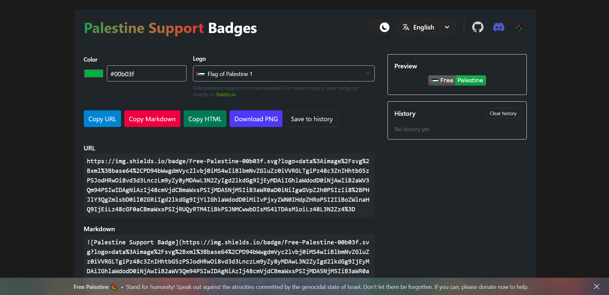

# Palestine Support Badges

  

Welcome to Palestine Support Badges! This project is not just a technical tool for creating **stylized badges** (with [Shields.io](https://shields.io/)), it also aims to be an instrument for mobilizing **support on social media** and amplifying messages in solidarity with Palestine, while **denouncing the genocide** against the Palestinian people perpetrated by the state of Israel and enabled by its allies.

The website is simple and intuitive: it requires no registration or prior forms, **no documentation needs to be read** and no knowledge of image limitations is required to use them as icons. In addition, it features a color picker, a **real-time preview of the generated badge** and a history to save certain color patterns or combinations we may need in the future. Overall, the platform is designed to support campaigns **without requiring advanced technical resources or spending too much time** creating useful and attractive badges. It also takes an accessible and responsive approach by providing clear metadata (URL, embedding in Markdown/HTML) and export options.


<div align="center">
    
</div>


## 🛠️ How to use

**1. Choose color**

- Use the color picker or type the color you want (hex, rgb, rgba, hsl, hsla and css named colors supported).

- If you provide a color name (for example, "green") it will usually be accepted as well, since the value is normalized internally. However, not all colors are available this way. To verify which ones are, check the [Shields.io documentation](https://github.com/badges/shields/tree/master/badge-maker#colors).

- In the current implementation, only the color of the message (the right part of the badge) can be changed.


**2. Logos**

- Only palestine support icons are available. For custom logos in your badges go directly to [Shields.io](https://shields.io/badges).

- Currently there are 14 logos available to embed in the badges. These use SVG images of up to approximately 11 KB, which are later internally encoded in Base64.

- These icons aim to represent the most important symbols of both the Palestinian people's struggle and their cultural and historical heritage.

> [!NOTE]  
> I am not Palestinian, so I cannot fully understand the true importance and meanings of certain representations. For that reason, I would appreciate any corrections and any contributions of new symbols or images that better represent the Palestinian history.


**3. Copy or download PNG**

- _Copy URL_: This copies the direct image URL to your clipboard (useful for ```` or links).

- _Copy Markdown_: This copies the code needed to display the badge in any Markdown file.

- _Copy HTML_: This copies the badge image in HTML format (````).

- _Download PNG_: This converts the badge to PNG client-side using a canvas.


**4. History**

- Save different combinations with _Save to history_.

- History is stored in your localStorage. No form of caching or cookies is used.

- You can reload a history entry with a single click.


**5. Share**

Share and create all kinds of badges. Use the icons you feel most comfortable with, choose the colors that match your website and include these images **everywhere you can**: social media, personal webs, open-source projects and more. **Don’t be silent**. Fighting from a distance and against the inaction and complicity of our governments is not easy, but Israel lives through its image, so **expose what is happening** and don’t normalize it. Attend protests, be explicit about your stance and support the community in any way you can. None of this is enough, but it’s about **doing everything within our power**. We are talking about humanity.


> [!CAUTION]
> As I mentioned earlier, the badges in this project use logos embedded in the URL via Base64. This makes the **URL of badges with certain logos very long** and, due to GitHub's proxy system (which has its own URL size limits), these badges may not display correctly in GitHub repositories, although they usually load fine elsewhere since other platforms don’t impose such strict limits.
> If you want to **use these badges on GitHub**, it is recommended to **shorten the URL** using a free service like [TinyURL](https://tinyurl.com/). It’s very simple: just paste the long badge URL into TinyURL and use the shortened URL in your README or documentation.


## 📨 Ready-to-use examples


**URL**

```
https://img.shields.io/badge/Free-Palestine-00b03f.svg?logo=data%3Aimage%2Fsvg%2Bxml%3Bbase64%2CPD94bWwgdmVyc2lvbj0iMS4wIiBlbmNvZGluZz0iVVRGLTgiPz48c3ZnIHhtbG5zPSJodHRwOi8vd3d3LnczLm9yZy8yMDAwL3N2ZyIgd2lkdGg9IjEyMDAiIGhlaWdodD0iNjAwIiB2aWV3Qm94PSIwIDAgNiAzIj48cmVjdCBmaWxsPSIjMDA5NjM5IiB3aWR0aD0iNiIgaGVpZ2h0PSIzIi8%2BPHJlY3QgZmlsbD0iI0ZGRiIgd2lkdGg9IjYiIGhlaWdodD0iMiIvPjxyZWN0IHdpZHRoPSI2IiBoZWlnaHQ9IjEiLz48cGF0aCBmaWxsPSIjRUQyRTM4IiBkPSJNMCwwbDIsMS41TDAsM1oiLz48L3N2Zz4%3D
```


**Markdown**

```

```


**HTML**

```

```

---


**URL**

```
https://img.shields.io/badge/Free-Palestine-63accd.svg?logo=data%3Aimage%2Fsvg%2Bxml%3Bbase64%2CPD94bWwgdmVyc2lvbj0iMS4wIiBlbmNvZGluZz0idXRmLTgiPz4KDTwhLS0gVXBsb2FkZWQgdG86IFNWRyBSZXBvLCB3d3cuc3ZncmVwby5jb20sIEdlbmVyYXRvcjogU1ZHIFJlcG8gTWl4ZXIgVG9vbHMgLS0%2BCjxzdmcgd2lkdGg9IjgwMHB4IiBoZWlnaHQ9IjgwMHB4IiB2aWV3Qm94PSIwIDAgNjQgNjQiIHhtbG5zPSJodHRwOi8vd3d3LnczLm9yZy8yMDAwL3N2ZyI%2BCg08dGl0bGU%2BcGFsZXN0aW5lPC90aXRsZT4KDTxnIGlkPSJwYWxlc3RpbmUiPgoNPGNpcmNsZSBjeD0iMjYuNSIgY3k9IjIzLjUiIHI9IjIyLjUiIHN0eWxlPSJmaWxsOiNlZGViZGMiLz4KDTxyZWN0IHg9IjQuMDMzIiB5PSI1MyIgd2lkdGg9IjU2Ljk2NyIgaGVpZ2h0PSI4IiBzdHlsZT0iZmlsbDojZTdkMWM0O3N0cm9rZTojNGMyNDFkO3N0cm9rZS1saW5lY2FwOnJvdW5kO3N0cm9rZS1saW5lam9pbjpyb3VuZDtzdHJva2Utd2lkdGg6MnB4Ii8%2BCg08cmVjdCB4PSI0LjAzMyIgeT0iNDEiIHdpZHRoPSI1Ni45NjciIGhlaWdodD0iMTIiIHN0eWxlPSJmaWxsOiM5ZGMxZTQ7c3Ryb2tlOiM0YzI0MWQ7c3Ryb2tlLWxpbmVjYXA6cm91bmQ7c3Ryb2tlLWxpbmVqb2luOnJvdW5kO3N0cm9rZS13aWR0aDoycHgiLz4KDTxsaW5lIHgxPSIxNC45NzgiIHkxPSI0MS4zOTYiIHgyPSIxNC45NzgiIHkyPSI2MC41MzIiIHN0eWxlPSJmaWxsOm5vbmU7c3Ryb2tlOiM0YzI0MWQ7c3Ryb2tlLWxpbmVjYXA6cm91bmQ7c3Ryb2tlLWxpbmVqb2luOnJvdW5kO3N0cm9rZS13aWR0aDoycHgiLz4KDTxsaW5lIHgxPSI1MCIgeTE9IjQxIiB4Mj0iNTAiIHkyPSI2MSIgc3R5bGU9ImZpbGw6bm9uZTtzdHJva2U6IzRjMjQxZDtzdHJva2UtbGluZWNhcDpyb3VuZDtzdHJva2UtbGluZWpvaW46cm91bmQ7c3Ryb2tlLXdpZHRoOjJweCIvPgoNPGxpbmUgeDE9IjQiIHkxPSI0NCIgeDI9IjYxIiB5Mj0iNDQiIHN0eWxlPSJmaWxsOm5vbmU7c3Ryb2tlOiM0YzI0MWQ7c3Ryb2tlLWxpbmVjYXA6cm91bmQ7c3Ryb2tlLWxpbmVqb2luOnJvdW5kO3N0cm9rZS13aWR0aDoycHgiLz4KDTxwYXRoIGQ9Ik01LjQ2MSw0OWgwQTEuNTM5LDEuNTM5LDAsMCwxLDcsNTAuNTM5VjYxYTAsMCwwLDAsMSwwLDBIMy45MjNhMCwwLDAsMCwxLDAsMFY1MC41MzlBMS41MzksMS41MzksMCwwLDEsNS40NjEsNDlaIiBzdHlsZT0iZmlsbDpub25lO3N0cm9rZTojNGMyNDFkO3N0cm9rZS1saW5lY2FwOnJvdW5kO3N0cm9rZS1saW5lam9pbjpyb3VuZDtzdHJva2Utd2lkdGg6MnB4Ii8%2BCg08cGF0aCBkPSJNOC40NjEsNDloMEExLjUzOSwxLjUzOSwwLDAsMSwxMCw1MC41MzlWNjFhMCwwLDAsMCwxLDAsMEg2LjkyM2EwLDAsMCwwLDEsMCwwVjUwLjUzOUExLjUzOSwxLjUzOSwwLDAsMSw4LjQ2MSw0OVoiIHN0eWxlPSJmaWxsOm5vbmU7c3Ryb2tlOiM0YzI0MWQ7c3Ryb2tlLWxpbmVjYXA6cm91bmQ7c3Ryb2tlLWxpbmVqb2luOnJvdW5kO3N0cm9rZS13aWR0aDoycHgiLz4KDTxwYXRoIGQ9Ik0yMC40NjEsNDloMEExLjUzOSwxLjUzOSwwLDAsMSwyMiw1MC41MzlWNjFhMCwwLDAsMCwxLDAsMEgxOC45MjNhMCwwLDAsMCwxLDAsMFY1MC41MzlBMS41MzksMS41MzksMCwwLDEsMjAuNDYxLDQ5WiIgc3R5bGU9ImZpbGw6bm9uZTtzdHJva2U6IzRjMjQxZDtzdHJva2UtbGluZWNhcDpyb3VuZDtzdHJva2UtbGluZWpvaW46cm91bmQ7c3Ryb2tlLXdpZHRoOjJweCIvPgoNPHBhdGggZD0iTTIzLjQ2MSw0OWgwQTEuNTM5LDEuNTM5LDAsMCwxLDI1LDUwLjUzOVY2MWEwLDAsMCwwLDEsMCwwSDIxLjkyM2EwLDAsMCwwLDEsMCwwVjUwLjUzOUExLjUzOSwxLjUzOSwwLDAsMSwyMy40NjEsNDlaIiBzdHlsZT0iZmlsbDpub25lO3N0cm9rZTojNGMyNDFkO3N0cm9rZS1saW5lY2FwOnJvdW5kO3N0cm9rZS1saW5lam9pbjpyb3VuZDtzdHJva2Utd2lkdGg6MnB4Ii8%2BCg08cGF0aCBkPSJNMjYuNDYxLDQ5aDBBMS41MzksMS41MzksMCwwLDEsMjgsNTAuNTM5VjYxYTAsMCwwLDAsMSwwLDBIMjQuOTIzYTAsMCwwLDAsMSwwLDBWNTAuNTM5QTEuNTM5LDEuNTM5LDAsMCwxLDI2LjQ2MSw0OVoiIHN0eWxlPSJmaWxsOm5vbmU7c3Ryb2tlOiM0YzI0MWQ7c3Ryb2tlLWxpbmVjYXA6cm91bmQ7c3Ryb2tlLWxpbmVqb2luOnJvdW5kO3N0cm9rZS13aWR0aDoycHgiLz4KDTxwYXRoIGQ9Ik0yOS40NjEsNDloMEExLjUzOSwxLjUzOSwwLDAsMSwzMSw1MC41MzlWNjFhMCwwLDAsMCwxLDAsMEgyNy45MjNhMCwwLDAsMCwxLDAsMFY1MC41MzlBMS41MzksMS41MzksMCwwLDEsMjkuNDYxLDQ5WiIgc3R5bGU9ImZpbGw6bm9uZTtzdHJva2U6IzRjMjQxZDtzdHJva2UtbGluZWNhcDpyb3VuZDtzdHJva2UtbGluZWpvaW46cm91bmQ7c3Ryb2tlLXdpZHRoOjJweCIvPgoNPHBhdGggZD0iTTMyLjQ2MSw0OWgwQTEuNTM5LDEuNTM5LDAsMCwxLDM0LDUwLjUzOVY2MWEwLDAsMCwwLDEsMCwwSDMwLjkyM2EwLDAsMCwwLDEsMCwwVjUwLjUzOUExLjUzOSwxLjUzOSwwLDAsMSwzMi40NjEsNDlaIiBzdHlsZT0iZmlsbDpub25lO3N0cm9rZTojNGMyNDFkO3N0cm9rZS1saW5lY2FwOnJvdW5kO3N0cm9rZS1saW5lam9pbjpyb3VuZDtzdHJva2Utd2lkdGg6MnB4Ii8%2BCg08cGF0aCBkPSJNMzUuNDYxLDQ5aDBBMS41MzksMS41MzksMCwwLDEsMzcsNTAuNTM5VjYxYTAsMCwwLDAsMSwwLDBIMzMuOTIzYTAsMCwwLDAsMSwwLDBWNTAuNTM5QTEuNTM5LDEuNTM5LDAsMCwxLDM1LjQ2MSw0OVoiIHN0eWxlPSJmaWxsOm5vbmU7c3Ryb2tlOiM0YzI0MWQ7c3Ryb2tlLWxpbmVjYXA6cm91bmQ7c3Ryb2tlLWxpbmVqb2luOnJvdW5kO3N0cm9rZS13aWR0aDoycHgiLz4KDTxwYXRoIGQ9Ik0zOC40NjEsNDloMEExLjUzOSwxLjUzOSwwLDAsMSw0MCw1MC41MzlWNjFhMCwwLDAsMCwxLDAsMEgzNi45MjNhMCwwLDAsMCwxLDAsMFY1MC41MzlBMS41MzksMS41MzksMCwwLDEsMzguNDYxLDQ5WiIgc3R5bGU9ImZpbGw6bm9uZTtzdHJva2U6IzRjMjQxZDtzdHJva2UtbGluZWNhcDpyb3VuZDtzdHJva2UtbGluZWpvaW46cm91bmQ7c3Ryb2tlLXdpZHRoOjJweCIvPgoNPHBhdGggZD0iTTQxLjQ2MSw0OWgwQTEuNTM5LDEuNTM5LDAsMCwxLDQzLDUwLjUzOVY2MWEwLDAsMCwwLDEsMCwwSDM5LjkyM2EwLDAsMCwwLDEsMCwwVjUwLjUzOUExLjUzOSwxLjUzOSwwLDAsMSw0MS40NjEsNDlaIiBzdHlsZT0iZmlsbDpub25lO3N0cm9rZTojNGMyNDFkO3N0cm9rZS1saW5lY2FwOnJvdW5kO3N0cm9rZS1saW5lam9pbjpyb3VuZDtzdHJva2Utd2lkdGg6MnB4Ii8%2BCg08cGF0aCBkPSJNNDQuNDYxLDQ5aDBBMS41MzksMS41MzksMCwwLDEsNDYsNTAuNTM5VjYxYTAsMCwwLDAsMSwwLDBINDIuOTIzYTAsMCwwLDAsMSwwLDBWNTAuNTM5QTEuNTM5LDEuNTM5LDAsMCwxLDQ0LjQ2MSw0OVoiIHN0eWxlPSJmaWxsOm5vbmU7c3Ryb2tlOiM0YzI0MWQ7c3Ryb2tlLWxpbmVjYXA6cm91bmQ7c3Ryb2tlLWxpbmVqb2luOnJvdW5kO3N0cm9rZS13aWR0aDoycHgiLz4KDTxwYXRoIGQ9Ik01Ni40NjEsNDloMEExLjUzOSwxLjUzOSwwLDAsMSw1OCw1MC41MzlWNjFhMCwwLDAsMCwxLDAsMEg1NC45MjNhMCwwLDAsMCwxLDAsMFY1MC41MzlBMS41MzksMS41MzksMCwwLDEsNTYuNDYxLDQ5WiIgc3R5bGU9ImZpbGw6bm9uZTtzdHJva2U6IzRjMjQxZDtzdHJva2UtbGluZWNhcDpyb3VuZDtzdHJva2UtbGluZWpvaW46cm91bmQ7c3Ryb2tlLXdpZHRoOjJweCIvPgoNPHBhdGggZD0iTTU5LjQ2MSw0OWgwQTEuNTM5LDEuNTM5LDAsMCwxLDYxLDUwLjUzOVY2MWEwLDAsMCwwLDEsMCwwSDU3LjkyM2EwLDAsMCwwLDEsMCwwVjUwLjUzOUExLjUzOSwxLjUzOSwwLDAsMSw1OS40NjEsNDlaIiBzdHlsZT0iZmlsbDpub25lO3N0cm9rZTojNGMyNDFkO3N0cm9rZS1saW5lY2FwOnJvdW5kO3N0cm9rZS1saW5lam9pbjpyb3VuZDtzdHJva2Utd2lkdGg6MnB4Ii8%2BCg08cG9seWdvbiBwb2ludHM9IjQ4LjY4IDM3IDE2LjMyIDM3IDQgNDEgNjEgNDEgNDguNjggMzciIHN0eWxlPSJmaWxsOiNlN2QxYzQ7c3Ryb2tlOiM0YzI0MWQ7c3Ryb2tlLWxpbmVjYXA6cm91bmQ7c3Ryb2tlLWxpbmVqb2luOnJvdW5kO3N0cm9rZS13aWR0aDoycHgiLz4KDTxyZWN0IHg9IjE2IiB5PSIzMSIgd2lkdGg9IjMzIiBoZWlnaHQ9IjYiIHN0eWxlPSJmaWxsOiM5ZGMxZTQ7c3Ryb2tlOiM0YzI0MWQ7c3Ryb2tlLWxpbmVjYXA6cm91bmQ7c3Ryb2tlLWxpbmVqb2luOnJvdW5kO3N0cm9rZS13aWR0aDoycHgiLz4KDTxsaW5lIHgxPSIxNCIgeTE9IjMxIiB4Mj0iNTEiIHkyPSIzMSIgc3R5bGU9ImZpbGw6bm9uZTtzdHJva2U6IzRjMjQxZDtzdHJva2UtbGluZWNhcDpyb3VuZDtzdHJva2UtbGluZWpvaW46cm91bmQ7c3Ryb2tlLXdpZHRoOjJweCIvPgoNPHBhdGggZD0iTTQ3LDMxVjIzLjk5NEM0NS4yLDE1LjIzNywzMywxMSwzMywxMVMyMC44LDE1LjIzNywxOSwyMy45OTRWMzFaIiBzdHlsZT0iZmlsbDojZmZjZTU2O3N0cm9rZTojNGMyNDFkO3N0cm9rZS1saW5lY2FwOnJvdW5kO3N0cm9rZS1saW5lam9pbjpyb3VuZDtzdHJva2Utd2lkdGg6MnB4Ii8%2BCg08bGluZSB4MT0iMzMiIHkxPSIxMSIgeDI9IjMzIiB5Mj0iNyIgc3R5bGU9ImZpbGw6bm9uZTtzdHJva2U6IzRjMjQxZDtzdHJva2UtbGluZWNhcDpyb3VuZDtzdHJva2UtbGluZWpvaW46cm91bmQ7c3Ryb2tlLXdpZHRoOjJweCIvPgoNPC9nPgoNPC9zdmc%2B
```


**Markdown**

```
![Palestine Support Badge](https://img.shields.io/badge/Free-Palestine-63accd.svg?logo=data%3Aimage%2Fsvg%2Bxml%3Bbase64%2CPD94bWwgdmVyc2lvbj0iMS4wIiBlbmNvZGluZz0idXRmLTgiPz4KDTwhLS0gVXBsb2FkZWQgdG86IFNWRyBSZXBvLCB3d3cuc3ZncmVwby5jb20sIEdlbmVyYXRvcjogU1ZHIFJlcG8gTWl4ZXIgVG9vbHMgLS0%2BCjxzdmcgd2lkdGg9IjgwMHB4IiBoZWlnaHQ9IjgwMHB4IiB2aWV3Qm94PSIwIDAgNjQgNjQiIHhtbG5zPSJodHRwOi8vd3d3LnczLm9yZy8yMDAwL3N2ZyI%2BCg08dGl0bGU%2BcGFsZXN0aW5lPC90aXRsZT4KDTxnIGlkPSJwYWxlc3RpbmUiPgoNPGNpcmNsZSBjeD0iMjYuNSIgY3k9IjIzLjUiIHI9IjIyLjUiIHN0eWxlPSJmaWxsOiNlZGViZGMiLz4KDTxyZWN0IHg9IjQuMDMzIiB5PSI1MyIgd2lkdGg9IjU2Ljk2NyIgaGVpZ2h0PSI4IiBzdHlsZT0iZmlsbDojZTdkMWM0O3N0cm9rZTojNGMyNDFkO3N0cm9rZS1saW5lY2FwOnJvdW5kO3N0cm9rZS1saW5lam9pbjpyb3VuZDtzdHJva2Utd2lkdGg6MnB4Ii8%2BCg08cmVjdCB4PSI0LjAzMyIgeT0iNDEiIHdpZHRoPSI1Ni45NjciIGhlaWdodD0iMTIiIHN0eWxlPSJmaWxsOiM5ZGMxZTQ7c3Ryb2tlOiM0YzI0MWQ7c3Ryb2tlLWxpbmVjYXA6cm91bmQ7c3Ryb2tlLWxpbmVqb2luOnJvdW5kO3N0cm9rZS13aWR0aDoycHgiLz4KDTxsaW5lIHgxPSIxNC45NzgiIHkxPSI0MS4zOTYiIHgyPSIxNC45NzgiIHkyPSI2MC41MzIiIHN0eWxlPSJmaWxsOm5vbmU7c3Ryb2tlOiM0YzI0MWQ7c3Ryb2tlLWxpbmVjYXA6cm91bmQ7c3Ryb2tlLWxpbmVqb2luOnJvdW5kO3N0cm9rZS13aWR0aDoycHgiLz4KDTxsaW5lIHgxPSI1MCIgeTE9IjQxIiB4Mj0iNTAiIHkyPSI2MSIgc3R5bGU9ImZpbGw6bm9uZTtzdHJva2U6IzRjMjQxZDtzdHJva2UtbGluZWNhcDpyb3VuZDtzdHJva2UtbGluZWpvaW46cm91bmQ7c3Ryb2tlLXdpZHRoOjJweCIvPgoNPGxpbmUgeDE9IjQiIHkxPSI0NCIgeDI9IjYxIiB5Mj0iNDQiIHN0eWxlPSJmaWxsOm5vbmU7c3Ryb2tlOiM0YzI0MWQ7c3Ryb2tlLWxpbmVjYXA6cm91bmQ7c3Ryb2tlLWxpbmVqb2luOnJvdW5kO3N0cm9rZS13aWR0aDoycHgiLz4KDTxwYXRoIGQ9Ik01LjQ2MSw0OWgwQTEuNTM5LDEuNTM5LDAsMCwxLDcsNTAuNTM5VjYxYTAsMCwwLDAsMSwwLDBIMy45MjNhMCwwLDAsMCwxLDAsMFY1MC41MzlBMS41MzksMS41MzksMCwwLDEsNS40NjEsNDlaIiBzdHlsZT0iZmlsbDpub25lO3N0cm9rZTojNGMyNDFkO3N0cm9rZS1saW5lY2FwOnJvdW5kO3N0cm9rZS1saW5lam9pbjpyb3VuZDtzdHJva2Utd2lkdGg6MnB4Ii8%2BCg08cGF0aCBkPSJNOC40NjEsNDloMEExLjUzOSwxLjUzOSwwLDAsMSwxMCw1MC41MzlWNjFhMCwwLDAsMCwxLDAsMEg2LjkyM2EwLDAsMCwwLDEsMCwwVjUwLjUzOUExLjUzOSwxLjUzOSwwLDAsMSw4LjQ2MSw0OVoiIHN0eWxlPSJmaWxsOm5vbmU7c3Ryb2tlOiM0YzI0MWQ7c3Ryb2tlLWxpbmVjYXA6cm91bmQ7c3Ryb2tlLWxpbmVqb2luOnJvdW5kO3N0cm9rZS13aWR0aDoycHgiLz4KDTxwYXRoIGQ9Ik0yMC40NjEsNDloMEExLjUzOSwxLjUzOSwwLDAsMSwyMiw1MC41MzlWNjFhMCwwLDAsMCwxLDAsMEgxOC45MjNhMCwwLDAsMCwxLDAsMFY1MC41MzlBMS41MzksMS41MzksMCwwLDEsMjAuNDYxLDQ5WiIgc3R5bGU9ImZpbGw6bm9uZTtzdHJva2U6IzRjMjQxZDtzdHJva2UtbGluZWNhcDpyb3VuZDtzdHJva2UtbGluZWpvaW46cm91bmQ7c3Ryb2tlLXdpZHRoOjJweCIvPgoNPHBhdGggZD0iTTIzLjQ2MSw0OWgwQTEuNTM5LDEuNTM5LDAsMCwxLDI1LDUwLjUzOVY2MWEwLDAsMCwwLDEsMCwwSDIxLjkyM2EwLDAsMCwwLDEsMCwwVjUwLjUzOUExLjUzOSwxLjUzOSwwLDAsMSwyMy40NjEsNDlaIiBzdHlsZT0iZmlsbDpub25lO3N0cm9rZTojNGMyNDFkO3N0cm9rZS1saW5lY2FwOnJvdW5kO3N0cm9rZS1saW5lam9pbjpyb3VuZDtzdHJva2Utd2lkdGg6MnB4Ii8%2BCg08cGF0aCBkPSJNMjYuNDYxLDQ5aDBBMS41MzksMS41MzksMCwwLDEsMjgsNTAuNTM5VjYxYTAsMCwwLDAsMSwwLDBIMjQuOTIzYTAsMCwwLDAsMSwwLDBWNTAuNTM5QTEuNTM5LDEuNTM5LDAsMCwxLDI2LjQ2MSw0OVoiIHN0eWxlPSJmaWxsOm5vbmU7c3Ryb2tlOiM0YzI0MWQ7c3Ryb2tlLWxpbmVjYXA6cm91bmQ7c3Ryb2tlLWxpbmVqb2luOnJvdW5kO3N0cm9rZS13aWR0aDoycHgiLz4KDTxwYXRoIGQ9Ik0yOS40NjEsNDloMEExLjUzOSwxLjUzOSwwLDAsMSwzMSw1MC41MzlWNjFhMCwwLDAsMCwxLDAsMEgyNy45MjNhMCwwLDAsMCwxLDAsMFY1MC41MzlBMS41MzksMS41MzksMCwwLDEsMjkuNDYxLDQ5WiIgc3R5bGU9ImZpbGw6bm9uZTtzdHJva2U6IzRjMjQxZDtzdHJva2UtbGluZWNhcDpyb3VuZDtzdHJva2UtbGluZWpvaW46cm91bmQ7c3Ryb2tlLXdpZHRoOjJweCIvPgoNPHBhdGggZD0iTTMyLjQ2MSw0OWgwQTEuNTM5LDEuNTM5LDAsMCwxLDM0LDUwLjUzOVY2MWEwLDAsMCwwLDEsMCwwSDMwLjkyM2EwLDAsMCwwLDEsMCwwVjUwLjUzOUExLjUzOSwxLjUzOSwwLDAsMSwzMi40NjEsNDlaIiBzdHlsZT0iZmlsbDpub25lO3N0cm9rZTojNGMyNDFkO3N0cm9rZS1saW5lY2FwOnJvdW5kO3N0cm9rZS1saW5lam9pbjpyb3VuZDtzdHJva2Utd2lkdGg6MnB4Ii8%2BCg08cGF0aCBkPSJNMzUuNDYxLDQ5aDBBMS41MzksMS41MzksMCwwLDEsMzcsNTAuNTM5VjYxYTAsMCwwLDAsMSwwLDBIMzMuOTIzYTAsMCwwLDAsMSwwLDBWNTAuNTM5QTEuNTM5LDEuNTM5LDAsMCwxLDM1LjQ2MSw0OVoiIHN0eWxlPSJmaWxsOm5vbmU7c3Ryb2tlOiM0YzI0MWQ7c3Ryb2tlLWxpbmVjYXA6cm91bmQ7c3Ryb2tlLWxpbmVqb2luOnJvdW5kO3N0cm9rZS13aWR0aDoycHgiLz4KDTxwYXRoIGQ9Ik0zOC40NjEsNDloMEExLjUzOSwxLjUzOSwwLDAsMSw0MCw1MC41MzlWNjFhMCwwLDAsMCwxLDAsMEgzNi45MjNhMCwwLDAsMCwxLDAsMFY1MC41MzlBMS41MzksMS41MzksMCwwLDEsMzguNDYxLDQ5WiIgc3R5bGU9ImZpbGw6bm9uZTtzdHJva2U6IzRjMjQxZDtzdHJva2UtbGluZWNhcDpyb3VuZDtzdHJva2UtbGluZWpvaW46cm91bmQ7c3Ryb2tlLXdpZHRoOjJweCIvPgoNPHBhdGggZD0iTTQxLjQ2MSw0OWgwQTEuNTM5LDEuNTM5LDAsMCwxLDQzLDUwLjUzOVY2MWEwLDAsMCwwLDEsMCwwSDM5LjkyM2EwLDAsMCwwLDEsMCwwVjUwLjUzOUExLjUzOSwxLjUzOSwwLDAsMSw0MS40NjEsNDlaIiBzdHlsZT0iZmlsbDpub25lO3N0cm9rZTojNGMyNDFkO3N0cm9rZS1saW5lY2FwOnJvdW5kO3N0cm9rZS1saW5lam9pbjpyb3VuZDtzdHJva2Utd2lkdGg6MnB4Ii8%2BCg08cGF0aCBkPSJNNDQuNDYxLDQ5aDBBMS41MzksMS41MzksMCwwLDEsNDYsNTAuNTM5VjYxYTAsMCwwLDAsMSwwLDBINDIuOTIzYTAsMCwwLDAsMSwwLDBWNTAuNTM5QTEuNTM5LDEuNTM5LDAsMCwxLDQ0LjQ2MSw0OVoiIHN0eWxlPSJmaWxsOm5vbmU7c3Ryb2tlOiM0YzI0MWQ7c3Ryb2tlLWxpbmVjYXA6cm91bmQ7c3Ryb2tlLWxpbmVqb2luOnJvdW5kO3N0cm9rZS13aWR0aDoycHgiLz4KDTxwYXRoIGQ9Ik01Ni40NjEsNDloMEExLjUzOSwxLjUzOSwwLDAsMSw1OCw1MC41MzlWNjFhMCwwLDAsMCwxLDAsMEg1NC45MjNhMCwwLDAsMCwxLDAsMFY1MC41MzlBMS41MzksMS41MzksMCwwLDEsNTYuNDYxLDQ5WiIgc3R5bGU9ImZpbGw6bm9uZTtzdHJva2U6IzRjMjQxZDtzdHJva2UtbGluZWNhcDpyb3VuZDtzdHJva2UtbGluZWpvaW46cm91bmQ7c3Ryb2tlLXdpZHRoOjJweCIvPgoNPHBhdGggZD0iTTU5LjQ2MSw0OWgwQTEuNTM5LDEuNTM5LDAsMCwxLDYxLDUwLjUzOVY2MWEwLDAsMCwwLDEsMCwwSDU3LjkyM2EwLDAsMCwwLDEsMCwwVjUwLjUzOUExLjUzOSwxLjUzOSwwLDAsMSw1OS40NjEsNDlaIiBzdHlsZT0iZmlsbDpub25lO3N0cm9rZTojNGMyNDFkO3N0cm9rZS1saW5lY2FwOnJvdW5kO3N0cm9rZS1saW5lam9pbjpyb3VuZDtzdHJva2Utd2lkdGg6MnB4Ii8%2BCg08cG9seWdvbiBwb2ludHM9IjQ4LjY4IDM3IDE2LjMyIDM3IDQgNDEgNjEgNDEgNDguNjggMzciIHN0eWxlPSJmaWxsOiNlN2QxYzQ7c3Ryb2tlOiM0YzI0MWQ7c3Ryb2tlLWxpbmVjYXA6cm91bmQ7c3Ryb2tlLWxpbmVqb2luOnJvdW5kO3N0cm9rZS13aWR0aDoycHgiLz4KDTxyZWN0IHg9IjE2IiB5PSIzMSIgd2lkdGg9IjMzIiBoZWlnaHQ9IjYiIHN0eWxlPSJmaWxsOiM5ZGMxZTQ7c3Ryb2tlOiM0YzI0MWQ7c3Ryb2tlLWxpbmVjYXA6cm91bmQ7c3Ryb2tlLWxpbmVqb2luOnJvdW5kO3N0cm9rZS13aWR0aDoycHgiLz4KDTxsaW5lIHgxPSIxNCIgeTE9IjMxIiB4Mj0iNTEiIHkyPSIzMSIgc3R5bGU9ImZpbGw6bm9uZTtzdHJva2U6IzRjMjQxZDtzdHJva2UtbGluZWNhcDpyb3VuZDtzdHJva2UtbGluZWpvaW46cm91bmQ7c3Ryb2tlLXdpZHRoOjJweCIvPgoNPHBhdGggZD0iTTQ3LDMxVjIzLjk5NEM0NS4yLDE1LjIzNywzMywxMSwzMywxMVMyMC44LDE1LjIzNywxOSwyMy45OTRWMzFaIiBzdHlsZT0iZmlsbDojZmZjZTU2O3N0cm9rZTojNGMyNDFkO3N0cm9rZS1saW5lY2FwOnJvdW5kO3N0cm9rZS1saW5lam9pbjpyb3VuZDtzdHJva2Utd2lkdGg6MnB4Ii8%2BCg08bGluZSB4MT0iMzMiIHkxPSIxMSIgeDI9IjMzIiB5Mj0iNyIgc3R5bGU9ImZpbGw6bm9uZTtzdHJva2U6IzRjMjQxZDtzdHJva2UtbGluZWNhcDpyb3VuZDtzdHJva2UtbGluZWpvaW46cm91bmQ7c3Ryb2tlLXdpZHRoOjJweCIvPgoNPC9nPgoNPC9zdmc%2B)
```


**HTML**

```
<img src="https://img.shields.io/badge/Free-Palestine-63accd.svg?logo=data%3Aimage%2Fsvg%2Bxml%3Bbase64%2CPD94bWwgdmVyc2lvbj0iMS4wIiBlbmNvZGluZz0idXRmLTgiPz4KDTwhLS0gVXBsb2FkZWQgdG86IFNWRyBSZXBvLCB3d3cuc3ZncmVwby5jb20sIEdlbmVyYXRvcjogU1ZHIFJlcG8gTWl4ZXIgVG9vbHMgLS0%2BCjxzdmcgd2lkdGg9IjgwMHB4IiBoZWlnaHQ9IjgwMHB4IiB2aWV3Qm94PSIwIDAgNjQgNjQiIHhtbG5zPSJodHRwOi8vd3d3LnczLm9yZy8yMDAwL3N2ZyI%2BCg08dGl0bGU%2BcGFsZXN0aW5lPC90aXRsZT4KDTxnIGlkPSJwYWxlc3RpbmUiPgoNPGNpcmNsZSBjeD0iMjYuNSIgY3k9IjIzLjUiIHI9IjIyLjUiIHN0eWxlPSJmaWxsOiNlZGViZGMiLz4KDTxyZWN0IHg9IjQuMDMzIiB5PSI1MyIgd2lkdGg9IjU2Ljk2NyIgaGVpZ2h0PSI4IiBzdHlsZT0iZmlsbDojZTdkMWM0O3N0cm9rZTojNGMyNDFkO3N0cm9rZS1saW5lY2FwOnJvdW5kO3N0cm9rZS1saW5lam9pbjpyb3VuZDtzdHJva2Utd2lkdGg6MnB4Ii8%2BCg08cmVjdCB4PSI0LjAzMyIgeT0iNDEiIHdpZHRoPSI1Ni45NjciIGhlaWdodD0iMTIiIHN0eWxlPSJmaWxsOiM5ZGMxZTQ7c3Ryb2tlOiM0YzI0MWQ7c3Ryb2tlLWxpbmVjYXA6cm91bmQ7c3Ryb2tlLWxpbmVqb2luOnJvdW5kO3N0cm9rZS13aWR0aDoycHgiLz4KDTxsaW5lIHgxPSIxNC45NzgiIHkxPSI0MS4zOTYiIHgyPSIxNC45NzgiIHkyPSI2MC41MzIiIHN0eWxlPSJmaWxsOm5vbmU7c3Ryb2tlOiM0YzI0MWQ7c3Ryb2tlLWxpbmVjYXA6cm91bmQ7c3Ryb2tlLWxpbmVqb2luOnJvdW5kO3N0cm9rZS13aWR0aDoycHgiLz4KDTxsaW5lIHgxPSI1MCIgeTE9IjQxIiB4Mj0iNTAiIHkyPSI2MSIgc3R5bGU9ImZpbGw6bm9uZTtzdHJva2U6IzRjMjQxZDtzdHJva2UtbGluZWNhcDpyb3VuZDtzdHJva2UtbGluZWpvaW46cm91bmQ7c3Ryb2tlLXdpZHRoOjJweCIvPgoNPGxpbmUgeDE9IjQiIHkxPSI0NCIgeDI9IjYxIiB5Mj0iNDQiIHN0eWxlPSJmaWxsOm5vbmU7c3Ryb2tlOiM0YzI0MWQ7c3Ryb2tlLWxpbmVjYXA6cm91bmQ7c3Ryb2tlLWxpbmVqb2luOnJvdW5kO3N0cm9rZS13aWR0aDoycHgiLz4KDTxwYXRoIGQ9Ik01LjQ2MSw0OWgwQTEuNTM5LDEuNTM5LDAsMCwxLDcsNTAuNTM5VjYxYTAsMCwwLDAsMSwwLDBIMy45MjNhMCwwLDAsMCwxLDAsMFY1MC41MzlBMS41MzksMS41MzksMCwwLDEsNS40NjEsNDlaIiBzdHlsZT0iZmlsbDpub25lO3N0cm9rZTojNGMyNDFkO3N0cm9rZS1saW5lY2FwOnJvdW5kO3N0cm9rZS1saW5lam9pbjpyb3VuZDtzdHJva2Utd2lkdGg6MnB4Ii8%2BCg08cGF0aCBkPSJNOC40NjEsNDloMEExLjUzOSwxLjUzOSwwLDAsMSwxMCw1MC41MzlWNjFhMCwwLDAsMCwxLDAsMEg2LjkyM2EwLDAsMCwwLDEsMCwwVjUwLjUzOUExLjUzOSwxLjUzOSwwLDAsMSw4LjQ2MSw0OVoiIHN0eWxlPSJmaWxsOm5vbmU7c3Ryb2tlOiM0YzI0MWQ7c3Ryb2tlLWxpbmVjYXA6cm91bmQ7c3Ryb2tlLWxpbmVqb2luOnJvdW5kO3N0cm9rZS13aWR0aDoycHgiLz4KDTxwYXRoIGQ9Ik0yMC40NjEsNDloMEExLjUzOSwxLjUzOSwwLDAsMSwyMiw1MC41MzlWNjFhMCwwLDAsMCwxLDAsMEgxOC45MjNhMCwwLDAsMCwxLDAsMFY1MC41MzlBMS41MzksMS41MzksMCwwLDEsMjAuNDYxLDQ5WiIgc3R5bGU9ImZpbGw6bm9uZTtzdHJva2U6IzRjMjQxZDtzdHJva2UtbGluZWNhcDpyb3VuZDtzdHJva2UtbGluZWpvaW46cm91bmQ7c3Ryb2tlLXdpZHRoOjJweCIvPgoNPHBhdGggZD0iTTIzLjQ2MSw0OWgwQTEuNTM5LDEuNTM5LDAsMCwxLDI1LDUwLjUzOVY2MWEwLDAsMCwwLDEsMCwwSDIxLjkyM2EwLDAsMCwwLDEsMCwwVjUwLjUzOUExLjUzOSwxLjUzOSwwLDAsMSwyMy40NjEsNDlaIiBzdHlsZT0iZmlsbDpub25lO3N0cm9rZTojNGMyNDFkO3N0cm9rZS1saW5lY2FwOnJvdW5kO3N0cm9rZS1saW5lam9pbjpyb3VuZDtzdHJva2Utd2lkdGg6MnB4Ii8%2BCg08cGF0aCBkPSJNMjYuNDYxLDQ5aDBBMS41MzksMS41MzksMCwwLDEsMjgsNTAuNTM5VjYxYTAsMCwwLDAsMSwwLDBIMjQuOTIzYTAsMCwwLDAsMSwwLDBWNTAuNTM5QTEuNTM5LDEuNTM5LDAsMCwxLDI2LjQ2MSw0OVoiIHN0eWxlPSJmaWxsOm5vbmU7c3Ryb2tlOiM0YzI0MWQ7c3Ryb2tlLWxpbmVjYXA6cm91bmQ7c3Ryb2tlLWxpbmVqb2luOnJvdW5kO3N0cm9rZS13aWR0aDoycHgiLz4KDTxwYXRoIGQ9Ik0yOS40NjEsNDloMEExLjUzOSwxLjUzOSwwLDAsMSwzMSw1MC41MzlWNjFhMCwwLDAsMCwxLDAsMEgyNy45MjNhMCwwLDAsMCwxLDAsMFY1MC41MzlBMS41MzksMS41MzksMCwwLDEsMjkuNDYxLDQ5WiIgc3R5bGU9ImZpbGw6bm9uZTtzdHJva2U6IzRjMjQxZDtzdHJva2UtbGluZWNhcDpyb3VuZDtzdHJva2UtbGluZWpvaW46cm91bmQ7c3Ryb2tlLXdpZHRoOjJweCIvPgoNPHBhdGggZD0iTTMyLjQ2MSw0OWgwQTEuNTM5LDEuNTM5LDAsMCwxLDM0LDUwLjUzOVY2MWEwLDAsMCwwLDEsMCwwSDMwLjkyM2EwLDAsMCwwLDEsMCwwVjUwLjUzOUExLjUzOSwxLjUzOSwwLDAsMSwzMi40NjEsNDlaIiBzdHlsZT0iZmlsbDpub25lO3N0cm9rZTojNGMyNDFkO3N0cm9rZS1saW5lY2FwOnJvdW5kO3N0cm9rZS1saW5lam9pbjpyb3VuZDtzdHJva2Utd2lkdGg6MnB4Ii8%2BCg08cGF0aCBkPSJNMzUuNDYxLDQ5aDBBMS41MzksMS41MzksMCwwLDEsMzcsNTAuNTM5VjYxYTAsMCwwLDAsMSwwLDBIMzMuOTIzYTAsMCwwLDAsMSwwLDBWNTAuNTM5QTEuNTM5LDEuNTM5LDAsMCwxLDM1LjQ2MSw0OVoiIHN0eWxlPSJmaWxsOm5vbmU7c3Ryb2tlOiM0YzI0MWQ7c3Ryb2tlLWxpbmVjYXA6cm91bmQ7c3Ryb2tlLWxpbmVqb2luOnJvdW5kO3N0cm9rZS13aWR0aDoycHgiLz4KDTxwYXRoIGQ9Ik0zOC40NjEsNDloMEExLjUzOSwxLjUzOSwwLDAsMSw0MCw1MC41MzlWNjFhMCwwLDAsMCwxLDAsMEgzNi45MjNhMCwwLDAsMCwxLDAsMFY1MC41MzlBMS41MzksMS41MzksMCwwLDEsMzguNDYxLDQ5WiIgc3R5bGU9ImZpbGw6bm9uZTtzdHJva2U6IzRjMjQxZDtzdHJva2UtbGluZWNhcDpyb3VuZDtzdHJva2UtbGluZWpvaW46cm91bmQ7c3Ryb2tlLXdpZHRoOjJweCIvPgoNPHBhdGggZD0iTTQxLjQ2MSw0OWgwQTEuNTM5LDEuNTM5LDAsMCwxLDQzLDUwLjUzOVY2MWEwLDAsMCwwLDEsMCwwSDM5LjkyM2EwLDAsMCwwLDEsMCwwVjUwLjUzOUExLjUzOSwxLjUzOSwwLDAsMSw0MS40NjEsNDlaIiBzdHlsZT0iZmlsbDpub25lO3N0cm9rZTojNGMyNDFkO3N0cm9rZS1saW5lY2FwOnJvdW5kO3N0cm9rZS1saW5lam9pbjpyb3VuZDtzdHJva2Utd2lkdGg6MnB4Ii8%2BCg08cGF0aCBkPSJNNDQuNDYxLDQ5aDBBMS41MzksMS41MzksMCwwLDEsNDYsNTAuNTM5VjYxYTAsMCwwLDAsMSwwLDBINDIuOTIzYTAsMCwwLDAsMSwwLDBWNTAuNTM5QTEuNTM5LDEuNTM5LDAsMCwxLDQ0LjQ2MSw0OVoiIHN0eWxlPSJmaWxsOm5vbmU7c3Ryb2tlOiM0YzI0MWQ7c3Ryb2tlLWxpbmVjYXA6cm91bmQ7c3Ryb2tlLWxpbmVqb2luOnJvdW5kO3N0cm9rZS13aWR0aDoycHgiLz4KDTxwYXRoIGQ9Ik01Ni40NjEsNDloMEExLjUzOSwxLjUzOSwwLDAsMSw1OCw1MC41MzlWNjFhMCwwLDAsMCwxLDAsMEg1NC45MjNhMCwwLDAsMCwxLDAsMFY1MC41MzlBMS41MzksMS41MzksMCwwLDEsNTYuNDYxLDQ5WiIgc3R5bGU9ImZpbGw6bm9uZTtzdHJva2U6IzRjMjQxZDtzdHJva2UtbGluZWNhcDpyb3VuZDtzdHJva2UtbGluZWpvaW46cm91bmQ7c3Ryb2tlLXdpZHRoOjJweCIvPgoNPHBhdGggZD0iTTU5LjQ2MSw0OWgwQTEuNTM5LDEuNTM5LDAsMCwxLDYxLDUwLjUzOVY2MWEwLDAsMCwwLDEsMCwwSDU3LjkyM2EwLDAsMCwwLDEsMCwwVjUwLjUzOUExLjUzOSwxLjUzOSwwLDAsMSw1OS40NjEsNDlaIiBzdHlsZT0iZmlsbDpub25lO3N0cm9rZTojNGMyNDFkO3N0cm9rZS1saW5lY2FwOnJvdW5kO3N0cm9rZS1saW5lam9pbjpyb3VuZDtzdHJva2Utd2lkdGg6MnB4Ii8%2BCg08cG9seWdvbiBwb2ludHM9IjQ4LjY4IDM3IDE2LjMyIDM3IDQgNDEgNjEgNDEgNDguNjggMzciIHN0eWxlPSJmaWxsOiNlN2QxYzQ7c3Ryb2tlOiM0YzI0MWQ7c3Ryb2tlLWxpbmVjYXA6cm91bmQ7c3Ryb2tlLWxpbmVqb2luOnJvdW5kO3N0cm9rZS13aWR0aDoycHgiLz4KDTxyZWN0IHg9IjE2IiB5PSIzMSIgd2lkdGg9IjMzIiBoZWlnaHQ9IjYiIHN0eWxlPSJmaWxsOiM5ZGMxZTQ7c3Ryb2tlOiM0YzI0MWQ7c3Ryb2tlLWxpbmVjYXA6cm91bmQ7c3Ryb2tlLWxpbmVqb2luOnJvdW5kO3N0cm9rZS13aWR0aDoycHgiLz4KDTxsaW5lIHgxPSIxNCIgeTE9IjMxIiB4Mj0iNTEiIHkyPSIzMSIgc3R5bGU9ImZpbGw6bm9uZTtzdHJva2U6IzRjMjQxZDtzdHJva2UtbGluZWNhcDpyb3VuZDtzdHJva2UtbGluZWpvaW46cm91bmQ7c3Ryb2tlLXdpZHRoOjJweCIvPgoNPHBhdGggZD0iTTQ3LDMxVjIzLjk5NEM0NS4yLDE1LjIzNywzMywxMSwzMywxMVMyMC44LDE1LjIzNywxOSwyMy45OTRWMzFaIiBzdHlsZT0iZmlsbDojZmZjZTU2O3N0cm9rZTojNGMyNDFkO3N0cm9rZS1saW5lY2FwOnJvdW5kO3N0cm9rZS1saW5lam9pbjpyb3VuZDtzdHJva2Utd2lkdGg6MnB4Ii8%2BCg08bGluZSB4MT0iMzMiIHkxPSIxMSIgeDI9IjMzIiB5Mj0iNyIgc3R5bGU9ImZpbGw6bm9uZTtzdHJva2U6IzRjMjQxZDtzdHJva2UtbGluZWNhcDpyb3VuZDtzdHJva2UtbGluZWpvaW46cm91bmQ7c3Ryb2tlLXdpZHRoOjJweCIvPgoNPC9nPgoNPC9zdmc%2B" alt="Palestine Support Badge" />
```


**Shortened URL (with TinyURL)**

```
https://tinyurl.com/2s3bkswk
```

---


**URL**

```
https://img.shields.io/badge/Free-Palestine-e62d36.svg?logo=data%3Aimage%2Fsvg%2Bxml%3Bbase64%2CPHN2ZyB4bWxucz0iaHR0cDovL3d3dy53My5vcmcvMjAwMC9zdmciIHZpZXdCb3g9IjI1MCAxMjAgMjAwIDc1MCI%2BPHBhdGggZmlsbD0iI0ZFMzAzMCIgZD0iTTgwIDI2N2E2OS43IDY5LjcgMCAwIDEgMTIuMiA2bDMgMS42IDMgMS44YzguOSA1IDE3LjcgMTAuMyAyNi41IDE1LjVsMjMuMyAxMy42IDI5LjkgMTcuNSAyMy4xIDEzLjUgMjkuOSAxNy41IDIzLjEgMTMuNSAyOS45IDE3LjUgMjMuMSAxMy41IDI5LjkgMTcuNSAyMy4xIDEzLjUgMjkuOSAxNy41IDIzLjEgMTMuNSAyOS45IDE3LjUgMjMuMSAxMy41IDI5LjkgMTcuNSAyMy4xIDEzLjUgMjkuOSAxNy41IDIzLjEgMTMuNSAyOS45IDE3LjUgMjMuMSAxMy41YzEwIDUuNyAyMCAxMS42IDI5LjkgMTcuNWwyNCAxNGMyNC43IDE0LjIgMjQuNyAxNC4yIDI2LjEgMTdhOTMuOCA5My44IDAgMCAxLTQgN2wtMS40IDJhMjI5LjUgMjI5LjUgMCAwIDEtMzAuOCAzOS43QTIzMC40IDIzMC40IDAgMCAxIDYzNSA3MTRsLTMgMi4zYy0zNy43IDMwLTgyLjEgNTAtMTI5IDYwLjdsLTIuNy42QTM0NiAzNDYgMCAwIDEgNDU5IDc4NGwtMi45LjNhMzUwIDM1MCAwIDAgMS0zMSAxaC0zYTM4Ny43IDM4Ny43IDAgMCAxLTE1OS42LTM1LjQgMzcwLjIgMzcwLjIgMCAwIDEtOTItNTguOGMtNi01LjEtMTItMTAuNC0xNy41LTE2LTItMi00LTMuOS02LjEtNS43YTc5IDc5IDAgMCAxLTguOS05IDIxOSAyMTkgMCAwIDAtNi4yLTYuOUEyNjIgMjYyIDAgMCAxIDExMyA2MzFsLTEuNi0yQzU3LjIgNTU2LjEgMjkuMiA0NjUuMiA0MiAzNzQuNmM0LjUtMzAgMTMuMi01OCAyNS43LTg1LjZsMS4zLTNjNy4yLTE1LjMgNy4yLTE1LjMgMTEtMTkuMVoiLz48cGF0aCBmaWxsPSIjRDhGRUQ4IiBkPSJNODAgMjY3YzMuMyAxLjMgNi41IDIuNyA5LjYgNC41bDIuNiAxLjUgMyAxLjYgMyAxLjdhMTg5NCAxODk0IDAgMCAxIDI0LjYgMTQuNGwxLjggMWExOTQ1LjQgMTk0NS40IDAgMCAxIDggNC44YzIuNCAxLjUgMi40IDEuNSA0LjQgMy41bC0xIDEuM2MtMjUgMzQuOS0zMi4yIDgxLjgtMzIuMyAxMjMuNXYzYy0uMSA1OCAxOS45IDExNS41IDU0LjMgMTYyLjJsMS4zIDEuN0EzMDggMzA4IDAgMCAwIDIwOCA2NDVsMS42IDEuNGEzMzYuOCAzMzYuOCAwIDAgMCAxNzEuOCA3NmM2OSAxMCAxNDQuNS04IDIwMC42LTQ5LjRhMjM1IDIzNSAwIDAgMCAxMS42LTkuM0EyMjIuNSAyMjIuNSAwIDAgMCA2MjggNjI5bDIuNS0zYTIyMy4yIDIyMy4yIDAgMCAwIDEzLjctMTkuNGMxLjYtMi41IDIuOS00LjggMy44LTcuNiAzLjYgMS40IDcgMyAxMC4zIDVsMy4xIDEuNyAzLjQgMiAzLjQgMmEyNzc5IDI3NzkgMCAwIDEgMjQuOSAxNC42bDMuMiAyIDMgMS44IDIuNyAxLjVjMiAxLjQgMiAxLjQgMyAzLjRhOTMuOCA5My44IDAgMCAxLTQgN2wtMS40IDJhMjI5LjUgMjI5LjUgMCAwIDEtMzAuOCAzOS43QTIzMC40IDIzMC40IDAgMCAxIDYzNSA3MTRsLTMgMi4zYy0zNy43IDMwLTgyLjEgNTAtMTI5IDYwLjdsLTIuNy42QTM0NiAzNDYgMCAwIDEgNDU5IDc4NGwtMi45LjNhMzUwIDM1MCAwIDAgMS0zMSAxaC0zYTM4Ny43IDM4Ny43IDAgMCAxLTE1OS42LTM1LjQgMzcwLjIgMzcwLjIgMCAwIDEtOTItNTguOGMtNi01LjEtMTItMTAuNC0xNy41LTE2LTItMi00LTMuOS02LjEtNS43YTc5IDc5IDAgMCAxLTguOS05IDIxOSAyMTkgMCAwIDAtNi4yLTYuOUEyNjIgMjYyIDAgMCAxIDExMyA2MzFsLTEuNi0yQzU3LjIgNTU2LjEgMjkuMiA0NjUuMiA0MiAzNzQuNmM0LjUtMzAgMTMuMi01OCAyNS43LTg1LjZsMS4zLTNjNy4yLTE1LjMgNy4yLTE1LjMgMTEtMTkuMVoiLz48cGF0aCBmaWxsPSIjRkU1MzUyIiBkPSJNMTM2IDMwMGM1LjkgMS42IDEwLjcgNC42IDE1LjkgNy42bDIuNiAxLjYgNi41IDMuOC0yLjMgMS42Yy0xOC40IDE2LjItMjQuOCA1NC42LTI4LjMgNzcuNmwtMSA1LjdhMTU4LjIgMTU4LjIgMCAwIDAtMS43IDMxLjEgMTg3LjQgMTg3LjQgMCAwIDAgNCA0Mi4zQzE0MSA1MzQuMSAxODEgNTk2LjQgMjMxIDYzNWwzIDIuM2EzMjIuNyAzMjIuNyAwIDAgMCA3OS4yIDQ1YzU0LjMgMjIgMTIwLjcgMjYuNyAxNzYuOCA4LjdsMi42LS44QTI0Mi44IDI0Mi44IDAgMCAwIDU4MyA2NDBsMi44LTIuNGExMTMuNCAxMTMuNCAwIDAgMCAxNi42LTE3LjNjOC43LTkuNyAxOS41LTIxLjkgMjMuNi0zNC4zIDUgMS43IDkuMyA0LjQgMTMuOCA3LjFsMi40IDEuNCA1LjggMy41Yy0uNSA0LjUtMi41IDcuOC01IDExLjVsLTEuMiAxLjlBMjM1LjIgMjM1LjIgMCAwIDEgNTkxIDY2N2wtMi45IDIuM2MtNTYuOSA0NS4zLTEzMi4yIDYyLTIwMy43IDU0LjZhMzIxLjcgMzIxLjcgMCAwIDEtMTg2LjMtODcuMiAxODguNCAxODguNCAwIDAgMS0yNC0yNSAyNTYgMjU2IDAgMCAxLTM1LjMtNTAuM0EyNjYuNyAyNjYuNyAwIDAgMSAxMDIuNiA0MjV2LTNhMjQ5LjEgMjQ5LjEgMCAwIDEgMjUuMi0xMDguOGMyLjMtNC44IDUtOSA4LjItMTMuM1oiLz48cGF0aCBmaWxsPSIjMDE2QzAxIiBkPSJNODAgMjY3YzMuOCAxLjQgNy40IDMuMiAxMSA1bC0yIDEtLjggMi41YTU0LjUgNTQuNSAwIDAgMS00LjQgOS41QTI2NiAyNjYgMCAwIDAgNTUgMzY5bC0uNCAyLjRhMjk2IDI5NiAwIDAgMCAuOSAxMDEuNkEzMDkuNiAzMDkuNiAwIDAgMCA4MCA1NTNsMS4yIDIuOEEzNDQuNSAzNDQuNSAwIDAgMCAxNDYgNjUybDEuNiAxLjhjOC44IDkuNyA4LjggOS43IDE4LjQgMTguNmEyNjkuNCAyNjkuNCAwIDAgMCAzMi4xIDI2LjNjMzkuNSAyOS42IDg1LjEgNTEuMiAxMzIuOSA2My4zbDMgLjhhMjkzIDI5MyAwIDAgMCA3Mi42IDEwLjRoNGEzMTk0LjIgMzE5NC4yIDAgMCAwIDE2LjMgMEEyNzEgMjcxIDAgMCAwIDQ3NiA3NzBsMy45LS42YzE1LTIuNSAyOS42LTUuNyA0NC4xLTEwLjRsMy0xYTMwNC40IDMwNC40IDAgMCAwIDEwMy43LTU2LjRBMjQwLjUgMjQwLjUgMCAwIDAgNjY4IDY2NGwyLTIuNGM1LjMtNi4xIDkuOS0xMi43IDE0LjQtMTkuNGwxLjgtMi44YzIuOS00LjMgNS42LTguNiA3LjgtMTMuNCA0LjEgMS41IDcuNCAzLjUgMTEgNmExOTMuNiAxOTMuNiAwIDAgMS0yNiAzOGwtMi40IDNhMzE3LjQgMzE3LjQgMCAwIDEtMjAuMiAyMS44bC0yLjYgMi43YTIxOS41IDIxOS41IDAgMCAxLTIwLjYgMThjLTM4IDMwLjUtODMgNTAuNy0xMzAuMiA2MS41bC0yLjcuNkEzNDYgMzQ2IDAgMCAxIDQ1OSA3ODRsLTIuOS4zYTM1MCAzNTAgMCAwIDEtMzEgMWgtM2EzODcuNyAzODcuNyAwIDAgMS0xNTkuNi0zNS40IDM3MC4yIDM3MC4yIDAgMCAxLTkyLTU4LjhjLTYtNS4xLTEyLTEwLjQtMTcuNS0xNi0yLTItNC0zLjktNi4xLTUuN2E3OSA3OSAwIDAgMS04LjktOSAyMTkgMjE5IDAgMCAwLTYuMi02LjlBMjYyIDI2MiAwIDAgMSAxMTMgNjMxbC0xLjYtMkM1Ny4yIDU1Ni4xIDI5LjIgNDY1LjIgNDIgMzc0LjZjNC41LTMwIDEzLjItNTggMjUuNy04NS42bDEuMy0zYzcuMi0xNS4zIDcuMi0xNS4zIDExLTE5LjFaIi8%2BPHBhdGggZmlsbD0iIzlBRkM5QSIgZD0iTTg5IDI3M2MzLjcuNSA1LjYgMS4xIDggNC0xIDEuNS0xIDEuNS0xLjggMy4xYTI3NC4yIDI3NC4yIDAgMCAwLTMxLjcgODYuMSAyNzIuNSAyNzIuNSAwIDAgMC0uNCAxMDcuNUEyNjYgMjY2IDAgMCAwIDczIDUxNGwuOSAyLjdBMzQyLjYgMzQyLjYgMCAwIDAgMTU0LjcgNjUxYzUuOSA2LjYgMTIgMTIuNyAxOC43IDE4LjZsNSA0LjVjMzIuNyAyOS4yIDcyIDUxLjkgMTEyLjYgNjcuOWwyLjggMS4xYzE1LjEgNiAzMC41IDEwLjEgNDYuMiAxMy45bDMgLjdjOS45IDIuNSAxOS43IDQuNiAyOS44IDZsMi4zLjRjMTUuOSAyLjIgMzIgMi4xIDQ4IDJoM2EzMTMgMzEzIDAgMCAwIDIyMy45LTkzIDE3OS41IDE3OS41IDAgMCAwIDE2LjQtMTkuMWM4LTEwLjIgMTUuMy0yMC43IDIxLjYtMzJsNiAzYTI4IDI4IDAgMCAxLTUuMyAxMi4zbC0xLjMgMkEyMjcgMjI3IDAgMCAxIDY2MyA2NzFhMjExLjcgMjExLjcgMCAwIDEtMzcuNCAzNkEzMDMuMiAzMDMuMiAwIDAgMSA1MzMgNzU3bC0yLjUuOWEyNzMuNiAyNzMuNiAwIDAgMS05MCAxNi4zaC0zLjlhMzE4MC41IDMxODAuNSAwIDAgMS0xNi4zIDAgMzEzLjggMzEzLjggMCAwIDEtNTYuMi00Yy00Ni45LTYuNy05My42LTI0LjYtMTM0LjEtNDkuMmwtMi4yLTEuM2MtMjIuOC0xMy44LTQ0LTMwLTYzLjQtNDguNC0yLTItNC4zLTMuOC02LjUtNS43YTIwNy41IDIwNy41IDAgMCAxLTE5LjItMjAgMjY0LjMgMjY0LjMgMCAwIDEtMjEuMy0yNi44Yy05LjEtMTItMTctMjQuNi0yNC40LTM3LjhsLTEuNi0yLjhjLTEyLjctMjMtMjItNDctMjkuNC03Mi4ybC0uOC0yLjVjLTIuNy05LjQtNC43LTE4LjktNi40LTI4LjVsLS41LTIuOEw1MyA0NjNjMC0uNy0uMi0xLjMtLjMtMmEzMTEgMzExIDAgMCAxLTItNDEuNlY0MTZjMC0xNS44LjMtMzEuNCAzLjMtNDdsLjUtMi44QTMxMS43IDMxMS43IDAgMCAxIDg5IDI3M1oiLz48cGF0aCBmaWxsPSIjMUQxQTFBIiBkPSJNNDcxIDUxMmExOCAxOCAwIDAgMSA3IDdjMS41IDEyLTEuNCAyMC44LTguOCAzMC4zYTIyIDIyIDAgMCAxLTE1LjggOC4xYy0zLjIgMC00LjItLjItNi44LTIuMUEyMC4zIDIwLjMgMCAwIDEgNDQzIDUzOWMzLTEwLjIgOC0xOC44IDE3LTI0LjYgMy45LTIgNi42LTMuNSAxMS0yLjRaTTMxNCA2MTVjMy44IDEuNyA1LjUgMy4xIDcgNyAxLjMgMTAuOS0xIDE5LjEtNy40IDI3LjktNC40IDUuNC04LjggOC43LTE2IDkuNS0zLjYtLjQtMy42LS40LTYuNS0yLjctNC4yLTUuMy0zLjYtMTEuMi0zLjEtMTcuNyAyLTkuNCA4LjYtMTYuOSAxNi4xLTIyLjYgMy42LTEuNyA2LTEuOSA5LjktMS40WiIvPjxwYXRoIGZpbGw9IiMxQzFBMUEiIGQ9Ik00NTAgNjIwYzIuOCAxLjggNC41IDMgNiA2YTM1LjIgMzUuMiAwIDAgMS04IDI4LjQgMjUgMjUgMCAwIDEtMTYuMSA5Yy0zLjctLjUtNS4zLTEuOC03LjktNC40YTMyIDMyIDAgMCAxIDEuNS0yMi4zYzUtOSAxMy40LTE4LjMgMjQuNS0xNi43WiIvPjxwYXRoIGZpbGw9IiMxRTFBMUEiIGQ9Ik01NDEgNTk5YzMgMS43IDMgMS43IDUgNWEzNS44IDM1LjggMCAwIDEtNy4zIDI3LjljLTQuMiA1LTguNCA3LjUtMTQuOSA4LjctMy44LS44LTUuMy0yLjYtNy44LTUuNi0yLjMtNC42LTEuNS0xMC43LS40LTE1LjYgMy42LTEwLjQgMTMuMS0yMi44IDI1LjQtMjAuNFoiLz48cGF0aCBmaWxsPSIjMUQxQTFBIiBkPSJNMTg2IDQ2NmMyLjggMS44IDQuNSAzIDYgNmEzNy4yIDM3LjIgMCAwIDEtOC40IDI4LjUgMjUgMjUgMCAwIDEtMTMuOCA3Yy0zLjgtLjctNS4zLTIuNS03LjgtNS41LTIuMy00LjYtMS41LTEwLjctLjQtMTUuNiAzLjYtMTAuMyAxMi41LTIxLjkgMjQuNC0yMC40Wk0zODEgNTI3YzMuNiAyLjcgNC43IDQuMiA1LjQgOC41LjQgMTAuMi0yLjYgMTgtOS40IDI1LjUtNC41IDQuMy03LjYgNi40LTE0IDYuMy0yLS4zLTItLjMtNC40LTIuMi0zLjktNS4yLTMuNC0xMC45LTIuNi0xNy4xIDIuNy04IDYuNS0xNS4xIDEzLjctMjAgMy45LTEuNyA3LjEtMi4yIDExLjMtMVoiLz48cGF0aCBmaWxsPSIjMUYxQTFBIiBkPSJNMjk2IDQ4OGM0LjEgMy40IDUuOCA1LjUgNi41IDEwLjhhMzUuNiAzNS42IDAgMCAxLTkuNiAyMS42Yy00LjEgMy43LTcuOCA2LjQtMTMuMyA3LTQuMi0uNS01LjctMS41LTguNi00LjQtMi4yLTQuMy0xLjYtOS45LS4zLTE0LjQgNC4xLTkuOCAxMy0yMy4yIDI1LjMtMjAuNloiLz48cGF0aCBmaWxsPSIjMUUxQTFBIiBkPSJNMTgzIDM1MmM0LjEgMy41IDUuOSA1LjUgNi40IDEwLjlhMzIgMzIgMCAwIDEtOS40IDIxLjcgMTYuNCAxNi40IDAgMCAxLTEyLjYgNS40Yy0zLjQtMS0zLjQtMS01LjgtMy42LTMtNi4zLTItMTEuOC40LTE4LjIgMy44LTguMiAxMS4xLTE3LjQgMjEtMTYuMlpNMjcwIDQxMmMyLjkgMiA0LjcgMy41IDUuNSA3IC4zIDcuNC0yLjQgMTQuNS02LjggMjAuNC00LjIgNC04IDYuNy0xMy45IDcuMi0zLjgtLjYtMy44LS42LTYuMy0zLjItMi00LjYtMi4zLTcuNy0uOC0xMi42IDMuMi04LjEgMTItMjEuMyAyMi4zLTE4LjhaIi8%2BPC9zdmc%2B
```


**Markdown**

```
![Palestine Support Badge](https://img.shields.io/badge/Free-Palestine-e62d36.svg?logo=data%3Aimage%2Fsvg%2Bxml%3Bbase64%2CPHN2ZyB4bWxucz0iaHR0cDovL3d3dy53My5vcmcvMjAwMC9zdmciIHZpZXdCb3g9IjI1MCAxMjAgMjAwIDc1MCI%2BPHBhdGggZmlsbD0iI0ZFMzAzMCIgZD0iTTgwIDI2N2E2OS43IDY5LjcgMCAwIDEgMTIuMiA2bDMgMS42IDMgMS44YzguOSA1IDE3LjcgMTAuMyAyNi41IDE1LjVsMjMuMyAxMy42IDI5LjkgMTcuNSAyMy4xIDEzLjUgMjkuOSAxNy41IDIzLjEgMTMuNSAyOS45IDE3LjUgMjMuMSAxMy41IDI5LjkgMTcuNSAyMy4xIDEzLjUgMjkuOSAxNy41IDIzLjEgMTMuNSAyOS45IDE3LjUgMjMuMSAxMy41IDI5LjkgMTcuNSAyMy4xIDEzLjUgMjkuOSAxNy41IDIzLjEgMTMuNSAyOS45IDE3LjUgMjMuMSAxMy41YzEwIDUuNyAyMCAxMS42IDI5LjkgMTcuNWwyNCAxNGMyNC43IDE0LjIgMjQuNyAxNC4yIDI2LjEgMTdhOTMuOCA5My44IDAgMCAxLTQgN2wtMS40IDJhMjI5LjUgMjI5LjUgMCAwIDEtMzAuOCAzOS43QTIzMC40IDIzMC40IDAgMCAxIDYzNSA3MTRsLTMgMi4zYy0zNy43IDMwLTgyLjEgNTAtMTI5IDYwLjdsLTIuNy42QTM0NiAzNDYgMCAwIDEgNDU5IDc4NGwtMi45LjNhMzUwIDM1MCAwIDAgMS0zMSAxaC0zYTM4Ny43IDM4Ny43IDAgMCAxLTE1OS42LTM1LjQgMzcwLjIgMzcwLjIgMCAwIDEtOTItNTguOGMtNi01LjEtMTItMTAuNC0xNy41LTE2LTItMi00LTMuOS02LjEtNS43YTc5IDc5IDAgMCAxLTguOS05IDIxOSAyMTkgMCAwIDAtNi4yLTYuOUEyNjIgMjYyIDAgMCAxIDExMyA2MzFsLTEuNi0yQzU3LjIgNTU2LjEgMjkuMiA0NjUuMiA0MiAzNzQuNmM0LjUtMzAgMTMuMi01OCAyNS43LTg1LjZsMS4zLTNjNy4yLTE1LjMgNy4yLTE1LjMgMTEtMTkuMVoiLz48cGF0aCBmaWxsPSIjRDhGRUQ4IiBkPSJNODAgMjY3YzMuMyAxLjMgNi41IDIuNyA5LjYgNC41bDIuNiAxLjUgMyAxLjYgMyAxLjdhMTg5NCAxODk0IDAgMCAxIDI0LjYgMTQuNGwxLjggMWExOTQ1LjQgMTk0NS40IDAgMCAxIDggNC44YzIuNCAxLjUgMi40IDEuNSA0LjQgMy41bC0xIDEuM2MtMjUgMzQuOS0zMi4yIDgxLjgtMzIuMyAxMjMuNXYzYy0uMSA1OCAxOS45IDExNS41IDU0LjMgMTYyLjJsMS4zIDEuN0EzMDggMzA4IDAgMCAwIDIwOCA2NDVsMS42IDEuNGEzMzYuOCAzMzYuOCAwIDAgMCAxNzEuOCA3NmM2OSAxMCAxNDQuNS04IDIwMC42LTQ5LjRhMjM1IDIzNSAwIDAgMCAxMS42LTkuM0EyMjIuNSAyMjIuNSAwIDAgMCA2MjggNjI5bDIuNS0zYTIyMy4yIDIyMy4yIDAgMCAwIDEzLjctMTkuNGMxLjYtMi41IDIuOS00LjggMy44LTcuNiAzLjYgMS40IDcgMyAxMC4zIDVsMy4xIDEuNyAzLjQgMiAzLjQgMmEyNzc5IDI3NzkgMCAwIDEgMjQuOSAxNC42bDMuMiAyIDMgMS44IDIuNyAxLjVjMiAxLjQgMiAxLjQgMyAzLjRhOTMuOCA5My44IDAgMCAxLTQgN2wtMS40IDJhMjI5LjUgMjI5LjUgMCAwIDEtMzAuOCAzOS43QTIzMC40IDIzMC40IDAgMCAxIDYzNSA3MTRsLTMgMi4zYy0zNy43IDMwLTgyLjEgNTAtMTI5IDYwLjdsLTIuNy42QTM0NiAzNDYgMCAwIDEgNDU5IDc4NGwtMi45LjNhMzUwIDM1MCAwIDAgMS0zMSAxaC0zYTM4Ny43IDM4Ny43IDAgMCAxLTE1OS42LTM1LjQgMzcwLjIgMzcwLjIgMCAwIDEtOTItNTguOGMtNi01LjEtMTItMTAuNC0xNy41LTE2LTItMi00LTMuOS02LjEtNS43YTc5IDc5IDAgMCAxLTguOS05IDIxOSAyMTkgMCAwIDAtNi4yLTYuOUEyNjIgMjYyIDAgMCAxIDExMyA2MzFsLTEuNi0yQzU3LjIgNTU2LjEgMjkuMiA0NjUuMiA0MiAzNzQuNmM0LjUtMzAgMTMuMi01OCAyNS43LTg1LjZsMS4zLTNjNy4yLTE1LjMgNy4yLTE1LjMgMTEtMTkuMVoiLz48cGF0aCBmaWxsPSIjRkU1MzUyIiBkPSJNMTM2IDMwMGM1LjkgMS42IDEwLjcgNC42IDE1LjkgNy42bDIuNiAxLjYgNi41IDMuOC0yLjMgMS42Yy0xOC40IDE2LjItMjQuOCA1NC42LTI4LjMgNzcuNmwtMSA1LjdhMTU4LjIgMTU4LjIgMCAwIDAtMS43IDMxLjEgMTg3LjQgMTg3LjQgMCAwIDAgNCA0Mi4zQzE0MSA1MzQuMSAxODEgNTk2LjQgMjMxIDYzNWwzIDIuM2EzMjIuNyAzMjIuNyAwIDAgMCA3OS4yIDQ1YzU0LjMgMjIgMTIwLjcgMjYuNyAxNzYuOCA4LjdsMi42LS44QTI0Mi44IDI0Mi44IDAgMCAwIDU4MyA2NDBsMi44LTIuNGExMTMuNCAxMTMuNCAwIDAgMCAxNi42LTE3LjNjOC43LTkuNyAxOS41LTIxLjkgMjMuNi0zNC4zIDUgMS43IDkuMyA0LjQgMTMuOCA3LjFsMi40IDEuNCA1LjggMy41Yy0uNSA0LjUtMi41IDcuOC01IDExLjVsLTEuMiAxLjlBMjM1LjIgMjM1LjIgMCAwIDEgNTkxIDY2N2wtMi45IDIuM2MtNTYuOSA0NS4zLTEzMi4yIDYyLTIwMy43IDU0LjZhMzIxLjcgMzIxLjcgMCAwIDEtMTg2LjMtODcuMiAxODguNCAxODguNCAwIDAgMS0yNC0yNSAyNTYgMjU2IDAgMCAxLTM1LjMtNTAuM0EyNjYuNyAyNjYuNyAwIDAgMSAxMDIuNiA0MjV2LTNhMjQ5LjEgMjQ5LjEgMCAwIDEgMjUuMi0xMDguOGMyLjMtNC44IDUtOSA4LjItMTMuM1oiLz48cGF0aCBmaWxsPSIjMDE2QzAxIiBkPSJNODAgMjY3YzMuOCAxLjQgNy40IDMuMiAxMSA1bC0yIDEtLjggMi41YTU0LjUgNTQuNSAwIDAgMS00LjQgOS41QTI2NiAyNjYgMCAwIDAgNTUgMzY5bC0uNCAyLjRhMjk2IDI5NiAwIDAgMCAuOSAxMDEuNkEzMDkuNiAzMDkuNiAwIDAgMCA4MCA1NTNsMS4yIDIuOEEzNDQuNSAzNDQuNSAwIDAgMCAxNDYgNjUybDEuNiAxLjhjOC44IDkuNyA4LjggOS43IDE4LjQgMTguNmEyNjkuNCAyNjkuNCAwIDAgMCAzMi4xIDI2LjNjMzkuNSAyOS42IDg1LjEgNTEuMiAxMzIuOSA2My4zbDMgLjhhMjkzIDI5MyAwIDAgMCA3Mi42IDEwLjRoNGEzMTk0LjIgMzE5NC4yIDAgMCAwIDE2LjMgMEEyNzEgMjcxIDAgMCAwIDQ3NiA3NzBsMy45LS42YzE1LTIuNSAyOS42LTUuNyA0NC4xLTEwLjRsMy0xYTMwNC40IDMwNC40IDAgMCAwIDEwMy43LTU2LjRBMjQwLjUgMjQwLjUgMCAwIDAgNjY4IDY2NGwyLTIuNGM1LjMtNi4xIDkuOS0xMi43IDE0LjQtMTkuNGwxLjgtMi44YzIuOS00LjMgNS42LTguNiA3LjgtMTMuNCA0LjEgMS41IDcuNCAzLjUgMTEgNmExOTMuNiAxOTMuNiAwIDAgMS0yNiAzOGwtMi40IDNhMzE3LjQgMzE3LjQgMCAwIDEtMjAuMiAyMS44bC0yLjYgMi43YTIxOS41IDIxOS41IDAgMCAxLTIwLjYgMThjLTM4IDMwLjUtODMgNTAuNy0xMzAuMiA2MS41bC0yLjcuNkEzNDYgMzQ2IDAgMCAxIDQ1OSA3ODRsLTIuOS4zYTM1MCAzNTAgMCAwIDEtMzEgMWgtM2EzODcuNyAzODcuNyAwIDAgMS0xNTkuNi0zNS40IDM3MC4yIDM3MC4yIDAgMCAxLTkyLTU4LjhjLTYtNS4xLTEyLTEwLjQtMTcuNS0xNi0yLTItNC0zLjktNi4xLTUuN2E3OSA3OSAwIDAgMS04LjktOSAyMTkgMjE5IDAgMCAwLTYuMi02LjlBMjYyIDI2MiAwIDAgMSAxMTMgNjMxbC0xLjYtMkM1Ny4yIDU1Ni4xIDI5LjIgNDY1LjIgNDIgMzc0LjZjNC41LTMwIDEzLjItNTggMjUuNy04NS42bDEuMy0zYzcuMi0xNS4zIDcuMi0xNS4zIDExLTE5LjFaIi8%2BPHBhdGggZmlsbD0iIzlBRkM5QSIgZD0iTTg5IDI3M2MzLjcuNSA1LjYgMS4xIDggNC0xIDEuNS0xIDEuNS0xLjggMy4xYTI3NC4yIDI3NC4yIDAgMCAwLTMxLjcgODYuMSAyNzIuNSAyNzIuNSAwIDAgMC0uNCAxMDcuNUEyNjYgMjY2IDAgMCAwIDczIDUxNGwuOSAyLjdBMzQyLjYgMzQyLjYgMCAwIDAgMTU0LjcgNjUxYzUuOSA2LjYgMTIgMTIuNyAxOC43IDE4LjZsNSA0LjVjMzIuNyAyOS4yIDcyIDUxLjkgMTEyLjYgNjcuOWwyLjggMS4xYzE1LjEgNiAzMC41IDEwLjEgNDYuMiAxMy45bDMgLjdjOS45IDIuNSAxOS43IDQuNiAyOS44IDZsMi4zLjRjMTUuOSAyLjIgMzIgMi4xIDQ4IDJoM2EzMTMgMzEzIDAgMCAwIDIyMy45LTkzIDE3OS41IDE3OS41IDAgMCAwIDE2LjQtMTkuMWM4LTEwLjIgMTUuMy0yMC43IDIxLjYtMzJsNiAzYTI4IDI4IDAgMCAxLTUuMyAxMi4zbC0xLjMgMkEyMjcgMjI3IDAgMCAxIDY2MyA2NzFhMjExLjcgMjExLjcgMCAwIDEtMzcuNCAzNkEzMDMuMiAzMDMuMiAwIDAgMSA1MzMgNzU3bC0yLjUuOWEyNzMuNiAyNzMuNiAwIDAgMS05MCAxNi4zaC0zLjlhMzE4MC41IDMxODAuNSAwIDAgMS0xNi4zIDAgMzEzLjggMzEzLjggMCAwIDEtNTYuMi00Yy00Ni45LTYuNy05My42LTI0LjYtMTM0LjEtNDkuMmwtMi4yLTEuM2MtMjIuOC0xMy44LTQ0LTMwLTYzLjQtNDguNC0yLTItNC4zLTMuOC02LjUtNS43YTIwNy41IDIwNy41IDAgMCAxLTE5LjItMjAgMjY0LjMgMjY0LjMgMCAwIDEtMjEuMy0yNi44Yy05LjEtMTItMTctMjQuNi0yNC40LTM3LjhsLTEuNi0yLjhjLTEyLjctMjMtMjItNDctMjkuNC03Mi4ybC0uOC0yLjVjLTIuNy05LjQtNC43LTE4LjktNi40LTI4LjVsLS41LTIuOEw1MyA0NjNjMC0uNy0uMi0xLjMtLjMtMmEzMTEgMzExIDAgMCAxLTItNDEuNlY0MTZjMC0xNS44LjMtMzEuNCAzLjMtNDdsLjUtMi44QTMxMS43IDMxMS43IDAgMCAxIDg5IDI3M1oiLz48cGF0aCBmaWxsPSIjMUQxQTFBIiBkPSJNNDcxIDUxMmExOCAxOCAwIDAgMSA3IDdjMS41IDEyLTEuNCAyMC44LTguOCAzMC4zYTIyIDIyIDAgMCAxLTE1LjggOC4xYy0zLjIgMC00LjItLjItNi44LTIuMUEyMC4zIDIwLjMgMCAwIDEgNDQzIDUzOWMzLTEwLjIgOC0xOC44IDE3LTI0LjYgMy45LTIgNi42LTMuNSAxMS0yLjRaTTMxNCA2MTVjMy44IDEuNyA1LjUgMy4xIDcgNyAxLjMgMTAuOS0xIDE5LjEtNy40IDI3LjktNC40IDUuNC04LjggOC43LTE2IDkuNS0zLjYtLjQtMy42LS40LTYuNS0yLjctNC4yLTUuMy0zLjYtMTEuMi0zLjEtMTcuNyAyLTkuNCA4LjYtMTYuOSAxNi4xLTIyLjYgMy42LTEuNyA2LTEuOSA5LjktMS40WiIvPjxwYXRoIGZpbGw9IiMxQzFBMUEiIGQ9Ik00NTAgNjIwYzIuOCAxLjggNC41IDMgNiA2YTM1LjIgMzUuMiAwIDAgMS04IDI4LjQgMjUgMjUgMCAwIDEtMTYuMSA5Yy0zLjctLjUtNS4zLTEuOC03LjktNC40YTMyIDMyIDAgMCAxIDEuNS0yMi4zYzUtOSAxMy40LTE4LjMgMjQuNS0xNi43WiIvPjxwYXRoIGZpbGw9IiMxRTFBMUEiIGQ9Ik01NDEgNTk5YzMgMS43IDMgMS43IDUgNWEzNS44IDM1LjggMCAwIDEtNy4zIDI3LjljLTQuMiA1LTguNCA3LjUtMTQuOSA4LjctMy44LS44LTUuMy0yLjYtNy44LTUuNi0yLjMtNC42LTEuNS0xMC43LS40LTE1LjYgMy42LTEwLjQgMTMuMS0yMi44IDI1LjQtMjAuNFoiLz48cGF0aCBmaWxsPSIjMUQxQTFBIiBkPSJNMTg2IDQ2NmMyLjggMS44IDQuNSAzIDYgNmEzNy4yIDM3LjIgMCAwIDEtOC40IDI4LjUgMjUgMjUgMCAwIDEtMTMuOCA3Yy0zLjgtLjctNS4zLTIuNS03LjgtNS41LTIuMy00LjYtMS41LTEwLjctLjQtMTUuNiAzLjYtMTAuMyAxMi41LTIxLjkgMjQuNC0yMC40Wk0zODEgNTI3YzMuNiAyLjcgNC43IDQuMiA1LjQgOC41LjQgMTAuMi0yLjYgMTgtOS40IDI1LjUtNC41IDQuMy03LjYgNi40LTE0IDYuMy0yLS4zLTItLjMtNC40LTIuMi0zLjktNS4yLTMuNC0xMC45LTIuNi0xNy4xIDIuNy04IDYuNS0xNS4xIDEzLjctMjAgMy45LTEuNyA3LjEtMi4yIDExLjMtMVoiLz48cGF0aCBmaWxsPSIjMUYxQTFBIiBkPSJNMjk2IDQ4OGM0LjEgMy40IDUuOCA1LjUgNi41IDEwLjhhMzUuNiAzNS42IDAgMCAxLTkuNiAyMS42Yy00LjEgMy43LTcuOCA2LjQtMTMuMyA3LTQuMi0uNS01LjctMS41LTguNi00LjQtMi4yLTQuMy0xLjYtOS45LS4zLTE0LjQgNC4xLTkuOCAxMy0yMy4yIDI1LjMtMjAuNloiLz48cGF0aCBmaWxsPSIjMUUxQTFBIiBkPSJNMTgzIDM1MmM0LjEgMy41IDUuOSA1LjUgNi40IDEwLjlhMzIgMzIgMCAwIDEtOS40IDIxLjcgMTYuNCAxNi40IDAgMCAxLTEyLjYgNS40Yy0zLjQtMS0zLjQtMS01LjgtMy42LTMtNi4zLTItMTEuOC40LTE4LjIgMy44LTguMiAxMS4xLTE3LjQgMjEtMTYuMlpNMjcwIDQxMmMyLjkgMiA0LjcgMy41IDUuNSA3IC4zIDcuNC0yLjQgMTQuNS02LjggMjAuNC00LjIgNC04IDYuNy0xMy45IDcuMi0zLjgtLjYtMy44LS42LTYuMy0zLjItMi00LjYtMi4zLTcuNy0uOC0xMi42IDMuMi04LjEgMTItMjEuMyAyMi4zLTE4LjhaIi8%2BPC9zdmc%2B)
```


**HTML**

```
<img src="https://img.shields.io/badge/Free-Palestine-e62d36.svg?logo=data%3Aimage%2Fsvg%2Bxml%3Bbase64%2CPHN2ZyB4bWxucz0iaHR0cDovL3d3dy53My5vcmcvMjAwMC9zdmciIHZpZXdCb3g9IjI1MCAxMjAgMjAwIDc1MCI%2BPHBhdGggZmlsbD0iI0ZFMzAzMCIgZD0iTTgwIDI2N2E2OS43IDY5LjcgMCAwIDEgMTIuMiA2bDMgMS42IDMgMS44YzguOSA1IDE3LjcgMTAuMyAyNi41IDE1LjVsMjMuMyAxMy42IDI5LjkgMTcuNSAyMy4xIDEzLjUgMjkuOSAxNy41IDIzLjEgMTMuNSAyOS45IDE3LjUgMjMuMSAxMy41IDI5LjkgMTcuNSAyMy4xIDEzLjUgMjkuOSAxNy41IDIzLjEgMTMuNSAyOS45IDE3LjUgMjMuMSAxMy41IDI5LjkgMTcuNSAyMy4xIDEzLjUgMjkuOSAxNy41IDIzLjEgMTMuNSAyOS45IDE3LjUgMjMuMSAxMy41YzEwIDUuNyAyMCAxMS42IDI5LjkgMTcuNWwyNCAxNGMyNC43IDE0LjIgMjQuNyAxNC4yIDI2LjEgMTdhOTMuOCA5My44IDAgMCAxLTQgN2wtMS40IDJhMjI5LjUgMjI5LjUgMCAwIDEtMzAuOCAzOS43QTIzMC40IDIzMC40IDAgMCAxIDYzNSA3MTRsLTMgMi4zYy0zNy43IDMwLTgyLjEgNTAtMTI5IDYwLjdsLTIuNy42QTM0NiAzNDYgMCAwIDEgNDU5IDc4NGwtMi45LjNhMzUwIDM1MCAwIDAgMS0zMSAxaC0zYTM4Ny43IDM4Ny43IDAgMCAxLTE1OS42LTM1LjQgMzcwLjIgMzcwLjIgMCAwIDEtOTItNTguOGMtNi01LjEtMTItMTAuNC0xNy41LTE2LTItMi00LTMuOS02LjEtNS43YTc5IDc5IDAgMCAxLTguOS05IDIxOSAyMTkgMCAwIDAtNi4yLTYuOUEyNjIgMjYyIDAgMCAxIDExMyA2MzFsLTEuNi0yQzU3LjIgNTU2LjEgMjkuMiA0NjUuMiA0MiAzNzQuNmM0LjUtMzAgMTMuMi01OCAyNS43LTg1LjZsMS4zLTNjNy4yLTE1LjMgNy4yLTE1LjMgMTEtMTkuMVoiLz48cGF0aCBmaWxsPSIjRDhGRUQ4IiBkPSJNODAgMjY3YzMuMyAxLjMgNi41IDIuNyA5LjYgNC41bDIuNiAxLjUgMyAxLjYgMyAxLjdhMTg5NCAxODk0IDAgMCAxIDI0LjYgMTQuNGwxLjggMWExOTQ1LjQgMTk0NS40IDAgMCAxIDggNC44YzIuNCAxLjUgMi40IDEuNSA0LjQgMy41bC0xIDEuM2MtMjUgMzQuOS0zMi4yIDgxLjgtMzIuMyAxMjMuNXYzYy0uMSA1OCAxOS45IDExNS41IDU0LjMgMTYyLjJsMS4zIDEuN0EzMDggMzA4IDAgMCAwIDIwOCA2NDVsMS42IDEuNGEzMzYuOCAzMzYuOCAwIDAgMCAxNzEuOCA3NmM2OSAxMCAxNDQuNS04IDIwMC42LTQ5LjRhMjM1IDIzNSAwIDAgMCAxMS42LTkuM0EyMjIuNSAyMjIuNSAwIDAgMCA2MjggNjI5bDIuNS0zYTIyMy4yIDIyMy4yIDAgMCAwIDEzLjctMTkuNGMxLjYtMi41IDIuOS00LjggMy44LTcuNiAzLjYgMS40IDcgMyAxMC4zIDVsMy4xIDEuNyAzLjQgMiAzLjQgMmEyNzc5IDI3NzkgMCAwIDEgMjQuOSAxNC42bDMuMiAyIDMgMS44IDIuNyAxLjVjMiAxLjQgMiAxLjQgMyAzLjRhOTMuOCA5My44IDAgMCAxLTQgN2wtMS40IDJhMjI5LjUgMjI5LjUgMCAwIDEtMzAuOCAzOS43QTIzMC40IDIzMC40IDAgMCAxIDYzNSA3MTRsLTMgMi4zYy0zNy43IDMwLTgyLjEgNTAtMTI5IDYwLjdsLTIuNy42QTM0NiAzNDYgMCAwIDEgNDU5IDc4NGwtMi45LjNhMzUwIDM1MCAwIDAgMS0zMSAxaC0zYTM4Ny43IDM4Ny43IDAgMCAxLTE1OS42LTM1LjQgMzcwLjIgMzcwLjIgMCAwIDEtOTItNTguOGMtNi01LjEtMTItMTAuNC0xNy41LTE2LTItMi00LTMuOS02LjEtNS43YTc5IDc5IDAgMCAxLTguOS05IDIxOSAyMTkgMCAwIDAtNi4yLTYuOUEyNjIgMjYyIDAgMCAxIDExMyA2MzFsLTEuNi0yQzU3LjIgNTU2LjEgMjkuMiA0NjUuMiA0MiAzNzQuNmM0LjUtMzAgMTMuMi01OCAyNS43LTg1LjZsMS4zLTNjNy4yLTE1LjMgNy4yLTE1LjMgMTEtMTkuMVoiLz48cGF0aCBmaWxsPSIjRkU1MzUyIiBkPSJNMTM2IDMwMGM1LjkgMS42IDEwLjcgNC42IDE1LjkgNy42bDIuNiAxLjYgNi41IDMuOC0yLjMgMS42Yy0xOC40IDE2LjItMjQuOCA1NC42LTI4LjMgNzcuNmwtMSA1LjdhMTU4LjIgMTU4LjIgMCAwIDAtMS43IDMxLjEgMTg3LjQgMTg3LjQgMCAwIDAgNCA0Mi4zQzE0MSA1MzQuMSAxODEgNTk2LjQgMjMxIDYzNWwzIDIuM2EzMjIuNyAzMjIuNyAwIDAgMCA3OS4yIDQ1YzU0LjMgMjIgMTIwLjcgMjYuNyAxNzYuOCA4LjdsMi42LS44QTI0Mi44IDI0Mi44IDAgMCAwIDU4MyA2NDBsMi44LTIuNGExMTMuNCAxMTMuNCAwIDAgMCAxNi42LTE3LjNjOC43LTkuNyAxOS41LTIxLjkgMjMuNi0zNC4zIDUgMS43IDkuMyA0LjQgMTMuOCA3LjFsMi40IDEuNCA1LjggMy41Yy0uNSA0LjUtMi41IDcuOC01IDExLjVsLTEuMiAxLjlBMjM1LjIgMjM1LjIgMCAwIDEgNTkxIDY2N2wtMi45IDIuM2MtNTYuOSA0NS4zLTEzMi4yIDYyLTIwMy43IDU0LjZhMzIxLjcgMzIxLjcgMCAwIDEtMTg2LjMtODcuMiAxODguNCAxODguNCAwIDAgMS0yNC0yNSAyNTYgMjU2IDAgMCAxLTM1LjMtNTAuM0EyNjYuNyAyNjYuNyAwIDAgMSAxMDIuNiA0MjV2LTNhMjQ5LjEgMjQ5LjEgMCAwIDEgMjUuMi0xMDguOGMyLjMtNC44IDUtOSA4LjItMTMuM1oiLz48cGF0aCBmaWxsPSIjMDE2QzAxIiBkPSJNODAgMjY3YzMuOCAxLjQgNy40IDMuMiAxMSA1bC0yIDEtLjggMi41YTU0LjUgNTQuNSAwIDAgMS00LjQgOS41QTI2NiAyNjYgMCAwIDAgNTUgMzY5bC0uNCAyLjRhMjk2IDI5NiAwIDAgMCAuOSAxMDEuNkEzMDkuNiAzMDkuNiAwIDAgMCA4MCA1NTNsMS4yIDIuOEEzNDQuNSAzNDQuNSAwIDAgMCAxNDYgNjUybDEuNiAxLjhjOC44IDkuNyA4LjggOS43IDE4LjQgMTguNmEyNjkuNCAyNjkuNCAwIDAgMCAzMi4xIDI2LjNjMzkuNSAyOS42IDg1LjEgNTEuMiAxMzIuOSA2My4zbDMgLjhhMjkzIDI5MyAwIDAgMCA3Mi42IDEwLjRoNGEzMTk0LjIgMzE5NC4yIDAgMCAwIDE2LjMgMEEyNzEgMjcxIDAgMCAwIDQ3NiA3NzBsMy45LS42YzE1LTIuNSAyOS42LTUuNyA0NC4xLTEwLjRsMy0xYTMwNC40IDMwNC40IDAgMCAwIDEwMy43LTU2LjRBMjQwLjUgMjQwLjUgMCAwIDAgNjY4IDY2NGwyLTIuNGM1LjMtNi4xIDkuOS0xMi43IDE0LjQtMTkuNGwxLjgtMi44YzIuOS00LjMgNS42LTguNiA3LjgtMTMuNCA0LjEgMS41IDcuNCAzLjUgMTEgNmExOTMuNiAxOTMuNiAwIDAgMS0yNiAzOGwtMi40IDNhMzE3LjQgMzE3LjQgMCAwIDEtMjAuMiAyMS44bC0yLjYgMi43YTIxOS41IDIxOS41IDAgMCAxLTIwLjYgMThjLTM4IDMwLjUtODMgNTAuNy0xMzAuMiA2MS41bC0yLjcuNkEzNDYgMzQ2IDAgMCAxIDQ1OSA3ODRsLTIuOS4zYTM1MCAzNTAgMCAwIDEtMzEgMWgtM2EzODcuNyAzODcuNyAwIDAgMS0xNTkuNi0zNS40IDM3MC4yIDM3MC4yIDAgMCAxLTkyLTU4LjhjLTYtNS4xLTEyLTEwLjQtMTcuNS0xNi0yLTItNC0zLjktNi4xLTUuN2E3OSA3OSAwIDAgMS04LjktOSAyMTkgMjE5IDAgMCAwLTYuMi02LjlBMjYyIDI2MiAwIDAgMSAxMTMgNjMxbC0xLjYtMkM1Ny4yIDU1Ni4xIDI5LjIgNDY1LjIgNDIgMzc0LjZjNC41LTMwIDEzLjItNTggMjUuNy04NS42bDEuMy0zYzcuMi0xNS4zIDcuMi0xNS4zIDExLTE5LjFaIi8%2BPHBhdGggZmlsbD0iIzlBRkM5QSIgZD0iTTg5IDI3M2MzLjcuNSA1LjYgMS4xIDggNC0xIDEuNS0xIDEuNS0xLjggMy4xYTI3NC4yIDI3NC4yIDAgMCAwLTMxLjcgODYuMSAyNzIuNSAyNzIuNSAwIDAgMC0uNCAxMDcuNUEyNjYgMjY2IDAgMCAwIDczIDUxNGwuOSAyLjdBMzQyLjYgMzQyLjYgMCAwIDAgMTU0LjcgNjUxYzUuOSA2LjYgMTIgMTIuNyAxOC43IDE4LjZsNSA0LjVjMzIuNyAyOS4yIDcyIDUxLjkgMTEyLjYgNjcuOWwyLjggMS4xYzE1LjEgNiAzMC41IDEwLjEgNDYuMiAxMy45bDMgLjdjOS45IDIuNSAxOS43IDQuNiAyOS44IDZsMi4zLjRjMTUuOSAyLjIgMzIgMi4xIDQ4IDJoM2EzMTMgMzEzIDAgMCAwIDIyMy45LTkzIDE3OS41IDE3OS41IDAgMCAwIDE2LjQtMTkuMWM4LTEwLjIgMTUuMy0yMC43IDIxLjYtMzJsNiAzYTI4IDI4IDAgMCAxLTUuMyAxMi4zbC0xLjMgMkEyMjcgMjI3IDAgMCAxIDY2MyA2NzFhMjExLjcgMjExLjcgMCAwIDEtMzcuNCAzNkEzMDMuMiAzMDMuMiAwIDAgMSA1MzMgNzU3bC0yLjUuOWEyNzMuNiAyNzMuNiAwIDAgMS05MCAxNi4zaC0zLjlhMzE4MC41IDMxODAuNSAwIDAgMS0xNi4zIDAgMzEzLjggMzEzLjggMCAwIDEtNTYuMi00Yy00Ni45LTYuNy05My42LTI0LjYtMTM0LjEtNDkuMmwtMi4yLTEuM2MtMjIuOC0xMy44LTQ0LTMwLTYzLjQtNDguNC0yLTItNC4zLTMuOC02LjUtNS43YTIwNy41IDIwNy41IDAgMCAxLTE5LjItMjAgMjY0LjMgMjY0LjMgMCAwIDEtMjEuMy0yNi44Yy05LjEtMTItMTctMjQuNi0yNC40LTM3LjhsLTEuNi0yLjhjLTEyLjctMjMtMjItNDctMjkuNC03Mi4ybC0uOC0yLjVjLTIuNy05LjQtNC43LTE4LjktNi40LTI4LjVsLS41LTIuOEw1MyA0NjNjMC0uNy0uMi0xLjMtLjMtMmEzMTEgMzExIDAgMCAxLTItNDEuNlY0MTZjMC0xNS44LjMtMzEuNCAzLjMtNDdsLjUtMi44QTMxMS43IDMxMS43IDAgMCAxIDg5IDI3M1oiLz48cGF0aCBmaWxsPSIjMUQxQTFBIiBkPSJNNDcxIDUxMmExOCAxOCAwIDAgMSA3IDdjMS41IDEyLTEuNCAyMC44LTguOCAzMC4zYTIyIDIyIDAgMCAxLTE1LjggOC4xYy0zLjIgMC00LjItLjItNi44LTIuMUEyMC4zIDIwLjMgMCAwIDEgNDQzIDUzOWMzLTEwLjIgOC0xOC44IDE3LTI0LjYgMy45LTIgNi42LTMuNSAxMS0yLjRaTTMxNCA2MTVjMy44IDEuNyA1LjUgMy4xIDcgNyAxLjMgMTAuOS0xIDE5LjEtNy40IDI3LjktNC40IDUuNC04LjggOC43LTE2IDkuNS0zLjYtLjQtMy42LS40LTYuNS0yLjctNC4yLTUuMy0zLjYtMTEuMi0zLjEtMTcuNyAyLTkuNCA4LjYtMTYuOSAxNi4xLTIyLjYgMy42LTEuNyA2LTEuOSA5LjktMS40WiIvPjxwYXRoIGZpbGw9IiMxQzFBMUEiIGQ9Ik00NTAgNjIwYzIuOCAxLjggNC41IDMgNiA2YTM1LjIgMzUuMiAwIDAgMS04IDI4LjQgMjUgMjUgMCAwIDEtMTYuMSA5Yy0zLjctLjUtNS4zLTEuOC03LjktNC40YTMyIDMyIDAgMCAxIDEuNS0yMi4zYzUtOSAxMy40LTE4LjMgMjQuNS0xNi43WiIvPjxwYXRoIGZpbGw9IiMxRTFBMUEiIGQ9Ik01NDEgNTk5YzMgMS43IDMgMS43IDUgNWEzNS44IDM1LjggMCAwIDEtNy4zIDI3LjljLTQuMiA1LTguNCA3LjUtMTQuOSA4LjctMy44LS44LTUuMy0yLjYtNy44LTUuNi0yLjMtNC42LTEuNS0xMC43LS40LTE1LjYgMy42LTEwLjQgMTMuMS0yMi44IDI1LjQtMjAuNFoiLz48cGF0aCBmaWxsPSIjMUQxQTFBIiBkPSJNMTg2IDQ2NmMyLjggMS44IDQuNSAzIDYgNmEzNy4yIDM3LjIgMCAwIDEtOC40IDI4LjUgMjUgMjUgMCAwIDEtMTMuOCA3Yy0zLjgtLjctNS4zLTIuNS03LjgtNS41LTIuMy00LjYtMS41LTEwLjctLjQtMTUuNiAzLjYtMTAuMyAxMi41LTIxLjkgMjQuNC0yMC40Wk0zODEgNTI3YzMuNiAyLjcgNC43IDQuMiA1LjQgOC41LjQgMTAuMi0yLjYgMTgtOS40IDI1LjUtNC41IDQuMy03LjYgNi40LTE0IDYuMy0yLS4zLTItLjMtNC40LTIuMi0zLjktNS4yLTMuNC0xMC45LTIuNi0xNy4xIDIuNy04IDYuNS0xNS4xIDEzLjctMjAgMy45LTEuNyA3LjEtMi4yIDExLjMtMVoiLz48cGF0aCBmaWxsPSIjMUYxQTFBIiBkPSJNMjk2IDQ4OGM0LjEgMy40IDUuOCA1LjUgNi41IDEwLjhhMzUuNiAzNS42IDAgMCAxLTkuNiAyMS42Yy00LjEgMy43LTcuOCA2LjQtMTMuMyA3LTQuMi0uNS01LjctMS41LTguNi00LjQtMi4yLTQuMy0xLjYtOS45LS4zLTE0LjQgNC4xLTkuOCAxMy0yMy4yIDI1LjMtMjAuNloiLz48cGF0aCBmaWxsPSIjMUUxQTFBIiBkPSJNMTgzIDM1MmM0LjEgMy41IDUuOSA1LjUgNi40IDEwLjlhMzIgMzIgMCAwIDEtOS40IDIxLjcgMTYuNCAxNi40IDAgMCAxLTEyLjYgNS40Yy0zLjQtMS0zLjQtMS01LjgtMy42LTMtNi4zLTItMTEuOC40LTE4LjIgMy44LTguMiAxMS4xLTE3LjQgMjEtMTYuMlpNMjcwIDQxMmMyLjkgMiA0LjcgMy41IDUuNSA3IC4zIDcuNC0yLjQgMTQuNS02LjggMjAuNC00LjIgNC04IDYuNy0xMy45IDcuMi0zLjgtLjYtMy44LS42LTYuMy0zLjItMi00LjYtMi4zLTcuNy0uOC0xMi42IDMuMi04LjEgMTItMjEuMyAyMi4zLTE4LjhaIi8%2BPC9zdmc%2B" alt="Palestine Support Badge" />
```


**Shortened URL (with TinyURL)**

```
https://tinyurl.com/3uz829tm
```


## 🍉 Alternative awesome badge projects

If you’re looking for **another type of ready-made badge** or banner, there are many developers who have created awesome pro-Palestine badges that you can check out.

### [support-palestine-banner](https://github.com/Safouene1/support-palestine-banner) by [@Safouene1](https://github.com/Safouene1)


[](https://techforpalestine.org/learn-more)

```
[](https://techforpalestine.org/learn-more)
```

[](https://github.com/Safouene1/support-palestine-banner)

```
[](https://techforpalestine.org/learn-more)
```

---

### [StandWithPalestine](https://github.com/saedyousef/StandWithPalestine) by [@saedyousef](https://github.com/saedyousef)

[](https://github.com/saedyousef/StandWithPalestine)

```
[](https://github.com/saedyousef/StandWithPalestine)
```

[](https://github.com/saedyousef/StandWithPalestine)

```
[](https://github.com/saedyousef/StandWithPalestine)
```

[](https://github.com/saedyousef/StandWithPalestine)

```
[](https://github.com/saedyousef/StandWithPalestine)
```

---

### [Stand-with-Palestine](https://github.com/zeyadetman/stand-with-palestine) by [@zeyadetman](https://github.com/zeyadetman) & [@elharony](https://github.com/elharony)


```
<script src="https://stand-with-palestine.pages.dev/widget.js"></script>
```

---

### [hinds-banner](https://github.com/alvii147/hinds-banner) by [@alvii147](https://github.com/alvii147)

[](https://www.pcrf.net)

```
[](https://www.pcrf.net)
```

[](https://www.pcrf.net)

```
[](https://www.pcrf.net)
```


## 📄 License

This project is licensed under the [MIT License](LICENSE). Feel free to use and modify it as you like and contributions are more than welcome!